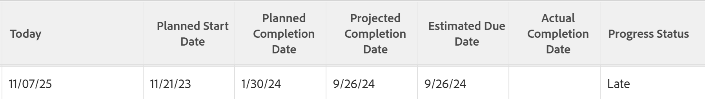

# 專案進度狀態概觀

<!--Audited: 12/2023-->

Adobe Workfront會透過檢視專案在時間表中的進度來確定專案的進度狀態。 您可以設定Workfront以根據任務的進度狀態值決定專案狀態。 如需有關設定專案條件的詳細資訊，請參閱文章[專案條件和條件型別概觀](../../../manage-work/projects/manage-projects/project-condition-and-condition-type.md)。

以下是Workfront中專案的進度狀態：

<table style="table-layout:auto"> 
 <col> 
 <col> 
 <tbody> 
  <tr> 
   <td>準時</td> 
   <td> 專案的進度狀態為<strong>時間</strong>，如果：<ul><li>如果「預計到期日」與「預估到期日」都早於或等於專案的「計畫完成日期」 
  
</li></ul>  </td> 
  </tr> 
  <tr> 
   <td>有風險</td> 
   <td> 如果下列<strong>全部</strong>為True，專案的進度狀態為<strong>有風險</strong>：<ul><li>預估與預計完成日期都是未來日期</li><li> 預估到期日晚於計畫完成日期與預計完成日期 
  
</li></ul> </td> 
  </tr> 
  <tr> 
   <td>滞後</td> 
   <td> 如果下列<strong>全部</strong>為True，專案的進度狀態為<strong>落後</strong>：<ul><li>預估與預計完成日期都是未來日期</li><li> 預估和預計完成日期都晚於專案的計畫完成日期</li><li> 預估到期日不晚於預計完成日期
   
  
</li></ul>  </td> 
  </tr> 
  <tr> 
   <td>遲到</td> 
   <td> 
     如果下列<strong>任一</strong>為True，專案的進度狀態為<strong>延遲</strong>：<ul><li>專案已完成，且實際完成日期晚於計畫完成日期 
  
 </li> 
     <li> 
專案未完成，且專案的規劃完成日期為過去的日期 
  
 </li> 
    </ul> </td> 
  </tr> 
 </tbody> 
</table>

考慮以下事項：

* 專案的預計完成日期由關鍵路徑上的任務驅動，並具有最新的預計完成日期。
* 專案的估計到期日是由關鍵路徑上具有最新估計到期日的任務所驅動。

如需有關專案關鍵路徑的資訊，請參閱[專案關鍵路徑概觀](../../../manage-work/tasks/manage-tasks/critical-path.md)。

如需有關預計完成日期的資訊，請參閱[專案、任務和問題的預計完成日期總覽](../../../manage-work/projects/planning-a-project/project-projected-completion-date.md)。
