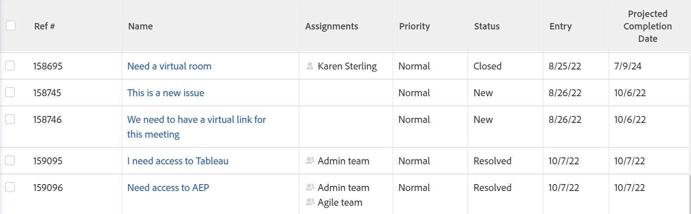

# 專案、任務和問題的預計完成日期總覽

<!-- Audited: 1/2024 -->

預計完成日期是即時計算的指標，指出專案、任務或問題的完成時間。 當專案、任務或問題標示為「已完成」時，「預計完成日期」會變更為「實際完成日期」的日期。

以下小節說明如何決定專案、任務和問題的預計完成日期，以及如何找到它。

## 存取需求

+++ 展開以檢視本文中功能的存取需求。

<table style="table-layout:auto"> 
 <col> 
 <col> 
 <tbody> 
  <tr> 
   <td role="rowheader">Adobe Workfront計畫</td> 
   <td> 
任何
 </td> 
  </tr> 
  <tr> 
   <td role="rowheader">Adobe Workfront授權*</td> 
   <td> 
   
新增： 
   <ul><li>
投稿人或以上人員可檢視報告中的預計完成日期
</li> <li>
建立報告的標準授權
</li> </ul>

目前： 
   <ul><li>
複查或更高以檢視報告中的預計完成日期
</li> 
   <li>
建立報告的計畫授權
 </li></ul>
      </td> 
  </tr> 
  <tr> 
   <td role="rowheader">存取層級</td> 
   <td> 
檢視或更高專案存取權
 
您必須擁有報告、儀表板、行事曆的編輯存取權，才能建立報告
 
您必須擁有「篩選器」、「檢視」、「群組」的「編輯」存取權，才能建立報告或修改清單檢視
  </td> 
  </tr> 
  <tr> 
   <td role="rowheader">物件許可權</td> 
   <td> 
檢視專案或更高的許可權
 </td> 
  </tr> 
 </tbody> 
</table>

*如需此表格中資訊的詳細資訊，請參閱Workfront檔案中的[存取需求](/help/quicksilver/administration-and-setup/add-users/access-levels-and-object-permissions/access-level-requirements-in-documentation.md)。

+++

## Adobe Workfront如何決定預計完成日期

「預計完成日期」是計算欄位，無法手動變更。

根據您檢視的物件，用來決定「預計完成日期」的條件會有所不同：

* **專案：**&#x200B;專案的預計完成日期等於專案上最新任務的預計完成日期。

  例如，較高的完成百分比會將任務的「預計完成日期」移動至更接近當天。 如果任務的狀態為「新增」，且任務的「計畫完成日期」已關閉或已過，則「預計完成日期」會進一步移向未來。

* **任務：**&#x200B;任務的預計完成日期是根據下列條件決定：

   * **工作受指派人對工作所做的進度更新：**&#x200B;進度更新包括完成百分比的變更以及工作狀態的變更。
   * **認可日期：**&#x200B;如果工作受指派人指定認可日期，預計完成日期會變更以符合認可日期。

     如需認可日期的詳細資訊，請參閱文章[認可日期概觀](../../../manage-work/projects/updating-work-in-a-project/overview-of-commit-dates.md)。

   * **前置任務：**&#x200B;如果前置任務沒有延遲，則預計完成日期應該與計畫完成日期相符。 發生延遲時，相依任務顯示的「預計完成日期」會晚於「計畫完成日期」。

     如需任務計畫完成日期的詳細資訊，請參閱[任務計畫完成日期概觀](../../../manage-work/tasks/task-information/task-planned-completion-date.md)。

  >[!IMPORTANT]
  >
  >當任務的前置任務具有實際完成日期時，相依任務會收到如下案例所述的預計完成日期：
  >
  >
  >如果專案具有任務A、任務B和任務C，而任務B是任務A的後續任務，任務C是任務B的後續任務，並且任務A新增了實際完成日期，則會自動重新計算任務B的預計完成日期（假設專案的&#x200B;**更新型別**&#x200B;設定為「自動」和「變更時」），但不會重新計算任務C。目前，基於效能原因，Workfront會計算從更新的「任務」向上或向下一個層級之任務的預計完成日期。

* **問題：**&#x200B;問題預計完成日期最初設定為與問題計畫完成日期相符。

  如果問題受指派人指定認可日期，則預計完成日期和計畫完成日期都會變更以符合認可日期。

  如需認可日期的詳細資訊，請參閱文章[認可日期概觀](../../../manage-work/projects/updating-work-in-a-project/overview-of-commit-dates.md)。

## 檢視預計完成日期

您可以在報告中檢視專案、任務和問題的預計完成日期。 您可以在Workfront的其他區域中檢視專案和任務的預計完成日期。

### 檢視專案的預計完成日期 {#view-the-projected-completion-date-of-a-project}

1. 移至您要檢視預計完成日期的專案。
1. 按一下左側面板中的&#x200B;**專案詳細資料**。
1. 在&#x200B;**總覽** > **專案日期**&#x200B;區段中，找到&#x200B;**預計完成日期**&#x200B;欄位。

### 檢視任務的預計完成日期 {#view-the-projected-completion-date-of-a-task}

1. 移至您要檢視「預計完成日期」的工作。
1. 按一下左側面板中的&#x200B;**工作詳細資料**。
1. 在&#x200B;**總覽** > **任務日期和限制**&#x200B;區段中，找到&#x200B;**預計完成日期**&#x200B;欄位。

### 檢視問題的預計完成日期 {#view-the-projected-completion-date-of-an-issue}

您只能在問題報告或清單檢視中檢視問題的預計完成日期。 建立清單檢視類似於在報告中建立檢視。

若要建立包含預計完成日期的問題報表，請執行下列步驟：

1. 建立問題報告，如文章[建立自訂報告](../../../reports-and-dashboards/reports/creating-and-managing-reports/create-custom-report.md)中所述。
1. 選取&#x200B;**欄（檢視）**&#x200B;標籤。
1. 按一下&#x200B;**新增欄**，然後開始在&#x200B;**顯示在此欄：**&#x200B;欄位中輸入&#x200B;**預計完成日期**。

1. 當它出現在清單中的&#x200B;**問題**&#x200B;物件下時，請選取它。
1. 按一下「**儲存並關閉**」。

   已填入報告中的&#x200B;**預計完成日期**&#x200B;欄。

   
