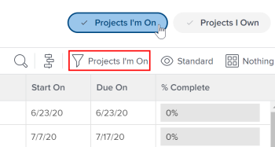

# 專案團隊概述

<!-- Audited: 6/2025 -->

專案團隊由以一定容量與專案相關聯的使用者組成。 在專案的「人員」區段中列出的使用者構成了專案團隊。 例如，被指派處理專案的使用者或專案所有者屬於專案團隊。

使用範本建立專案後，專案範本中的下列使用者將成為未來專案團隊的一分子：

* 指派給範本上工作（任務和問題）的使用者。
* 範本所有者或贊助者。

屬於範本上未來專案團隊的使用者會顯示在範本的「人員」區段中。

## 專案團隊成員

您可以手動或自動將使用者指派給專案團隊。 如需詳細資訊，請參閱[管理專案團隊](../../../manage-work/projects/planning-a-project/manage-project-team.md)一文中的「將使用者新增至專案團隊」一節。

當您手動將使用者新增至專案團隊時，他們會獲得專案的檢視許可權，以及專案的任務、問題和檔案。

## 通知專案團隊成員

根據Adobe Workfront管理員啟用的電子郵件通知，專案團隊中的使用者會收到有關專案各種動作的通知。

如需詳細資訊，另請參閱下列文章：

* [事件通知型別](/help/quicksilver/administration-and-setup/manage-workfront/emails/event-notifications-available-in-wf.md)

* [為系統中的每個人設定事件通知](../../../administration-and-setup/manage-workfront/emails/configure-event-notifications-for-everyone-in-the-system.md)

>[!NOTE]
>
>請務必保持更新專案團隊成員資格，以避免傳送通知給不需要專案相關資訊的使用者。

## 角色型核准

若要在專案上使用角色型核准，使用者必須指派給專案團隊，並在其使用者設定檔中指派正確的工作角色。

有關如何將使用者新增到專案團隊以及如何為他們指派工作角色的資訊，請參閱以下文章：

* [管理專案團隊](../../../manage-work/projects/planning-a-project/manage-project-team.md)
* [編輯使用者設定檔](../../../administration-and-setup/add-users/create-and-manage-users/edit-a-users-profile.md)

如果您不想要求使用者屬於專案團隊以進行角色型核准，您可以在核准設定中控制此項。 如需詳細資訊，請參閱[設定全域核准設定](../../../administration-and-setup/customize-workfront/configure-approval-milestone-processes/establish-approval-settings.md)。

## 我所在的專案篩選器

如果使用者列在專案的「人員」區域，當他們在專案或專案報告的清單中套用「我所在的專案」篩選器時，該專案就會出現。

您可以檢視我所在的專案篩選器是否選取在專案區域標頭中。 您可以從「篩選器」面板或標題套用它。

>[!NOTE]
>
>如果您是專案的建立者，即使您的姓名未出現在專案的「人員」區域，或您的姓名已從該清單中移除，該專案仍會列在「我所在的專案」清單中。
