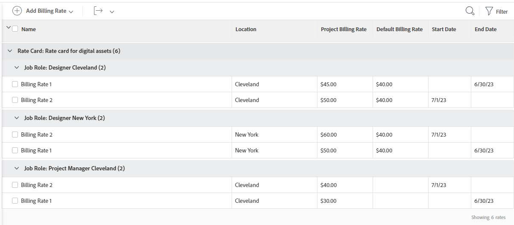

# 將費率卡附加至專案

{{highlighted-preview-article-level}}

費率卡會根據地點儲存每個工作角色的多個收費率。 您可能擁有位於巴黎的Designer以及位於紐約的第二個Designer的工作角色，每個工作角色具有不同的收費率。 但是，費率卡上的工作角色不需要位置。 費率卡上工作角色（可能還有地點）的計費費率也可包含有效日期。

當您在專案中附加費率卡時，所有角色（依地點）及其相關的收費率都會新增至專案。

>[!NOTE]
>
>附加費率卡會覆寫專案上任何現有的收費率。

您可以直接在專案中編輯費率卡的計費費率。 這不會影響預設費率卡上儲存的費率。

如需有關建立費率卡的資訊，請參閱[管理費率卡](/help/quicksilver/administration-and-setup/set-up-workfront/configure-system-defaults/manage-rate-cards.md)。

如需有關覆寫專案的工作角色收費率以及計算專案收入的一般資訊，請參閱[覆寫工作角色收費率以及計算專案收入的總覽](/help/quicksilver/manage-work/projects/project-finances/override-role-billing-rates-and-calculate-project-revenue.md)。

## 存取需求

您必須具有下列存取權才能執行本文中的步驟：

<table style="table-layout:auto"> 
 <col> 
 <col> 
 <tbody> 
  <tr> 
   <td role="rowheader">Adobe Workfront計畫*</td> 
   <td> 
任何
 </td> 
  </tr> 
  <tr> 
   <td role="rowheader">Adobe Workfront授權*</td> 
   <td> 
目前計畫：標準

或

舊版計畫：計畫 
 </td> 
  </tr> 
  <tr> 
   <td role="rowheader">存取層級設定*</td> 
   <td> 
編輯專案與財務資料的存取權
 
職位角色的管理存取權
 
注意：如果您還是沒有存取權，請詢問您的Workfront管理員，他們是否在您的存取層級中設定其他限制。 如需Workfront管理員如何修改存取層級的詳細資訊，請參閱<a href="../../../administration-and-setup/add-users/configure-and-grant-access/create-modify-access-levels.md" class="MCXref xref">建立或修改自訂存取層級</a>。
 </td> 
  </tr> 
  <tr> 
   <td role="rowheader">物件許可權</td> 
   <td> 
管理具有管理財務之許可權的專案許可權
 
如需請求其他存取權的資訊，請參閱<a href="../../../workfront-basics/grant-and-request-access-to-objects/request-access.md" class="MCXref xref">請求物件</a>的存取權。
 </td> 
  </tr> 
 </tbody> 
</table>

&#42;若要瞭解您擁有的計畫、授權型別或存取權，請連絡您的Workfront管理員。

## 將費率卡附加至專案

1. 前往專案。
1. 按一下左側面板中的&#x200B;**收費率**。 您可能需要先按一下「**顯示更多**」。
1. 按一下&#x200B;**新增收費率>附加費率卡**。

   「附加費率卡」頁面隨即開啟。 如需詳細資訊，請參閱[管理費率卡](/help/quicksilver/administration-and-setup/set-up-workfront/configure-system-defaults/manage-rate-cards.md)。

1. 選取要新增至專案的費率卡，然後按一下&#x200B;**附加**。

   費率卡及其所有工作角色費率會新增至計費費率清單。

   

   >[!NOTE]
   >
   >在計費費率清單上，您可以移除一或多個來自費率卡的工作角色。 從專案移除工作角色收費率時，不會將其從預設費率卡中移除。
