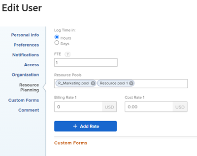
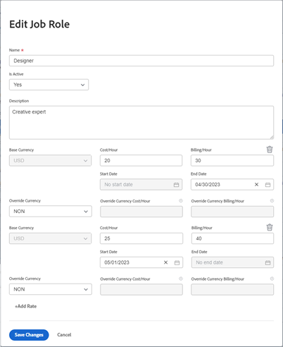

# 帳單與收入概要

{{highlighted-preview}}

身為專案經理，您可以使用收費率來擷取專案的收入。

本文會介紹專案的追蹤收入。 在「使用率報表」中，收入的計算方式不同。 如需「使用率報表」中收入計算的資訊，請參閱 [檢視資源使用率資訊](../../../resource-mgmt/resource-utilization/view-utilization-information.md).

## 收費率概觀

處理計費率時，請考慮下列各項：

* 您需要具有編輯財務資料存取權的計畫授權，才能管理收費率。\
  如需授與財務資料存取權的詳細資訊，請參閱 [授予財務資料的存取權](../../../administration-and-setup/add-users/configure-and-grant-access/grant-access-financial.md).

* 收費率是與工作角色或使用者相關之每個工作單位的收入金額。

  將費率乘以工作花費時數，可為您的專案產生收入。

* 建立您的收費率後，您可以接著建立收費記錄來追蹤收入，以記錄已記帳和未記帳的內容。

  >[!TIP]
  >
  >當您將記帳記錄標籤為已記帳時，將永遠無法編輯它。 當您的費率不同，而且您想要鎖定專案的收入和費用資訊時，這一點很重要。 將其新增到記帳記錄並標籤為已記帳，可在您的系統中更新費率時防止其更新。

  如需建立付費記錄的詳細資訊，請參閱文章 [建立付費記錄](../../../manage-work/projects/project-finances/create-billing-records.md).

* 您可以為使用者、工作角色建立收費率，也可以為專案或任務設定一次性收費率。

>[!IMPORTANT]
>
>計算收入的費率屬於記錄時間的使用者或其職務角色。

* [使用者收費率](#user-billing-rates)
* [工作角色收費率](#job-role-billing-rates)
* [專案或任務的固定收費率](#fixed-billing-rates-for-projects-or-tasks)
* [覆寫收費率](#override-billing-rates)

### 使用者收費率 {#user-billing-rates}

身為使用者管理員，當您建立使用者時，可以透過指定「每小時計費」欄位的值以及費率的日期，將它們與日期有效的「計費費率」相關聯。

如需建立使用者的詳細資訊，請參閱文章 [新增使用者](../../../administration-and-setup/add-users/create-and-manage-users/add-users.md).

### 工作角色收費率 {#job-role-billing-rates}

身為Adobe Workfront管理員，當您建立職務角色時，可以透過指定「每小時計費」欄位的值以及費率的日期，將其與日期有效的「計費費率」建立關聯。

您可以使用Workfront系統的基本貨幣或其他自訂貨幣來定義工作角色收費率的值。

如需建立工作角色和覆寫其貨幣的詳細資訊，請參閱本文 [建立和管理職位角色](../../../administration-and-setup/set-up-workfront/organizational-setup/create-manage-job-roles.md).

### 專案或任務的固定收費率 {#fixed-billing-rates-for-projects-or-tasks}

除了使用者和工作角色每小時費率之外，您還可以擁有以下固定收費率：

* 固定小時收入型別的固定金額
* 固定收入收入型別的固定金額

如需有關如何使用固定收費率來計算收入的詳細資訊，請參閱 [作業收入型態概要](#overview-of-task-revenue-types).

### 覆寫收費率 {#override-billing-rates}

>[!IMPORTANT]
>
>您可以覆寫與工作角色關聯的收費率。 您無法覆寫使用者收費率或固定費率。

您可以覆寫下列專案的工作角色收費率：

* 特定公司

  如需建立公司特定工作角色收費率的詳細資訊，請參閱 [建立和編輯公司](../../../administration-and-setup/set-up-workfront/organizational-setup/create-and-edit-companies.md).

* 特定專案

  如需有關建立專案特定工作角色收費率的詳細資訊，請參閱文章 [覆寫工作角色帳單費率與計算專案收入的概要](../../../manage-work/projects/project-finances/override-role-billing-rates-and-calculate-project-revenue.md).

## 追蹤收入金額

根據任務的計畫時數建立任務時，Workfront可以自動追蹤計畫收入。

當實際時數記錄到任務、問題和專案上時，它也可以自動追蹤實際收入。

下表顯示與任務、問題和專案相關的收入型別。

<table style="table-layout:auto"> 
 <col> 
 <col> 
 <tbody> 
  <tr> 
   <td role="rowheader">計畫收入</td> 
   <td> 
對於任務，這是與任務的計畫時數關聯的收入。 所有任務的計畫時數會累計至專案的計畫時數，以貢獻專案計畫時數的計算。 
 
如需Workfront中計畫時數的詳細資訊，請參閱 <a href="../../../manage-work/tasks/task-information/planned-hours.md" class="MCXref xref">計畫時數概觀</a>. 
 
Workfront使用此公式計算任務的計畫收入：

   
<code>Task Planned Revenue = Planned Hours * Billing hourly rate</code>
 
<strong>注意</strong>  公式中的帳單小時費率會考量費率的任何日期有效變更。
 
Workfront會使用下列公式計算專案的計畫收入：
 
<code>Project Planned Revenue = SUM (All tasks Planned Revenue) + Fixed Revenue</code>

   
<b>附註</b>

顯示在「專案詳細資訊」區域和專案報表中的專案計畫收入，與「使用率」報表中顯示的計畫收入不同。 
 
專案詳細資訊區域中的計畫收入反映與任務計畫時數以及專案的固定收入相關的任務收入。 「使用率報表」中的「計畫收入」僅顯示與專案上任務指派之計畫時數相關聯的計畫收入。 
 
     
Example: </b>"> 
      
如果專案有1個時數為10的任務，指派給顧問時數為$20的費率，且專案有$100的固定收入，則「使用率」報表會顯示計畫收入$200 （與任務時數相關的計畫收入）。 專案詳細資訊區段顯示$300 （任務的計畫收入與專案的固定收入）。 
 
     
 
 
任務計畫收入使用指派給任務的使用者或工作角色的計費小時費率計算。 任務的收入型別會影響用於計算計畫收入的比率（使用者或角色）。 如需詳細資訊，請參閱本文中的下列章節：
 
    <ul> 
     <li> 
<a href="#overview-of-task-revenue-types" class="MCXref xref">作業收入型態概要</a> 
 </li> 
     <li> 
<a href="#revenue-calculations-for-tasks-based-on-user-and-role-assignments" class="MCXref xref">根據使用者和角色指派的任務收入計算</a> 
 </li> 
    </ul> 
如需「使用率」報表中計畫收入計算的相關資訊，請參閱 <a href="../../../resource-mgmt/resource-utilization/view-utilization-information.md" class="MCXref xref">檢視資源使用率資訊 </a>. 
 </td> 
  </tr> 
  <tr> 
   <td role="rowheader">實際收入*</td> 
   <td> 
與任務、問題和專案的實際小時數相關聯。 
 
一般而言，Workfront會使用此公式來計算實際收入：
 
<code>Actual Revenue = Actual Hours * Billing rate</code> 
 
<strong>注意</strong>  公式中的帳單小時費率會考量費率的任何日期有效變更。
 
如需「使用率報表」中實際收入計算的資訊，請參閱 <a href="../../../resource-mgmt/resource-utilization/view-utilization-information.md" class="MCXref xref">檢視資源使用率資訊 </a>. 
 
<b>秘訣</b>

您無法檢視問題層級的「實際收入」，但與問題上的「實際時數」相關的收入會貢獻專案的「實際收入」。 
 </td>
</tr> 
 </tbody> 
</table>

*對於實際時數，使用者的費率一律指記錄時數的使用者或其職務角色的費率。 如需Workfront何時使用使用者費率，以及何時使用使用者職務角色費率的相關資訊，請參閱 [收入計算](#revenue-calculations) 一節。

<!--Note from the table for Planned Revenue line: 
     
(the note below is duplicated in this article: /Content/Resource Mgmt/Resource utilization/view-utilization-information.htm and in the glossary)

    -->

例如，如果一項具有使用者每小時收入型別的任務計畫需要2小時，而指派給它的使用者的每小時費率為$30小時，則任務的計畫收入為$60。 任務完成時，如果使用者僅記錄1.5小時作為完成任務的實際花費時間，則實際收入金額為$45。 如果未指派給任務的另一個使用者記錄時間，則實際收入會根據該使用者的收費率計算。

您可以透過下列方式記錄收入：

* 藉由定義任務的收入型別，並將指派給工作專案的使用者或角色與收費率建立關聯。 這會依工作專案的計畫或實際時數金額計算收入。 您可以設定每小時費率的最高收費金額，也可以不設定。\
  如需有關指定任務的收入型別的詳細資訊，請參閱文章 [編輯任務](../../../manage-work/tasks/manage-tasks/edit-tasks.md).

* 藉由對任務或專案的固定收入費率開立帳單。\
  如果您的任務具有固定收入，則固定收入金額將新增為任務或專案的計畫收入，而任務的計畫收入將可用以固定收入新增到記帳記錄中。
* 藉由為專案設定統一帳單「固定收入」費率，然後為專案內的作業設定每小時費率。 Workfront會將任務的每小時費率新增至專案的統一費率。\
  例如，使用Workfront的機械師可以輸入零件的成本作為專案的固定收入，然後針對修理汽車所花的時間按小時記帳。 之後專案或任務的固定收入會在完成時實現。

您也可以將工作標示為「不可記帳」，這樣就不會有相關的計畫或實際收入。

## 作業收入型態概要 {#overview-of-task-revenue-types}

依預設，所有新任務的收入型別都是根據您的Workfront或群組管理員指定的任務和問題偏好設定來設定。\
如需有關為Workfront執行個體定義任務和問題偏好設定的詳細資訊，請參閱文章 [設定系統範圍的任務和問題偏好設定](../../../administration-and-setup/set-up-workfront/configure-system-defaults/set-task-issue-preferences.md).

專案所有者可以修改任務的收入型別和專案的固定收入。\
如需有關指定專案固定收入的詳細資訊，請參閱文章 [編輯專案](../../../manage-work/projects/manage-projects/edit-projects.md).\
如需有關指定任務的收入型別的詳細資訊，請參閱文章 [編輯任務](../../../manage-work/tasks/manage-tasks/edit-tasks.md).

您可以將下列收入型別套用至您的任務或專案：

<table border="1" cellspacing="15"> 
 <col> 
 <col> 
 <thead> 
  <tr> 
   <th> 
<strong>收入類型</strong> 
 </th> 
   <th> 
<strong>說明</strong> 
 </th> 
  </tr> 
 </thead> 
 <tbody> 
  <tr> 
   <td> 
固定收入
 </td> 
   <td> 
此型別可用於專案和任務。 
 
將範本附加至專案時，範本的「固定收入」會新增至專案的「固定收入」。 如需詳細資訊，請參閱 <a href="../../../manage-work/projects/create-and-manage-templates/attach-template-to-project-overview.md" class="MCXref xref">將範本附加至專案的概觀</a>. 
 
對於任務，無論任務指派為何，都會使用任務上指定的固定金額來計算任務上的收入。 
 
子系任務的「固定收入」會累計至父系任務的收入，然後再累計至專案的收入。 如果在父系任務和/或專案上定義了固定金額，則會將該金額新增到從任何子系任務累計的計畫收入中。
 
任務的固定收入金額可以包含在專案的記帳記錄中。
 </td> 
  </tr> 
  <tr> 
   <td> 
使用者小時
 </td> 
   <td> 
此型別僅能用於工作。 
 
您為特定使用者設定的收費率，乘以該任務的計畫時數，便成為任務的計畫收入金額。 您為特定使用者設定的收費率，乘以使用者針對任務記錄的時數，即為任務的「實際收入」金額。  例如，當您建立使用者並為其每小時付費欄位設定$20時，如果使用者為時程表上的任務提交5小時，則該任務的實際付費金額為$100。

   
使用者設定檔可包含具有有效日期的多個計費費率。 例如，第一個使用者收費率$20於2023年4月30日結束，第二個使用者收費率$25於2023年5月1日開始。 若使用者於4月28日提交2小時，並於5月2日提交3小時，則任務的「實際帳單」金額為$40 + $75 = $115。

   
<b>秘訣</b>

這是您建立任務時的預設收入型別。
 </td>
</tr> 
  <tr> 
   <td> 
角色小時
 </td> 
   <td> 
此型別僅能用於工作。
 
此型別類似於「每小時使用者」，但使用工作角色費率而非使用者費率。
 
<strong>注意</strong> 職務角色也可以有多個具有有效日期的計費率。
</td> 
  </tr> 
  <tr> 
   <td> 
受限使用者小時
 </td> 
   <td> 
此型別僅能用於工作。
 
任務會以每小時的使用者小時計費，但具有您可指定的上限金額。  例如，如果使用者的收費率為$25，但任務的上限金額為$20，而使用者記錄一小時，則任務的實際收入為$20。 
 </td> 
  </tr> 
  <tr> 
   <td> 
角色小時（帶上限）
 </td> 
   <td> 
此型別僅能用於工作。
 
此型別類似於具有上限的使用者每小時，但使用工作角色費率而非使用者費率。 
 </td> 
  </tr> 
  <tr> 
   <td> 
使用者小時加固定
 </td> 
   <td> 
此型別僅能用於工作。 
 
任務會以每小時使用者數計費，但具有您可以新增到使用者費率的固定金額。 在任務上指定的「固定金額」可包含在專案的記帳記錄中。 固定數量不會乘以任務的時數。 只有使用者收費率可以。 
 </td> 
  </tr> 
  <tr> 
   <td> 
角色小時加固定
 </td> 
   <td> 
此型別僅能用於工作。 
 
任務會依角色每小時計費，但會有額外的「固定金額」可新增至角色費率。 在任務上指定的「固定金額」可包含在專案的記帳記錄中。 固定數量不會乘以任務的時數。 只有工作角色收費率可以。 
 </td> 
  </tr> 
  <tr> 
   <td> 
固定小時
 </td> 
   <td> 
此型別僅能用於工作。
 
您為任務設定的上限或固定金額乘以針對任務輸入的小時數（無論使用者或其工作角色為何）即為計費金額。
 </td> 
  </tr> 
  <tr> 
   <td> 
不可記帳
 </td> 
   <td> 
此型別僅能用於工作。
 
此收入型別對收入沒有影響。 
 
如果父物件有此設定，則具有計費型別的子工作仍會正常套用。
 
當沒有財務資料存取許可權的使用者或沒有範本財務許可權的使用者從該範本建立專案時，這是專案上任務的預設「收入型別」。
 
如需有關存取財務資料的資訊，請參閱文章 <a href="../../../administration-and-setup/add-users/configure-and-grant-access/grant-access-financial.md" class="MCXref xref">授予財務資料的存取權</a>. 如需物件的財務許可權相關資訊，請參閱文章 <a href="../../../workfront-basics/grant-and-request-access-to-objects/sharing-permissions-on-objects-overview.md" class="MCXref xref">物件許可權共用概觀</a>. 如需有關從範本建立專案的資訊，請參閱文章 <a href="../../../manage-work/projects/create-projects/create-project-from-template.md" class="MCXref xref">使用範本建立專案</a>. 
 </td> 
  </tr> 
 </tbody> 
</table>

## 父系任務的收入概觀

如果您將具有帳單資訊的獨立作業變更為上階，則新的上階作業仍會保留先前套用至該作業的任何帳單資訊，以及先前套用的時數。 來自記錄至子系任務之時數的任何計費資訊都將作為實際收入累計至新的父系任務。

子系任務的計畫收入也會累計至父系任務。

## 問題的收入概觀

問題沒有計畫或實際收入金額，但可能有實際成本。

如果您記錄問題的時數，並使用標示為「計入收入」的時數型別，則Workfront會根據登入時間的使用者比率計算實際成本金額。 此數字會新增至專案的實際成本。 時數也可包含在付費記錄中。

如需有關追蹤成本的詳細資訊，請參閱文章 [追蹤成本](../../../manage-work/projects/project-finances/track-costs.md).

如需有關小時型別的詳細資訊，請參閱文章 [管理小時型別](../../../administration-and-setup/set-up-workfront/configure-timesheets-schedules/hour-types.md).

## 收入計算

* [根據使用者和角色指派的任務收入計算](#revenue-calculations-for-tasks-based-on-user-and-role-assignments)

### 根據使用者和角色指派的任務收入計算 {#revenue-calculations-for-tasks-based-on-user-and-role-assignments}

計算任務的收入時，請考量下列事項：

* 如果使用者或工作角色顯示費率$0.00，Workfront會將其讀取為有效金額，然後將此金額乘以任務的時數來計算收入。 如果您不想要顯示任務的收入，請確定使用者或工作角色的計費率欄位是空的。
* 當套用職務角色收費率時，Workfront會在專案層級使用覆寫費率，而不是每當專案上有覆寫費率時，在系統層級定義該角色的收費率。
* 就實際收入而言，如果使用者或工作角色具有多個具有有效日期的記帳費率，則任務收入為使用者已記錄時間的每個時間期間的收入總和。 計畫收入以時間期間的計畫時數為基礎。
* 如果任務上有多個受指派人，則以下概述的情境適用於每個受指派人。

有一個階層，其費率會根據任務指派用於收入計算。

如果您的Workfront管理員已啟用 **手動指派工作角色到時數專案** 時程表和時數偏好設定區域中的設定，以及專案上的使用者記錄時間會選取與此時關聯的不同角色，任務或專案的實際收入一律根據與時數專案關聯的角色進行計算。 如需有關為特定工作角色啟用記錄時間的資訊，請參閱文章 [時程表和小時喜好設定](../../../administration-and-setup/set-up-workfront/configure-timesheets-schedules/timesheet-and-hour-preferences.md).

根據「收入型別」與任務指派的性質來計算任務收入時，會出現下列案例：

* **任務的收入型別為使用者小時**

  <table style="table-layout:auto"> 
   <col> 
   <col> 
   <col> 
   <col> 
   <tbody> 
    <tr> 
     <td role="rowheader">記帳/小時費率</td> 
     <td>無指派</td> 
     <td>使用者指派</td> 
     <td>工作角色指派</td> 
    </tr> 
    <tr> 
     <td role="rowheader">計畫收入的每小時記帳費率</td> 
     <td>$0.00</td> 
     <td> 如果使用者在其設定檔中有計費率，則該費率用於計算計畫收入。 否則，會使用其主要工作角色的系統收費率。  
<b>注意</b>  您可以將使用者指派給具有其中一個次要工作角色的任務，但此處會改用主要工作角色的速率。

如果使用者角色在指派期間有所變更，則重新計算專案財務時會套用正確的費率。
</td> 
     <td>
如果費率卡已附加至專案，則會根據費率卡中的工作角色計算「計畫收入」。
 
可在專案層次覆寫收費率。
</td> 
    </tr> 
    <tr> 
     <td role="rowheader">實際收入的每小時收費率</td> 
     <td>如果記錄時數的使用者在其設定檔中有計費率，則會使用該費率。 
      當為具有進階指派中的位置特定指派的使用者或角色記錄時間時，會使用位置的費率。
      否則，會使用其主要職務角色的計費率。 如果沒有與使用者或其主要角色相關聯的收費率，則實際收入為$0.00。  
<b>附註</b>

  在計算時，只會考慮與記錄時間的使用者相關聯的費率，即使將另一個使用者指派給任務亦然。
</td>
  <td>如果記錄時數的使用者在其設定檔中有計費率，則會使用該費率。  當為具有進階指派中的位置特定指派的使用者或角色記錄時間時，會使用位置的費率。 否則，會使用其主要職務角色的計費率。 如果沒有與使用者或其主要角色相關聯的收費率，則實際收入為$0.00。  
<b>附註</b>

  在計算時，只會考慮與記錄時間的使用者相關聯的費率，即使將另一個使用者指派給任務亦然。
</td>
  <td>如果記錄時數的使用者在其設定檔中有計費率，則會使用該費率。 否則，會使用其主要職務角色的計費率。 
<b>附註</b>

  如果使用者記錄時間沒有關聯的收費率，且他們沒有工作角色或工作角色的收費率，則會使用與任務相關的工作角色的費率。 如果此角色沒有收費率，收入為$0.00
</td>
  </tr> 
   </tbody> 
  </table>

* **任務的收入型別為每小時「角色」**

  <table style="table-layout:auto"> 
   <col> 
   <col> 
   <col> 
   <col> 
   <tbody> 
    <tr> 
     <td role="rowheader">記帳/小時費率</td> 
     <td>無指派</td> 
     <td>使用者指派</td> 
     <td>工作角色指派</td> 
    </tr> 
    <tr> 
     <td role="rowheader">計畫收入的每小時記帳費率</td> 
     <td>$0.00</td> 
     <td>
Workfront會檢視使用者在任務上所履行的工作角色，以計算計畫收入。  如果使用者未與任務上的任何角色建立關聯，則收入為$0.00。
 
<strong>注意</strong> 如果使用者角色在指派期間有所變更，則重新計算專案財務時會套用正確的費率。
 </td> 
     <td>
如果費率卡已附加至專案，則會根據費率卡中的工作角色計算「計畫收入」。
 
可在專案層次覆寫收費率。
</td> 
    </tr> 
    <tr> 
     <td role="rowheader">實際收入的每小時收費率</td> 
     <td>Workfront會使用記錄時間之使用者的主要職務角色的計費率。  當為具有進階指派中的位置特定指派的使用者或角色記錄時間時，會使用位置的費率。  如果記錄時間的使用者沒有關聯的工作角色，或如果主要工作角色沒有收費率，則實際收入為$0.00。 </td> 
     <td> 如果將記錄時間的使用者指派給任務，則會使用與任務的使用者相關聯之工作角色的計費率來計算實際收入。  當為具有進階指派中的位置特定指派的使用者或角色記錄時間時，會使用位置的費率。  否則，會使用其主要職務角色的計費率。 如果使用者沒有主要職務角色，或其主要職務角色沒有收費率，則實際收入為$0.00。 </td> 
     <td>如果記錄時間之使用者的其中一個工作角色指派給工作，則會使用該工作角色比率。 如果指派給任務的工作角色未與記錄時間的使用者相關聯，則會使用使用者主要角色的記帳費率來計算實際收入。 如果使用者沒有工作角色，或沒有與其主要工作角色相關聯的費率，則會使用指派給任務的工作角色費率。 </td> 
    </tr> 
   </tbody> 
  </table>

<!--

Ideal table but does not come across Markdown

<table style="table-layout:auto">
<col>
<col>
<col>
<col>
<col>
<col>
<col>
<tbody>
<tr>
<td colspan="3">Revenue Type = User Hourly</td>
<td colspan="4">Revenue Type = Role Hourly</td>
</tr>
<tr>
<td> 
 
 </td>
<td> 
<strong>No Assignment</strong> 
 </td>
<td> 
<strong>User Assignment</strong> 
 </td>
<td> 
<strong>Job Role Assignment</strong> 
 </td>
<td> 
<strong>No Assignment</strong> 
 </td>
<td> 
<strong>User Assignment</strong> 
 </td>
<td> 
<strong>Job Role Assignment</strong> 
 </td>
</tr>
<tr>
<td> 
<strong>Billing per hour rate for Planned Revenue</strong> 
 </td>
<td> 
$0.00
 </td>
<td> 
 If a user has a billing rate in their profile, then that rate is used to calculate Planned Revenue. Otherwise, the system billing rate of their primary job role is used.  <note type="note">
The user can be assigned to the task with one of their secondary job roles, but the rate of the primary job role is used here instead.
</note>
 </td>
<td> 
 The system billing rate of the job role assigned to the task is used to calculate Planned Revenue. 
 </td>
<td> 
$0.00
 </td>
<td> 
Workfront looks at the job role that the user fulfills on the task to calculate the Planned Revenue.  If the user is not associated with any role on the task, the Revenue is $0.00. 
 </td>
<td> 
The billing rate of the job role assigned to the task is used to calculate Planned Revenue. 
 
 
 
 
 </td>
</tr>
<tr>
<td> 
<strong>Billing per hour rate for Actual Revenue</strong> 
 </td>
<td colspan="2"> 
If the user logging the hours has a billing rate in their profile, that rate is used.  Otherwise, the billing rate of their primary job role is used. If there is no billing rate associated with the user or their primary role, the Actual Revenue is $0.00.  <note type="note">
Only the rates associated with the user logging the time are taken into account for the calculation, even when another user is assigned to the task.
</note>
 </td>
<td> If the user logging the hours has a billing rate in their profile, that rate is used. Otherwise, the billing rate of their primary job role is used. <note type="note">
If the user logging time has no billing rate associated with them, and they do not have a job role or a billing rate for their job role, then the rate from the job role associated with the task is used. If there is no billing rate for this role, the revenue is $0.00
</note></td>
<td> 
Workfront uses the billing rate of the primary job role of the user logging the time.  If the user logging the time has no job role associated with them, or if the primary job role has no billing rate, the Actual Revenue is $0.00. 
 </td>
<td> 
 If the user logging the time is assigned to the task, the billing rate of the job role associated with the user on the task is used to calculate the Actual Revenue. Otherwise, the billing rate of their primary job role is used. If the user has no primary job role or if their primary job role has no billing rate, the Actual Revenue is $0.00. 
 </td>
<td> 
If one of the job roles of the user logging the time is assigned to the task, that job role rate is used. If the job role assigned to the task is not associated with the user logging the time, then the billing rate of the primary role of the user is used to calculate the Actual Revenue. If the user does not have a job role or there is no rate associated with their primary job role, then the rate of the job role assigned to the task is used. 
 </td>
</tr>
</tbody>
</table>

-->

### 專案的收入計算

您可以追蹤專案的下列收入型別：

* 專案的計畫收入計算公式如下：

  `Project Planned Revenue = SUM(Task Planned Revenue)+ Fixed Revenue`

  如需有關如何計算任務計畫收入的資訊，請參閱 [根據使用者和角色指派的任務收入計算](#revenue-calculations-for-tasks-based-on-user-and-role-assignments) 一節。

* 專案的實際收入透過下列公式計算：

  `Project Actual Revenue = SUM (Task Actual Revenue) + (Hours logged for the project x User Billing per Hour Rate) + SUM (Hours logged for the issues x User Billing per Hour rate)`

如需有關如何計算任務實際收入的資訊，請參閱 [根據使用者和角色指派的任務收入計算](#revenue-calculations-for-tasks-based-on-user-and-role-assignments) 一節。

對於與直接記錄至專案或問題的時數相關聯的實際收入，Workfront會使用在專案上記錄時間之使用者的收費率。 如果使用者沒有與其設定檔相關聯的收費率，則Workfront會使用其主要工作角色的收費率。 如果兩個費率皆為零，則與專案記錄時數或問題相關聯的實際收入為零。
