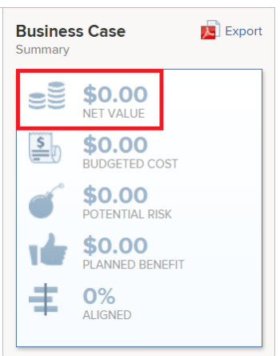

# 計算淨值

項目的淨值是計算項目收益並刪除成本後的項目總預期值。 

## 項目淨值概覽

Adobe Workfront使用下列公式計算專案的淨值： 

```
Project Net Value = Planned Benefit - Budgeted Cost - Potential Risk Cost
```

下列欄位可能會影響專案的淨值：

* **計畫福利**:這是項目所有者在完成 **專案資訊** 商業案例的區域。\
   有關項目的計畫效益的詳細資訊，請參閱 [專案資訊](../../../manage-work/projects/define-a-business-case/areas-of-business-case.md#project-info) 文章一節 [業務案例領域概述](../../../manage-work/projects/define-a-business-case/areas-of-business-case.md).

* **預算成本**：這是初次啟動專案時預估的與專案相關的總成本。

   此 **預算成本** 使用 **預算人工成本** 在「業務案例」的「資源預算」區域中計算的值，它考慮了資源計畫員中任務職責的預算小時數以及每個任務職責的「每小時成本」費率。\
   預算成本會影響 **淨值** 的URL。 有關如何計算預算成本的詳細資訊，請參閱 [計算預算成本](../../../manage-work/projects/project-finances/budgeted-cost.md).

* **潛在風險成本**:這是與項目中任何風險（如業務案例或項目的「風險」頁簽中所定義）相關的成本。\
   有關計算項目潛在風險成本的詳細資訊，請參閱文章 [計算潛在風險成本](../../../manage-work/projects/project-finances/potential-risk-cost.md).

    

## 找出專案淨值

您可以在Workfront的下列區域找到專案的淨值：

* 業務案例的業務案例摘要區 \
   有關「業務案例摘要」區域的詳細資訊，請參閱文章中的「了解業務案例摘要」部分 [為項目建立業務案例](../../../manage-work/projects/define-a-business-case/create-business-case.md) [為項目建立業務案例](../../../manage-work/projects/define-a-business-case/create-business-case.md).

   

* 在Portfolio優化程式中，如果項目與產品組合關聯

   >[!TIP]
   >
   >所有項目淨值的合計為產品組合的淨值。

   如需有關Portfolio優化程式的詳細資訊，請參閱 [Portfolio優化程式概述](../../../manage-work/portfolios/portfolio-optimizer/portfolio-optimizer-overview.md).

* 在以下清單和報表的「項目淨值」欄位中：

   * 專案
   * 任務
   * 問題
   * 專案 (財務資料)
   如需建立報表的詳細資訊，請參閱文章 [建立自訂報表](../../../reports-and-dashboards/reports/creating-and-managing-reports/create-custom-report.md).
