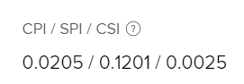

# 計算排程績效指數(SPI)

<!--
<p data-mc-conditions="QuicksilverOrClassic.Draft mode">(NOTE: Linked to the product. Do not change link.)</p>
-->

排程績效指數(SPI)說明計畫排程與實際排程之間的關係。 Adobe Workfront會計算專案與任務層級的SPI。 專案經理會檢閱此量度，以識別任務或專案目前追蹤的時間是否比排程提前或落後。

## 存取權要求

+++ 展開以檢視這篇文章中所述功能的存取權要求。

<table style="table-layout:auto"> 
 <col> 
 <col> 
 <tbody> 
  <tr> 
   <td>Adobe Workfront 封裝</td> 
   <td>任何</td> 
  </tr> 
  <tr> 
   <td>Adobe Workfront授權</td> 
   <td>
   <p>淺色或更高</p>
   <p>評論或以上</p></td>  
  </tr> 
  <tr> 
   <td>存取層級設定</td> 
   <td>檢視專案與財務資料的存取權</td> 
  </tr> 
  <tr> 
   <td>物件許可權</td> 
   <td>檢視擁有檢視一般財務許可權之專案的或更高許可權</td> 
  </tr> 
 </tbody> 
</table>

如需詳細資訊，請參閱Workfront檔案中的[存取需求](/help/quicksilver/administration-and-setup/add-users/access-levels-and-object-permissions/access-level-requirements-in-documentation.md)。

+++

## 排程績效指數(SPI)概觀

* [SPI值顯示什麼](#what-the-spi-value-shows)
* [Workfront如何計算SPI](#how-workfront-calculates-spi)

### SPI值顯示內容 {#what-the-spi-value-shows}

專案經理瞭解，SPI值為1表示專案符合計畫或準時。  值大於1表示專案比排程提前，值小於1表示專案比排程落後。  從1越遠，與計畫的偏差越大。

| **SPI值** | **「依排程」的指示** |
|---|---|
| 1 | 依計畫或依排程 |
| > 1 （大於1） | 比計畫提前 |
| &lt; 1 （小於1） | 晚於排程 |

{style="table-layout:auto"}

### Workfront如何計算SPI  {#how-workfront-calculates-spi}

Workfront會透過下列公式計算SPI：

```
SPI = (Total Planned Hours x % Complete) / Planned Hours Scheduled to Date*
```

*&#42;如果計畫時數排程為日期= 0，SPI = 1*。

計畫時數排程至今會在您執行計算的分鐘計算。 它顯示到目前日期的計畫時數。 當您變更財務資料以取得準確資料時，系統會自動重新計算。 Workfront中沒有指出此值的欄位。

例如，如果您有一個具有1個任務的專案，而該任務具有10個計畫時數和10天期間，則計畫時數排程至第5天的日期為5。

## 在專案或任務中尋找SPI

1. 移至您要檢視SPI的專案或工作。
1. 根據您想要檢視專案或任務上的SPI，請執行下列任一項作業：

   1. 按一下左側面板中的&#x200B;**專案詳細資料**，然後檢視&#x200B;**財務**&#x200B;區域。

   1. 按一下左側面板中的&#x200B;**工作詳細資料**，然後檢視&#x200B;**財務**&#x200B;區域。

      專案上的SPI

1. 尋找&#x200B;**CPI/ SPI/ CSI**&#x200B;欄位。
