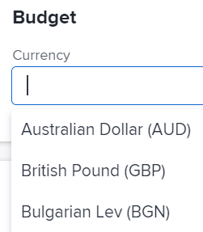

# 更改項目幣種

身為專案管理員，您可以設定專案，使用Adobe Workfront系統預設貨幣以外的貨幣。 這可讓您在計算人工成本和收入時，以所需貨幣顯示專案的財務資訊。

您必須先依照文章所述，讓Workfront管理員啟用並設定多種貨幣，才能使用本節所述的替代貨幣 [設定匯率](../../../administration-and-setup/manage-workfront/exchange-rates/set-up-exchange-rates.md).

## 存取需求

您必須具備下列存取權，才能執行本文中的步驟：

<table style="table-layout:auto"> 
 <col> 
 <col> 
 <tbody> 
  <tr> 
   <td role="rowheader">Adobe Workfront計畫*</td> 
   <td> 
任何
 </td> 
  </tr> 
  <tr> 
   <td role="rowheader">Adobe Workfront授權*</td> 
   <td> 
計劃 
 </td> 
  </tr> 
  <tr> 
   <td role="rowheader">訪問級別配置*</td> 
   <td> 
編輯專案的存取權
 
注意：如果您仍無權存取，請洽詢您的Workfront管理員，他們是否在您的存取層級設定其他限制。 如需Workfront管理員如何修改您的存取層級的詳細資訊，請參閱 <a href="../../../administration-and-setup/add-users/configure-and-grant-access/create-modify-access-levels.md" class="MCXref xref">建立或修改自訂存取層級</a>.
 </td> 
  </tr> 
  <tr> 
   <td role="rowheader">物件權限</td> 
   <td> 
管理專案的權限
 
有關請求其他訪問的資訊，請參閱 <a href="../../../workfront-basics/grant-and-request-access-to-objects/request-access.md" class="MCXref xref">請求對對象的訪問 </a>.
 </td> 
  </tr> 
 </tbody> 
</table>

&#42;若要了解您擁有的計畫、授權類型或存取權，請聯絡您的Workfront管理員。

## 在Workfront中變更專案貨幣時的考量事項

* 如果項目中有任何財務資訊，則不能更改項目的幣種。
* 工資費用採用稅率；收入計算，並於日後用於報告用途。
* 如果您未指定專案的不同貨幣，Workfront會假設專案的貨幣為系統的預設貨幣。 有關係統級預設貨幣的資訊，請參閱 [設定匯率](../../../administration-and-setup/manage-workfront/exchange-rates/set-up-exchange-rates.md).
* 預設情況下，所有完整許可證用戶都有權查看幣種和匯率。 Workfront管理員需要授予 **匯率** 讓使用者可設定專案的特定比率。
* Workfront的匯率並非動態的。 該值由管理員設定，且必須在匯率發生變更時更新。
* 建立報表以反映專案上的貨幣時，依預設，所有報表都會依專案的預設貨幣分組。 如果您使用具有不同匯率的多個項目建立報表，則應用於項目的任何分組都反映系統級別的預設匯率。 如需詳細資訊，請參閱文章 [使用獨特的匯率建立財務資料報告](../../../reports-and-dashboards/reports/creating-and-managing-reports/create-financial-data-reports-unique-exchange-rates.md).

## 設定專案的貨幣

1. 轉到要更改預設貨幣的項目。

   >[!TIP]
   >
   >確保項目尚未包含任何財務資訊。 例如，確保沒有與項目關聯的計畫成本或實際成本。

1. 按一下 **專案詳細資料** 在左側面板中，然後前往 **金融** 的上界。
1. 按一下 **新增** 在 **貨幣** 欄位，然後選取您要作為專案預設貨幣的貨幣。 系統會顯示您的Workfront管理員為Workfront例項設定的所有貨幣。

   

1. （條件性）如果您選取的貨幣不是為Workfront系統設定的預設貨幣，請指定所選貨幣的匯率，因為它與在系統中設定為基本貨幣的貨幣相關。
1. 按一下 **儲存變更**.
