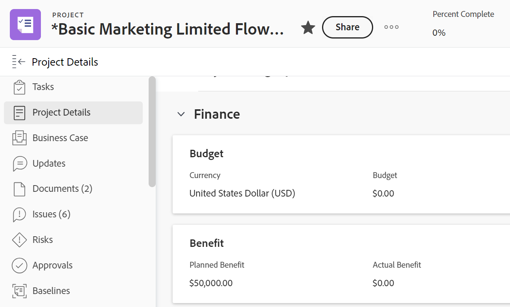

# 管理項目財務區域中的資訊

<!--

(NOTE: some information in here is duplicated in Edit projects. If you need to update one of the fields in this area, do it in both places.)

-->

通過訪問「項目詳細資訊」部分的「財務」區域，可以查看或編輯項目的財務資訊。 在此區域中可查看或編輯的欄位數量有限。 如需編輯專案所有資訊的相關資訊，請參閱 [編輯專案](../../../manage-work/projects/manage-projects/edit-projects.md).

## 存取需求

您必須具備下列存取權，才能執行本文中的步驟：

<table style="table-layout:auto"> 
 <col> 
 <col> 
 <tbody> 
  <tr> 
   <td role="rowheader">Adobe Workfront計畫*</td> 
   <td> 
任何
 </td> 
  </tr> 
  <tr> 
   <td role="rowheader">Adobe Workfront授權*</td> 
   <td> 
審核或更高版本
 </td> 
  </tr> 
  <tr> 
   <td role="rowheader">訪問級別配置*</td> 
   <td> 
查看或更高程度地訪問項目和財務資料
 
編輯對項目和財務資料的訪問以編輯項目的財務資訊
 
注意：如果您仍無權存取，請洽詢您的Workfront管理員，他們是否在您的存取層級設定其他限制。 如需Workfront管理員如何變更您的存取層級的詳細資訊，請參閱 <a href="../../../administration-and-setup/add-users/configure-and-grant-access/create-modify-access-levels.md" class="MCXref xref">建立或修改自訂存取層級</a>.
 </td> 
  </tr> 
  <tr> 
   <td role="rowheader">物件權限</td> 
   <td> 
查看包含查看財務權限的項目或更高版本的權限
 
管理包含「管理財務」的項目的權限，以編輯項目的財務資訊
 
有關請求其他訪問的資訊，請參閱 <a href="../../../workfront-basics/grant-and-request-access-to-objects/request-access.md" class="MCXref xref">請求對對象的訪問 </a>.
 </td> 
  </tr> 
 </tbody> 
</table>

&#42;若要了解您擁有的計畫、授權類型或存取權，請聯絡您的Workfront管理員。

## 財務領域概覽

在「財務」區域中查看或編輯資訊時，請考慮以下事項：

* 您可以在「項目詳細資訊」的「財務」區域中找到的財務資訊表示從任務累計到項目層的值，以及直接在項目上輸入的資訊。 可以在項目和任務級別管理某些財務資訊。
* 您必須具有項目的查看權限以及訪問級別中的財務資料的訪問權限，才能查看項目上的財務區域。
* 您必須具有項目的管理權限以及訪問級別的財務資料的權限，才能編輯財務區域上的資訊。 不過，我們建議只有專案擁有者才應編輯此區域的資訊。

## 查看項目的財務資訊

1. 前往專案。
1. 按一下 **專案詳細資料** 中。
1. 按一下 **編輯** 圖示  在「詳細資料」區段的右上角，按一下 **金融**.

   

   >[!NOTE]
   >
   >視您的Workfront管理員設定配置範本的方式而定，「概述」區段可能不會先列出，而是會收合。 如需詳細資訊，請參閱 [使用版面範本自訂「詳細資料」檢視](../../../administration-and-setup/customize-workfront/use-layout-templates/customize-details-view-layout-template.md).

1. 查看項目「財務」區域中的以下欄位：

   <table style="table-layout:auto"> 
    <col> 
    <col> 
    <tbody> 
     <tr> 
      <td role="rowheader">績效指數方法</td> 
      <td> 控制Workfront用於計算掙值量度的方法。 可以是以小時為基礎，或以成本為基礎。  有關PIM的詳細資訊，請參閱文章 <a href="../../../manage-work/projects/project-finances/set-pim.md" class="MCXref xref">設定效能索引方法(PIM)</a></td> 
     </tr> 
     <tr> 
      <td role="rowheader">CPI / SPI / CSI</td> 
      <td> 
這些是專案績效量度，可顯示您專案在指定時間的執行情形。 其值是根據「效能索引」方法計算的。 如需詳細資訊，請參閱下列文章： 
 
       <ul> 
        <li> 
<a href="../../../manage-work/projects/project-finances/calculate-cpi.md" class="MCXref xref">計算成本績效指數(CPI)</a> 
 </li> 
        <li> 
<a href="../../../manage-work/projects/project-finances/calculate-spi.md" class="MCXref xref">計算計畫效能索引(SPI) </a> 
 </li> 
        <li> 
<a href="../../../manage-work/projects/project-finances/calculate-csi.md" class="MCXref xref">計算成本計畫效能指數(CSI)</a> 
 </li> 
       </ul> </td> 
     </tr> 
     <tr> 
      <td role="rowheader">預估完成成本</td> 
      <td> 如果效能索引方法(PIM)基於小時，則以小時表示項目的預計總成本，如果效能索引方法(PIM)基於成本，則以貨幣值表示。 如需有關計算完成時預估的詳細資訊，請參閱文章 <a href="../../../manage-work/projects/project-finances/calculate-eac.md" class="MCXref xref">完成時計算估計值(EAC)</a></td> 
     </tr> 
     <tr> 
      <td role="rowheader">預算</td> 
      <td>這是項目設定的預算。 此項目所有者手動指定。</td> 
     </tr> 
     <tr> 
      <td role="rowheader">固定成本</td> 
      <td>這些是項目的固定成本，與項目上的其他活動無關。 由項目所有者手動輸入。</td> 
     </tr> 
     <tr> 
      <td role="rowheader">計畫成本</td> 
      <td>根據計畫小時數和與任務分配者（職務角色或用戶）關聯的費率，項目的估計成本。</td> 
     </tr> 
     <tr> 
      <td role="rowheader">實際成本</td> 
      <td>項目應計的所有成本。 實際成本是所有實際成本的總和：人工成本（基於實際小時數和與任務職責或記錄任務的用戶相關聯的費率）、費用和固定成本（可與項目或任務相關聯）。</td> 
     </tr> 
     <tr> 
      <td role="rowheader">固定收入</td> 
      <td>根據項目時間表設定預期收入。 固定收入由專案擁有者手動指定。</td> 
     </tr> 
     <tr> 
      <td role="rowheader">計畫收入</td> 
      <td>根據計畫小時數和與任務分配者（職務角色或用戶）關聯的費率，預計收入。</td> 
     </tr> 
     <tr> 
      <td role="rowheader">實際收入</td> 
      <td>根據實際小時數和與任務分配者（職務職責或用戶）關聯的費率，項目的實際收入。</td> 
     </tr> 
     <tr> 
      <td role="rowheader">已記帳收入</td> 
      <td> 
向客戶或在「帳單記錄」中捕獲的其他交易方開單的收入。 如需帳單記錄的詳細資訊，請參閱文章 <a href="../../../manage-work/projects/project-finances/create-billing-records.md" class="MCXref xref">建立計費記錄</a>. 
 </td> 
     </tr> 
     <tr> 
      <td role="rowheader"> </td> 
      <td> </td> 
     </tr> 
     <tr> 
      <td role="rowheader"> </td> 
      <td> </td> 
     </tr> 
    </tbody> 
   </table>

## 編輯項目的財務資訊

作為項目責任人，您可以編輯項目的「財務」子標籤上的資訊。

要編輯「項目財務」子標籤上的資訊，請執行以下操作：

1. 轉到您是的所有者的項目。

   >[!NOTE]
   >
   >您需要專案的「管理」權限，才能執行下列步驟。 我們也建議只有專案擁有者才應該變更專案的「財務」子標籤。

1. 按一下 **專案詳細資料** 中。
1. 按一下 **編輯** 圖示  在「詳細資料」區段的右上角，按一下 **金融** . 這將開啟「財務」區域進行編輯。
1. 按一下欄位或按一下，編輯任何可供編輯的欄位 **+添加** 將資訊添加到空欄位。

   >[!TIP]
   >
   >如果欄位是由Workfront自動計算，或您沒有編輯權限，則無法編輯這些欄位。

   

1. 更新下列任何欄位。

   >[!NOTE]
   >
   >視您的Workfront管理員設定「配置範本」的方式而定，您的環境中「專案詳細資料」區段中的欄位可能會不同。 如需詳細資訊，請參閱 [使用版面範本自訂「詳細資料」檢視](../../../administration-and-setup/customize-workfront/use-layout-templates/customize-details-view-layout-template.md).

   <table style="table-layout:auto"> 
    <col> 
    <col> 
    <tbody> 
     <tr> 
      <td role="rowheader">績效指數方法</td> 
      <td> 
控制Workfront用於計算專案效能量度的方法。 這是由管理員在系統層級設定的，但您也可以在專案層級編輯。 請考慮選取下列其中一個選項：
 
       <ul> 
        <li><strong>小時型：</strong>Workfront在計算項目的CPI和EAC時使用「計畫小時數」，而項目的EAC以小時數顯示。 </li> 
        <li><strong>基於成本：</strong>Workfront在計算項目的CPI和EAC時使用「計畫人工成本」，EAC顯示為貨幣值。 選擇此選項時，請確保任務分配者（職務角色或用戶）與成本比率相關聯。</li> 
       </ul> </td> 
     </tr> 
     <tr> 
      <td role="rowheader">預估完成成本</td> 
      <td> 
表示項目或任務完成時的預計總成本。 這是由管理員在系統層級設定的，但您也可以在專案層級編輯。 請考慮選取下列其中一個選項：
 
       <ul> 
        <li><strong>在專案層級計算</strong>:父任務和項目的EAC通過在EAC公式中輸入實際小時數/實際人工成本來確定。 此計算包括直接添加到父任務或項目的實際小時數/成本和費用。</li> 
        <li><strong>從任務/子任務匯總</strong>:父任務和項目的EAC通過加總每個子任務的EAC來確定。 此計算不包括直接添加到父任務或項目的實際小時數/成本和費用。</li> 
       </ul> </td> 
     </tr> 
     <tr> 
      <td role="rowheader">預算</td> 
      <td>指定此項目的預算。</td> 
     </tr> 
     <tr> 
      <td role="rowheader"><strong>固定成本</strong> </td> 
      <td>指定此項目的固定成本。 這不應包括任何人工或費用成本。</td> 
     </tr> 
     <tr> 
      <td role="rowheader"><strong>固定收入</strong> </td> 
      <td> 
指定此專案的固定收入。 這不應包括向合作夥伴或第三方開單的任何帳單記錄所產生的收入。
 </td> 
     </tr> 
     <tr> 
      <td role="rowheader">專案貨幣</td> 
      <td> 
如果此項目的貨幣與系統中的預設貨幣不同，請為其指定貨幣。 系統中的預設貨幣由您的Workfront管理員定義。 如需在Workfront中設定匯率的詳細資訊，請參閱文章 <a href="../../../administration-and-setup/manage-workfront/exchange-rates/set-up-exchange-rates.md" class="MCXref xref">設定匯率</a>.
 </td> 
     </tr> 
     <tr> 
      <td role="rowheader"> </td> 
      <td> </td> 
     </tr> 
    </tbody> 
   </table>

1. 按一下 **儲存****變更**.
