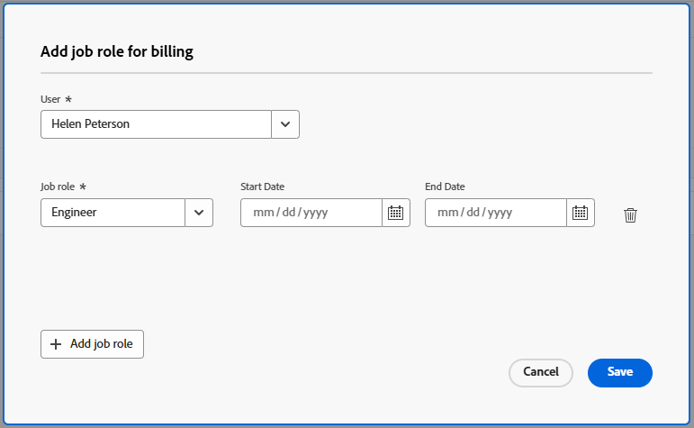

# 設定帳單的工作角色

Workfront可讓您為使用者和其主要工作角色不同的工作角色開立帳單。 當一個人暫時執行應按不同費率計費的工作時，這將很有用。

您可以透過兩種方式指定「開立帳單工作角色」：

* 專案層級：當整個專案中的人員應透過相同工作角色被計費時，請使用此選項。
* 在指定層次：當您要針對特定作業以不同方式開立帳單時，請使用此選項。

>[!NOTE]
>
>* 計費工作角色僅適用於人員（使用者）。 它不適用於一般職務角色或預留位置。
>* 新增「計費」的工作角色只會影響計費率，不會影響成本。
>* 工作分派層次帳單一律優先於專案層次帳單。

如需詳細資訊，請參閱[收入和成本階層概覽](/help/quicksilver/manage-work/projects/project-finances/overview-revenue-cost-hierarchy.md)和[建立進階工作分派](/help/quicksilver/manage-work/tasks/assign-tasks/create-advanced-assignments.md)。

## 存取權要求

+++ 展開以檢視這篇文章中所述功能的存取權要求。

<table style="table-layout:auto"> 
 <col> 
 <col> 
 <tbody> 
  <tr> 
   <td>Adobe Workfront 封裝</td> 
   <td>Workflow Ultimate</td> 
  </tr> 
  <tr> 
   <td>Adobe Workfront授權</td> 
   <td>標準</td> 
  </tr> 
  <tr> 
   <td>存取層級設定</td> 
   <td> 編輯對費率卡的存取權</td> 
  </tr> 
  <tr> 
   <td>物件許可權</td> 
   <td>管理專案的許可權 </td> 
  </tr> 
 </tbody> 
</table>

如需詳細資訊，請參閱Workfront檔案中的[存取需求](/help/quicksilver/administration-and-setup/add-users/access-levels-and-object-permissions/access-level-requirements-in-documentation.md)。

+++

## 在專案層次指定開立帳單的工作角色

當您建立工作角色以在專案上開立帳單時：

* 帳單角色會套用至該使用者在專案內的所有任務和指派。
* 帳單會使用所選工作角色的帳單費率，但成本仍會依循使用者的主要角色。

若要在專案層次指定開立帳單的工作角色，請執行下列步驟：

1. 開啟專案。
1. 按一下左側面板中的&#x200B;**計費資源**。
1. 選取帳單的&#x200B;**工作角色**&#x200B;標籤（如果尚未顯示）。
1. 按一下&#x200B;**新增>新增工作角色以進行計費**。
1. 在&#x200B;**新增工作角色以計費**&#x200B;方塊上，選取&#x200B;**使用者**。
1. 選取&#x200B;**工作角色**，作為此專案中此使用者的計費工作角色。
1. （選擇性）按一下&#x200B;**新增工作角色**&#x200B;以定義工作角色的有效日期，以進行計費。 輸入工作角色的&#x200B;**開始**&#x200B;和&#x200B;**結束**&#x200B;日期。

   開立帳單

1. 再按一下&#x200B;**新增工作角色**&#x200B;以指定不同時間週期的其他計費角色。
1. 按一下「**儲存**」。

### 專案層級的範例

>[!BEGINSHADEBOX]

John的主要職務角色為Designer 1。 專案需要資深Designer，而John正在填入。

您應在專案層級將計費的工作角色設定為&#x200B;**資深Designer**。

結果:

* 記帳收入是高級Designer費率
* 成本是Designer 1的成本比率（John的實際成本比率）

>[!ENDSHADEBOX]

## 在指定層次指定開立帳單的工作角色

當您新增工作角色以針對指定開立帳單時，此設定只會針對該特定指定覆寫專案層次的帳單角色。

若要在指定層次指定開立帳單的工作角色，請執行下列步驟：

1. 開啟專案並找出任務。
1. 前往任務的&#x200B;**進階工作分派**。

   如需詳細資訊，請參閱[建立進階工作分派](/help/quicksilver/manage-work/tasks/assign-tasks/create-advanced-assignments.md)。

1. 在任務指派網格上，找到欄&#x200B;**工作角色以進行計費**。
1. 針對您想要不同帳單的每個指派，選取工作角色。

   >[!NOTE]
   >
   >如果帳單的工作角色是在專案層次指定，則會顯示在指定上。 您可以按一下&#x200B;**工作角色以計費**欄位，然後選取其他工作角色以用於指派。
   >資訊圖示會通知您帳單的工作角色是在專案或指定層次定義。

   

### 指派層次的範例

>[!BEGINSHADEBOX]

John的主要職務角色為Designer 1。 他在專案層級被列為資深Designer，但有一個特殊任務需要主要的Designer收費率。

您只能在該指派上將計費的工作角色設定為主要Designer。

結果:

* John的所有其他任務都以資深Designer的身份提呈
* 此一任務以主要Designer的名義發行
* 成本仍為Designer 1

>[!ENDSHADEBOX]
