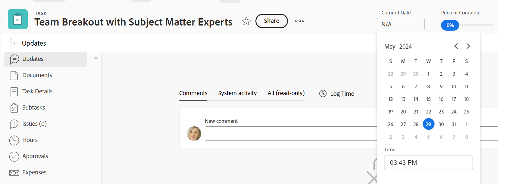

# 更新任務和問題的認可日期

<!--Audited: 07/2024-->

<!--The highlighted information on this page refers to functionality not yet generally available. It is available only in the Preview environment for all customers, or in the Production environment for customers who enabled fast releases.

For information about fast releases, see [Enable or disable fast releases for your organization](/help/quicksilver/administration-and-setup/set-up-workfront/configure-system-defaults/enable-fast-release-process.md).

For information about the current release, see [Third Quarter 2024 release overview](/help/quicksilver/product-announcements/product-releases/24-q3-release-activity/24-q3-release-overview.md).-->

您可以手動更新指派給您的任務或問題的認可日期。 如需Adobe Workfront中認可日期的詳細資訊，請參閱[認可日期總覽](../../../manage-work/projects/updating-work-in-a-project/overview-of-commit-dates.md)。

## 存取需求

<!--Audited: 01/2024-->

+++ 展開以檢視本文中功能的存取需求。

<table style="table-layout:auto"> 
 <col> 
 <col> 
 <tbody> 
  <tr> 
   <td role="rowheader">Adobe Workfront計畫</td> 
   <td> 
任何
 </td> 
  </tr> 
  <tr> 
   <td role="rowheader">Adobe Workfront授權*</td> 
   <td> 
   新增：
   <ul>
   <li>
任務的標準
 </li>
   <li>
問題的貢獻者或以上版本
</li>
   </ul>
   目前：
<ul>
   <li>
工作或更高的任務
</li> 
   <li>
要求或更高版本的問題
</li>
</ul>

</td> 
  </tr> 
  <tr> 
   <td role="rowheader">存取層級設定</td> 
   <td> 
編輯任務和問題的存取權
 </td> 
  </tr> 
  <tr> 
   <td role="rowheader">物件許可權</td> 
   <td> 
管理任務或問題的許可權

   
 您必須被指派任務或問題才能更新認可日期 

    </td> 
  </tr> 
 </tbody> 
</table>

* 如需詳細資訊，請參閱Workfront檔案中的[存取需求](/help/quicksilver/administration-and-setup/add-users/access-levels-and-object-permissions/access-level-requirements-in-documentation.md)。

+++

## 先決條件

您必須被指派給需要更新其認可日期的任務或問題，才能編輯任務或問題的認可日期。

## 更新任務和問題的認可日期

您可以在Workfront的下列區域中更新任務或問題的認可日期：

* 任務或問題的詳細資訊區段
* 任務或問題標題

  您的Workfront或群組管理員必須將認可日期新增到版面配置範本的任務或問題標題，以從任務或問題頁面檢視它。
如需詳細資訊，請參閱[使用配置範本自訂物件標頭](/help/quicksilver/administration-and-setup/customize-workfront/use-layout-templates/customize-object-headers.md)。

更新認可日期對於任務和問題而言是相同的。

>[!NOTE]
>
>您可以要求系統或群組管理員將認可日期欄位新增到您的摘要面板，使其更易於在Workfront的各個區域更新。
>
>如需詳細資訊，請參閱下列文章：
>
>* [摘要概述](/help/quicksilver/workfront-basics/the-new-workfront-experience/summary-overview.md)
>* [使用配置範本自訂摘要面板](/help/quicksilver/administration-and-setup/customize-workfront/use-layout-templates/customize-home-summary-layout-template.md)。

1. 前往指派您為&#x200B;**所有者**&#x200B;的任務或問題。

   如需尋找問題或任務的任務擁有者的詳細資訊，請參閱文章[編輯任務](../../../manage-work/tasks/manage-tasks/edit-tasks.md)中的[編輯任務](../../../manage-work/tasks/manage-tasks/edit-tasks.md#assignments)小節。

1. （條件式與選擇性）如果您的Workfront或群組管理員將認可日期新增到您的任務或問題標題，請按一下標題中的&#x200B;**認可日期**&#x200B;欄位，然後從日曆中選取日期。 如果「認可日期」不在標題中，請繼續下列步驟。

   

1. 按一下左側面板中的&#x200B;**任務詳細資料**&#x200B;或&#x200B;**問題詳細資料**。
1. 按一下「**概觀**」以展開它。
1. 更新&#x200B;**認可日期**&#x200B;欄位。

   

1. 按一下「**儲存變更**」。

   進行此變更後，會發生下列情況：

   * 任務或問題的認可日期和計畫完成日期不再相同。

     相反，任務或問題的認可日期和預計完成日期變為相同。

     

   * Workfront應用程式內通知會通知專案所有者，您已建議任務或問題的新認可日期。
   * 更新區段會通知專案所有者，您已建議新的認可日期，他們現在可以更新任務或問題的規劃完成日期，以符合您建議的認可日期。

     

     <!---->

     如需有關此變更所觸發的通知和更新的資訊，請參閱文章[認可日期概觀](/help/quicksilver/manage-work/projects/updating-work-in-a-project/overview-of-commit-dates.md)中的「變更認可日期所觸發的通知和更新」一節。

<!--at the Production update stream when removing legacy - replace the last bullet with: The Project Owner is notified in the Systems Activity and the All tabs of the Updates section that you have suggested a new Commit Date. They can then update the Planned Completion Date accordingly by editing the task or the issue.-->