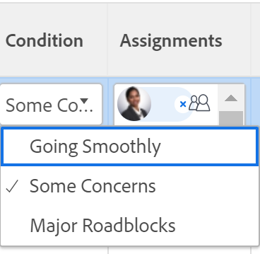

# 更新任務和問題的條件

任務或問題的條件是在其上放置標誌以指示進展情況。 這與工作專案的「狀態」不同，後者指示專案開發的目前階段。

您可以自動或手動設定任務或問題的條件。

Adobe Workfront管理員可為您的環境建立自訂條件，如所述 [建立或編輯自訂條件](../../../administration-and-setup/customize-workfront/create-manage-custom-conditions/create-edit-custom-conditions.md)

<!--You can manually update the Condition of a task or issue if you are assigned to it or if you have permissions to it, as described in the [Access requirements](#access-requirements) section of this article.-->

## 存取需求 {#access-requirements}

您必須具有下列存取權才能執行本文中的步驟：

<table style="table-layout:auto"> 
 <col> 
 <col> 
 <tbody> 
  <tr> 
   <td role="rowheader">Adobe Workfront計畫</td> 
   <td> 
任何
 </td> 
  </tr> 
  <tr> 
   <td role="rowheader">Adobe Workfront授權*</td> 
   <td>

對於新授權：
<ul><li>
任務的標準
</li>
   <li>
問題的貢獻者或以上版本
</li></ul>

對於目前的授權：
<ul><li>
工作或更高的任務
</li>
   <li>
要求或更高版本的問題
</li></ul>
    </td> 
  </tr> 
  <tr> 
   <td role="rowheader">存取層級設定</td> 
   <td> 
檢視或更高專案存取權
 
編輯任務和問題的存取權 
</td> 
  </tr> 
  <tr> 
   <td role="rowheader">物件許可權</td> 
   <td> 
檢視任務或問題的許可權以檢視其狀態

   
管理任務和問題的許可權以更新條件

  </td> 
  </tr> 
 </tbody> 
</table>

*若要瞭解您擁有的計畫、授權型別或存取權，請聯絡您的Workfront管理員。 如需詳細資訊，請參閱 [Workfront檔案中的存取需求](/help/quicksilver/administration-and-setup/add-users/access-levels-and-object-permissions/access-level-requirements-in-documentation.md).

## 找出任務和問題的狀況

條件會顯示為與任務或問題相關聯的標幟。 附註也可以與數字建立關聯，該數字可在報表中顯示，而非標籤。 如需將條件與數字產生關聯的詳細資訊，請參閱 [建立或編輯自訂條件](../../../administration-and-setup/customize-workfront/create-manage-custom-conditions/create-edit-custom-conditions.md).

您可以在下列區域找到任務和問題的狀況：

* 任務和問題更新指派給任務或問題時，更新內的更新區域。 新的評論體驗不支援此功能。 如需詳細資訊，請參閱 [新的評論體驗](/help/quicksilver/product-announcements/betas/new-commenting-experience-beta/unified-commenting-experience.md).
* 當您在檢視或分組中顯示「條件」欄位時，會報告並列出。

>[!NOTE]
>
>當「條件」一詞顯示在「日誌專案」報表的「欄位名稱」欄位中時，表示專案的「條件」已更新。 在「分錄」報表中追蹤「條件」欄位時，「新值」和「舊值」會顯示與條件相關的編號，而不是其名稱。 如果最初沒有為任務或問題定義條件，而您稍後更新了它，則擷取更新的日誌專案會將「條件」欄位的「舊號碼值」顯示為 — 2,147,483,648。

## 更新狀態以自動更新條件

當您被指派任務或問題並按一下 **處理它** ，開始任務或開始問題，或更新其狀態，任務或問題的條件自動變更為關聯的預設條件 **進展順利**.

如需使用自訂條件作為預設條件的詳細資訊，請參閱文章  [設定自訂條件作為任務和問題的預設值](../../../administration-and-setup/customize-workfront/create-manage-custom-conditions/set-custom-condition-default-tasks-issues.md) 和 [將自訂條件設定為專案的預設值](../../../administration-and-setup/customize-workfront/create-manage-custom-conditions/set-custom-condition-default-projects.md).

如需有關變更工作狀態的資訊，請參閱 [更新任務狀態](../../../manage-work/projects/updating-work-in-a-project/update-task-status.md).

如需有關變更問題狀態的資訊，請參閱 [更新問題狀態](../../../manage-work/projects/updating-work-in-a-project/update-issue-status.md).

有關將處理它按鈕設定為開始任務或開始問題按鈕的資訊，請參閱 [將處理它按鈕取代為開始按鈕](../../../people-teams-and-groups/create-and-manage-teams/work-on-it-button-to-start-button.md).

## 手動更新條件

您必須被指派給任務或問題，或擁有任務或問題的管理許可權，才能對其設定條件。

當您在檢視中顯示「條件」欄位時，可以手動更新任務、問題報告或清單中的任務或問題的條件。

<!--old Condition update - in the commenting stream: 
Updating the Condition of a task or issue differs depending on whether you are assigned to it or not:

* If you are using the legacy commenting experience, you can update the Condition in the Updates tab or in a list of tasks or issues if you are assigned to them. This is not supported in the new commenting experience. For information, see [New commenting experience](/help/quicksilver/product-announcements/betas/new-commenting-experience-beta/unified-commenting-experience.md). 
* You can update the Condition in a list of tasks or issues if you are not assigned to them, only if you have Manage permissions to them. In this case, you cannot update the Condition in the Update tab of the task or issue. -->

若要手動更新任務或問題的狀態：

1. 前往您擁有「管理」許可權的任務或問題清單。 確保 **條件** 欄位會顯示在清單的檢視中。

1. 更新 **條件** 內嵌問題的現有條件，並從下拉式選單中選取新值。

   

   >[!NOTE]
   >
   >條件可以根據您的環境自訂，因此您可以在環境中找到三個以上的條件選項。 條件的名稱可能與上方列出的名稱不同。 如需在Workfront中自訂條件的詳細資訊，請參閱 [建立或編輯自訂條件](../../../administration-and-setup/customize-workfront/create-manage-custom-conditions/create-edit-custom-conditions.md).

1. 按下 **輸入** 或按一下「條件」欄位外部以儲存新任務或問題「條件」。

   <!--   
     <li data-mc-conditions="QuicksilverOrClassic.Draft mode">
(NOTE: drafted because I can't do this anymore)

If you have Manage permissions to the task or issue but are not assigned to it, perhaps as a project manager, add the <strong>Condition</strong> column to any view you use in a task or issue list, then set the <strong>Condition</strong> in inline edit and press Enter.

For information about adding a column to a view, see <a href="../../../reports-and-dashboards/reports/reporting-elements/views-overview.md" class="MCXref xref">Views overview in Adobe Workfront</a>.
</li>   
     -->
