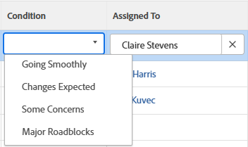

# 更新任務和問題的條件

<!--Audited: 07/2024-->

<!--The highlighted information on this page refers to functionality not yet generally available. It is available only in the Preview environment for all customers, or in the Production environment for customers who enabled fast releases.

For information about fast releases, see [Enable or disable fast releases for your organization](/help/quicksilver/administration-and-setup/set-up-workfront/configure-system-defaults/enable-fast-release-process.md).

For information about the current release, see [Third Quarter 2024 release overview](/help/quicksilver/product-announcements/product-releases/24-q3-release-activity/24-q3-release-overview.md).-->

任務或問題的條件是在其上放置標誌以指示進展情況。 這與工作專案的「狀態」不同，後者指示專案開發的目前階段。

您可以自動或手動設定任務或問題的條件。

根據預設，我們在Workfront中可以使用本文中提及的條件值。 您的Adobe Workfront管理員可以為您的環境建立自訂條件，如[建立或編輯自訂條件](../../../administration-and-setup/customize-workfront/create-manage-custom-conditions/create-edit-custom-conditions.md)中所述。

## 存取需求 {#access-requirements}

+++ 展開以檢視本文中功能的存取需求。 

<table style="table-layout:auto"> 
 <col> 
 <col> 
 <tbody> 
  <tr> 
   <td role="rowheader">Adobe Workfront計畫</td> 
   <td> 
任何
 </td> 
  </tr> 
  <tr> 
   <td role="rowheader">Adobe Workfront授權*</td> 
   <td> 
   新增:
   <ul><li>
任務的標準
</li>
   <li>
問題的貢獻者或以上版本
</li></ul>
   目前：
   <ul><li>
工作或更高的任務
</li>
   <li>
要求或更高版本的問題
</li></ul>
    </td> 
  </tr> 
  <tr> 
   <td role="rowheader">存取層級設定</td> 
   <td> 
檢視或更高專案存取權
 
編輯任務和問題的存取權 
</td> 
  </tr> 
  <tr> 
   <td role="rowheader">物件許可權</td> 
   <td> 
檢視任務或問題的許可權以檢視其狀態

   
貢獻任務和問題的許可權以更新條件

  </td> 
  </tr> 
 </tbody> 
</table>

*如需詳細資訊，請參閱Workfront檔案中的[存取需求](/help/quicksilver/administration-and-setup/add-users/access-levels-and-object-permissions/access-level-requirements-in-documentation.md)。

+++

## 先決條件

您必須指派給任務或問題才能手動更新其條件。

## 找出任務和問題的狀況

條件會顯示為與任務或問題相關聯的標幟。 附註也可以與數字建立關聯，該數字可在報表中顯示，而非標籤。 如需將條件與數字產生關聯的詳細資訊，請參閱[建立或編輯自訂條件](../../../administration-and-setup/customize-workfront/create-manage-custom-conditions/create-edit-custom-conditions.md)。

您可以在Workfront的下列區域中找到任務和問題的狀況：

* 在Workfront或群組管理員將其新增到您的版面配置範本後，顯示詳細資訊頁面。 如需詳細資訊，請參閱[使用配置範本自訂詳細資料檢視](/help/quicksilver/administration-and-setup/customize-workfront/use-layout-templates/customize-details-view-layout-template.md)。

* Workfront或群組管理員將任務或問題的標題新增到您的版面配置範本後。 如需詳細資訊，請參閱[使用配置範本自訂物件標頭](/help/quicksilver/administration-and-setup/customize-workfront/use-layout-templates/customize-object-headers.md)。

* 在Workfront或群組管理員將其新增到您的版面配置範本後，顯示「摘要」面板。 如需詳細資訊，請參閱[使用配置範本自訂摘要面板](/help/quicksilver/administration-and-setup/customize-workfront/use-layout-templates/customize-home-summary-layout-template.md)。

* 當您在檢視或分組中顯示「條件」欄位時，會報告並列出。

  >[!NOTE]
  >
  >當「條件」一詞顯示在「日誌專案」報表的「欄位名稱」欄位中時，表示專案的「條件」已更新。 在「分錄」報表中追蹤「條件」欄位時，「新值」和「舊值」會顯示與條件相關的編號，而不是其名稱。 如果最初沒有為任務或問題定義條件，而您稍後更新了它，則擷取更新的日誌專案會將「條件」欄位的「舊號碼值」顯示為 — 2,147,483,648。

## 更新狀態以自動更新條件

當您被指派任務或問題，並按一下&#x200B;**處理它** 、開始任務或開始問題，或更新其狀態時，任務或問題的條件會自動變更為與&#x200B;**順利進行**&#x200B;相關的預設條件。

如需使用自訂條件做為預設條件的詳細資訊，請參閱文章[設定自訂條件做為任務和問題的預設值](../../../administration-and-setup/customize-workfront/create-manage-custom-conditions/set-custom-condition-default-tasks-issues.md)以及[設定自訂條件做為專案的預設值](../../../administration-and-setup/customize-workfront/create-manage-custom-conditions/set-custom-condition-default-projects.md)。

如需有關變更工作狀態的資訊，請參閱[更新工作狀態](../../../manage-work/projects/updating-work-in-a-project/update-task-status.md)。

如需有關變更問題狀態的資訊，請參閱[更新問題狀態](../../../manage-work/projects/updating-work-in-a-project/update-issue-status.md)。

有關將[處理它]按鈕設定為[開始任務]或[開始問題]按鈕的資訊，請參閱[將[處理它]按鈕取代為[開始]按鈕](../../../people-teams-and-groups/create-and-manage-teams/work-on-it-button-to-start-button.md)。

## 手動更新條件

您必須被指派給任務或問題，或擁有任務或問題的管理許可權，才能對其設定條件。

當您在檢視中顯示「條件」欄位時，可以手動更新任務、問題報告或清單中的任務或問題的條件。

>[!NOTE]
>
>您可以要求系統或群組管理員將「條件」欄位新增到「摘要」面板，或任務或問題標題或「詳細資訊」頁面。
>
>如需詳細資訊，請參閱下列文章：
>
>* [摘要概述](/help/quicksilver/workfront-basics/the-new-workfront-experience/summary-overview.md)
>* [使用配置範本自訂摘要面板](/help/quicksilver/administration-and-setup/customize-workfront/use-layout-templates/customize-home-summary-layout-template.md)。

<!--old Condition update - in the commenting stream: 
Updating the Condition of a task or issue differs depending on whether you are assigned to it or not:

* If you are using the legacy commenting experience, you can update the Condition in the Updates tab or in a list of tasks or issues if you are assigned to them. This is not supported in the new commenting experience. For information, see [New commenting experience](/help/quicksilver/product-announcements/betas/new-commenting-experience-beta/unified-commenting-experience.md). 
* You can update the Condition in a list of tasks or issues if you are not assigned to them, only if you have Manage permissions to them. In this case, you cannot update the Condition in the Update tab of the task or issue. -->

您可以在Workfront的各個區域中手動更新任務和問題的狀況。 以下小節說明如何手動更新任務和問題的條件。

### 更新任務或問題標題中任務或問題的條件

1. （視條件而定）如果您的Workfront或群組管理員將「條件」欄位新增到版面配置範本的任務或問題標題中，請按一下標題中的「**條件**」欄位，然後從下列選項中選取：
   * 進展順利
   * 部分關注事項
   * 主要障礙

   

<!--1. Click Enter to save the Condition.-->

### 在任務或問題詳細資訊區段中更新任務或問題的條件

1. （視條件而定）如果您的Workfront或群組管理員將「條件」欄位新增至版面配置範本中任務或問題的詳細資訊區段，請按一下左側面板中的「**詳細資料**」，然後按一下「**任務條件**」或「**問題條件**」，並從下列選項中選取：
   * 進展順利
   * 部分關注事項
   * 主要障礙
1. 按一下&#x200B;**儲存變更**。 任務或問題的狀態已更新。

### 更新報告或清單中任務或問題的條件

1. 前往您擁有「管理」許可權的任務或問題清單。 確定清單檢視中是否顯示&#x200B;**條件**&#x200B;欄位。

1. 連按兩下現有條件並從下拉式選單中選取新值，更新問題或內嵌任務的&#x200B;**條件**。

   

   >[!NOTE]
   >
   >條件可以根據您的環境自訂，因此您可以在環境中找到三個以上的條件選項。 條件的名稱可能與上方列出的名稱不同。 如需在Workfront中自訂條件的詳細資訊，請參閱[建立或編輯自訂條件](../../../administration-and-setup/customize-workfront/create-manage-custom-conditions/create-edit-custom-conditions.md)。

1. 在鍵盤上按&#x200B;**Enter**，或按一下[條件]欄位外部以儲存新任務或問題條件。

   >[!NOTE]
   >
   >在預設的「條件」檢視中，**條件**&#x200B;欄位是無法內嵌編輯的欄位型別。 當您單獨將&#x200B;**條件**&#x200B;欄位新增到檢視時，它是可編輯的。 如需內嵌編輯的詳細資訊，請參閱[在Adobe Workfront中內嵌編輯清單的專案](/help/quicksilver/workfront-basics/navigate-workfront/use-lists/inline-edit-objects.md)。

<!--   
<li>
(NOTE: drafted because I can't do this anymore)

If you have Manage permissions to the task or issue but are not assigned to it, perhaps as a project manager, add the <strong>Condition</strong> column to any view you use in a task or issue list, then set the <strong>Condition</strong> in inline edit and press Enter.

For information about adding a column to a view, see <a href="../../../reports-and-dashboards/reports/reporting-elements/views-overview.md">Views overview in Adobe Workfront</a>.
</li>   
     -->

