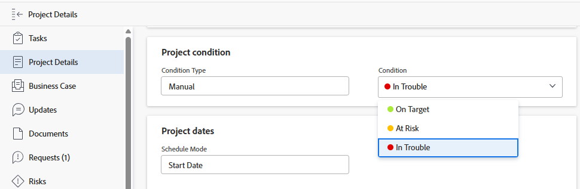

# 更新專案狀態

專案的狀態是放在專案上的旗標，以指出與其相關聯的工作是否順利進行或您是否遇到任何障礙。 這與專案的狀態不同，後者指示您是否正在處理該專案。

您可以自動或手動設定專案條件。 若要手動變更專案狀況，您必須是專案所有者或擁有專案管理許可權。

Adobe Workfront管理員可以為您的環境建立自訂條件，如[建立或編輯自訂條件](../../../administration-and-setup/customize-workfront/create-manage-custom-conditions/create-edit-custom-conditions.md)中所述。

## 存取權要求

+++ 展開以檢視這篇文章中所述功能的存取權要求。 

<table style="table-layout:auto"> 
 <col> 
 <col> 
 <tbody> 
  <tr> 
   <td role="rowheader">Adobe Workfront 封裝</td> 
   <td>
任何
 </td> 
  </tr> 
  <tr> 
   <td role="rowheader">Adobe Workfront授權</td> 
   <td> 
  
標準

   
規劃

    </td> 
  </tr> 
  <tr> 
   <td role="rowheader">存取層級設定</td> 
   <td> 
檢視或更高專案存取權
 
編輯任務和問題的存取權 
 </td> 
  </tr> 
  <tr> 
   <td role="rowheader">物件許可權</td> 
   <td> 
檢視任務或問題的許可權以檢視其狀態

   
管理任務和問題的許可權以更新條件

     </td> 
  </tr> 
 </tbody> 
</table>

如需詳細資訊，請參閱Workfront檔案中的[存取需求](/help/quicksilver/administration-and-setup/add-users/access-levels-and-object-permissions/access-level-requirements-in-documentation.md)。

+++

<!--
Old:

<table style="table-layout:auto"> 
 <col> 
 <col> 
 <tbody> 
  <tr> 
   <td role="rowheader">Adobe Workfront plan</td> 
   <td>
Any
 </td> 
  </tr> 
  <tr> 
   <td role="rowheader">Adobe Workfront license*</td> 
   <td> 
   
   For the new licenses:
  
Standard

   
   For current licenses:
   <ul><li>
Plan

    </td> 
  </tr> 
  <tr> 
   <td role="rowheader">Access level configurations</td> 
   <td> 
View or higher access to projects
 
Edit access to tasks and issues 
 </td> 
  </tr> 
  <tr> 
   <td role="rowheader">Object permissions</td> 
   <td> 
View or higher permissions on tasks and issues to view their Condition

   
Manage permissions on tasks and issues to update the Condition

     </td> 
  </tr> 
 </tbody> 
</table>
-->

## 自動設定條件

自動設定專案條件由專案的條件型別決定。 條件型別必須設定為進度狀態，Workfront才能自動設定專案條件。

在設定區域中設定專案偏好設定時，您的Workfront或群組管理員會針對系統中的新專案決定條件型別欄位的預設值。 如需詳細資訊，請參閱[設定全系統的專案偏好設定](../../../administration-and-setup/set-up-workfront/configure-system-defaults/set-project-preferences.md)。

建立專案時，系統會自動設定專案的「狀態」，以符合專案當時的進度狀態。 專案的進度狀態是根據專案上任務的進度。

如需有關專案條件以及如何根據進度狀態計算這些條件的資訊，請參閱[專案進度狀態概觀](../../../manage-work/projects/planning-a-project/project-progress-status.md)。

## 手動更新專案條件

如果您將專案的條件型別設定為手動，而不是進度狀態，您可以手動更新專案的條件。

1. 前往您要更新條件的專案。
1. 按一下左側面板中的&#x200B;**專案詳細資料**&#x200B;區段。

1. 確定&#x200B;**條件型別**&#x200B;欄位已設定為&#x200B;**手動**。

   

1. 在&#x200B;**條件**&#x200B;欄位中，從下列選項中選取符合您對相關工作是否順利進行或是否有任何延遲的理解的選項：

   * **在目標**&#x200B;上
   * **有風險**
   * **存在問題**

   如需有關專案條件的詳細資訊，請參閱[專案條件和條件型別概觀](../../../manage-work/projects/manage-projects/project-condition-and-condition-type.md)。

   >[!NOTE]
   >
   >條件可以根據您的環境自訂，因此您可以在環境中找到三個以上的條件選項。 條件的名稱可能與上方列出的名稱不同。 如需在Workfront中自訂條件的詳細資訊，請參閱[建立或編輯自訂條件](../../../administration-and-setup/customize-workfront/create-manage-custom-conditions/create-edit-custom-conditions.md)。

1. 按一下「**儲存變更**」。
