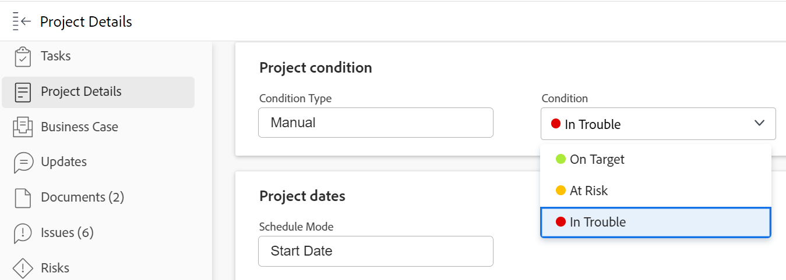

# 專案的更新條件

專案的條件是標幟，可指出與專案相關聯的工作是否順利進行，或您是否遇到任何障礙。 這與項目的狀態不同，該狀態指示您是否正在進行活動。

您可以自動或手動設定專案的條件。 要手動更改項目的條件，您必須是項目所有者或具有項目的管理權限。

Adobe Workfront管理員可以建立您環境的自訂條件，如 [建立或編輯自訂條件](../../../administration-and-setup/customize-workfront/create-manage-custom-conditions/create-edit-custom-conditions.md).

## 存取需求

<!--drafted for P&P:

<table style="table-layout:auto"> 
 <col> 
 <col> 
 <tbody> 
  <tr> 
   <td role="rowheader">Adobe Workfront plan*</td> 
   <td>
Any
 </td> 
  </tr> 
  <tr> 
   <td role="rowheader">Adobe Workfront license*</td> 
   <td> 
   
   For the current licenses:
  
Standard

   
   For legacy licenses:
   <ul><li>
Plan

    </td> 
  </tr> 
  <tr> 
   <td role="rowheader">Access level configurations*</td> 
   <td> 
View or higher access to projects
 
Edit access to tasks and issues 
 
<b>NOTE</b> 
   
   If you still don't have access, ask your Workfront administrator if they set additional restrictions in your access level. For information on how a Workfront administrator can change your access level, see <a href="../../../administration-and-setup/add-users/configure-and-grant-access/create-modify-access-levels.md" class="MCXref xref">Create or modify custom access levels</a>.
 </td> 
  </tr> 
  <tr> 
   <td role="rowheader">Object permissions</td> 
   <td> 
View or higher permissions on tasks and issues to view their Condition

   
Manage permissions on tasks and issues to update the Condition

    
For information on requesting additional access, see <a href="../../../workfront-basics/grant-and-request-access-to-objects/request-access.md" class="MCXref xref">Request access to objects </a>.
 </td> 
  </tr> 
 </tbody> 
</table>
-->

您必須具備下列存取權，才能執行本文中的步驟：

<table style="table-layout:auto"> 
 <col> 
 <col> 
 <tbody> 
  <tr> 
   <td role="rowheader">Adobe Workfront計畫*</td> 
   <td> 
任何
 </td> 
  </tr> 
  <tr> 
   <td role="rowheader">Adobe Workfront授權*</td> 
   <td> 
計劃 
 </td> 
  </tr> 
  <tr> 
   <td role="rowheader">訪問級別配置*</td> 
   <td> 
編輯專案的存取權
 
<b>附註</b>

如果您仍無權存取，請洽詢您的Workfront管理員，他們是否在您的存取層級設定其他限制。 如需Workfront管理員如何修改您的存取層級的詳細資訊，請參閱 <a href="../../../administration-and-setup/add-users/configure-and-grant-access/create-modify-access-levels.md" class="MCXref xref">建立或修改自訂存取層級</a>.
 </td>
</tr> 
  <tr> 
   <td role="rowheader">物件權限</td> 
   <td> 
管理專案的權限
 
有關請求其他訪問的資訊，請參閱 <a href="../../../workfront-basics/grant-and-request-access-to-objects/request-access.md" class="MCXref xref">請求對對象的訪問 </a>.
 </td> 
  </tr> 
 </tbody> 
</table>

&#42;若要了解您擁有的計畫、授權類型或存取權，請聯絡您的Workfront管理員。

## 自動設定條件

自動設定項目的條件由項目的條件類型確定。 條件類型必須設為進度狀態，Workfront才會自動設定專案的條件。

在「設定」區域設定專案偏好設定時，Workfront或群組管理員會決定系統中新專案的「條件類型」欄位預設值。 如需詳細資訊，請參閱 [配置系統範圍的項目首選項](../../../administration-and-setup/set-up-workfront/configure-system-defaults/set-project-preferences.md).

建立專案時，專案的條件會自動設定，以符合當時專案的進度狀態。 項目的進度狀態基於項目任務的進度。

有關項目條件以及如何根據進展狀態計算這些條件的資訊，請參閱 [項目進度狀態概觀](../../../manage-work/projects/planning-a-project/project-progress-status.md).

## 手動更新專案的條件

如果您將專案的「條件類型」設為「手動」而非「進度狀態」，您可以手動更新專案的「條件」。

1. 前往您要更新條件的專案。
1. 按一下 **專案詳細資料** 區段。

   

1. 確保 **條件類型** 欄位設為 **手動**.

1. 在 **條件** 欄位中，從以下選項中選擇與您對與其關聯的工作是否順利進行或是否存在延遲的理解相匹配的選項：

   * **達成目標**
   * **有風險**
   * **陷入困境**

   如需專案條件的詳細資訊，請參閱 [專案條件和條件類型概觀](../../../manage-work/projects/manage-projects/project-condition-and-condition-type.md).

   >[!NOTE]
   >
   >您可以根據您的環境自訂條件，因此在您的環境中可能會找到三個以上的「條件」選項。 條件的名稱可能與上述名稱不同。 如需在Workfront中自訂條件的相關資訊，請參閱 [建立或編輯自訂條件](../../../administration-and-setup/customize-workfront/create-manage-custom-conditions/create-edit-custom-conditions.md).

1. 按一下 **儲存**。按一下 **儲存變更**.
