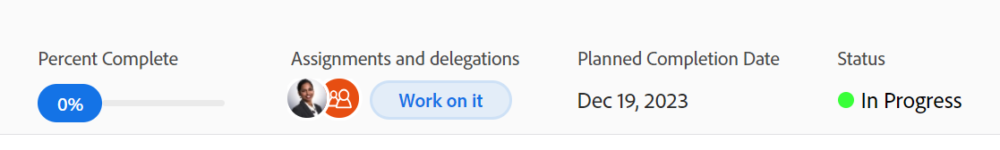

# 更新任務狀態

您可以更新任務的狀態，以通知其他人該任務在何處（以及整個專案）及其進行方式。

預設狀態為「新增」、「進行中」和「完成」。 您的Adobe Workfront管理員可為您的組織新增自訂狀態。 如需詳細資訊，請參閱[建立或編輯狀態](../../../administration-and-setup/customize-workfront/creating-custom-status-and-priority-labels/create-or-edit-a-status.md)。

您可以手動更新任務狀態，也可以讓Workfront在某些動作發生時自動更新。

## 存取需求

您必須具有下列存取權才能手動更新任務：

<table style="table-layout:auto"> 
 <col> 
 <col> 
 <tbody> 
  <tr> 
   <td role="rowheader">Adobe Workfront計畫</td> 
   <td> 
任何
 </td> 
  </tr> 
  <tr> 
   <td role="rowheader">Adobe Workfront授權*</td> 
   <td> 
新增：標準
 
   或
   
目前：工作或以上

   </td> 
  </tr> 
  <tr> 
   <td role="rowheader">存取層級設定</td> 
   <td> 
編輯任務的存取權
  </td> 
  </tr> 
  <tr> 
   <td role="rowheader">物件許可權</td> 
   <td> 
管理任務的許可權
 </td> 
  </tr> 
 </tbody> 
</table>

*若要瞭解您擁有的計畫、授權型別或存取權，請聯絡您的Workfront管理員。 如需詳細資訊，請參閱Workfront檔案中的[存取需求](/help/quicksilver/administration-and-setup/add-users/access-levels-and-object-permissions/access-level-requirements-in-documentation.md)。

## 更新任務狀態的注意事項

* 將任務標示為「完成」時，任務的完成百分比會更新為100%。
* 父系任務存在下列情況：
   * 當專案的摘要完成模式設定為自動且子任務未完成時，您無法將父系任務的狀態更新為完成。
   * 當專案的「摘要完成模式」設定為「手動」，且子任務已完成或未完成時，您可以將父系任務的「狀態」更新為「完成」。

  如需詳細資訊，請參閱[編輯專案](../manage-projects/edit-projects.md)。

## 手動更新任務狀態

您可以在Workfront的下列區域中更新任務狀態：

* 任務頁面上的任務標題。
* 編輯任務時顯示的「編輯任務」方塊。
* 「任務」頁面上的「任務詳細資訊」區段。
* 在任務清單或報告中，何時在檢視中可看到Status欄位。
* 在任務的摘要面板中。

若要手動更新任務標題中的任務狀態：

1. 移至您要更新其狀態的作業。
1. 按一下工作標題中的&#x200B;**狀態**&#x200B;欄位並選取新狀態。
1. 若要提供任務完成的視覺化指示，請拖曳或按兩下任務標題中&#x200B;**完成百分比**&#x200B;下的泡泡

   或

   在任務標題的泡泡內按一下以輸入百分比。

   

1. （可選）執行下列任一項作業，以提供有關更新的其他資訊：

   * 若要新增關於更新的備註，請移至&#x200B;**更新**&#x200B;區段，然後按一下&#x200B;**新增註解**，然後輸入備註。

     

   * 若要通知特定使用者有關更新，請在您輸入評論時顯示的&#x200B;**標籤人員或團隊**&#x200B;欄位中輸入其名稱。 如需詳細資訊，請參閱[標籤其他人的更新](/help/quicksilver/workfront-basics/updating-work-items-and-viewing-updates/tag-others-on-updates.md)。
   * 若要更新任務的認可日期，請按一下&#x200B;**任務詳細資料**，然後編輯&#x200B;**認可日期**&#x200B;欄位。 如需詳細資訊，請參閱[編輯工作](/help/quicksilver/manage-work/tasks/manage-tasks/edit-tasks.md)。

   >[!IMPORTANT]
   >
   >  只有任務受指派人可以更新認可日期。

<!--old functionality in old commenting: 

1. Go to a task that you are assigned to for which you want to update the status.
1. Click the **Status** field in the task header and select a new status. 
1. (Optional) Do any of the following to provide additional information about the update, then click **Update** or, if the task has the **Complete** status, click **Done:**

   * To add a note about the update, go to the **Updates** area and click **Start a new update**, then type your note.  

   * To notify certain users about the update, type their names in the **Notify** box that appears when you type a note about the update. For more information, see [Tag others on updates](../../../workfront-basics/updating-work-items-and-viewing-updates/tag-others-on-updates.md). 
   * To update the condition of the task, click **Select Condition** to the right of the **Notify** box (these appear when you type a note about the update), then select the condition that best reflects the current condition of the task.
   
   * To update the Commit Date of the task, expand the **Commit Date** drop-down calendar, and select a new Commit Date. 
   * To provide a visual indication of task completion, drag the bubble under Percent Complete or double-click it to enter a percent value.   
     -->

## 自動更新任務狀態

當下表所列動作發生時，Workfront會自動將任務的現有狀態更新為其他狀態。

>[!NOTE]
>
>下表中的狀態是預設的系統狀態。 您的Workfront管理員或群組管理員可重新命名Workfront執行個體中的狀態。 如需有關在Workfront中建立和管理狀態的資訊，請參閱[建立或編輯狀態](../../../administration-and-setup/customize-workfront/creating-custom-status-and-priority-labels/create-or-edit-a-status.md)。

<table style="table-layout:auto"> 
 <col> 
 <col> 
 <col> 
 <tbody> 
  <tr> 
   <td><b>動作</b></td> 
   <td><b>原始狀態</b></td> 
   <td><b>新狀態</b></td> 
  </tr> 
  <tr> 
   <td>將任務完成百分比更新為100%</td> 
   <td>新增或進行中</td> 
   <td>完成</td> 
  </tr> 
  <tr> 
   <td>將任務完成百分比從100%更新為較低數字</td> 
   <td>完成</td> 
   <td>進行中</td> 
  </tr> 
  <tr data-mc-conditions=""> 
   <td>按一下[開始工作]按鈕以接受處理指派給您的工作 </td> 
   <td>新增 </td> 
   <td> 
任何與您主團隊設定中的[開始工作]按鈕關聯的狀態。
 
有關將[處理它]按鈕取代為[開始工作]按鈕的資訊，請參閱<a href="../../../people-teams-and-groups/create-and-manage-teams/work-on-it-button-to-start-button.md" class="MCXref xref">將[處理它]按鈕取代為[開始]按鈕</a>。
 
提示：按一下[開始工作]後，按一下 復原按鈕會將狀態回覆成[新增]。 
 </td> 
  </tr> 
 </tbody> 
</table>
