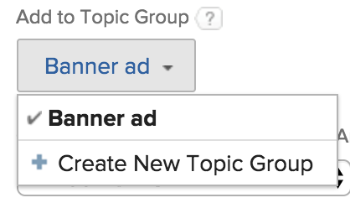

# 建立佇列主題

「佇列主題」可與「路由規則」搭配使用，以自動將內送工作指派給使用者、工作角色、專案團隊，或將其置於專案上。 佇列主題定義必須存在才能實作路由規則的條件。

可指派給主題群組或專案的佇列主題數量沒有限制。 佇列主題是可報告的物件型別。

## 存取需求

<!--drafted - replace table with P&P:

<table style="table-layout:auto"> 
 <col> 
 <col> 
 <tbody> 
  <tr> 
   <td role="rowheader">Adobe Workfront plan*</td> 
   <td> 
Any 
 </td> 
  </tr> 
  <tr> 
   <td role="rowheader">Adobe Workfront license*</td> 
   <td> 
Current license: Standard 
 
   Or
   
Legacy license: Plan 
 </td> 
  </tr> 
  <tr> 
   <td role="rowheader">Access level configurations*</td> 
   <td> 
Edit access to Projects
 
Note: If you still don't have access, ask your Workfront administrator if they set additional restrictions in your access level. For information on how a Workfront administrator can modify your access level, see <a href="../../../administration-and-setup/add-users/configure-and-grant-access/create-modify-access-levels.md" class="MCXref xref">Create or modify custom access levels</a>.
 </td> 
  </tr> 
  <tr> 
   <td role="rowheader">Object permissions</td> 
   <td> 
 Manage permissions to the project
 
For information on requesting additional access, see <a href="../../../workfront-basics/grant-and-request-access-to-objects/request-access.md" class="MCXref xref">Request access to objects </a>.
 </td> 
  </tr> 
 </tbody> 
</table>
-->

您必須具備下列條件：

<table style="table-layout:auto"> 
 <col> 
 <col> 
 <tbody> 
  <tr> 
   <td role="rowheader">Adobe Workfront計畫*</td> 
   <td> 
任何 
 </td> 
  </tr> 
  <tr> 
   <td role="rowheader">Adobe Workfront授權*</td> 
   <td> 
計劃 
 </td> 
  </tr> 
  <tr> 
   <td role="rowheader">存取層級設定*</td> 
   <td> 
編輯專案的存取權
 
注意：如果您仍然沒有存取權，請詢問您的Workfront管理員是否對您的存取層級設定了其他限制。 如需有關Workfront管理員如何修改您的存取層級的資訊，請參閱 <a href="../../../administration-and-setup/add-users/configure-and-grant-access/create-modify-access-levels.md" class="MCXref xref">建立或修改自訂存取層級</a>.
 </td> 
  </tr> 
  <tr> 
   <td role="rowheader">物件許可權</td> 
   <td> 
 管理專案的許可權
 
如需請求其他存取許可權的詳細資訊，請參閱 <a href="../../../workfront-basics/grant-and-request-access-to-objects/request-access.md" class="MCXref xref">要求物件的存取權 </a>.
 </td> 
  </tr> 
 </tbody> 
</table>

&#42;若要瞭解您擁有的計畫、授權型別或存取權，請聯絡Workfront管理員

## 建立佇列主題

1. 建立路由規則、主題群組和自訂表單（如果您計畫將它們與佇列主題相關聯）。\
   如需如何建立路由規則、主題群組或自訂表單的詳細資訊，請參閱下列文章：

   * [建立路由規則](../../../manage-work/requests/create-and-manage-request-queues/create-routing-rules.md)
   * [建立主題群組](../../../manage-work/requests/create-and-manage-request-queues/create-topic-groups.md)
   * [建立或編輯自訂表單](../../../administration-and-setup/customize-workfront/create-manage-custom-forms/create-or-edit-a-custom-form.md)

1. 移至您選擇啟用為「說明請求佇列」的專案，以及您要建立新佇列主題的位置。\
   有關如何將專案指定為說明請求佇列的詳細資訊，請參閱以下文章：\
   [建立請求佇列](../../../manage-work/requests/create-and-manage-request-queues/create-request-queue.md)

   您可以在「主題群組」下或直接在指定為「說明請求佇列」的專案下組織相關的「佇列主題」。 這會在提出要求時，為要求者提供一系列下拉式功能表。\
   您可以直接在指定為「說明請求佇列」的專案下巢狀內嵌佇列主題，而不需要主題群組。

   如需有關建立主題群組的資訊，請參閱 [建立主題群組](../../../manage-work/requests/create-and-manage-request-queues/create-topic-groups.md).

1. 按一下 **佇列主題** 在左側面板中。 您可能需要按一下 **顯示更多**，則 **佇列主題**.
1. 按一下 **新增佇列主題**.
1. 於 **新增佇列主題** 表單，指定下列內容：

   <table style="table-layout:auto"> 
    <col> 
    <col> 
    <tbody> 
     <tr> 
      <td role="rowheader"><strong>名稱</strong> </td> 
      <td> 佇列主題的名稱。</td> 
     </tr> 
     <tr> 
      <td role="rowheader"><strong>說明</strong> </td> 
      <td>說明請求佇列。 當使用者在提交新請求的過程中選取佇列主題時，會顯示說明。 </td> 
     </tr> 
     <tr> 
      <td role="rowheader"><strong>新增至主題群組</strong> </td> 
      <td> 如果專案中沒有主題群組，專案名稱將預設為主題群組。 如果您想從此處建立其他主題群組，請選取 <strong>建立新主題群組</strong> 從下拉式功能表。 </td> 
     </tr> 
     <tr> 
      <td role="rowheader"><strong>自訂表單</strong> </td> 
      <td>選取您要與佇列主題關聯的任何自訂表單。 您必須先建立問題的自訂表單，然後才能將問題與佇列主題相關聯。 如需建立自訂表單的相關資訊，請參閱 <a href="../../../administration-and-setup/customize-workfront/create-manage-custom-forms/create-or-edit-a-custom-form.md" class="MCXref xref">建立或編輯自訂表單</a>.</td> 
     </tr> 
     <tr> 
      <td role="rowheader"><strong>預設核准</strong></td> 
      <td> 
將核准流程與此佇列主題相關聯。 此下拉式選單中只會顯示「問題核准流程」。 提交至此佇列的所有問題都將與此核准流程相關聯。 您的Adobe Workfront管理員必須先定義系統層級的核准流程，您才能將其與佇列主題相關聯。 具有核准流程管理存取權的使用者也可以建立群組特定的核准流程。 如需建立核准流程的詳細資訊，請參閱 <a href="../../../administration-and-setup/customize-workfront/configure-approval-milestone-processes/create-approval-processes.md" class="MCXref xref">建立工作專案的核准流程</a>. 
 
       
 
        
重要：如果專案的群組變更，則附加至現有問題的群組特定核准流程會變成單一用途核准流程。 如需有關專案群組的變更或核准流程變更如何影響核准設定的詳細資訊，請參閱 <a href="../../../administration-and-setup/customize-workfront/configure-approval-milestone-processes/how-changes-affect-group-approvals.md" class="MCXref xref">群組和核准流程變更如何影響指派的核准流程</a>.
 
        
將核准流程新增至佇列主題時，請考量下列事項： 
 
        <ul style="list-style-type: circle;"> 
         <li>清單中只會顯示有效的核准流程。 </li> 
         <li> 
系統範圍及群組特定核准程式會顯示在清單中。 與專案群組以外的群組相關聯的核准程式不會顯示在清單中。
 </li> 
        </ul> 
       
 </td> 
     </tr> 
     <tr> 
      <td role="rowheader"><strong>預設期間</strong> </td> 
      <td>這是請求的預設持續時間，並根據此值計算請求的規劃完成日期。</td> 
     </tr> 
     <tr> 
      <td role="rowheader"><strong>預設路線</strong> </td> 
      <td>指定您要與「佇列主題」關聯的路由規則。 您必須先建立路由規則，才能將其附加至佇列主題。 如需詳細資訊，請參閱 <a href="../../../manage-work/requests/create-and-manage-request-queues/create-routing-rules.md">建立路由規則</a> </td> 
     </tr> 
     <tr> 
      <td role="rowheader"><strong>請求類型</strong> </td> 
      <td> 
選擇此佇列主題儲存的請求型別。 可見的選項設定於 <strong>佇列詳細資訊</strong> 索引標籤中。 這是必填欄位。 

   
<b>附註</b>:

   只有在「佇列詳細資訊」和「佇列主題」頁面中同時選取「請求型別」時，「型別」才會顯示為「請求」區域的選取專案。 如需有關設定專案的「佇列詳細資訊」區域的資訊，請參閱 <a href="../../../manage-work/requests/create-and-manage-request-queues/create-request-queue.md" class="MCXref xref">建立請求佇列</a>. 
 
從下列型別中選取：

   <ul>
   <li>錯誤報告</li>
   <li>變更順序</li>
   <li>問題</li>
   <li>請求</li>
   </ul> 
您的Workfront管理員可能已重新命名其中的一些選項。 
 </td>
   </tr> 
    </tbody> 
   </table>

   

1.  
1. 按一下&#x200B;**儲存**。\
   在選取「請求佇列」和「主題群組」後，「佇列主題」現在可供使用，並顯示在Workfront的「請求」區域中。
