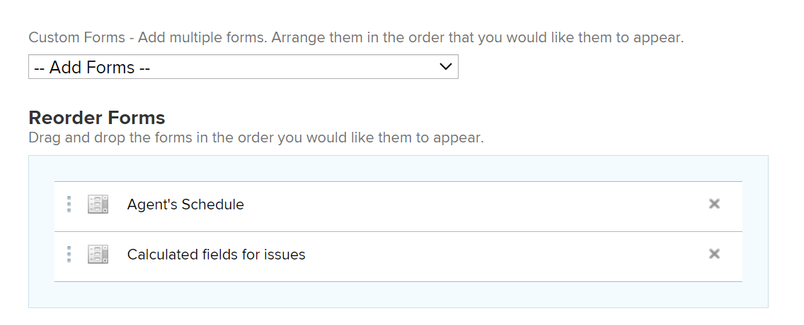

# 建立請求佇列

<!--Audited: 12/2023-->

<!--
<THIS IS CONNECTED TO THE PRODUCT IN BLUEPRINTS. DO NOT MOVE/ CHANGE URL>
-->

您可以設定請求佇列，讓使用者可輸入專案上未計畫工作的臨時請求。 例如，服務檯請求佇列可設定為擷取所有來到IT部門的使用者請求。

本文說明如何建立請求佇列，讓使用者可以在其中提交請求。 如需有關如何將新請求提交至請求佇列的資訊，請參閱 [複製並提交請求](../create-requests/copy-and-submit-requests.md).

## 存取需求

+++ 展開以檢視本文中功能的存取需求。

<table style="table-layout:auto"> 
 <col> 
 <col> 
 <tbody> 
  <tr> 
   <td role="rowheader">Adobe Workfront計畫*</td> 
   <td> 
任何 
 </td> 
  </tr> 
  <tr> 
   <td role="rowheader">Adobe Workfront授權*</td> 
   <td> 
   
新授權： Standard 

   或
   
目前授權：計畫 
 </td> 
  </tr> 
  <tr> 
   <td role="rowheader">存取層級設定*</td> 
   <td> 
編輯專案的存取權
 
<b>附註</b>

如果您還是沒有存取權，請詢問您的Workfront管理員，他們是否在您的存取層級中設定其他限制。 如需有關Workfront管理員如何修改您的存取層級的資訊，請參閱 <a href="../../../administration-and-setup/add-users/configure-and-grant-access/create-modify-access-levels.md" class="MCXref xref">建立或修改自訂存取層級</a>.
 </td>
</tr> 
  <tr> 
   <td role="rowheader">物件許可權</td> 
   <td> 
 管理專案的許可權
 
如需請求其他存取許可權的詳細資訊，請參閱 <a href="../../../workfront-basics/grant-and-request-access-to-objects/request-access.md" class="MCXref xref">要求物件的存取權 </a>.
 </td> 
  </tr> 
 </tbody> 
</table>

&#42;若要瞭解您擁有的計畫、授權型別或存取權，請聯絡您的Workfront管理員。

+++

<!--old access levels: 
You must have the following access to perform the steps in this article:

<table style="table-layout:auto"> 
 <col> 
 <col> 
 <tbody> 
  <tr> 
   <td role="rowheader">Adobe Workfront plan*</td> 
   <td> 
Any 
 </td> 
  </tr> 
  <tr> 
   <td role="rowheader">Adobe Workfront license*</td> 
   <td> 
Plan 
 </td> 
  </tr> 
  <tr> 
   <td role="rowheader">Access level configurations*</td> 
   <td> 
Edit access to Projects
 
<b>NOTE</b>
 
   
   
If you still don't have access, ask your Workfront administrator if they set additional restrictions in your access level. For information on how a Workfront administrator can modify your access level, see <a href="../../../administration-and-setup/add-users/configure-and-grant-access/create-modify-access-levels.md" class="MCXref xref">Create or modify custom access levels</a>.
 </td> 
  </tr> 
  <tr> 
   <td role="rowheader">Object permissions</td> 
   <td> 
 Manage permissions to the project
 
For information on requesting additional access, see <a href="../../../workfront-basics/grant-and-request-access-to-objects/request-access.md" class="MCXref xref">Request access to objects </a>.
 </td> 
  </tr> 
 </tbody> 
</table>

*To find out what plan, license type, or access you have, contact your Workfront administrator
-->

## 請求佇列總覽

您可以將請求佇列設定為專案。 將專案指定為請求佇列時，可從Adobe Workfront的請求區域存取佇列。 自訂「請求佇列」時，也會自訂使用者提交請求時填寫的表單。

本文會說明如何從現有專案建立請求佇列。 不過，若要為請求擷取流程建立一致性，或為其中新增多個層級以用於報告和更好的管理，您也可以設定請求佇列的其他建置區塊，如下表所述。

<table style="table-layout:auto"> 
 <col> 
 <col> 
 <tbody> 
  <tr> 
   <td role="rowheader">佇列詳細資訊</td> 
   <td> 
您必須在「佇列詳細資訊」區域將專案設定為請求佇列。 此步驟為必要步驟。 
 
如需詳細資訊，請參閱 <a href="#create-a-request-queue" class="MCXref xref">建立請求佇列</a> 一節。
 </td> 
  </tr> 
  <tr> 
   <td role="rowheader">主題群組</td> 
   <td> 
它們是額外的選單，可依據常見功能來分類請求。 例如，對於IT要求佇列，您可能想要有「現場」和「遠端」主題群組。 
 
如需詳細資訊，請參閱 <a href="../../../manage-work/requests/create-and-manage-request-queues/create-topic-groups.md" class="MCXref xref">建立主題群組</a>. 
 
這是選擇性的。
 </td> 
  </tr> 
  <tr> 
   <td role="rowheader">佇列主題</td> 
   <td> 
它們是額外的功能表，可根據常見功能將屬於相同主題群組的請求分類。 一個主題群組可以包含數個佇列主題。 
 
例如，IT要求佇列的「現場」主題群組可能包含「硬體」、「軟體」和「網路」佇列主題。 
 
如需詳細資訊，請參閱 <a href="../../../manage-work/requests/create-and-manage-request-queues/create-queue-topics.md" class="MCXref xref">建立佇列主題</a>. 
 
這是選擇性的。
 </td> 
  </tr> 
  <tr> 
   <td role="rowheader">路由規則</td> 
   <td> 
它們可讓您將每個請求路由至使用者、工作角色、團隊或專案。 
 
如需詳細資訊，請參閱 <a href="../../../manage-work/requests/create-and-manage-request-queues/create-routing-rules.md" class="MCXref xref">建立路由規則</a>. 
 
這是選擇性的。
 </td> 
  </tr> 
 </tbody> 
</table>

## 建立請求佇列

將專案設定為請求佇列時，專案狀態必須為目前才能顯示在Workfront的請求區域中。

>[!TIP]
>
>您的Workfront或群組管理員可能會將您指派給自訂配置範本，該範本可能不包括下列步驟中說明的某些區段。

若要建立「請求佇列」：

1. 前往您要設定為「請求佇列」的專案。
1. （選用）按一下 **專案詳細資訊** 在左側面板中新增 **說明** 至中的專案 **概觀** 區域。 此資訊會顯示在所有新請求上。
1. 按一下 **佇列詳細資訊** 在左側面板中。 您可能需要按一下 **顯示更多**，然後 **佇列詳細資訊**.

   這會開啟佇列詳細資訊區段。

   

1. 指定下列資訊：

   * **以說明要求佇列發佈：** 選取此選項可將此專案識別為請求佇列。 所有傳入問題都視為請求。\
     若未選取此選項，專案的運作方式會類似Workfront中的標準專案，而所有傳入的問題都會是問題。

   * **誰可以新增要求至此佇列：** 選取哪些使用者有權將請求新增至此佇列。 您可以允許下列群組的人在新增新請求時，於全域導覽列的「請求」區域中看到「請求佇列」：

     | 誰可以輸入請求 | 說明 |
     |---|---|
     | 任何人 | 任何擁有有效帳戶的Workfront使用者都可以檢視此請求佇列並新增請求 |
     | 擁有此專案檢視存取權限的人員 | 擁有專案檢視許可權的使用者可以檢視及新增請求至此佇列 |
     | 專案公司人員 | 屬於與此專案相關聯之公司的使用者可以檢視請求並將其新增至此佇列。 如果專案有關聯的公司，則在此設定後方括弧內會列出公司名稱。 |
     | 專案群組人員 | 屬於與此專案相關聯的群組的使用者可以檢視請求並將其新增到此佇列。 如果有與專案相關聯的群組，則該群組的名稱會以灰色字型列在此設定之後的括弧中。 |

     {style="table-layout:auto"}

   * **使用這些連結共用：** 下列選項可讓您為Workfront外部的使用者或使用外部頁面的Workfront使用者提供請求佇列及與其關聯的表單的直接存取權。 如需將請求佇列內嵌於儀表板作為外部頁面的相關資訊，請參閱 [將請求佇列內嵌在控制面板中](../../../reports-and-dashboards/dashboards/creating-and-managing-dashboards/embed-request-queue-dashboard.md).

     使用者必須擁有請求佇列的存取許可權，才能直接存取許可權。 使用此處說明的任一選項都不會自動授予使用者存取權。

     >[!TIP]
     >
     >使用者從其他應用程式存取「請求佇列」頁面時，必須先登入Workfront，才能存取請求佇列。

      * **直接存取URL：** 當使用者從瀏覽器存取此URL時，使用者將被直接帶到「請求」區域的「新請求」區段，並且系統會為他們預設選取此請求。

        

        >[!NOTE]
        >
        >您可以在控制面板中將「請求佇列」顯示為外部頁面。 在此情況下，會預先選取請求佇列，但您可以從「請求型別」欄位中選取任何其他請求佇列。 使用者可以變更請求型別。 也會顯示要求的導覽元件。

      * **內嵌程式碼：** 使用此HTML程式碼將請求佇清單單內嵌為任何HTML頁面中的iframe。\
        如果使用者在檢視內嵌程式碼所在的頁面時，尚未通過Workfront驗證，則會顯示「Workfront登入」對話方塊。 使用者登入後，畫面會顯示「請求佇列」表單。

        >[!NOTE]
        >
        >在iframe中顯示「請求佇列」時，只會顯示請求表單，請求名稱會預先選取並變暗。 使用者無法變更請求型別。 請求區域的導覽元件不顯示。

        為了讓請求佇清單單在使用此內嵌程式碼時顯示，您必須在系統設定中啟用「允許在iframe中內嵌Workfront」設定。 如需在iframe中啟用Workfront內嵌功能的詳細資訊，請參閱 [設定系統安全性偏好設定](../../../administration-and-setup/manage-workfront/security/configure-security-preferences.md). 如果未啟用此設定，iframe會顯示為空白。

        您可以調整內嵌表單顯示方式的各個方面，如下所示：

        <table border="1" cellspacing="15"> 
         <col> 
         <col> 
         <thead> 
          <tr> 
           <th> 
<strong>功能</strong> 
 </th> 
           <th> 
<strong>解決方案</strong> 
 </th> 
          </tr> 
         </thead> 
         <tbody> 
          <tr> 
           <td> 
調整框架大小
 </td> 
           <td> 
修改「寬度」和「高度」屬性。
 
依預設，寬度是"500"，高度是"600"
 </td> 
          </tr> 
          <tr> 
           <td> 
將使用者導向至特定佇列主題或主題群組
 </td> 
           <td> 
將「path」引數新增至src URL。 您可以導覽至非內嵌表單中所需的佇列主題或主題群組，並檢查URL來尋找path引數。
 </td> 
          </tr> 
          <tr> 
           <td> 
顯示並允許使用者變更預先設定的主題群組下拉式清單
 </td> 
           <td> 
使用"path"引數，方法是新增 <code>showPreSelectedOptions=true</code> 的引數 <code>src URL</code>.
 </td> 
          </tr> 
          <tr> 
           <td> 
偵測表單何時已提交
 </td> 
           <td> 
將「訊息」事件接聽程式新增至網頁的視窗，並檢查是否 <code>event.data.type</code> 是 <code>requestSubmitted</code>. <code>event.data.newIssueID</code> 將設定為已建立問題的ID。
 </td> 
          </tr> 
         </tbody> 
        </table>

   * **請求型別：** 從下列預設選項中選取。

     Workfront管理員可重新命名預設請求型別。 如需重新命名請求型別的詳細資訊，請參閱 [自訂預設問題型別](../../../administration-and-setup/set-up-workfront/configure-system-defaults/customize-default-issue-types.md).

      * 錯誤報告
      * 變更順序
      * 問題
      * 請求

        這是必填欄位，您必須至少選取一個選項。

     >[!NOTE]
     >
     >只有在「佇列詳細資訊」和「佇列主題」頁面中同時選取「請求型別」時，「請求型別」才會顯示為「請求」區域的選取專案。 如需有關設定專案之「佇列詳細資訊」區域的資訊，請參閱 [建立佇列主題](../../../manage-work/requests/create-and-manage-request-queues/create-queue-topics.md).

     此處選取的每個型別都可在表單上使用（您可以選取多個型別）。 選取多個型別有助於組織傳入的多個請求。\
     例如，如果您在IT專案的請求佇列上使用表單，佇列中可能會有下列請求型別：硬體、軟體、錯誤修正和問題。

   * **預設持續時間：** 預設期間是完成問題通常需要的時間。 這會成為所有傳入問題的預設值，並可手動修改。 持續時間通常以小時、天或周為單位設定。 問題的預設期間與問題的計畫時數相同。 問題的計畫完成日期會根據此欄位來計算。\
     問題「持續時間」的預設為1天或8小時。 如果您的Workfront管理員將每個工作日的一般時數設定為少於8小時，則問題的預設持續時間仍為8小時。 例如，如果「每個工作日一般時數」設為7小時，問題的預設期間為1.14天或8小時。 如需如何設定系統「每工作日一般時數」的詳細資訊，請參閱文章中的「時間表計算」一節 [設定全系統專案偏好設定](../../../administration-and-setup/set-up-workfront/configure-system-defaults/set-project-preferences.md).

   * **來自相同公司的人員將針對所有請求繼承相同許可權。：** 選取後，所有提交至佇列的請求對同一家公司的使用者可見。 使用者可以在所有請求區段（位於請求區域）中檢視這些請求。 啟用或停用此設定時，將會影響所有未來的請求；而不會回溯影響資訊。
   * **當有人提出要求時，自動授予：** 當使用者向請求佇列提出請求時，系統會自動授予使用者您選擇用於該請求的許可權等級。 從下列許可權層級中選取：

      * **檢視存取權**
      * **Contribute存取**. 這是預設選取範圍。
      * **管理存取權**

     如需Workfront許可權模型的相關資訊，請參閱 [物件許可權共用概觀](../../../workfront-basics/grant-and-request-access-to-objects/sharing-permissions-on-objects-overview.md).\
     在此設定許可權可節省時間，而不需針對每個傳入的個別請求授與許可權。 選擇此選項會影響所有未來的請求，但不會影響現有請求。

   * **預設核准**：將核准流程與此請求佇列建立關聯。 此下拉式選單中只會顯示問題核准流程。 提交至此佇列的所有問題都將與此核准流程相關聯。 您的Workfront管理員必須定義系統層級的核准流程，您才能將其與請求佇列相關聯。 擁有核准流程管理存取權的使用者也可以建立群組特定的核准流程。

     >[!IMPORTANT]
     >
     >如果專案的群組變更，則附加至現有問題的群組特定核准流程會變成單一使用核准流程。 如需關於專案群組變更或核准流程變更如何影響核准設定的詳細資訊，請參閱 [群組和核准流程變更如何影響指派的核准流程](../../../administration-and-setup/customize-workfront/configure-approval-milestone-processes/how-changes-affect-group-approvals.md).

     如果您有多個與請求佇列相關聯的佇列主題，建議您改為將核准流程與佇列主題相關聯。 如需有關建立佇列主題的詳細資訊，請參閱 [建立佇列主題](../../../manage-work/requests/create-and-manage-request-queues/create-queue-topics.md).

     將核准流程新增至請求佇列時，請考量下列事項：

      * 清單中只會顯示有效的核准流程。
      * 系統範圍及群組特定的核准程式會顯示在清單中。 與專案群組以外的群組相關聯的核准程式不會顯示在清單中。

   * **預設路由**：將路由規則與此請求佇列相關聯。 使用「遞送規則」，自動將提交至「請求佇列」的新問題指派給正確的資源（使用者、工作角色或團隊），並指派給正確的專案。 提交至此佇列的所有問題都將與此路由規則相關聯。 您必須先設定「路由規則」，才能將其顯示在「佇列詳細資訊」區段中，以及將其與請求佇列產生關聯。\
     如果您有多個與請求佇列相關聯的佇列主題，建議您改為將路由規則與佇列主題相關聯。 如需建立路由規則的詳細資訊，請參閱 [建立路由規則](../../../manage-work/requests/create-and-manage-request-queues/create-routing-rules.md).

   * **新問題欄位：** 在 **向所有使用者顯示下列選取的欄位** 區段，選取您希望對提交請求至專案或新增問題至專案或任務的所有使用者可見的任何欄位。

     >[!TIP]
     >
     >在佇列詳細資料區段中選取的新問題欄位也會與新增到專案的任何新問題相關聯 <!--this is confusing: or to the tasks in the Issues section-->.

     當您啟用任何「指派至」、「工作角色」或「團隊」欄位時，它們一律會在請求表單中重新命名為「指派」，但您只能指定此處選取的指派型別。

     >[!NOTE]
     >
     >如果您在「佇列詳細資料」區域選取了「指定給」，則只能在請求表單的「工作總攬」欄位中輸入使用者。 在這種情況下，您無法輸入職位角色或團隊。

   * **檔案**：如果您選擇在新請求表單中顯示檔案區段，請選擇檔案上傳區段的放置位置。 從下列選項中選取：

     <table style="table-layout:auto"> 
      <col> 
      <col> 
      <tbody> 
       <tr> 
        <td role="rowheader">在自訂表單之後</td> 
        <td>檔案區段會顯示在請求表單的底部。 </td> 
       </tr> 
       <tr> 
        <td role="rowheader">在自訂表單之前</td> 
        <td> 
檔案區段會顯示在Workfront欄位和請求表單的自訂欄位之間。 
 </td> 
       </tr> 
      </tbody> 
     </table>

     

   * **將所有選取和未選取的欄位顯示給：** 選取您想在新請求表單上檢視所有欄位的使用者。 以下選項可控制對表單上欄位的存取。

     | 哪些使用者可以檢視請求表單上的所有欄位 | 說明 |
     |---|---| 
     | 所有使用者（計畫授權） | 所有擁有Plan授權的使用者都可以看到所選以及未選取的欄位。 |
     | 擁有此專案檢視存取權限的人員（計劃授權） | 擁有計畫授權且擁有此專案檢視許可權的使用者可以檢視所選及未所選欄位。 其他可以提交請求至此專案的使用者只能看到選取的欄位。 |
     | 無使用者 | 沒有使用者可以看到未選取的欄位。 所有可以提交請求至此專案的使用者只能看到選取的欄位。 |

   * **自訂Forms**：選取要與請求佇列相關聯的自訂表單。 在此下拉式選單中僅問題自訂Forms可供選取。 提交至「請求佇列」的所有問題都會有與其關聯的選定表單。 您必須先建立問題自訂表單，才能看到它們顯示在佇列詳細資料區段中。
如果您有多個與請求佇列相關的佇列主題，建議您改將自訂表單與佇列主題相關聯。 如需建立「請求佇列」之子區段的詳細資訊，請參閱 [建立佇列主題](../../../manage-work/requests/create-and-manage-request-queues/create-queue-topics.md).

     

     如果您有多個與請求佇列相關聯的自訂表單，請拖放這些表單，以使用所需的順序排序它們： **重新排序Forms** 區段。

     >[!TIP]
     >
     >新增到佇列詳細資料區段的自訂表單也與新增到專案的任何新問題相關聯 <!--this is confusiong: or the tasks in the Issues  section-->.

1. 繼續選取「 」中設定的資訊 **電子郵件佇列設定** 區域，以允許使用者透過電子郵件將請求傳送到請求佇列專案。

   如需詳細資訊，請參閱 [讓使用者透過電子郵件將問題傳送到請求佇列專案](../../../manage-work/requests/create-requests/enable-email-issues-into-projects.md).

1. 按一下「**儲存**」。\
   您的專案現在已設定為請求佇列，使用者現在可以在其中新增請求。

1. （可選）若要增強「請求佇列」功能，請為您的佇列建立其他子區段，以及將傳入的請求路由到正確團隊、受指派人或專案的規則。

   * 如需有關為「請求佇列」建立子區段的資訊，請參閱文章 [建立佇列主題](../../../manage-work/requests/create-and-manage-request-queues/create-queue-topics.md) 和 [建立主題群組](../../../manage-work/requests/create-and-manage-request-queues/create-topic-groups.md).
   * 如需有關將請求遞送給適當的受指派人、專案團隊和適當的專案的資訊，請參閱 [建立路由規則](../../../manage-work/requests/create-and-manage-request-queues/create-routing-rules.md).
