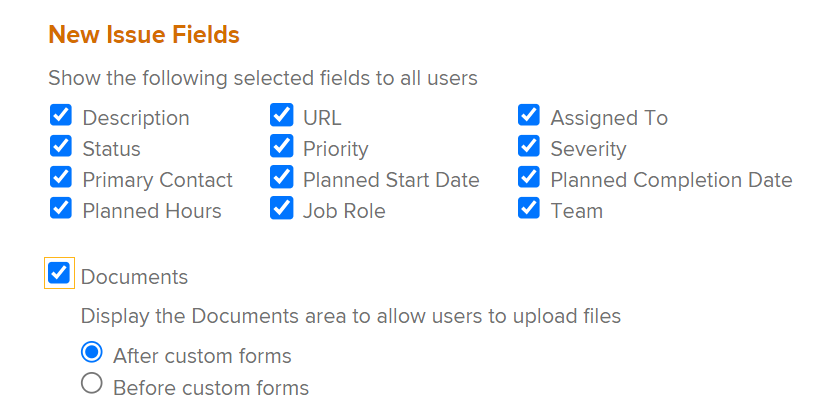

# 建立請求佇列

<!--
<THIS IS CONNECTED TO THE PRODUCT IN BLUEPRINTS. DO NOT MOVE/ CHANGE URL>
-->

您可以設定「請求佇列」，讓使用者在其中輸入非計畫在專案中運作的偶發請求。 例如，可以設定服務台請求隊列，以捕獲到IT部門的所有用戶請求。

## 存取需求

<!--drafted for P&P: replace the table below with this:

<table style="table-layout:auto"> 
 <col> 
 <col> 
 <tbody> 
  <tr> 
   <td role="rowheader">Adobe Workfront plan*</td> 
   <td> 
Any 
 </td> 
  </tr> 
  <tr> 
   <td role="rowheader">Adobe Workfront license*</td> 
   <td> 
   
Current license: Stadard 

   Or
   
Legacy license: Plan 
 </td> 
  </tr> 
  <tr> 
   <td role="rowheader">Access level configurations*</td> 
   <td> 
Edit access to Projects
 
<b>NOTE</b> 
   
   If you still don't have access, ask your Workfront administrator if they set additional restrictions in your access level. For information on how a Workfront administrator can modify your access level, see <a href="../../../administration-and-setup/add-users/configure-and-grant-access/create-modify-access-levels.md" class="MCXref xref">Create or modify custom access levels</a>.
 </td> 
  </tr> 
  <tr> 
   <td role="rowheader">Object permissions</td> 
   <td> 
 Manage permissions to the project
 
For information on requesting additional access, see <a href="../../../workfront-basics/grant-and-request-access-to-objects/request-access.md" class="MCXref xref">Request access to objects </a>.
 </td> 
  </tr> 
 </tbody> 
</table>

&#42;To find out what plan, license type, or access you have, contact your Workfront administrator
-->

您必須具備下列存取權，才能執行本文中的步驟：

<table style="table-layout:auto"> 
 <col> 
 <col> 
 <tbody> 
  <tr> 
   <td role="rowheader">Adobe Workfront計畫*</td> 
   <td> 
任何 
 </td> 
  </tr> 
  <tr> 
   <td role="rowheader">Adobe Workfront授權*</td> 
   <td> 
計劃 
 </td> 
  </tr> 
  <tr> 
   <td role="rowheader">訪問級別配置*</td> 
   <td> 
編輯專案的存取權
 
注意：如果您仍無權存取，請洽詢您的Workfront管理員，他們是否在您的存取層級設定其他限制。 如需Workfront管理員如何修改您的存取層級的詳細資訊，請參閱 <a href="../../../administration-and-setup/add-users/configure-and-grant-access/create-modify-access-levels.md" class="MCXref xref">建立或修改自訂存取層級</a>.
 </td> 
  </tr> 
  <tr> 
   <td role="rowheader">物件權限</td> 
   <td> 
 管理專案的權限
 
有關請求其他訪問的資訊，請參閱 <a href="../../../workfront-basics/grant-and-request-access-to-objects/request-access.md" class="MCXref xref">請求對對象的訪問 </a>.
 </td> 
  </tr> 
 </tbody> 
</table>

&#42;若要了解您擁有的計畫、授權類型或存取權，請聯絡您的Workfront管理員

## 請求佇列概觀

您可將請求佇列設為專案。 當您將專案指定為「請求佇列」時，即可從Adobe Workfront的「請求」區域存取佇列。 當您自訂「請求佇列」時，也是在自訂使用者提交請求時填寫的表單。

本文說明如何從現有專案建立請求佇列。 不過，為了為請求接收程式建立一致性，或為其新增多個層以用於報告和進行更好的管理，您也可以配置請求佇列的其他組成要素，如下表所述。

<table style="table-layout:auto"> 
 <col> 
 <col> 
 <tbody> 
  <tr> 
   <td role="rowheader">佇列詳細資訊</td> 
   <td> 
您必須在「佇列詳細資料」區域中將專案設定為請求佇列。 此步驟為必要步驟。 
 
如需詳細資訊，請參閱 <a href="#create-a-request-queue" class="MCXref xref">建立請求佇列</a> 一節。
 </td> 
  </tr> 
  <tr> 
   <td role="rowheader">主題群組</td> 
   <td> 
這些功能是其他功能表，可根據常見功能將請求分類。 例如，對於IT請求佇列，您可能想要有「站上」和「遠端」主題群組。 
 
如需詳細資訊，請參閱 <a href="../../../manage-work/requests/create-and-manage-request-queues/create-topic-groups.md" class="MCXref xref">建立主題群組</a>. 
 
此為選用項目。
 </td> 
  </tr> 
  <tr> 
   <td role="rowheader">佇列主題</td> 
   <td> 
這些功能是其他功能表，可根據常見功能將屬於相同主題群組的請求分類。 主題組可以包含多個隊列主題。 
 
例如，IT請求隊列的「現場」主題組可能包含「硬體」、「軟體」和「網路」隊列主題。 
 
如需詳細資訊，請參閱 <a href="../../../manage-work/requests/create-and-manage-request-queues/create-queue-topics.md" class="MCXref xref">建立佇列主題</a>. 
 
此為選用項目。
 </td> 
  </tr> 
  <tr> 
   <td role="rowheader">路由規則</td> 
   <td> 
它們可讓您將每個請求路由至使用者、工作角色、團隊或專案。 
 
如需詳細資訊，請參閱 <a href="../../../manage-work/requests/create-and-manage-request-queues/create-routing-rules.md" class="MCXref xref">建立路由規則</a>. 
 
此為選用項目。
 </td> 
  </tr> 
 </tbody> 
</table>

## 建立請求佇列

將專案設為「請求佇列」時，專案狀態必須為「目前」，才會顯示在Workfront的「請求」區域中。

若要建立請求佇列：

1. 前往您要設定為「請求佇列」的專案。
1. （選用）按一下 **專案詳細資料** 並新增 **說明** 至 **概述** 的上界。 此資訊會顯示在所有新請求上。
1. 按一下 **隊列詳細資訊** 中。 您可能需要按一下 **顯示更多**，然後 **隊列詳細資訊**.

   這會開啟「佇列詳細資料」區段。

   

1. 指定下列資訊：

   * **以幫助請求隊列形式發佈：** 選取此選項可將此專案識別為請求佇列。 所有傳入的問題均視為「請求」。\
      若未選取此選項，專案的行為就會像Workfront中的標準專案一樣，而所有傳入的問題都會發生。

   * **誰可以將請求新增至此佇列：** 選取哪些使用者有權將請求新增至此佇列。 您可以讓下列人員群組在全域導覽列的「請求」區域中看到「請求佇列」：

      | 任何人 | 任何具有作用中帳戶的Workfront使用者都可以檢視此請求佇列，並新增請求 |
      |---|---|
      | 擁有此專案檢視存取權限的人員 | 具有專案檢視權限的使用者可以檢視請求，以及將請求新增至此佇列 |
      | 專案公司人員 | 屬於與此專案相關聯的公司的使用者可以檢視請求，並將請求新增至此佇列。 如果有與項目關聯的公司，則此設定後面的括弧中會列出公司的名稱。 |
      | 專案群組人員 | 屬於與此專案相關聯的群組的使用者可以檢視請求，並將請求新增至此佇列。 如果有與項目關聯的組，則此設定後面的括弧中會列出該組的名稱。 |

      {style=&quot;table-layout:auto&quot;}

   * **與下列連結共用：** 下列選項可讓您使用外部頁面，直接存取請求佇列及與請求佇列相關聯的表單，給Workfront以外的使用者或Workfront的使用者。 如需將請求佇列內嵌在控制面板中作為外部頁面的詳細資訊，請參閱 [將請求佇列內嵌在控制面板中](../../../reports-and-dashboards/dashboards/creating-and-managing-dashboards/embed-request-queue-dashboard.md).

      使用者必須擁有「請求佇列」的存取權，才能獲得直接存取權。 使用此處所述的任一選項不會自動授予使用者存取權。

      >[!TIP]
      >
      >使用者從其他應用程式存取「請求佇列」頁面時，必須先登入Workfront，才能存取請求佇列。

      * **直接存取URL:** 當使用者從瀏覽器存取此URL時，系統會直接將使用者帶往「請求」區域的「新請求」區段，並依預設為這些使用者選取此請求。

         

         >[!NOTE]
         >
         >您可以將控制面板中的「請求佇列」顯示為外部頁面。 在此情況下，會預先選取請求佇列，但您可以從「請求類型」欄位中選取任何其他請求佇列。 使用者可以變更「請求類型」。 「請求」的導覽元件也隨即顯示。

      * **內嵌程式碼：** 使用此HTML程式碼，將請求佇清單單內嵌為任何HTML頁面中的iframe。\
         如果使用者在檢視內嵌程式碼的頁面時尚未通過Workfront的驗證，則會顯示Workfront登入對話方塊。 使用者登入後，「請求佇列」表單隨即顯示。

         

         >[!NOTE]
         在iframe中顯示「請求佇列」時，只會顯示請求表單，請求名稱會預先選取且暗顯。 使用者無法變更請求類型。 「請求」區域的導覽元件不會顯示。

         為了在使用此內嵌程式碼時顯示請求佇清單單，您必須在系統設定中啟用「允許將Workfront內嵌在iframe中」設定。 如需啟用iframe內嵌Workfront的詳細資訊，請參閱 [配置系統安全首選項](../../../administration-and-setup/manage-workfront/security/configure-security-preferences.md). 如果未啟用此設定，iframe會顯示為空白。

         您可以調整嵌入表單的顯示方式的各個方面，如下所示：

         <table border="1" cellspacing="15"> 
         <col> 
         <col> 
         <thead> 
          <tr> 
           <th> 
<strong>功能</strong> 
 </th> 
           <th> 
<strong>解決方案</strong> 
 </th> 
          </tr> 
         </thead> 
         <tbody> 
          <tr> 
           <td> 
調整框架的大小
 </td> 
           <td> 
修改「寬度」和「高度」屬性。
 
預設情況下，寬度為「500」，高度為「600」
 </td> 
          </tr> 
          <tr> 
           <td> 
將用戶引導到特定隊列主題或主題組
 </td> 
           <td> 
將"path"參數新增至src URL。 您可以導覽至非內嵌表單中所需的佇列主題或主題群組，並檢查URL，以找到路徑參數。
 </td> 
          </tr> 
          <tr> 
           <td> 
顯示並允許使用者變更預先設定的「主題群組」下拉式清單
 </td> 
           <td> 
借由新增 <code>showPreSelectedOptions=true</code> 參數 <code>src URL</code>.
 </td> 
          </tr> 
          <tr> 
           <td> 
偵測表單是否已提交
 </td> 
           <td> 
將「消息」事件偵聽器添加到網頁的窗口，並檢查是否 <code>event.data.type</code> is <code>requestSubmitted</code>. <code>event.data.newIssueID</code> 會設為已建立問題的ID。
 </td> 
          </tr> 
         </tbody> 
        </table>
   * **請求類型：** 從下方的預設選項中選取。

      Workfront管理員可重新命名預設請求類型。 如需重新命名請求類型的詳細資訊，請參閱 [自訂預設問題類型](../../../administration-and-setup/set-up-workfront/configure-system-defaults/customize-default-issue-types.md).

      * 更改順序
      * 問題
      * 請求
      * 風險

         這是必填欄位，您必須至少選取一個選項。
      >[!NOTE]
      只有在「佇列詳細資料」和「佇列主題」頁面皆已選取「請求類型」時，「請求類型」才會顯示為「請求」區域中的選取項目。 有關設定項目的「隊列詳細資訊」區域的資訊，請參閱 [建立佇列主題](../../../manage-work/requests/create-and-manage-request-queues/create-queue-topics.md).

      此處選取的每種類型都可在表單上使用（您可以選取多個類型）。 選取多個類型有助於組織傳入的多個請求。\
      例如，如果您在IT專案的請求佇列中使用表單，下列請求類型可進入佇列：硬體、軟體、錯誤修正和問題。

   * **預設持續時間：** 預設持續時間是完成問題通常需要的時間長度。 這會成為所有傳入問題的預設值，並可手動修改。 持續時間通常以小時、天或周為單位設定。 問題的「預設持續時間」與問題的「計畫時數」相同。 根據此欄位計算問題的計畫完成日期。\
      問題持續時間的預設值為1天或8小時。 如果您的Workfront管理員將「每個工作日的一般小時數」設定為少於8小時，則問題的「預設持續時間」仍為8小時。 例如，如果「每個工作日的一般小時數」設為7小時，則問題的「預設持續時間」為1.14天或8小時。 有關如何設定系統「每工作日典型小時數」的詳細資訊，請參閱文章中的「時間軸計算」一節 [配置系統範圍的項目首選項](../../../administration-and-setup/set-up-workfront/configure-system-defaults/set-project-preferences.md).

   * **來自相同公司的人員將針對所有要求繼承相同權限。:** 選取後，提交至佇列的所有請求都會顯示給相同公司中的使用者。 使用者可以在「請求」區域內的「所有請求」區段中檢視這些請求。 此設定啟用或停用時，會影響所有未來的請求；它不會回溯影響資訊。
   * **當有人提出要求時，會自動授與：** 當使用者向請求佇列提出請求時，系統會自動授予使用者您選擇該請求的權限層級。 從下列權限層級中選取：\
      **- 檢視**

      **- 參與**
      **- 管理**

      如需Workfront權限模型的相關資訊，請參閱 [對象共用權限概述](../../../workfront-basics/grant-and-request-access-to-objects/sharing-permissions-on-objects-overview.md).\
      在此處設定權限可節省時間，而不必為每個個別傳入的請求授予權限。 選擇此選項會影響所有未來的請求，但不會回溯影響現有的請求。

   * **預設批准**:將審批流程與此請求隊列關聯。 此下拉式功能表中只會顯示「核准核准程式」。 提交到此隊列的所有問題都將與此批准過程關聯。 您的Workfront管理員必須先定義系統層級的核准程式，才能將它們與請求佇列建立關聯。 具有管理存取權的核准程式使用者也可以建立群組專屬的核准程式。

      >[!IMPORTANT]
      如果項目組發生更改，附加到現有問題的特定於組的審批流程將變成一次性審批流程。 有關項目組的更改或審批流程中的更改如何影響審批設定的詳細資訊，請參閱 [組和審批流程更改如何影響分配的審批流程](../../../administration-and-setup/customize-workfront/configure-approval-milestone-processes/how-changes-affect-group-approvals.md).

      如果您有多個佇列主題與請求佇列相關聯，建議您改為將核准程式與佇列主題關聯。 如需建立佇列主題的詳細資訊，請參閱 [建立佇列主題](../../../manage-work/requests/create-and-manage-request-queues/create-queue-topics.md).

      將核准程式新增至請求佇列時，請考量下列事項：

      * 清單中只會顯示作用中的核准程式。
      * 清單中顯示系統範圍和組特定的批准流程。 與項目組以外的組相關聯的審批流程不會顯示在清單中。
   * **預設路由**:將路由規則與此請求隊列關聯。 使用「路由規則」將提交到「請求隊列」的新問題自動分配給正確的資源（用戶、作業角色或團隊）和正確的項目。 提交到此隊列的所有問題都與此路由規則相關聯。 必須先配置路由規則，然後才能將它們與請求隊列關聯。\
      如果您有多個與請求隊列關聯的隊列主題，建議您將路由規則與隊列主題關聯。 有關建立路由規則的詳細資訊，請參閱 [建立路由規則](../../../manage-work/requests/create-and-manage-request-queues/create-routing-rules.md).

   * **新問題欄位：** 在向所有使用者顯示下列選取欄位區段中，選取您要顯示給向專案提交請求或將問題新增至專案或工作的所有使用者的任何欄位。

      >[!TIP]
      在「佇列詳細資料」區段中選取的新問題欄位，也會與新增至專案或「問題」區段中工作的任何新問題相關聯。

      當您啟用「已分配給」、「作業角色」或「團隊」欄位中的任何欄位時，請求表單中的「工作總是」將其更名為「工作總攬」，但您只能指定此處選擇的分配類型。

      **範例：** 如果您在「隊列詳細資訊」區域中選擇了「分配到」，則您只能在請求表單的「分配」欄位中輸入用戶。 在這種情況下，您不能輸入工作角色或團隊。

   * **檔案**:如果您選擇在新請求表單中顯示「文檔」部分，請選擇應將文檔上載部分放置的位置。 從以下項目中選取：

      <table style="table-layout:auto"> 
      <col> 
      <col> 
      <tbody> 
       <tr> 
        <td role="rowheader">在自訂表單之後</td> 
        <td>「檔案」區段會顯示在請求表單的底部。 </td> 
       </tr> 
       <tr> 
        <td role="rowheader">在自訂表單之前</td> 
        <td> 
「檔案」區段會顯示在請求表單的Workfront欄位與自訂欄位之間。 
 </td> 
       </tr> 
      </tbody> 
     </table>

      

   * **顯示所有選定和未選定的欄位，以：** 選取您要查看表單上所有欄位的使用者。 下列選項可控制對表單上欄位的存取。

      | 所有用戶（計畫許可證） | 所有擁有計畫許可證的用戶都可以查看選定欄位以及未選定欄位。 |
      |---|---|
      | 擁有此專案檢視存取權限的人員（計劃授權） | 具有計畫許可證且對此項目具有「查看」權限的用戶可以查看所選欄位以及未選擇的欄位。 其他可向此專案提交請求的使用者只能看見選取的欄位。 |
      | 無使用者 | 使用者看不到未選取的欄位。 所有可向此專案提交請求的使用者只能看見選取的欄位。 |

      {style=&quot;table-layout:auto&quot;}

   * **自訂Forms**:選取要與「請求佇列」建立關聯的自訂表單。 此下拉式功能表中僅提供「問題自訂Forms」供選取。 所有提交至「請求佇列」的問題，都會有選定的表單與其相關聯。\
      如果您有多個佇列主題與「請求佇列」相關聯，建議您改為將自訂表單與「佇列主題」建立關聯。 如需為「請求佇列」建立子區段的詳細資訊，請參閱 [建立佇列主題](../../../manage-work/requests/create-and-manage-request-queues/create-queue-topics.md).

      如果您有多個與「請求佇列」相關聯的自訂表單，請拖放表單，以依照 **重新排序Forms** 區段。

      >[!TIP]
      新增至「佇列詳細資料」區段的自訂表單也會與新增至專案的任何新問題，或與「問題」區段中的工作相關聯。

   * **允許透過電子郵件新增問題：** 選取此選項可允許透過電子郵件提交請求。\
      如需詳細資訊，請參閱 [讓使用者將問題透過電子郵件傳送至「請求佇列」專案](../../../manage-work/requests/create-requests/enable-email-issues-into-projects.md).

1. 按一下&#x200B;**儲存**。\
   您的專案現在已設定為「請求佇列」，使用者現在可以新增請求。

1. （可選）若要增強「請求佇列」功能，請為佇列建立其他子區段，並建立規則，將傳入的請求路由至正確的團隊、受託人或專案。

   如需為「請求佇列」建立子區段的相關資訊，請參閱相關文章 [建立佇列主題](../../../manage-work/requests/create-and-manage-request-queues/create-queue-topics.md) 和 [建立主題群組](../../../manage-work/requests/create-and-manage-request-queues/create-topic-groups.md).\
   有關將請求傳送給相應的受託人、團隊和相應項目的資訊，請參閱 [建立路由規則](../../../manage-work/requests/create-and-manage-request-queues/create-routing-rules.md).
