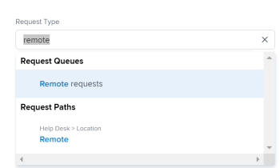

# 建立及提交請求

<!--Audited: 12/2023-->

<!--

(NOTE: Linked to the UI - do not change/ remove; THIS IS NOW SPLIT IN THREE ARTICLES>> MAKE SURE THE TRANSITION TO THE OTHER TWO IS CLEAR SINCE THIS IS LINKED TO UI)

(NOTE: If they come out with templates AND drafts, consider splitting this article to keep Create in one and Working with Drafts and Requests in another??)

(NOTE: this article is linked from Submitting Workfront Requests from Salesforce) 

-->

本頁醒目提示的資訊指出尚未普遍可用的功能。 它僅在預覽環境中可供所有客戶使用。 每月發行至生產環境後，生產環境中為啟用快速發行的客戶也提供相同的功能。

如需快速發行資訊，請參閱[為您的組織啟用或停用快速發行](/help/quicksilver/administration-and-setup/set-up-workfront/configure-system-defaults/enable-fast-release-process.md)。

計畫工作在Adobe Workfront中以專案和任務表示。 不過，您可能會在一個環境中工作，在這種環境中，非計畫工作（以請求的形式）可以隨時進入。 Workfront透過使用請求佇列提供可容納這種環境型別的工作流程。

在「請求佇列」中建立請求後，您可以將請求指派給完成者，或將其轉換為任務或專案。\
如需將問題轉換為任務或專案的詳細資訊，請參閱文章[在Adobe Workfront中轉換問題的概觀](../../../manage-work/issues/convert-issues/convert-issues.md)。

您可以透過下列方式建立Workfront請求：

* 從頭開始，如本文所述。
* 從草稿。 如需詳細資訊，請參閱[從草稿建立請求](../../../manage-work/requests/create-requests/create-requests-from-drafts.md)。
* 從現有請求，透過複製和提交副本。 如需詳細資訊，請參閱[複製並提交請求](../../../manage-work/requests/create-requests/copy-and-submit-requests.md)。

您可以從頭開始建立Workfront Planning請求，以透過下列方式在Workfront Planning中建立記錄：

* 從Workfront Planning請求表單的連結。

* 從Workfront請求區域中的Workfront計畫請求表單。

  貴組織必須購買Workfront Planning套件。 如需詳細資訊，請參閱[提交Adobe Workfront Planning要求以建立記錄](/help/quicksilver/planning/requests/submit-requests.md)。

## 存取需求

+++ 展開以檢視本文中功能的存取需求。

您必須具有下列存取權才能執行本文中的步驟：

<table style="table-layout:auto"> 
 <col> 
 <col> 
 <tbody> 
 <tbody> 
  <tr> 
   <td role="rowheader">Adobe Workfront計畫</td> 
   <td> 
任何 
 </td> 
  </tr> 
  <tr> 
   <td role="rowheader">Adobe Workfront授權</td> 
   <td> 
新增：投稿人或更高版本

   或
   
目前：要求或以上

    </td> 
  </tr> 
  <tr> 
   <td role="rowheader">存取層級設定</td> 
   <td> 
編輯問題的存取權
  </td> 
  </tr> 
  <tr> 
   <td role="rowheader"> 產品</td> 
   <td> <ul><li>Adobe Workfront</li><li>您必須安裝Adobe Workfront Planning才能檢視Planning請求或請求表單</td> 
  </tr> 
 </tbody> 
</table>

如需有關此表格的詳細資訊，請參閱Workfront檔案中的[存取需求](/help/quicksilver/administration-and-setup/add-users/access-levels-and-object-permissions/access-level-requirements-in-documentation.md)。

+++

## 使用請求佇列的先決條件

Workfront管理員必須先建立請求佇列，並讓使用者可以使用此功能。 擁有規劃者授權和編輯專案存取權及管理特定專案許可權的使用者也可以建立請求佇列。

如需有關如何建立請求佇列的資訊，請參閱文章[建立請求佇列](../../../manage-work/requests/create-and-manage-request-queues/create-request-queue.md)。

Workfront管理員必須建立「請求佇列」的下列元件：

* 處於目前狀態的專案，已發佈為說明請求佇列。
* 佇列主題。\
  如需詳細資訊，請參閱文章[建立佇列主題](../../../manage-work/requests/create-and-manage-request-queues/create-queue-topics.md)。

* 路由規則。\
  如需詳細資訊，請參閱文章[建立路由規則](../../../manage-work/requests/create-and-manage-request-queues/create-routing-rules.md)。

* （選用）主題群組。\
  如需詳細資訊，請參閱文章[建立主題群組](../../../manage-work/requests/create-and-manage-request-queues/create-topic-groups.md)。

* （選用）要求自訂表格。\
  如需詳細資訊，請參閱文章[建立自訂表格](/help/quicksilver/administration-and-setup/customize-workfront/create-manage-custom-forms/form-designer/design-a-form/design-a-form.md)。

* （選用）要求核准流程。\
  如需詳細資訊，請參閱文章[建立工作專案的核准程式](../../../administration-and-setup/customize-workfront/configure-approval-milestone-processes/create-approval-processes.md)。

## 在Workfront網頁應用程式中建立請求並產生草稿

當您在Workfront網頁應用程式中建立請求時，Workfront會先將請求儲存為草稿，然後再提交。 當您選取請求佇列並開始輸入資訊時，Workfront會立即建立草稿。

您可以繼續提交請求，也可以儘可能填寫可用資訊，並離開請求以稍後完成。 Workfront會儲存您在「草稿」資料夾中啟動的草稿請求。

>[!IMPORTANT]
>
>使用草稿時，請考量下列事項：
>
>* 當您從協力廠商應用程式提交草稿請求時，Workfront不會建立草稿請求，例如透過電子郵件傳送至Workfront，或使用任何其他應用程式建立草稿。 當您從Workfront網頁應用程式外部提交請求時，該請求會儲存在已提交區段中。
>* 如果請求佇列的結構變更，您將無法再存取現有的草稿。 例如，如果移除佇列主題或新增主題群組，則無法再存取已儲存的草稿。
>

如需有關從現有草稿建立要求的資訊，請參閱[從草稿建立要求](../../../manage-work/requests/create-requests/create-requests-from-drafts.md)。 如需有關刪除請求草稿的資訊，另請參閱[刪除請求草稿](../../../manage-work/requests/create-requests/delete-request-draft.md)。

若要在Workfront網頁應用程式中建立請求：

{{step1-to-requests}}

1. （選擇性和條件性）如果下列專案適用於您的組織和Workfront執行個體，請選取畫面右上角的&#x200B;**切換至新體驗**&#x200B;設定：

   * 您的組織已購買Workfront套件
   * 您的組織已加入Adobe Unified Experience。
   * 您的管理員已授與您存取Workfront Planning的許可權
   * 您至少擁有Workfront Planning工作區的檢視許可權

   如需詳細資訊，請參閱[提交Adobe Workfront Planning要求以建立記錄](/help/quicksilver/planning/requests/submit-requests.md)

1. 按一下頁面右上角的&#x200B;**新要求**。

   >[!TIP]
   >
   >* 您可以從請求區域的任何區段存取新請求選項。
   >* 當您無權建立問題時，新請求選項會變暗。

   **新要求**&#x200B;方塊開啟。

1. （視條件而定）如果您切換至新體驗，而且是在生產環境中，則&#x200B;**新請求**&#x200B;方塊會顯示下列專案：

   <ul><li>最近存取的6個Workfront請求佇列及Planning請求表單會顯示在「最近」區段中。 </li>
    <li>所有其他Workfront和Planning要求表單<b>所有要求表單</b>區段。 您可以搜尋預設不會顯示的請求表單。 </li>
    <li>所有其他Workfront和Planning請求佇列路徑會顯示在<b>所有請求路徑</b>區段中。 您可以搜尋預設不會顯示的請求佇列。</li></ul>
   按一下其中一個Workfront請求佇列路徑或表單，或搜尋其中一個路徑或表單，然後在清單中顯示時按一下它。
1. （條件式）如果您已切換至新體驗，請選取其中一個Workfront要求佇列路徑或表單，或按一下搜尋列。

   當您按一下搜尋列時，會出現一個下拉式清單，首先顯示最近使用的佇列和表單。 從清單中選取一個佇列，或開始輸入佇列或表單，並在佇列或表單出現時加以選取。

   >[!NOTE]
   >
   >考慮下列有關預覽中目前可用的新請求體驗：
   >* 此清單包含Workfront請求佇列和Workfront Planning請求表單。
   >* 您可以依物件型別篩選清單。
   >* 若要只顯示Workfront要求佇列，請篩選`Issue`物件型別。
   >* 在新的請求體驗中，在與已提交請求相同的清單中找到草稿。

1. （視條件而定）如果您切換至新體驗，請選取主題群組和佇列主題，並繼續更新表單。

   否則，請在&#x200B;**要求型別**&#x200B;欄位內按一下，然後執行下列任一項作業：

   * 從&#x200B;**最近使用的路徑**&#x200B;區段中，選取您最近用來開啟要求佇列的路徑。 路徑包括請求佇列、主題群組，以及您最近提交的佇列主題。 依預設會顯示最後三個路徑。

     >[!NOTE]
     >
     >Workfront只會在您實際提交請求時才儲存路徑。 它不會為草擬的請求建立路徑。

     

   * 從&#x200B;**要求佇列**&#x200B;區段中，選取要求佇列。
   * 輸入屬於先前存取路徑的關鍵字，以搜尋請求佇列。

     例如，如果您有一個名為「服務檯」的請求佇列，其主題群組名為「位置」，佇列主題名為「遠端」，則您可以輸入「遠端」，並在其路徑顯示的任何元素中輸入「遠端」的所有請求佇列。

     >[!TIP]
     >
     >當您輸入包含特殊字元的名稱時，即使您省略輸入字元，也會顯示請求佇列、佇列主題或主題群組。

     

     可用請求佇列和最近路徑清單會動態更新，以僅包含結果中反白顯示之關鍵字的路徑。

     搜尋結果會顯示在下列區域下：

     <table style="table-layout:auto"> 
      <col> 
      <col> 
      <tbody> 
       <tr> 
        <td role="rowheader">請求佇列</td> 
        <td>名稱中包含關鍵字的請求佇列</td> 
       </tr> 
       <tr> 
        <td role="rowheader">請求路徑</td> 
        <td> 
在任何元素名稱中包含關鍵字的路徑（包括請求佇列、主題群組、佇列主題）
 </td> 
       </tr> 
      </tbody> 
     </table>

   >[!TIP]
   >
   >* 根據預設，前200個請求佇列會依字母順序顯示。
   >* 請求佇列的名稱是已發佈為說明請求佇列的專案名稱。
   >* 設定為所選請求佇列的專案說明會顯示在請求佇列名稱的右側。
   >   
   >有關如何將專案發佈為說明請求佇列的詳細資訊，請參閱文章[建立請求佇列](../../../manage-work/requests/create-and-manage-request-queues/create-request-queue.md)。

1. 在&#x200B;**新要求**&#x200B;表單中，執行下列其中一項作業：

   * （視條件而定）從「請求型別」欄位下顯示的通知訊息中，選取可用的草稿。

     只有在您之前儲存草稿而未提交時，才會顯示這個區域。

     預設會顯示三個不同佇列主題的最近三個草稿。

     

   * 開始在選取的佇列中輸入新請求。

     當您開始輸入新請求的資訊，並在「主旨」欄位中為請求命名後，新草稿會自動儲存在「草稿」區段中。

1. （選擇性）如果您的「請求佇列」包含「主題群組」 ，請在第一個下拉式欄位中選取「主題群組」的名稱。 否則，請選取佇列主題。

   >[!TIP]
   >
   >當您將滑鼠游標停留在「主題群組」或「佇列主題」上時，「說明」欄位就會顯示在右側。 這包含有關主題群組或佇列主題的其他資訊。
   >
   >
   >
   >

   您的請求佇列中最多可包含10層主題群組。\
   如需有關如何建立主題群組的詳細資訊，請參閱文章[建立主題群組](../../../manage-work/requests/create-and-manage-request-queues/create-topic-groups.md)。 如需有關建立佇列主題的詳細資訊，請參閱文章[建立佇列主題](../../../manage-work/requests/create-and-manage-request-queues/create-queue-topics.md)。

   >[!TIP]
   >
   >如果您選取了草稿或之前的路徑，則會選取主題群組和佇列主題。 如有需要，您可以選取其他選項。

1. 根據Workfront管理員在專案的&#x200B;**佇列詳細資料**&#x200B;子標籤的&#x200B;**新問題欄位**&#x200B;區段中啟用的欄位，當您提交新請求時，可能會發現以下任何欄位：

   <table style="table-layout:auto"> 
    <col> 
    <col> 
    <tbody> 
     <tr> 
      <td role="rowheader"><strong>主旨</strong> </td> 
      <td>指定要求的名稱。 此為必填欄位。</td> 
     </tr> 
     <tr> 
      <td role="rowheader"><strong>說明</strong> </td> 
      <td>指定要求的說明。</td> 
     </tr> 
     <tr> 
      <td role="rowheader"><strong>URL</strong> </td> 
      <td> 
指定可能與您的請求相關的URL。
 </td> 
     </tr> 
     <tr> 
      <td role="rowheader"><strong>優先順序</strong> </td> 
      <td> 
指定要求的優先順序。 優先順序應定義您認為解決此請求的速度。 預設選項為： 
 
       <ul> 
        <li>無</li> 
        <li>低 </li> 
        <li>正常</li> 
        <li>高</li> 
        <li>緊急</li> 
       </ul> 
您的系統管理員可以修改優先順序的名稱。
 </td> 
     </tr> 
     <tr> 
      <td role="rowheader"><strong>嚴重性</strong> </td> 
      <td> 
指定要求的嚴重程度。 嚴重程度應該定義如果不能及時解決此請求對您工作的影響。 預設選項為：
 
       <ul> 
        <li>輕微</li> 
        <li>導致混淆</li> 
        <li>有因應措施的錯誤</li> 
        <li>無因應措施的錯誤</li> 
        <li>致命錯誤</li> 
       </ul> 
您的系統管理員可以修改嚴重程度的名稱。
 </td> 
     </tr> 
     <tr> 
      <td role="rowheader"><strong>主要連絡人</strong> </td> 
      <td>您會預設為請求的主要聯絡人，因為您是處理任何與請求相關問題的直接人員。 不過，您可以將其變更為任何其他Workfront使用者。</td> 
     </tr> 
     <tr data-mc-conditions="QuicksilverOrClassic.Quicksilver"> 
      <td role="rowheader"><strong>指派</strong> </td> 
      <td> 
指定應指派請求的使用中使用者、工作角色或團隊的名稱。 
 
您只能指定一個群組。

   
 視請求佇列的設定方式而定，您或許只能將一或兩種型別的資源指派給請求，而非全部三種（例如，您可能只能將請求指派給使用者）。

   
如果路由規則也關聯到請求佇列，而且它會自動將請求路由到不同型別的資源（例如，小組），則您的請求會同時指派給提交請求時手動指定的實體（使用者）以及路由規則中指定的資源（小組）。 

   
 如需詳細資訊，請參閱下列文章：
 
      <ul> 
      <li> 
<a href="../../../manage-work/requests/create-and-manage-request-queues/create-request-queue.md" class="MCXref xref">建立請求佇列</a> 
 </li> 
      <li> 
<a href="../../../manage-work/requests/create-and-manage-request-queues/create-routing-rules.md" class="MCXref xref">建立路由規則</a>   
 </li> 
      </ul> 

   
我們建議您使用要求佇列的路由規則，以便自動路由至適當的資源。 
 </td> 
     </tr>

   <tr> 
      <td role="rowheader"><strong>規劃時數</strong> </td> 
      <td> 
預估完成此請求所需的時間。
 </td> 
     </tr> 
     <tr> 
      <td role="rowheader"><strong>計劃開始日期</strong> </td> 
      <td> 
指定開始處理此請求的日期。
 </td> 
     </tr> 
     <tr> 
      <td role="rowheader"><strong>計畫完成日期</strong> </td> 
      <td>指定您想要解決此請求的日期。</td> 
     </tr> 
     <tr> 
      <td role="rowheader"><strong>狀態</strong> </td> 
      <td>新請求的預設狀態為「新增」。 您的系統管理員可能已變更此狀態的名稱。 您也可以從此下拉式功能表將狀態變更為其他專案。</td> 
     </tr> 
     <tr> 
      <td role="rowheader"><strong>文件</strong> </td> 
      <td> 
將檔案新增至您的請求。 
 
 視請求佇列的設定方式而定，檔案區段可能會顯示在自訂欄位之前或之後。 
 
您上傳至Workfront的檔案會在草擬的請求中儲存24小時。 之後，當您返回編輯並提交草稿時，必須重新附加它們。 從其他磁碟機連結的檔案會永久儲存在草稿上。 
 </td> 
     </tr> 
    </tbody> 
   </table>

1. （選用）如果您的Workfront管理員將自訂表單與請求佇列或佇列主題相關聯，請指定自訂表單內的欄位。\
   每個Workfront例項的自訂表單都不同。
1. （選擇性和條件性）在輸入請求期間，如果想要刪除自動建立的草稿，請按一下&#x200B;[!UICONTROL **捨棄草稿**]。 這將刪除無法復原的草稿。 系統會顯示確認訊息，確認您正在刪除草稿。

1. （選擇性）如果要還原動作並保留草稿，請按一下確認訊息上的&#x200B;[!UICONTROL **還原**]。

1. 執行下列其中一項：

   * 如果您已準備好提交要求，請按一下&#x200B;**提交**。 請求會儲存在「已提交」區段。 根據「請求佇列」的「路由規則」，此請求可能會路由至指定為「請求佇列」的不同專案。 如需路由規則的詳細資訊，請參閱[建立路由規則](../../../manage-work/requests/create-and-manage-request-queues/create-routing-rules.md)。

     或

     如果您尚未準備好提交，請按一下&#x200B;**關閉**，稍後可能會回來完成它。 您的請求會儲存在「草稿」區段，當您下次提交此請求佇列的請求時，即可使用此請求。

     

   當您提交請求時，草稿會自動刪除且無法還原。

   已提交的請求列在請求區域的&#x200B;**已提交**&#x200B;區段中。 如果您使用新體驗，Workfront提交的請求會顯示在「請求」區域的&#x200B;**Workfront**&#x200B;標籤中。

   如需有關處理傳入請求的資訊，請參閱文章[管理工作和團隊請求](../../../people-teams-and-groups/work-with-team-requests/manage-work-and-team-requests.md)。

   如需尋找已提交或草擬之要求的詳細資訊，請參閱[尋找已提交的要求](../../../manage-work/requests/create-requests/locate-submitted-requests.md)。

## 從Workfront外部建立請求

提交新請求時，您可以分享請求佇列的直接連結，並將其嵌入其他應用程式。 從網站或其他應用程式存取此連結的使用者也必須以有效的Workfront帳戶登入，才能存取此佇列並向其提交請求。 如需詳細資訊，請參閱[分享要求佇列的連結](../../../manage-work/requests/create-requests/share-link-to-request-queue.md)。

## 透過傳送電子郵件至Workfront來建立請求

如果您的請求佇列已啟用透過電子郵件接收請求，您可以透過電子郵件直接將您的請求傳送到與請求佇列相關聯的電子郵件地址。

電子郵件的內文會新增為請求說明。

>[!NOTE]
>
>請求進入Workfront時，HTML格式會遭到移除，但簽名和現有的回覆對話串內容不會遭到移除，並會出現在請求說明中。

如需有關如何啟用要求佇列以透過電子郵件接收要求的資訊，請參閱[讓使用者透過電子郵件將問題傳送到要求佇列專案](../../../manage-work/requests/create-requests/enable-email-issues-into-projects.md)。

## 使用Workfront行動應用程式建立請求

您可以使用智慧型手機上的行動應用程式來提交請求。 您可以建立新請求，並將其提交至您有權在網頁應用程式中檢視的「請求佇列」。

如需透過行動應用程式提交請求的相關資訊，請參閱文章中的請求一節：

* 適用於Android的[Adobe Workfront](../../../workfront-basics/mobile-apps/using-the-workfront-mobile-app/workfront-for-android.md#requests)
* [適用於iOS的Adobe Workfront](../../../workfront-basics/mobile-apps/using-the-workfront-mobile-app/workfront-for-ios.md#requests)

## 從其他應用程式建立請求

您可以使用已與Workfront整合的任何應用程式來提交請求：

* 您可以建立Workfront與其他應用程式之間的自訂整合，好讓您從其他應用程式提交請求至Workfront。\
  如需自訂Workfront整合的詳細資訊，請參閱文章[Adobe Workfront整合](../../../administration-and-setup/configure-integrations/workfront-integrations-1.md)。

## 使用Workfront Planning請求表單建立請求

您可以使用Planning請求表單新增Workfront Planning請求。 如果請求表單已核准或不需要核准，新增Workfront Planning請求可能會建立Planning記錄。

貴組織必須購買Workfront Planning套件才能提交Planning請求。

如需詳細資訊，請參閱下列文章：

* [在Adobe Workfront Planning中建立和管理要求表單](/help/quicksilver/planning/requests/create-request-form.md)。
* [提交Adobe Workfront Planning要求以建立記錄](/help/quicksilver/planning/requests/submit-requests.md)。

## 找出已提交的請求

如需尋找已提交或草擬之要求的詳細資訊，請參閱[尋找已提交的要求](../../../manage-work/requests/create-requests/locate-submitted-requests.md)。
