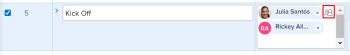

# 建立進階任務指派

{{preview-fast-release-general}}

<!-- Audited: 07/2024-->

您可以使用「進階指派」來管理任務或問題指派。

進行進階指派時，您可以調整下列指派資訊：

* 將使用者指派給任務或問題（這可以在進階指派之外完成）。
* 調整並重新分配每個受指派人分配的時數。
* 決定應指定為任務或問題之擁有者或主要受指派者的使用者。
* 指定每個使用者在處理任務或問題時履行哪個角色。
  <!--* Override the billing rate for a job role.-->

>[!NOTE]
>
>指派使用者工作時，其根據排程的可用性會影響任務和問題的計畫和預計日期。 如需排程的相關資訊，請參閱[建立排程](../../../administration-and-setup/set-up-workfront/configure-timesheets-schedules/create-schedules.md)。

## Adobe Workfront中您可以進行進階指派的區域

本文會說明如何在任務或問題的標題中存取進階工作總攬。

此外，您可以在Workfront的下列區域中執行進階任務指派：

* 在清單與報表中，當「工作總攬」欄位顯示在檢視中時。
* 編輯任務時顯示在「工作總攬」區段中。 如需詳細資訊，請參閱[編輯工作](../../../manage-work/tasks/manage-tasks/edit-tasks.md)。
* 在任務或問題標題中，在指派區域中。
* 在工作負載平衡器中。 如需詳細資訊，請參閱[使用工作負載平衡器](../../../resource-mgmt/workload-balancer/assign-work-in-workload-balancer-manually.md)手動指派工作。

## 存取需求

+++ 展開以檢視本文中功能的存取需求。

您必須具有下列存取權才能執行本文中的步驟：

<table style="table-layout:auto"> 
 <col> 
 <col> 
 <tbody> 
  <tr> 
   <td role="rowheader">Adobe Workfront計畫</td> 
   <td> 
任何
 </td> 
  </tr> 
  <tr> 
   <td role="rowheader">Adobe Workfront授權</td> 
   <td> 
新增：標準

    
目前：工作或以上
 </td> 
  </tr> 
  <tr> 
   <td role="rowheader">存取層級設定</td> 
   <td> 
編輯任務和問題的存取權
  </td> 
  </tr> 
  <tr> 
   <td role="rowheader">物件許可權</td> 
   <td> 
貢獻或更高的任務或問題許可權
  </td> 
  </tr> 
 </tbody> 
</table>

如需有關此表格的詳細資訊，請參閱Workfront檔案中的[存取需求](/help/quicksilver/administration-and-setup/add-users/access-levels-and-object-permissions/access-level-requirements-in-documentation.md)。

+++

## 進行進階任務指派

1. 前往您要指派任務或問題的專案。
1. 按一下左側面板中的&#x200B;**任務**&#x200B;或&#x200B;**問題**，然後按一下清單中任務或問題的名稱。

   >[!TIP]
   >
   >您可以直接在任務或問題清單上進行進階指派。 按一下任務或問題所在行上的&#x200B;**工作總攬**&#x200B;欄位內，然後按一下&#x200B;**進階**&#x200B;或&#x200B;**人員圖示**&#x200B;以開啟「進階工作總攬」視窗。 跳到步驟5以繼續建立進階工作分派。
   >預覽環境中的範例影像：
   >![按一下[進階]或[人員]圖示](assets/access-aa-from-lists.png)
   >生產環境中的影像範例：
   >

1. 按一下任務或問題標題中&#x200B;**工作總攬**&#x200B;欄位中的&#x200B;**指派給**

   或

   如果任務或問題已指派，請按一下其中一個指派的名稱。

1. 按一下&#x200B;**進階**。

   ![按一下[進階]](assets/assignments-from-task-header-0825.png)

1. 在&#x200B;**搜尋人員、角色和團隊**&#x200B;欄位中，開始輸入使用者、角色或團隊的名稱，然後在其出現在下拉式清單中時按一下該名稱。

   >[!NOTE]
   >
   >如果使用者名稱包含特殊字元，您必須在搜尋欄位中包含特殊字元。

1. （選擇性）繼續在&#x200B;**搜尋人員、角色和團隊**&#x200B;方塊中新增受指派人，以將多個資源新增至任務或問題。

   >[!TIP]
   >
   >* 您可以指派多個使用者、工作角色或團隊。 您只能指派作用中的使用者、工作角色和團隊。
   >
   >
   >* 新增使用者指派時，請注意頭像、使用者的主要角色或其電子郵件地址，以區分具有相同名稱的使用者。
   >使用者必須至少與一個工作角色相關聯，才能在您新增時檢視該角色。
   >您必須在存取層級中啟用檢視聯絡資訊設定，使用者才能檢視使用者的電子郵件。 如需詳細資訊，請參閱[授予使用者存取權](../../../administration-and-setup/add-users/configure-and-grant-access/grant-access-other-users.md)。
   >
   >
   >* 如果使用者、工作角色或團隊在停用之前已被指派，則他們仍被指派給工作專案。 在此情況下，我們建議採取下列步驟：
   >   
   >   * 將工作專案重新指派給作用中的資源。
   >   * 將已停用團隊中的使用者與作用中團隊建立關聯，並將工作專案重新指派給作用中團隊。

   <!-- SHOULD BE THIRD BULLET POINT IN TIP TABLE WHEN THIS FEATURE IS RELEASED 
    * When adding a job role assignment, you can search for the job role or location. Select the System/Default Job Role to use the default billing rate for the assignment, or select a Rate Card Job Role to override the rate at the assignment level. For more information on rate cards, see [Manage rate cards](/help/quicksilver/administration-and-setup/set-up-workfront/configure-system-defaults/manage-rate-cards.md).
    -->

1. 請為&#x200B;**受指派人**&#x200B;欄中的每個使用者指定下列資訊：

   * **所有者**：將游標停留在受指派人名稱上，如果要將受指派人標示為任務或問題所有者，請在「所有者」欄位中按一下&#x200B;**設為主要所有者**。 綠色核取方塊表示指定的使用者是任務或問題的主要聯絡人。 Adobe Workfront將您指派給任務或問題的第一個使用者或工作角色標籤為擁有者或主要指派。 團隊不能被指定為任務或問題的主要擁有者。

     >[!IMPORTANT]
     >
     >根據您的Workfront管理員或群組管理員設定專案偏好設定的方式，當您有多個使用者指派至任務時，Workfront可能會使用任務擁有者的排程來計算任務的時間表。 如需關於多個任務受指派人的資訊，請參閱文章[指派任務](../../../manage-work/tasks/assign-tasks/assign-tasks.md)中的「將多個使用者指派到一個任務」一節。

   * **配置**：當任務的期間型別為「簡單」時，請指定每個使用者或工作角色應指派給任務的小時數。 每位使用者所有指派時數的加總等於分配欄底部&#x200B;**計畫時數**&#x200B;欄位中的數字。 在所有其他情況下，請指定您希望受分派者解決任務或問題的時間百分比（或配置）。

     >[!TIP]
     >   
     >   * 在您手動修改任務的指派分配後，任務的計畫時數可能會相應地更新。 如需詳細資訊，請參閱文章[計畫時數概觀](../../../manage-work/tasks/task-information/planned-hours.md)中的「管理使用者指派時更新任務計畫時數」一節。
     >   * 您無法手動修改問題的指派分配。
     >   * 您無法手動修改指派給任務的專案團隊的分配。

   * **受指派人角色：**&#x200B;選取使用者完成此指派時應使用的角色。  預設會顯示使用者的主要角色。 按一下&#x200B;**受指派人角色**&#x200B;方塊以選取其他角色。 當您先將任務或問題指派給角色，然後新增可以履行該角色的使用者作為第二個指派時，將會篩選建議使用者的清單，以顯示可以履行已指派給任務和問題的角色的使用者。

     

   <!--

   * **Location**: The location comes from the rate card, if a rate card attached to the project uses locations with the job roles. The location can't be changed. 

   * **Billing Rates**: The billing rate for a user comes from the system rate for the user or their associated job role. The billing rate for a job role comes from the system rate or from the rate card, if a rate card is attached to the project. Existing billing rates are not displayed in this field. Click in the field to change the billing rate for this specific task assignment.

   
-->

   * **期間型別**：這僅適用於工作。 按一下「持續時間型別」的名稱，然後從下拉式選單中選取「持續時間型別」。 如需有關期間型別的資訊，請參閱[任務期間與期間型別的概觀](../../../manage-work/tasks/taskdurtn/task-duration-and-duration-type.md)。

   * **工期：**&#x200B;當您擁有任務的管理許可權時，可以更新任務的此欄位。

     如需詳細資訊，請參閱[任務期間與期間型別概觀](../../../manage-work/tasks/taskdurtn/task-duration-and-duration-type.md)。 大量編輯指派資訊時，會出現類似的對話方塊，以指派使用者、時數、配置和任務擁有者。

   * **計畫時數**：當期間型別為計算指派或簡單時，更新計畫時數。 因此，每個資源的配置百分比或時數會平均分配。 當期間型別為已計算的工作或投入比導向時，Workfront會計算計畫時數。 如需詳細資訊，請參閱[任務期間與期間型別概觀](../../../manage-work/tasks/taskdurtn/task-duration-and-duration-type.md)。

1. 按一下「**儲存**」。
