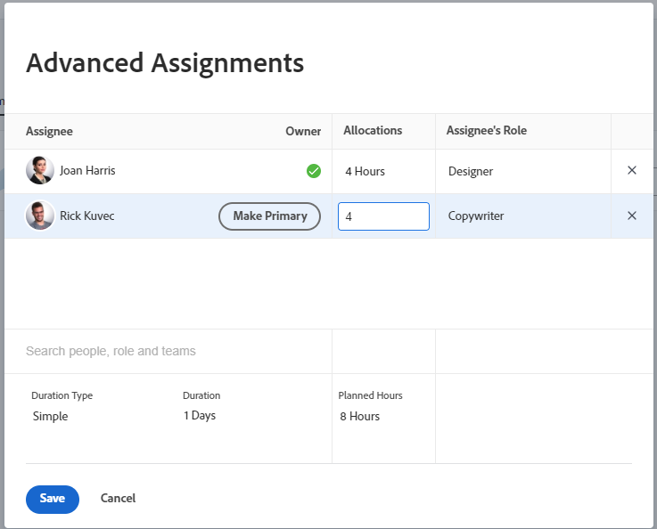

# 管理任務的使用者和角色分配時數

<!--Audited: 10/2025-->

<!--

 

The highlighted information on this page refers to functionality not yet generally available. It is available only in the Preview environment for all customers. The same features will also be available in the Production environment for all customers starting with  a week from the Preview release.      

For more information, see [Interface modernization](/help/quicksilver/product-announcements/product-releases/interface-modernization/interface-modernization.md).  

 
-->

分配時數代表已指派資源計畫處理一項任務的總時間量。 小時代表使用者在任務持續期間的指定日、工作日、周或月所分配的時間。

>[!NOTE]
>
>指派使用者工作時，其根據排程的可用性會影響任務和問題的計畫和預計日期。 如需排程的相關資訊，請參閱[建立排程](../../../administration-and-setup/set-up-workfront/configure-timesheets-schedules/create-schedules.md)。

## 存取需求

+++ 展開以檢視本文中功能的存取需求。

<table style="table-layout:auto"> 
 <col> 
 <col> 
 <tbody> 
  <tr> 
   <td>Adobe Workfront套件</td> 
   <td> 
任何
 </td> 
  </tr> 
  <tr> 
   <td>Adobe Workfront授權</td> 
   <td> 
標準

   
工作或更高

   </td> 
  </tr> 
  <tr> 
   <td>存取層級設定</td> 
   <td>編輯任務的存取權</td> 
  </tr> 
  <tr> 
   <td>物件許可權</td>
   <td>
貢獻或更高的任務許可權

   
編輯許可權以在編輯任務方塊中更新分配時數
</td>
  </tr>
 </tbody>
</table>

如需詳細資訊，請參閱Workfront檔案中的[存取需求](/help/quicksilver/administration-and-setup/add-users/access-levels-and-object-permissions/access-level-requirements-in-documentation.md)。

+++

<!--
Change this sentence in the table when unshimmming assignments on Edit task:

Edit permissions to update allocation hours in the Edit Task box

To this:

Edit permissions to update allocation hours in the Edit Task box when editing tasks using the old experience. You can no longer manage allocation hours in the Edit task box when editing tasks in the new experience.
 
For information, see <a href="/help/quicksilver/manage-work/tasks/manage-tasks/edit-tasks.md">Edit tasks</a>
.
-->

## 修改任務分配時數的考量事項

>[!IMPORTANT]
>
>在您手動修改任務上每個指派的分配後，任務的計畫時數可能會相應地更新。 如需詳細資訊，請參閱文章[計畫時數概觀](../../../manage-work/tasks/task-information/planned-hours.md#update)中的[管理使用者配置時更新任務計畫時數](../../../manage-work/tasks/task-information/planned-hours.md)一節。

* 分配給指派給任務的個別資源的時數總計代表任務的計畫時數。
* 如果任務有一個使用者或角色指派，則分配給使用者或角色的時數與任務的計畫時數相符。
* 在多重指派的情況下，如果任務「期間型別」為「簡單」，則預設會為每個使用者或工作角色指派相等的時數，以處理任務。 如需詳細資訊，請參閱下列文章：

   * [任務期間與期間型別概觀](../../../manage-work/tasks/taskdurtn/task-duration-and-duration-type.md)
   * [期間型別概觀：簡單](../../../manage-work/tasks/taskdurtn/simple-duration-type.md)

* 當任務具有「簡單期間型別」時，您可以手動變更每個使用者或職務角色的分配時數金額，以表示某些任務受指派人可能比其他任務受指派人有更多時間處理任務。
* 您無法修改分配給指派給任務的團隊的時數。
* 您無法手動修改問題的使用者或工作角色分配。
* 您還可以使用工作負載平衡器管理每日、每週或每月使用者對任務或問題的分配。 如需詳細資訊，請參閱[在工作負載平衡器](../../../resource-mgmt/workload-balancer/manage-user-allocations-workload-balancer.md)中管理使用者配置。

## 修改任務的使用者或角色配置時數

1. 移至您要變更其指派時數的任務。
1. 按一下工作名稱旁的&#x200B;**更多**&#x200B;功能表，然後按一下&#x200B;**編輯**，再按一下&#x200B;**工作分派**。

   或

   按一下工作標題中的&#x200B;**工作總攬**&#x200B;區域，然後按一下&#x200B;**進階**。

1. 確定任務的&#x200B;**期間型別**&#x200B;是&#x200B;**簡單**。
1. 修改每個任務受指派人的&#x200B;**配置**。 這些是整個任務期間此任務的每個工作分派的整體配置。 這也可能更新任務的整體計畫時數。

   

1. 按一下「**儲存**」。
