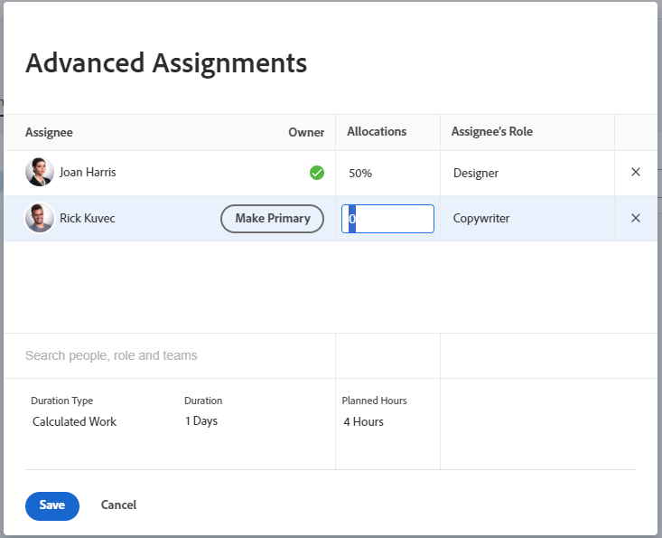

# 管理任務的使用者或角色配置百分比

<!--remove new/old experience references when they remove the New/ Old experience toggle from the Edit Tasks box-->

<!--
 

The highlighted information on this page refers to functionality not yet generally available. It is available only in the Preview environment for all customers. The same features will also be available in the Production environment for all customers starting with  a week from the Preview release.      

For more information, see [Interface modernization](/help/quicksilver/product-announcements/product-releases/interface-modernization/interface-modernization.md).  

 -->

配置百分比代表指定資源計畫在一天內處理一項任務的時間量。 這是在任務持續期間中配置資源的當日百分比（根據使用者或專案排程）。

當您對任務進行進階指派時，可以修改配置百分比。

>[!NOTE]
>
>指派使用者工作時，其根據排程的可用性會影響任務和問題的計畫和預計日期。 如需排程的相關資訊，請參閱[建立排程](../../../administration-and-setup/set-up-workfront/configure-timesheets-schedules/create-schedules.md)。

## 存取需求

+++ 展開以檢視本文中功能的存取需求。

<table style="table-layout:auto"> 
 <col> 
 <col> 
 <tbody> 
  <tr> 
   <td>Adobe Workfront套件</td> 
   <td> 
任何
 </td> 
  </tr> 
  <tr> 
   <td>Adobe Workfront授權</td> 
   <td> 
標準

   
工作或更高

   </td> 
  </tr> 
  <tr> 
   <td>存取層級設定</td> 
   <td>編輯任務的存取權</td> 
  </tr> 
  <tr> 
   <td>物件許可權</td>
   <td>
貢獻或更高的任務許可權

   
編輯許可權以在使用舊體驗編輯任務時，在「編輯任務」方塊中更新分配百分比。 在新體驗中編輯任務時，您無法再在「編輯任務」方塊中管理配置百分比。
 
如需詳細資訊，請參閱<a href="/help/quicksilver/manage-work/tasks/manage-tasks/edit-tasks.md">編輯工作</a>。
</td>
  </tr>
 </tbody>
</table>

如需詳細資訊，請參閱Workfront檔案中的[存取需求](/help/quicksilver/administration-and-setup/add-users/access-levels-and-object-permissions/access-level-requirements-in-documentation.md)。

+++

<!--
Take this piece out of the table above when we remove the new experience/ after production release in the task box: 

Edit permissions to update allocation percentage in the Edit Task box when editing tasks using the old experience. You can no longer manage allocation percentage in the Edit task box when editing tasks in the new experience.
 
For information, see <a href="/help/quicksilver/manage-work/tasks/manage-tasks/edit-tasks.md">Edit tasks</a>
.
-->

## 修改任務百分比分配的考量事項

* 依預設，使用者會獲得相等百分比的時間分配給指派給他們的任務。
* 只有在任務的「期間型別」是已計算的工作或投入比導向時，您才能手動修改指派給任務的使用者與工作角色的分配百分比。

  如需詳細資訊，請參閱[任務期間與期間型別概觀](../../../manage-work/tasks/taskdurtn/task-duration-and-duration-type.md)。

* 您無法修改指派給任務的團隊的百分比配置。
* 您無法修改指派給問題的使用者和職位角色的百分比分配。

## 修改任務的使用者或角色百分比分配

1. 移至您要變更其資源配置百分比的任務。
1. 按一下工作標題中的&#x200B;**工作總攬**&#x200B;區域，然後按一下&#x200B;**進階**。

1. 確定任務的&#x200B;**期間型別**&#x200B;是下列其中一項：

   * 已計算的工作
   * 投入比導向

   >[!TIP]
   >
   >* 對於計算的指派期間型別，Workfront會使用以下公式來計算每個受指派人的配置百分比： `Allocation Percentage = (Work Required / Number of days in the Duration) / Number of hours per work day / Number of assignees`。
   >* 對於「簡單期間型態」，您可以估計指派給每項資源的時數，而非配置百分比。

1. 修改每個任務受指派人的&#x200B;**配置**&#x200B;欄位。

   您只能修改使用者與職務角色指派的配置百分比。

   您無法修改指派給任務的團隊配置百分比。

   

1. 按一下「**儲存**」。
