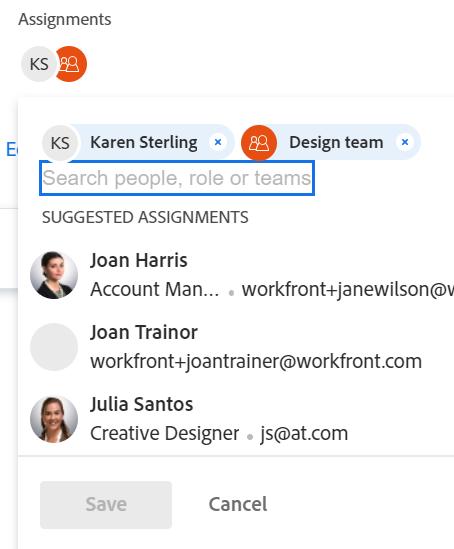

# 智慧指派總覽

本頁醒目提示的資訊指出尚未普遍可用的功能。 它僅在預覽環境中可供所有客戶使用。

如需目前發行排程的詳細資訊，請參閱 [2024年第一季版本總覽](/help/quicksilver/product-announcements/product-releases/24-q1-release-activity/24-q1-release-overview.md).

在管理任務和問題指派時，您可以使用智慧指派來識別誰是完成工作的最佳資源。 智慧型指派是Adobe Workfront在您根據演演算法將工作專案指派給資源時所顯示的建議，該演演算法會決定最適合工作的資源。 智慧指派可以是使用者、工作角色或團隊。

>[!NOTE]
>
>建議使用者時，智慧指派不會考慮使用者的可用性。 但是，根據它們的排程可用性，會影響任務和問題在指派時的計畫和預計日期。 如需有關排程的資訊，請參閱文章 [建立排程](../../../administration-and-setup/set-up-workfront/configure-timesheets-schedules/create-schedules.md).

本文包含智慧指派的一般資訊。 有關使用智慧指派指派指派任務和問題給使用者的資訊，請參閱 [進行智慧型指派](../../../manage-work/tasks/assign-tasks/make-smart-assignments.md).

## 智慧指派總覽

使用智慧型指派時，請考量下列事項：

* 演演算法可獨立處理任務和問題。 這表示問題的建議使用者清單可能與任務的建議使用者清單不同，因為Workfront會根據與問題和任務分別相關的准則來建立清單。
* 智慧指派不建議職務角色或團隊。 相反地，他們是最適合完成任務或問題的使用者的建議。
* 建議的指派一律為作用中的使用者。
* 首先列出的使用者應該是此任務的最佳相符者。

## 尋找智慧指派建議

您可以在下列區域中檢視智慧型指派，您可指派任務或問題：

* 工作列中的問題清單或報告

  

* 「工作總攬」欄中的任務清單或報告 

  

* 工作列位中的任務標題

  

* 工作列位中的問題標題

  

* 任務或問題任務區域中的摘要面板

  

* 當您開啟任務或問題時，在「工作總攬」區域的「首頁」區域中列出的專案的「工作總攬」欄位

  

* 當您指派任務或問題時，在「指派此給」區域的工作負載平衡器

  

## 智慧指派條件

智慧型指派對任務的運作方式與對問題的運作方式不同。

### 任務的智慧指派條件

任務智慧型指派計算在兩個階段中運作，這兩個階段使用兩個不同的演演算法。

根據尋找智慧指派的演演算法，指派會列在「指派」欄位的兩個獨立區段下。 如需詳細資訊，請參閱 [進行智慧型指派](/help/quicksilver/manage-work/tasks/assign-tasks/make-smart-assignments.md).

#### 工作的智慧型指派計算的第一階段

在計算智慧指派的第一個階段中，Workfront會計算每個指派的相似度分數。

>[!NOTE]
>
>智慧型指派計算的第一個階段不適用於下列任務區域：
>
>* 工作負載平衡器中的大量指派。
>* 已連線主機板上的卡片。

相似度評分的計算以及指派的列出順序會考慮下列因素：

* 如果現有指派中的任務、專案及投資組合名稱與您嘗試指派的任務相同，則會給予100%的分數。 現有指派的任務的專案與投資組合名稱也必須符合您嘗試指派的任務的專案與投資組合。

* 如果只有來自其他指派的部分資訊符合現有任務，則分數可能會低於100%。

  例如，如果您在名為「我的投資組合」的投資組合中指派名為「我的專案」的專案上名為「我的第二個任務」，而在名為「我的投資組合」的投資組合中另一個名為「我的專案」的專案上有一個名為「我的任務」的現有任務，則指派給「我的任務」的使用者可能會獲得95%的分數，因為現有任務的名稱與您目前嘗試指派的任務類似，但並不相同。

  >[!TIP]
  >
  >  Workfront只會在任務、專案和產品組合的「名稱」欄位中尋找相符專案，不會在其他任何欄位中尋找。

* 當指派給系統中許多名稱相似的任務時，指派可能會獲得較高的分數。 例如，如果名為「開發」的團隊指派給名稱中包含「AI」之系統的50%任務，而您現在指派名稱中包含「AI」的另一個任務，則「開發」團隊的分數會較高。 在這種情況下，專案和產品組合的名稱就不那麼重要了。

* 考慮到此評分系統，前7個建議會依其分數的遞減順序列為智慧型指派。 分數低於40%的工作分派不會顯示。

* 如果數個指派具有相同的分數，則會以指派的完成日期從最近日期開始按順序顯示。

  例如，如果Rick今天早些時候被指派到類似任務，而Jennifer兩天前被指派到類似任務，則Rick會先顯示。

* 此階段中識別的指派會列在 **建議的指派** 區段。

* 如果沒有符合使用此計算的專案，則智慧型指派的第二階段會使用不同的演演算法來開始計算。

#### 工作的智慧型指派計算的第二個階段

如果任務智慧指派的第一步找不到相符專案，Workfront會以計算問題的相同方式計算任務的智慧指派。

如需詳細資訊，請參閱區段 [任務和問題的智慧指派條件](#smart-assignments-criteria-for-tasks-and-issues) 本文章內容。

此階段中識別的指派會列在 **結果** 區段。 <!--update this to "Other assignments"-->

### 任務和問題的智慧指派條件

>[!NOTE]
>
>只有當任務智慧指派計算的第一個階段找不到任何相符專案時，以下條件才適用於任務。 如需詳細資訊，請參閱區段 [工作的智慧型指派計算的第一階段](#first-phase-of-smart-assignment-calculation-for-tasks) 本文章內容。 依預設，下列條件一律適用於問題。 

根據以下條件的組合，建議在智慧指派下拉式清單中使用者（按照從最重要到最不重要的順序列出）：

1. 由進行指派的使用者在過去30天內指派給其他工作專案的使用者。 符合此條件的前50名使用者隨即顯示。 最常被指派的使用者會先顯示。

2. 如果將工作專案指派給團隊或角色，則會進一步篩選建議的使用者清單，並考量以下現有的指派。 在此情況下，建議清單只會顯示下列使用者：

   * 主團隊是指派給工作專案的團隊的使用者。
   * 主要角色是指派給工作專案的角色的使用者。

>[!TIP]
>
>* 如果任務或問題未指派任何角色或團隊，Workfront會顯示過去30天指派的所有使用者，最多50名使用者。
>
>* 如果您在過去30天內未進行任何指派，則只有屬於指派的團隊或擁有指派給工作專案的角色的使用者才會顯示在智慧指派清單中。

<!--the commented out piece in the tip above was live before but I am not totally sure that smart assignments look at your team. I think they look JUST at the team/ role assigned to the work item; see this help site request for more info: https://experience.adobe.com/#/@adobeinternalworkfront/so:hub-Hub/workfront/issue/62fd222200037eb87572c5b6ad6bf53e/overview -->
<!--

<h3>Smart assignments criteria for the Production environment</h3>

(NOTE: drafted,this was the case BEFORE we updated the logic in the WB - with the 21.4 release)

Smart assignments display on tasks and issues when the following conditions are met:

<ul>
<li>The task or issue is subordinate to a parent task or issue that has a user, team, or job role currently assigned. </li>
</ul>

Smart assignments display the top twenty recommendations based on a proprietary algorithm that uses your own team information.

Users are recommended in the smart assignments drop-down list based on a combination of the following criteria (listed in order from most important to least important):

<ul>
<li>The user has the team assigned to the task or issue designated as their Home Team</li>
<li>The user is also assigned to the parent task</li>
<li>The user has the same primary job role as is currently assigned to the task or issue</li>
<li>The user has the team assigned to the parent task or issue designated as their Home Team</li>
<li>The user is associated with the same primary job role currently assigned to the parent task</li>
<li>The user is a member of the same team as the user who assigned the task or issue and the team is designated as their Home Team</li>
<li>The user is a member of the same Home Group as the user who is assigning the task or issue</li>
<li>The user has the same primary job role as the user who is assigning the task or issue.</li>
</ul>

-->

<!--

<h2>Make smart assignments</h2>

(NOTE:&nbsp;this was moved to its own article: make-smart-assignments.) 

Smart assignments are available in most locations where you can make assignments in Workfront.

You can use smart assignments on tasks and issues that have previously been assigned to a job role or a team.
 <note type="note">
You must have a Plan or a Work license and have at least Contribute permissions to a task or an issue to be able to make assignments to the task or the issue. You must have the Make Assignments option enabled in your permission level to make assignments.
</note>

To use smart assignments:

<ol>
<li value="1">Navigate to an issue or a task and click one of the following fields to edit them:  
<ul>
<li>
The <strong>Assignments</strong> field in the task or issue header
</li>
<li>The <strong>Assignments</strong> field of a task or issue list using in-line editing in a task or issue list. </li>
<li>The <strong>Assignee</strong> field after you have clicked <strong>Advanced</strong> from a task or an issue. </li>
</ul></li>
<li value="2"> 
Place your cursor in the assignment field, and wait for two seconds, then the <strong>Suggestions</strong> list is displayed.
 
Users displayed in this list are the smart assignment suggestions for the task or the issue. 
 
  
 </li>
<li value="3"> 
Select the user in the recommendations list by clicking their name. 
 
If there are no suggestions, the suggestion list does not open.
 </li>
<li value="4">(Optional) If you do not want to use one of the recommended users from the smart assignments list, start typing the name of the desired user and select the name when it appears in the list.</li>
<li value="5">Click <strong>Enter</strong> to make the assignment. </li>
</ol>

-->
