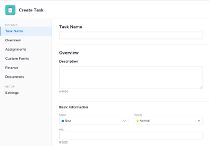

# 在專案中建立任務

<!-- Audited: 1/2024 -->

您只能在建立專案之後建立專案中的任務。

例如，建立專案後，您可能會想要新增任務並加以修改以組織專案計畫。 如需建立專案的詳細資訊，請參閱 [建立專案](../../../manage-work/projects/create-projects/create-project.md).

如需有關建立不在專案中的個人任務的資訊，請參閱 [建立個人任務](../../../workfront-basics/using-home/using-the-home-area/create-work-items-in-home.md#create-a-personal-task) 文章中的區段 [從首頁區域建立工作專案](../../../workfront-basics/using-home/using-the-home-area/create-work-items-in-home.md).

本文說明如何從頭開始建立工作。 您也可以以下列方式建立任務：

* 透過複製或複製現有任務。 如需詳細資訊，請參閱 [複製和複製任務](../../../manage-work/tasks/manage-tasks/copy-and-duplicate-tasks.md).
* 將任務從一個專案移動到另一個專案。 如需詳細資訊，請參閱 [移動任務](../../../manage-work/tasks/manage-tasks/move-tasks.md).

## 存取需求

<table style="table-layout:auto"> 
 <col> 
 <col> 
 <tbody> 
  <tr> 
   <td role="rowheader">Adobe Workfront計畫*</td> 
   <td> 
任何
 </td> 
  </tr> 
  <tr> 
   <td role="rowheader"> 
Adobe Workfront授權*
 </td> 
   <td>
目前：工作或以上
 
   或
   
新增：標準
 </td> 
  </tr> 
  <tr> 
   <td role="rowheader">存取層級設定*</td> 
   <td> 
編輯任務與專案的存取權
 
注意：如果您還是沒有存取權，請詢問您的Workfront管理員，他們是否在您的存取層級中設定其他限制。 如需存取工作的相關資訊，請參閱 <a href="../../../administration-and-setup/add-users/configure-and-grant-access/grant-access-tasks.md" class="MCXref xref">授與任務的存取權</a>. 如需有關Workfront管理員如何變更您的存取層級的資訊，請參閱 <a href="../../../administration-and-setup/add-users/configure-and-grant-access/create-modify-access-levels.md" class="MCXref xref">建立或修改自訂存取層級</a>. 
 </td> 
  </tr> 
  <tr> 
   <td role="rowheader">物件許可權</td> 
   <td> 
為專案貢獻許可權，並可新增任務或以上專案
 
建立任務時，您會自動收到該任務的「管理」許可權
 
 如需工作許可權的相關資訊，請參閱 <a href="../../../workfront-basics/grant-and-request-access-to-objects/share-a-task.md" class="MCXref xref">共用任務 </a>. 
 
如需請求其他許可權的相關資訊，請參閱 <a href="../../../workfront-basics/grant-and-request-access-to-objects/request-access.md" class="MCXref xref">要求物件的存取權 </a>.
 </td> 
  </tr> 
 </tbody> 
</table>

&#42;若要瞭解您擁有的計畫、授權型別或存取權，請聯絡您的Workfront管理員。

## 在專案中建立任務

1. 前往您要建立任務的專案。
1. 按一下 **任務** 在左側面板中。
1. （視條件而定）如果您目前正在敏捷檢視中檢視任務清單，請按一下 **清單檢視** 圖示  以顯示「工作清單」。
1. （可選）按一下 **計畫模式** 圖示  並選取 **手動儲存**，然後選取 **標準** 或 **時間表規劃**. 這樣會停用 **自動儲存** 選項，預設為啟用。

   

   >[!TIP]
   >
   >選取「手動儲存」時，您可以回覆變更。

1. 執行下列任一項作業來建立新作業：

   * 按一下 **建立任務** 位於工作清單頂端。
   * 按一下 **新增更多工** 位於工作清單底部。

   

1. （視條件而定）如果您按一下 **建立任務** 執行下列動作：

   1. 在有限欄位清單中指定任何欄位 **建立任務** 方塊，然後按一下 **建立任務** 如果您想要快速建立任務。

      或

      若要更新任務的所有欄位，請按一下 **更多選項** 以開啟 **建立任務** 方塊。

      

      此 **建立任務** 方塊開啟。

      

       

      >[!NOTE]
      >
      >視您的Workfront管理員如何設定版面配置範本而定，建立任務方塊中的欄位可能會顯示您環境中的不同欄位。 如需詳細資訊，請參閱 [使用版面配置範本自訂詳細資料檢視](../../../administration-and-setup/customize-workfront/use-layout-templates/customize-details-view-layout-template.md).

   1. 在「建立任務」方塊的左側面板中，指定下列區域的資訊：

      * 任務名稱
      * 概觀
      * 指派
      * 自訂表單
      * 財務
      * 設定

        如需在任務上定義所有任務相關欄位的詳細資訊，請參閱 [編輯任務](../../../manage-work/tasks/manage-tasks/edit-tasks.md).

   1. （條件式與選擇性）如果您希望任務重複發生，請更新 **週期頻率** 欄位。 如需建立週期性工作的詳細資訊，請參閱 [建立週期性任務](../../../manage-work/tasks/create-tasks/create-recurring-tasks.md).
   1. （選用）按一下 **檔案** 在左側面板中，將檔案附加到新任務，然後按一下 **新增或連結檔案** 從您的電腦、其他服務將檔案新增至工作，或從您的電腦或其他服務連結檔案和資料夾。

1. （視條件而定）如果您按一下 **新增更多工** 在步驟5中，開始使用內嵌編輯輸入工作資訊，然後按Enter鍵。

   <!--
   
(NOTE: ensure this stays accurate)

   -->

   我們建議使用此選項，尤其是在將多個任務新增至清單時。

   

1. （視條件而定）執行下列任一項作業：

   * 若您按一下 **建立任務** 在步驟5中，按一下 **建立任務** 以儲存變更並將新任務新增至專案。

     <!--   
     
(NOTE: is this step still right?)
   
     -->

   * 若您按一下 **新增更多工** 在步驟5中執行下列動作：

     <!--   
     
(NOTE: is this step still right?) 
   
     -->

      1. 按一下瀏覽器中的任意位置以提交變更，或按Enter鍵。
      1. （選擇性）在工作清單中，選取新建的工作，然後按一下 **縮排**.

         這會使新任務成為先前任務的子任務或子任務。

         如需有關子項工作的詳細資訊，請參閱 [任務總覽](../../../manage-work/tasks/task-information/tasks-overview.md).

      1. （視條件而定）如果您已停用 **自動儲存** 選項於按下之後 **新增更多工**，您可以進行以下操作：

         * 按一下 **還原** 隨時回覆您上次的變更，或 **取消** 反轉您對工作清單所做的所有變更。
         * 如果您先前已按一下 **還原**，按一下 **取消復原** 以重新套用您取消的上次變更。
         * 按一下 **儲存** 以儲存您對工作清單所做的變更。
