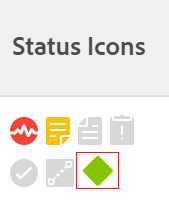

# 將里程碑與任務建立關聯

<!--Audited: 01/2024-->

您可以將里程碑與任務建立關聯，以指出您在專案存留期中何時達到重要步驟。

## 存取需求

+++ 展開以檢視本文中功能的存取需求。

<table style="table-layout:auto"> 
 <col> 
 <col> 
 <tbody> 
  <tr> 
   <td role="rowheader">Adobe Workfront計畫*</td> 
   <td> 
任何
 </td> 
  </tr> 
  <tr> 
   <td role="rowheader">Adobe Workfront授權*</td> 
   <td> 
新授權： Standard
 
   
目前授權：工作或以上
 
   </td> 
  </tr> 
  <tr> 
   <td role="rowheader">存取層級設定*</td> 
   <td> 
編輯任務的存取權
 
<b>附註</b>

如果您沒有存取權，請洽詢Workfront管理員，瞭解他們是否在您的存取層級設定其他限制。 如需Workfront管理員如何修改存取層級的詳細資訊，請參閱<a href="../../../administration-and-setup/add-users/configure-and-grant-access/create-modify-access-levels.md" class="MCXref xref">建立或修改自訂存取層級</a>。
 </td>
</tr> 
  <tr> 
   <td role="rowheader">物件許可權</td> 
   <td> 
管理任務的許可權
 
如需請求其他存取權的資訊，請參閱<a href="../../../workfront-basics/grant-and-request-access-to-objects/request-access.md" class="MCXref xref">請求物件</a>的存取權。
 </td> 
  </tr> 
 </tbody> 
</table>

若要瞭解您擁有的計畫、授權型別或存取權，請聯絡您的Workfront管理員。

+++

## 先決條件

在您將里程碑與任務關聯之前，必須存在下列專案：

* Workfront管理員必須建立里程碑路徑，如[建立里程碑路徑](../../../administration-and-setup/customize-workfront/configure-approval-milestone-processes/create-milestone-path.md)中所述。

* 您必須將里程碑路徑關聯至專案。

  如需詳細資訊，請參閱[編輯專案](/help/quicksilver/manage-work/projects/manage-projects/edit-projects.md)。

* 若要將里程碑路徑與專案產生關聯，專案必須處於「計畫」或「目前」狀態。

  >[!TIP]
  >
  >若要使用「里程碑」檢視取得專案中里程碑進度的最佳總覽，您應該建立父系任務，並將其與專案的每個主要階段建立關聯。 然後，將這些父系任務與里程碑路徑的每個里程碑相關聯。

## 將里程碑與任務相關聯

里程碑路徑與專案相關聯後，任務可指派為里程碑。

1. 前往工作，然後按一下工作名稱右側的&#x200B;**更多**&#x200B;圖示，然後&#x200B;**編輯**。

   任務和里程碑之間有1:1的關係。 您無法將相同的里程碑附加到多個任務。 每個任務都可以連結至單一里程碑，或者每個里程碑都可以對應至一個任務。

1. 按一下&#x200B;**設定**，然後在&#x200B;**里程碑**&#x200B;欄位中為任務選取里程碑。
1. 按一下「**儲存**」。
1. （選擇性）在工作清單中，新增&#x200B;**狀態圖示**&#x200B;欄，以識別哪些工作具有里程碑。 里程碑菱形指示器會顯示在「狀態圖示」欄中。

   如需詳細資訊，請參閱[在Adobe Workfront中建立或編輯檢視](/help/quicksilver/reports-and-dashboards/reports/reporting-elements/create-edit-views.md)。

   

1. （選擇性）前往專案清單，選取&#x200B;**里程碑**&#x200B;檢視以識別里程碑任務的進度。

   
