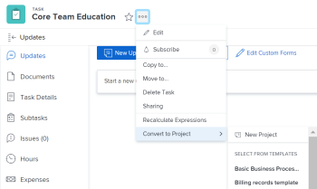

# 將任務轉換為項目

如果項目中的任務需要花費比最初計畫更多的精力才能完成，則可以將其轉換為項目。

## 存取需求

您必須具備下列存取權，才能執行本文中的步驟：

<table style="table-layout:auto"> 
 <col> 
 <col> 
 <tbody> 
  <tr> 
   <td role="rowheader">Adobe Workfront計畫*</td> 
   <td> 
任何
 </td> 
  </tr> 
  <tr> 
   <td role="rowheader">Adobe Workfront授權*</td> 
   <td> 
計劃 
 </td> 
  </tr> 
  <tr> 
   <td role="rowheader">訪問級別配置*</td> 
   <td> 
編輯對任務和項目的訪問
 
使用範本轉換為專案時，檢視或更高存取範本的權限
 
注意：如果您仍無權存取，請洽詢您的Workfront管理員，他們是否在您的存取層級設定其他限制。 如需Workfront管理員如何修改您的存取層級的詳細資訊，請參閱 <a href="../../../administration-and-setup/add-users/configure-and-grant-access/create-modify-access-levels.md" class="MCXref xref">建立或修改自訂存取層級</a>.
 </td> 
  </tr> 
  <tr> 
   <td role="rowheader">物件權限</td> 
   <td> 
管理任務的權限
 
使用範本轉換為專案時，檢視範本的權限
 
建立專案後，您擁有專案的「管理」權限
 
有關請求其他訪問的資訊，請參閱 <a href="../../../workfront-basics/grant-and-request-access-to-objects/request-access.md" class="MCXref xref">請求對對象的訪問 </a>.
 </td> 
  </tr> 
 </tbody> 
</table>

&#42;若要了解您擁有的計畫、授權類型或存取權，請聯絡您的Workfront管理員。

## 將任務轉換為專案的考量事項

* 將刪除原始任務。
* 任務批准被刪除。
* 所有子任務、問題和注釋都統計到新項目。
* 檔案、檔案版本和校樣會移至新專案。
* 會保留所有子任務和問題的狀態和完成百分比。
* 任務的共用使用者在專案上成為共用使用者。
* 項目開始日期設定為任務的開始日期。
* 如果任務狀態為「新」，則項目狀態將設定為「計畫」。
* 如果任務狀態為「正在進行」，則項目狀態將設定為「當前」。
* 如果任務狀態為「完成」，則項目狀態將設定為「完成」。

## 將任務轉換為項目

1. 轉至要轉換為項目的任務。
1. 按一下 **更多** 圖示 ，然後 **轉換為專案**.
1. 選擇下列任一選項：

   * **新專案**
   * 中的範本 **從模板中選擇** 節

      

1. 按一下 **繼續** 在顯示的通知上。
1. 在 **轉換為專案** 框中，指定以下內容：

   * **名稱**:為專案命名。 預設名稱是任務的名稱。
   * （可選） **說明**:說明此專案的用途。
   * （可選和條件性）如果您已選取從範本建立專案，請更新 **轉換為專案** 對話框。

      如需編輯專案欄位的詳細資訊，請參閱 [編輯專案](../../../manage-work/projects/manage-projects/edit-projects.md).

      >[!TIP]
      >
      >要更新「轉換為項目」框中「財務」部分中的欄位，您必須在訪問級別具有「編輯」訪問權。 如果您在訪問級別中擁有查看財務資料的訪問權限，則模板中的所有財務資訊都會傳輸到新項目，並且在轉換問題時無法編輯它。 如需詳細資訊，請參閱 [授予金融資料的存取權](../../../administration-and-setup/add-users/configure-and-grant-access/grant-access-financial.md) 和 [共用範本](../../../workfront-basics/grant-and-request-access-to-objects/share-a-template.md).

   * （可選）新增 **自訂Forms** 新專案。

      >[!TIP]
      如果為任務和項目配置了附加到任務的多對象自定義表單，則轉換時將保留表單中保存的所有資訊。
      如果使用模板進行轉換，並且附加到模板的自定義表單包含一個自定義欄位，該自定義欄位也位於附加到任務的自定義表單中，則任務中的欄位值將用於新項目。 不過，如果任務上的自訂欄位為空白，則會使用範本的值。

1. 按一下 **儲存變更**.
