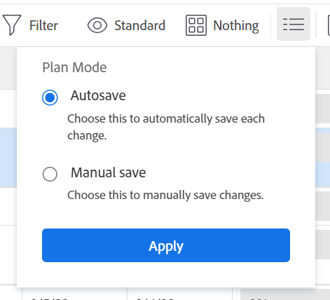

# 複製和複製任務

您可以將一個專案中的任務複製到另一個專案，也可以複製同一專案中的任務。

您可以一次複製或複製一或多個任務或父系任務。

## 存取需求

<!-- drafted for P&P:

<table style="table-layout:auto"> 
 <col> 
 <col> 
 <tbody> 
  <tr> 
   <td role="rowheader">Adobe Workfront plan*</td> 
   <td> 
Any 
 </td> 
  </tr> 
  <tr> 
   <td role="rowheader">Adobe Workfront license*</td> 
   <td> 
Current license: Standard
 
   Or
   
Legacy license: Work or higher 
 </td> 
  </tr> 
  <tr> 
   <td role="rowheader">Access level configurations*</td> 
   <td> 
Edit access to Tasks and Projects
 
<b>NOTE</b>
   
   If you still don't have access, ask your Workfront administrator if they set additional restrictions in your access level. For information on how a Workfront administrator can modify your access level, see <a href="../../../administration-and-setup/add-users/configure-and-grant-access/create-modify-access-levels.md" class="MCXref xref">Create or modify custom access levels</a>.
 </td> 
  </tr> 
  <tr> 
   <td role="rowheader">Object permissions</td> 
   <td> 
Manage permissions to a task
 
Contribute or higher permissions to the project
 
   
For information on requesting additional access, see <a href="../../../workfront-basics/grant-and-request-access-to-objects/request-access.md" class="MCXref xref">Request access to objects </a>.
 </td> 
  </tr> 
 </tbody> 
</table>
-->

您必須具有下列存取權才能執行本文中的步驟：

<table style="table-layout:auto"> 
 <col> 
 <col> 
 <tbody> 
  <tr> 
   <td role="rowheader">Adobe Workfront計畫*</td> 
   <td> 
任何
 </td> 
  </tr> 
  <tr> 
   <td role="rowheader">Adobe Workfront授權*</td> 
   <td> 
工作或更高 
 </td> 
  </tr> 
  <tr> 
   <td role="rowheader">存取層級設定*</td> 
   <td> 
編輯任務與專案的存取權
 
<b>附註</b>

如果您還是沒有存取權，請詢問您的Workfront管理員，他們是否在您的存取層級中設定其他限制。 如需Workfront管理員如何修改存取層級的詳細資訊，請參閱<a href="../../../administration-and-setup/add-users/configure-and-grant-access/create-modify-access-levels.md" class="MCXref xref">建立或修改自訂存取層級</a>。
 </td>
</tr> 
  <tr> 
   <td role="rowheader">物件許可權</td> 
   <td> 
管理任務的許可權 
 
Contribute或更高的專案許可權
 
如需請求其他存取權的資訊，請參閱<a href="../../../workfront-basics/grant-and-request-access-to-objects/request-access.md" class="MCXref xref">請求物件</a>的存取權。
 </td> 
  </tr> 
 </tbody> 
</table>

&#42;若要瞭解您擁有的計畫、授權型別或存取權，請連絡您的Workfront管理員。

## 複製任務的考量事項

複製任務時，請考量下列事項：

* 將任務從一個專案複製到另一個專案時，可能會重新計算任務日期。 重新計算將考慮新專案使用的排程和專案的「排程起始日期」資訊。
* 自訂表單會與任務一起複製。 只有在複製任務時您選擇複製自訂資料時，自訂欄位中的資訊才會傳輸到複製的任務。
* 在復製程式進行期間，您可以選取將某些與工作相關的專案複製到複製的工作。 但是，依預設，下列物件不會轉移到複製的任務：
   * 問題
   * 記錄時數
   * 使用者註解<!--not sure about this, enable only if requested by users and verified by Product: System activity comments transfer to the new task if they relate to information that you specifically select to be copied. For example, if you select to copy Expenses to the new task, system comments that identify adding expenses to the task will transfer to the copied task. -->
* 依預設，下列專案會移至複製的工作：

   * 里程碑會傳輸到複製的任務並從原始任務中移除。
   * 子任務會轉移至新任務。

* 您可以一次複製一個任務，也可以在編輯清單中的任務時一次複製多個任務。

## 複製清單中的任務 {#copy-tasks-in-a-list}

1. 移至包含您要複製之一或多個任務的專案。

   或

   前往任務報告。

1. （視條件而定）如果您開啟包含任務的專案，請按一下左側面板中的&#x200B;**任務**。
1. 按一下&#x200B;**計畫模式**&#x200B;圖示，並確認已啟用&#x200B;**自動儲存**&#x200B;選項。

   

   >[!IMPORTANT]
   >
   >只有在自動儲存變更時，您才能複製清單中的任務。 如需有關編輯任務時儲存選項的資訊，請參閱[在清單中編輯任務](../../../manage-work/tasks/manage-tasks/edit-tasks-in-a-list.md)。

1. 選取要複製的一個或多個任務，然後執行下列任一項作業：

   * 按一下工作清單頂端的&#x200B;**更多功能表**，然後按一下&#x200B;**複製到**。
   * 以滑鼠右鍵按一下選取的工作，然後按一下&#x200B;**複製到**。
   * 選取一個任務時，按一下清單中任務名稱旁的&#x200B;**更多**&#x200B;功能表，然後按一下&#x200B;**複製到**。

   

1. 繼續複製工作，如從步驟4開始的[複製工作層級](#copy-a-task-at-the-task-level)的工作一節中所述。

   <!--
      (NOTE: is this still accurate?!)
   -->

## 在任務層級複製任務 {#copy-a-task-at-the-task-level}

除了複製工作清單中的工作之外，您也可以在開啟工作後複製工作。

1. 透過搜尋來尋找Workfront系統中的任務。
1. 按一下工作名稱以開啟。
1. 按一下工作名稱旁的&#x200B;**更多**&#x200B;下拉式功能表，然後按一下&#x200B;**複製到**。

   

   「複製工作」方塊隨即顯示。

1. （選用）更新&#x200B;**工作名稱**。

   >[!TIP]
   >
   >選擇複製清單中的多個任務時，此欄位會變暗且無法編輯。 您可以將滑鼠游標停留在「任務名稱」欄位上，所有選取的任務清單隨即顯示。
   >
   >

1. 在&#x200B;**選取目的地專案**&#x200B;欄位中，輸入您要複製任務的&#x200B;**目的地專案**&#x200B;的名稱。

   >[!TIP]
   >
   >* 專案名稱區分大小寫。
   >* 您也可以開始輸入「參考編號」或輸入專案的ID。 這可能會協助您區分具有相同名稱的專案。
   >* 清單中只會顯示100個專案。

   依預設會顯示目前的專案名稱。 如果您想要複製相同專案中的任務，請保持此欄位不變。

1. （視條件而定）如果您沒有選取專案的存取權，請按一下&#x200B;**要求存取權**&#x200B;以要求存取專案。
1. （視條件而定）如果您有權將任務新增至目標專案上的任務之一，請繼續將任務複製到所選的目標專案，而不要求存取權。

   

   >[!TIP]
   >
   >如果Workfront管理員防止將任務新增到這些專案時，選取的專案處於未決核准、已完成或廢棄狀態，則會顯示類似訊息。 如需詳細資訊，請參閱[設定全系統的專案偏好設定](../../../administration-and-setup/set-up-workfront/configure-system-defaults/set-project-preferences.md)。

1. 按一下左側面板中的&#x200B;**選項**，然後取消選取您不想要與工作一起複製的工作屬性。 依預設會選取所有選項。

   >[!TIP]
   >
   >選取，然後取消選取&#x200B;**全選**，取消選取所有選項。

   取消選取下列選項，不將它們轉移到複製的工作。 下表說明取消選取選項時會發生什麼情況：

   <table style="table-layout:auto"> 
    <col> 
    <col> 
    <tbody> 
     <tr> 
      <td role="rowheader">約束</td> 
      <td> 
任務限制會根據專案排程模式設定為儘可能早或儘可能遲。
 
 選取後，任務的目前限制會移轉至複製的任務。 
 
備註：將具有日期特定限制的任務移轉或複製到其他專案時，如果任務的限制日期在新專案日期之外，則「任務限制」會變更為「儘可能早」或「儘可能晚」，或調整專案的「計劃開始日期」或「計畫完成日期」。 某些日期特定限制的範例為必須開始於、必須完成於、開始不得早於、開始不得晚於等。 如需有關任務限制以及任務限制或專案日期如何受到影響的資訊，請參閱<a href="../../../manage-work/tasks/task-constraints/task-constraint-overview.md" class="MCXref xref">任務限制總覽</a>並尋找特定限制。
 </td> 
     </tr> 
     <tr> 
      <td role="rowheader">指派</td> 
      <td> 
所有指派都將從任務中移除。 
 </td> 
     </tr> 
     <tr> 
      <td role="rowheader">核准流程</td> 
      <td>所有核准流程都會從任務中移除。</td> 
     </tr> 
     <tr> 
      <td role="rowheader">進度</td> 
      <td>任務狀態為「新增」。 否則，複製的任務會保留現有任務的狀態。</td> 
     </tr> 
     <tr> 
      <td role="rowheader">財務資訊</td> 
      <td>工作的財務資訊即被移除。</td> 
     </tr> 
     <tr> 
      <td role="rowheader">所有前置任務</td> 
      <td> 
這表示相依性不會延續到複製的任務。 
 
選取時，會保留複製任務群組內的前置任務，而刪除其他前置任務。
 </td> 
     </tr> 
     <tr> 
      <td role="rowheader">文件</td> 
      <td> 
附加到任務的檔案不會轉移到複製的任務。 這包括版本、校樣和連結檔案。
 
這不包括檔案核准。 在複製任務時永遠不能複製檔案核准。
 </td> 
     </tr> 
     <tr> 
      <td role="rowheader">提醒通知</td> 
      <td>任務提醒不會轉移到複製的任務。 </td> 
     </tr> 
     <tr> 
      <td role="rowheader">費用</td> 
      <td>登入任務的費用不會轉移到複製的任務。 </td> 
     </tr> 
     <tr> 
      <td role="rowheader">權限</td> 
      <td>Workfront會移除顯示在任務之「共用」清單中的所有實體名稱。 </td> 
     </tr> 
     <tr> 
      <td role="rowheader">自訂資料</td> 
      <td> 
自訂欄位的值會被清除，且自訂表單會傳輸到複製的任務。 
 
選取後，自訂欄位的表單和值都會轉移至複製的任務。 
 </td> 
     </tr> 
    </tbody> 
   </table>

1. （選擇性）按一下左側面板中的&#x200B;**選取父系**，然後在目的地專案中選取您想要成為所複製任務之父系的任務。

   >[!TIP]
   >
   >選取複製清單中的多個任務時，所有選取的任務都會成為選取父級的子項。

   執行下列任一項作業來選取父系：

   * 在任務清單中，選取專案計畫中的父項之一。
   * 按一下搜尋圖示並按名稱搜尋父系任務。

   任務會顯示在清單中。

   

1. 找到父項後，選取該父項的圓鈕。

   如果您未選取父系任務，任務會作為主要任務而非子任務複製，並放置在目標專案上任務清單的末尾。

1. 按一下&#x200B;**複製任務**

   或

   當您在清單中選取多個任務時，請按一下&#x200B;**複製任務**。
複製的任務現在位於指定的專案上，且為所選父系任務的子任務，或專案上的最後一個任務。

## 複製任務

如果您在相同專案上需要相同的任務，可以快速複製任務清單中的任務。

* [複製任務的考量事項](#considerations-for-duplicating-tasks)
* [複製任務](#duplicate-tasks)

### 複製任務的注意事項 {#considerations-for-duplicating-tasks}

* 只有當清單按任務編號排序時，您才能複製任務清單中的任務。
* 新任務將與原始任務同名。
* 您無法選取哪些資訊會複製到新任務。 根據預設，幾乎所有來自原始任務的資訊都會轉移到複製任務，包括父項關係。
* 下列專案未轉移到新任務：

   * 記錄時數
   * 附註
   * 問題
   * 只有同一組複製任務中的前置任務會與其後續任務一起複製。

     **範例**

     例如，如果您同時複製任務2及其前置任務任務1，則會有任務2的副本和任務1的副本。 任務1的副本將是任務2的副本的前置任務。 但如果您只複製任務2而沒有複製其前置任務，則其副本將沒有前置任務。

* 當您複製父任務時，即使未選取子任務，也會複製所有子任務。
* 您可以同時複製一或多個工作。

  不過，您無法同時複製多個非循序的工作。

* 里程碑會移至新任務並從原始任務中移除。

### 複製任務

1. 移至包含您要複製之一或多個任務的專案。
1. 按一下左側面板中的&#x200B;**工作**。
1. 執行下列其中一項：

   * （視條件而定）按一下&#x200B;**計畫模式**&#x200B;圖示並確認已啟用&#x200B;**自動儲存**&#x200B;選項，選取您要複製的工作，然後按一下&#x200B;**其他功能表**  > **複製**。

     

   * （視條件而定）按一下&#x200B;**計畫模式**&#x200B;圖示 > **手動儲存** > **標準**&#x200B;或&#x200B;**時間表計畫**，然後執行下列動作：

      1. 選取要複製的一個或多個任務，然後按一下[複製]。**&#x200B;**
      1. （選擇性）按一下&#x200B;**還原**&#x200B;以迴轉您的變更，並且不複製工作。
      1. （選擇性和條件性）如果您先前已按一下&#x200B;**復原**，請按一下&#x200B;**重做**&#x200B;以保留變更並複製工作。

      1. 按一下[儲存]儲存變更。**&#x200B;**

         任務會重複，並新增到與原始任務相同的專案。
