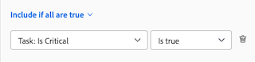

# 專案關鍵路徑概觀

<!-- Audited: 5/2025 -->

決定專案的關鍵路徑是Adobe Workfront標籤專案中可能影響專案時間表的一系列任務時的自動方式。 可能會影響專案時間表的任務會標示為「關鍵路徑」任務。

下列功能可能會影響專案的關鍵路徑：

* 專案的工作分解結構。

  如需詳細資訊，請參閱[決定專案中的工作分解結構](../../../manage-work/projects/planning-a-project/determine-project-work-breakdown-structure.md)。

* 完成每項工作所需的時間（持續時間）。
* 工作之間的相依性。

  請考量下列事項：

   * 當「關鍵路徑」上的任務具有前置任務關係時，如果前置任務或後置任務日期上的變更直接影響其相依性，則其前置任務或後置任務也會在「關鍵路徑」上。

     >[!TIP]
     >
     >當任務的後續任務日期未直接影響其相依任務的日期或專案日期時，後續任務不會在「關鍵路徑」上。
     >
     >
     >     >
     >

   * 當將子任務識別為「關鍵路徑」任務時，如果「預計開始日期」和父任務的時間與子任務的時間相同，則父任務也會識別為「關鍵路徑」任務。

考慮到這些功能，系統會使用最早任務與決定專案結束的任務之間的最長路徑，來計算「關鍵路徑」。 「關鍵路徑計算」會考量每個任務可以開始和完成的最早和最晚時間，而不需要延長專案。 此程式會判斷哪些任務為「關鍵」（且屬於最長路徑），以及哪些任務具有「總浮動」（可以延遲，而不會造成專案時間更長）。

關鍵路徑上任務活動的任何延遲會直接影響專案的預計完成日期（關鍵路徑上沒有浮點）。

## 存取需求

+++ 展開以檢視本文中功能的存取需求。

<table style="table-layout:auto"> 
 <col> 
 <col> 
 <tbody> 
  <tr> 
   <td role="rowheader">Adobe Workfront套件</td> 
   <td> 
任何
 </td> 
  </tr> 
  <tr> 
   <td role="rowheader">Adobe Workfront授權</td> 
   <td> 
   
標準

   
工作或更高

    </td> 
  </tr> 
  <tr> 
   <td role="rowheader">存取層級設定</td> 
   <td> 
檢視或更高的任務存取權
</td> 
  </tr> 
  <tr> 
   <td role="rowheader">物件許可權</td> 
   <td> 
檢視任務或更高的許可權 
</td> 
  </tr> 
 </tbody> 
</table>

如需詳細資訊，請參閱Workfront檔案中的[存取需求](/help/quicksilver/administration-and-setup/add-users/access-levels-and-object-permissions/access-level-requirements-in-documentation.md)。

+++

<!--Old:

<table style="table-layout:auto"> 
 <col> 
 <col> 
 <tbody> 
  <tr> 
   <td role="rowheader">Adobe Workfront plan</td> 
   <td> 
Any
 </td> 
  </tr> 
  <tr> 
   <td role="rowheader">Adobe Workfront license</td> 
   <td> 
   
New: Standard

   
Or

   
Current: Work or higher

    </td> 
  </tr> 
  <tr> 
   <td role="rowheader">Access level configurations</td> 
   <td> 
View or higher access to Tasks
 
Note: If you still don't have access, ask your Workfront administrator if they set additional restrictions in your access level. For information on how a Workfront administrator can modify your access level, see <a href="../../../administration-and-setup/add-users/configure-and-grant-access/create-modify-access-levels.md" class="MCXref xref">Create or modify custom access levels</a>.
 </td> 
  </tr> 
  <tr> 
   <td role="rowheader">Object permissions</td> 
   <td> 
View or higher permissions on a task 
 
For information on requesting additional access, see <a href="../../../workfront-basics/grant-and-request-access-to-objects/request-access.md" class="MCXref xref">Request access to objects </a>.
 </td> 
  </tr> 
 </tbody> 
</table>-->

## 檢視關鍵路徑

您可以在Workfront應用程式的下列區域中檢視屬於關鍵路徑的任務：

* [檢視甘特圖中的關鍵路徑](#view-the-critical-path-in-the-gantt-chart)
* [檢視工作清單或報告中的關鍵路徑](#view-the-critical-path-in-a-task-list-or-report)

### 在甘特圖中檢視關鍵路徑 {#view-the-critical-path-in-the-gantt-chart}

若要在甘特圖檢視關鍵路徑上的工作：

{{step1-to-projects}}

1. 在專案清單中，選取專案。

1. 在左側面板中，按一下&#x200B;**工作**。 **任務**&#x200B;索引標籤開啟。

1. 在工作清單的右上角，按一下&#x200B;**甘特圖**&#x200B;圖示。

   

1. 在甘特圖區段的右上角，按一下&#x200B;**選項**&#x200B;圖示，然後在出現的下拉式清單中選取&#x200B;**關鍵路徑**&#x200B;選項。 現在，關鍵路徑上的任務在時間表上方會有一條紅線。

   

### 檢視工作清單或報告中的關鍵路徑 {#view-the-critical-path-in-a-task-list-or-report}

若要檢視任務清單中關鍵路徑上的任務，請執行下列動作：

{{step1-to-projects}}

1. 在專案清單中，選取專案。

1. 在左側面板中，按一下&#x200B;**工作**。 **任務**&#x200B;索引標籤開啟。

1. 按一下&#x200B;**檢視**&#x200B;圖示，然後選取&#x200B;**狀態**。 關鍵路徑上的工作會在清單的&#x200B;**旗標**&#x200B;欄中顯示一個&#x200B;**關鍵路徑**&#x200B;旗標。

   或

   按一下&#x200B;**篩選器**&#x200B;圖示，然後選取&#x200B;**+新篩選器**。
1. 在第一個欄位中，輸入&#x200B;*Is Critical*，然後當它出現在清單的&#x200B;**任務**&#x200B;區段下時選取它。

   

1. 確定已在第二個下拉式功能表中選取&#x200B;**Is true**。

   

1. 關閉篩選器面板。 任務清單現在只會顯示關鍵路徑上的任務。
