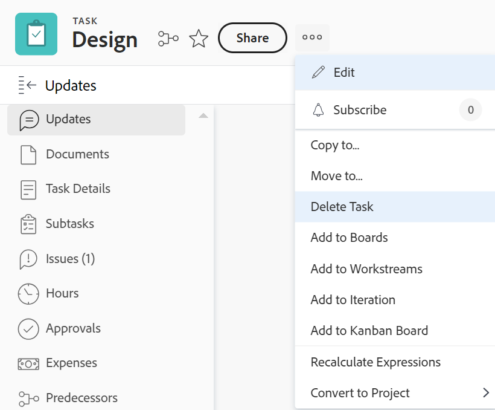

# 刪除任務

您可以刪除重複或建立有誤的任務。

對於具有歷史資訊（更新、排程變更、狀態或其他欄位）的任務，我們建議您將其關閉或標籤為廢棄，而不是刪除它們。 這可協助您保留專案的歷史資訊。

## 存取需求

您必須具有下列存取權才能執行本文中的步驟：

<table style="table-layout:auto"> 
 <col> 
 <col> 
 <tbody> 
  <tr> 
   <td role="rowheader">Adobe Workfront計畫*</td> 
   <td> 
任何
 </td> 
  </tr> 
  <tr> 
   <td role="rowheader">Adobe Workfront授權*</td> 
   <td> 
工作或以上
 </td> 
  </tr> 
  <tr> 
   <td role="rowheader">存取層級設定*</td> 
   <td> 
編輯對具有刪除存取權的任務和專案的存取權
 
注意：如果您仍然沒有存取權，請詢問您的Workfront管理員是否對您的存取層級設定了其他限制。 如需存取工作的相關資訊，請參閱 <a href="../../../administration-and-setup/add-users/configure-and-grant-access/grant-access-tasks.md" class="MCXref xref">授與任務的存取權</a>. 如需Workfront管理員如何變更存取層級的詳細資訊，請參閱 <a href="../../../administration-and-setup/add-users/configure-and-grant-access/create-modify-access-levels.md" class="MCXref xref">建立或修改自訂存取層級</a>. 
 </td> 
  </tr> 
  <tr> 
   <td role="rowheader">物件許可權</td> 
   <td> 
為專案貢獻許可權，並可新增任務或以上版本
 
當您建立任務時，您會自動收到該任務的「管理」許可權
 
 如需工作許可權的相關資訊，請參閱 <a href="../../../workfront-basics/grant-and-request-access-to-objects/share-a-task.md" class="MCXref xref">共用任務 </a>. 
 
如需請求其他許可權的相關資訊，請參閱 <a href="../../../workfront-basics/grant-and-request-access-to-objects/request-access.md" class="MCXref xref">要求物件的存取權 </a>.
 </td> 
  </tr> 
 </tbody> 
</table>

&#42;若要瞭解您擁有的計畫、授權型別或存取權，請聯絡您的Workfront管理員。

## 瞭解刪除任務的程式

* [刪除任務的限制](#limitations-for-deleting-tasks)
* [刪除任務的影響](#the-impact-of-deleting-tasks)

### 刪除任務的限制  {#limitations-for-deleting-tasks}

* 當專案狀態為「完成」時，只有當Workfront管理員或群組管理員在您的「專案偏好設定」區域中允許時，您才能刪除任務。 如需有關設定專案偏好設定的資訊，請參閱 [設定系統範圍的專案偏好設定](../../../administration-and-setup/set-up-workfront/configure-system-defaults/set-project-preferences.md).

* 如果任務已記錄時數，Workfront或群組管理員必須透過在您的Workfront執行個體中設定任務和問題偏好設定來允許刪除這些任務。 當您嘗試刪除擁有已記錄時數任務的專案時，這也適用。

  <!--
  (NOTE: the last statement is NWE&nbsp;only; not possible in classic)
  -->

  如需啟用刪除記錄時數之任務的詳細資訊，請參閱以下的「刪除」一節： [設定系統範圍的任務和問題偏好設定](../../../administration-and-setup/set-up-workfront/configure-system-defaults/set-task-issue-preferences.md).

### 刪除任務的影響 {#the-impact-of-deleting-tasks}

刪除任務時，會影響連結至該任務的其他物件。

當您刪除任務時，也會刪除附加至任務的下列物件：

* 文件

  您無法刪除具有已出庫檔案附加於其上的任務。 如需出庫檔案的詳細資訊，請參閱 [簽出檔案](../../../documents/managing-documents/check-out-documents.md).

* 問題
* 子任務
* 附註
* 核准

根據Workfront管理員如何在Workfront執行個體的時程表和小時偏好設定中設定專案、任務或問題刪除偏好設定，任務記錄的小時在刪除任務時以下列方式之一處理：

* 移至專案，如果稍後還原任務，則不會在任務上還原。
* 被刪除，如果稍後還原任務，則會在任務上還原。

  當您嘗試刪除擁有已記錄時數任務的專案時，這也適用。

  <!--
  <MadCap:conditionalText data-mc-conditions="QuicksilverOrClassic.Draft mode">
  (NOTE: this stays NWE; not possible in classic;)
  </MadCap:conditionalText>
  -->

  如需針對登入問題時數設定刪除偏好設定的詳細資訊，請參閱 [設定時程表和小時偏好設定](../../../administration-and-setup/set-up-workfront/configure-timesheets-schedules/timesheet-and-hour-preferences.md).

* 任務上的費用將移至專案。

* 指派給任務或任務核准的使用者仍保留在專案團隊中。

  如需專案團隊的詳細資訊，請參閱 [專案團隊概觀](../../../manage-work/projects/planning-a-project/project-team-overview.md).

## 刪除任務

* [同時刪除專案中的多個任務](#delete-multiple-tasks-in-a-project-simultaneously)
* [刪除單一任務](#delete-a-single-task)

### 同時刪除專案中的多個任務  {#delete-multiple-tasks-in-a-project-simultaneously}

1. 按一下 **主要功能表** 圖示  Adobe Workfront右上角。

1. 按一下 **專案**.
1. 按一下包含您要刪除之任務的專案名稱。
1. 按一下 **任務** 在左側面板中。
1. 執行下列任一項作業：

   1. （有條件）當 **自動儲存** 切換已啟用：

      1. 選取您要刪除的任務，然後按一下 **更多**
      1. 按一下 **刪除**，則 **是的，刪除** 以確認刪除。

         任務已刪除。

   1. （視條件而定）按一下 **計畫模式** 圖示並選取 **手動儲存** 如果要反轉對工作清單所做的變更。

      

      執行下列動作：

      1. 選取您要刪除的任務。
      1. 按一下 **刪除**.
      1. （可選）按一下 **還原** 以反轉變更而不刪除任務。
      1. 按一下 **取消復原** 如果要保留變更並刪除任務。
      1. 按一下 **儲存** 刪除任務。

         只有在您儲存變更後，才會刪除任務。

### 刪除單一任務 {#delete-a-single-task}

1. 按一下 **主要功能表** 圖示  Adobe Workfront右上角。

1. 按一下 **專案**.
1. 按一下包含您要刪除之任務的專案名稱。
1. 按一下 **任務** 在左側面板中。
1. 按一下您要刪除之工作的名稱。
1. 按一下 **更多** 圖示 右上角。

   

1. 按一下 **刪除任務**.
1. 如果允許刪除，請按一下 **是的，刪除**.

   您的Workfront管理員或群組管理員可能不允許刪除記錄時數的任務。

   如需刪除任務所需存取權和許可權的詳細資訊，請參閱區段 [刪除任務的限制](#limitations-for-deleting-tasks) 本文章內容。

## 還原已刪除的任務

Workfront或群組管理員可在任務刪除後30天內將其還原，如所述 [還原已刪除的專案](../../../administration-and-setup/manage-workfront/manage-deleted-items/restore-deleted-items.md).
