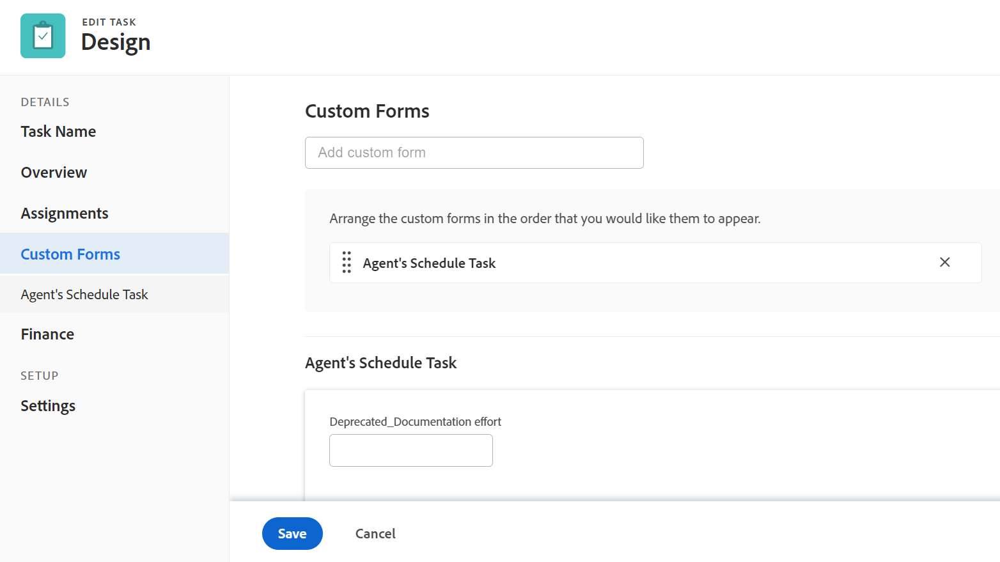

# 編輯任務

<!--Audited: 10/2025-->

<!--take out prod and preview references at release, or new and old experience-->

<!--

(NOTE: some information in this area is repeated in the following articles. If you need to update a field, update it in both:

** Task finances in details

** Task information in overview)

-->

本頁醒目提示的資訊指出尚未普遍可用的功能。 它僅在預覽環境中可供所有客戶使用。 從預覽版開始的一週起，生產環境中也將提供相同功能給所有客戶。

如需詳細資訊，請參閱[介面現代化](/help/quicksilver/product-announcements/product-releases/interface-modernization/interface-modernization.md)。

您可以編輯已建立或您擁有Contribute或「管理」許可權之工作的相關資訊。

## 存取需求

+++ 展開以檢視本文中功能的存取需求。 

<table style="table-layout:auto"> 
 <col> 
 <col> 
 <tbody> 
  <tr> 
   <td role="rowheader">Adobe Workfront套件</td> 
   <td> 
任何
 </td> 
  </tr> 
  <tr> 
   <td role="rowheader">Adobe Workfront授權</td> 
   <td> 
標準

   
工作或更高
 </td> 
  </tr> 
  <tr> 
   <td role="rowheader">存取層級</td> 
   <td> 
編輯任務與專案的存取權
 </td> 
  </tr> 
  <tr> 
   <td role="rowheader">物件許可權</td> 
   <td> 
    <ul> 
     <li> 
貢獻許可權給任務，以編輯任務詳細資訊區域中的下列資訊： 

     <ul>
     <li>說明</li>
     <li>狀態</li>
     </ul>  
      </li> 
     <li> 
管理任務的許可權，以編輯詳細資訊區域和編輯任務方塊中的所有資訊
 </li> 
    </ul> 
    <ul> 
     <li> 
貢獻專案或更高的許可權
 </li> 
    </ul> </td> 
  </tr> 
 </tbody> 
</table>

*如需詳細資訊，請參閱Workfront檔案中的[存取需求](/help/quicksilver/administration-and-setup/add-users/access-levels-and-object-permissions/access-level-requirements-in-documentation.md)。

+++

<!--Old:

<table style="table-layout:auto"> 
 <col> 
 <col> 
 <tbody> 
  <tr> 
   <td role="rowheader">Adobe Workfront plan</td> 
   <td> 
Any 
 </td> 
  </tr> 
  <tr> 
   <td role="rowheader">Adobe Workfront license*</td> 
   <td> 
Standard

   
Work or higher
 </td> 
  </tr> 
  <tr> 
   <td role="rowheader">Access level</td> 
   <td> 
Edit access to Tasks and Projects
 </td> 
  </tr> 
  <tr> 
   <td role="rowheader">Object permissions</td> 
   <td> 
    <ul> 
     <li> 
Contribute permissions to a task to edit the following information in the Task Details area: 

     <ul>
     <li>Description</li>
     <li>Status</li>
     </ul>  
      </li> 
     <li> 
Manage permissions to a task to edit all the information in the Details area and the Edit Task box
 </li> 
    </ul> 
    <ul> 
     <li> 
Contribute or higher permissions to the project
 </li> 
    </ul> </td> 
  </tr> 
 </tbody> 
</table>-->

## 編輯任務的限制

有一些限制可能會阻止您編輯任務。

編輯任務時，請考量下列事項：

* 更新任務會觸發狀態為「目前」的專案通知。 為避免指派給任務的使用者感到困惑，請在專案處於「目前」狀態時，儘可能限制編輯任務。
* 您無法編輯核准流程中的任務。 您只能記錄時間或更新核准程式中任務的狀態。

  

* 只有當Workfront管理員或群組管理員在專案偏好設定區域中啟用此功能時，您才能編輯檔案，並將其新增到專案上狀態為「完成」、「廢棄」或「未決核准」的任務中。 如需有關設定專案偏好設定的資訊，請參閱[設定全系統的專案偏好設定](../../../administration-and-setup/set-up-workfront/configure-system-defaults/set-project-preferences.md)。

* 當專案被標籤為「完成」、「廢棄」或處於「核准程式」中時，您可以隨時編輯任務的下列資訊：

   * 記錄時間
   * 編輯現有費用
   * 附加自訂表單

* 其他使用者必須先重新整理頁面，才能檢視您對任務所做的更新。

## 編輯清單中的任務

您可以透過內聯編輯清單檢視中顯示的欄位，編輯任務清單中的任務資訊。

如需有關編輯清單中工作的資訊，請參閱[編輯清單中的工作](../../../manage-work/tasks/manage-tasks/edit-tasks-in-a-list.md)。

## 使用「摘要」編輯清單中的任務

您可以使用「摘要」面板編輯清單中的任務。 如需有關在「摘要」面板中編輯任務的資訊，請參閱[在清單中編輯任務](../../../manage-work/tasks/manage-tasks/edit-tasks-in-a-list.md)文章中的「編輯摘要中的任務」一節。

## 在「編輯任務」方塊中編輯任務

您可以使用「編輯任務」或「任務詳細資訊」區域編輯任務。 下列步驟說明如何在「編輯任務」方塊中編輯任務。

{{step1-click-main-menu}}

1. 按一下&#x200B;**專案**，然後按一下專案名稱以開啟。
1. 按一下左側面板中的&#x200B;**工作**。
1. 按一下您要編輯的工作。
1. （視條件而定）若要編輯任務的有限資訊，請按一下左側面板中的&#x200B;**任務詳細資料**。

   

   請考慮編輯「工作詳細資訊」段落中下列區域的資訊：

   * **概觀**

     此區域預設為展開。

   * **自訂表單**

     只有當物件附有自訂表單時，才會顯示自訂表單的名稱。

   * **財務**

   >[!NOTE]
   >
   >視您的Workfront管理員或群組管理員修改版面配置範本的方式而定，可能會重新排列或不顯示任務詳細資訊區域中的欄位。 如需詳細資訊，請參閱[使用配置範本自訂詳細資料檢視](../../../administration-and-setup/customize-workfront/use-layout-templates/customize-details-view-layout-template.md)。

   如需「任務詳細資訊」區段中可見欄位的相關資訊，請繼續編輯「編輯任務」方塊中的任務，如下所述。

   若要編輯「詳細資訊」段落中的資訊，請執行下列動作：

   1. （選擇性）按一下右上角的&#x200B;**全部收合**&#x200B;圖示以收合所有區域。
   1. （選擇性和條件性）當區域摺疊時，按一下每個區域旁的&#x200B;**向右箭頭** 以展開您要編輯的區域。
   1. 如需在「工作詳細資訊」標籤中編輯資訊的詳細資訊，請參閱下列文章：

      * [在任務詳細資訊總覽區域中管理任務資訊](../../../manage-work/tasks/manage-tasks/task-information-in-overview.md)
      * [在任務詳細資訊區段中管理任務財務](../../../manage-work/tasks/manage-tasks/task-finances-in-details.md)

   1. （選擇性）如果沒有自訂表單附加到工作，請在&#x200B;**新增自訂表單**&#x200B;欄位中開始輸入表單的名稱，然後在清單中顯示時選取它，然後按一下&#x200B;**儲存變更**。
   1. （選擇性）按一下&#x200B;**匯出**&#x200B;圖示，將概述和自訂表單資訊匯出至PDF檔案，然後按一下&#x200B;**匯出**。 從下列選項中選取：

      * 全選（至少附加一個自訂表單時顯示）
      * 概觀
      * 一或多個自訂表單的名稱

      PDF檔案會下載至您的電腦。

      

      如需詳細資訊，請參閱[匯出自訂表單和物件詳細資料](../../../workfront-basics/work-with-custom-forms/export-custom-forms-details.md)。

1. （視條件而定）若要編輯有關工作的所有資訊，請以具有工作管理許可權的使用者身分，按一下工作名稱旁的&#x200B;**更多**&#x200B;功能表，然後按一下&#x200B;**編輯**。

   或

   從工作清單中選取工作，然後按一下清單頂端的&#x200B;**編輯**&#x200B;圖示。

   「編輯任務」方塊開啟。

   >[!IMPORTANT]
   >
   >您必須擁有任務的管理許可權才能檢視編輯選項。

   所有工作列位都可在「編輯任務」方塊中使用，並按左側面板中列出的區域分組。

   >[!NOTE]
   >
   >視您的Workfront管理員或群組管理員修改版面配置範本的方式而定，可能會重新排列或不顯示任務詳細資訊區域中的欄位。 如需詳細資訊，請參閱[使用配置範本自訂詳細資料檢視](../../../administration-and-setup/customize-workfront/use-layout-templates/customize-details-view-layout-template.md)。

   請考慮在下列任何一節中指定資訊：

   * [任務名稱](#task-name)
   * [概觀](#overview)
   * [指派](#assignments)
   * [自訂表單](#Custom%C2%A0F)
   * [財務](#finance)
   * [設定](#settings)
   * [評論](#comment)

   >[!NOTE]
   >
   >視您的Workfront管理員或群組管理員設定版面配置範本的方式而定，編輯任務方塊中的欄位可能會重新排列或不顯示。 如需詳細資訊，請參閱[使用配置範本自訂詳細資料檢視](../../../administration-and-setup/customize-workfront/use-layout-templates/customize-details-view-layout-template.md)。

### 任務名稱 {#task-name}

1. 如上所述開始編輯您的工作。
1. 按一下左側面板中的&#x200B;**工作名稱**。

   

1. 更新工作的名稱。

1. 按一下&#x200B;**儲存**&#x200B;或繼續下列章節。

### 概觀 {#overview}

1. 如上所述開始編輯您的工作。
1. 按一下左側面板中的&#x200B;**概觀**。

   

1. 更新下列有關工作的資訊：

   <table style="table-layout:auto"> 
    <col> 
    <col> 
    <tbody> 
     <tr> 
      <td role="rowheader">說明</td> 
      <td>新增關於工作的其他資訊。 </td> 
     </tr> 
     <tr> 
      <td colspan="2" role="rowheader">基本資訊區段 </td> 
     </tr> 
     <tr> 
      <td role="rowheader">狀態</td> 
      <td> 
選取任務的狀態，指出任務處於哪個開發階段。
 
<b>秘訣</b>

   您可以在任務標題中更新任務狀態。 

   
您的Workfront或群組管理員可以自訂任務狀態的名稱。 如需詳細資訊，請參閱<a href="/help/quicksilver/administration-and-setup/customize-workfront/creating-custom-status-and-priority-labels/create-or-edit-a-status.md">建立或編輯狀態</a>。 
      </td> 
     </tr> 
     <tr> 
      <td role="rowheader">優先順序</td> 
      <td> 
這是視覺化標幟，可讓您排定工作的優先順序。 
 
從下列選項中選取： 
 
       <ul> 
      <li> 
 無
 </li> 
      <li> 
 低 
 </li> 
      <li> 
正常 
 </li> 
      <li> 
高 
 </li> 
      <li> 
 緊急 
 </li> 
       </ul> 
根據Workfront管理員選取的專案偏好設定，您的優先順序名稱可能會不同。 如需工作優先順序的相關資訊，請參閱<a href="../../../manage-work/tasks/task-information/task-priority.md" class="MCXref xref">更新工作優先順序</a>。 
 </td> 
     </tr> 
     <tr> 
      <td colspan="2" role="rowheader">任務日期和限制區段 </td> 
     </tr> 
     <tr> 
      <td role="rowheader">任務限制</td> 
      <td> 
透過指定工作限制來決定必須完成工作的時間。 
 
從下列選項中選取： 
 
       <ul> 
      <li> 
固定日期 
 
指定<strong>計劃開始</strong>和<strong>計畫完成日期</strong>。 
 </li> 
      <li> 
必須在開始 
 
指定<strong>計劃開始日期</strong>。 
 </li> 
      <li> 
必須在完成 
 
指定<strong>計畫完成日期</strong>。 
 </li> 
       </ul> 
       <ul> 
      <li> 
儘快
 </li> 
      <li> 
儘可能遲
 </li> 
      <li> 
最早可用時間
 </li> 
      <li> 
 最新可用時間
 </li> 
      <li> 
開始時間不晚於 
 </li> 
      <li> 
指定計劃開始日期
 </li> 
      <li> 
開始時間不早於 
 
指定<strong>計劃開始日期</strong>。 
 </li> 
      <li> 
 完成時間不晚於
 
指定<strong>計畫完成日期</strong>。 
 </li> 
      <li> 
 完成時間不早於
 
指定<strong>計畫完成日期</strong>
 </li> 
       </ul> 
如需任務限制的詳細資訊，請參閱<a href="../../../manage-work/tasks/task-constraints/task-constraint-overview.md" class="MCXref xref">任務限制總覽</a>。
 </td> 
     </tr> 
     <tr> 
      <td role="rowheader">認可日期和時間</td> 
      <td> 
這是指派給任務的使用者認可完成任務的日期。 這可能與計畫完成日期不同。 僅受指派人可以編輯此欄位。 如需Workfront中認可日期的相關資訊，請參閱<a href="../../../manage-work/projects/updating-work-in-a-project/overview-of-commit-dates.md" class="MCXref xref">認可日期總覽</a>。 
 </td> 
     </tr> 
     <tr> 
      <td role="rowheader">計劃開始日期和時間</td> 
      <td> 
任務計劃開始的時間。 任務的計劃開始日期已設定且受許多因素影響：
 
       <ul> 
      <li>根據系統內任務計劃開始日期的偏好設定，專案上新任務的開始日期可以是今天，或是預設的專案開始日期。 與專案相關之群組的群組管理員也可以為群組設定此喜好設定。如需系統層級或群組層級工作偏好設定的詳細資訊，請參閱<a href="../../../administration-and-setup/set-up-workfront/configure-system-defaults/set-task-issue-preferences.md" class="MCXref xref">設定系統範圍的工作和問題偏好設定</a>。</li> 
      <li>根據任務的前置任務，Workfront會選擇計劃開始日期作為前置任務完成後下一個可用日期，或開始日期（取決於前置任務關係）。 如需前置任務關係的詳細資訊，請參閱<a href="../../../manage-work/tasks/use-prdcssrs/predecessors-overview.md" class="MCXref xref">前置任務概觀</a>。</li> 
      <li>當任務限製為「固定日期」或「必須開始日期」時，專案經理或任務擁有者可以手動設定計劃開始日期。 如需有關任務限制的詳細資訊，請參閱<a href="../../../manage-work/tasks/task-constraints/task-constraint-overview.md" class="MCXref xref">任務限制總覽</a>。</li> 
       </ul> </td> 
     </tr> 
     <tr> 
      <td role="rowheader">計畫完成日期和時間</td> 
      <td> 
計畫的任務時顯示的預計完成日期。 Workfront會使用下列部分因素來設定計畫完成日期：
 
       <ul> 
      <li>從計劃開始日期通過將任務的期間新增到計劃開始日期來計算計畫完成日期。 當專案經理或Workfront指定任務的期間時，這會觸發計畫完成日期的更新。 如果計畫日期變更，通常是因為任務的期間已更新。</li> 
      <li>當任務限製為「固定日期」或「必須完成日期」時，專案經理或任務擁有者可以手動設定計畫完成日期。 如需有關任務限制的詳細資訊，請參閱<a href="../../../manage-work/tasks/task-constraints/task-constraint-overview.md" class="MCXref xref">任務限制總覽</a>。</li> 
      <li>如果任務的期間型別變更，並且任務上的資源數量同時變更，則計畫完成日期也會變更。 如需有關期間型別的詳細資訊，請參閱<a href="../../../manage-work/tasks/taskdurtn/task-duration-and-duration-type.md" class="MCXref xref">工作期間與期間型別概觀</a>。</li> 
       </ul> </td> 
     </tr> 
     <tr> 
      <td role="rowheader">實際開始日期和時間</td> 
      <td> 
指定作業的實際開始日期。 當您將任務的狀態變更為進行中時，通常會自動填入預設值。 專案經理或任務擁有者也可以手動修改實際開始日期。 
 </td> 
     </tr> 
     <tr> 
      <td role="rowheader">實際完成日期和時間</td> 
      <td> 
指定任務完成時的實際日期和時間。 任務完成的預設日期與時間一律與狀態變為「已完成」的實際時間一致。 專案經理或任務擁有者也可以手動修改實際完成日期。 
 </td> 
     </tr> 
     <tr> 
      <td role="rowheader"><b>「工作時間」區段</b></td> 
     </tr> 
     <tr> 
      <td role="rowheader">工作投入 </td> 
      <td>

   
完成任務所需的工時量。 您的專案經理可能會決定使用此欄位而不是計畫時數來預估完成任務所需的工作。 只有在符合下列條件時，才會顯示此欄位：
 
      <ul> 
      <li> 
任務具有簡單期間型別。 
 
<b>秘訣</b>

   如果您變更任務期間型別，此欄位會變暗。 
 </li>
   <li>您的專案經理已啟用使用工作量以自動計算專案上的任務計畫時數欄位。 </li> 
      </ul> 
      
從下列選項中選取：
 
      <ul> 
      <li>小</li> 
      <li>Medium （這是新任務的預設值）</li> 
      <li>大</li> 
      </ul> 
      
<b>附註</b>

   更新工作量可能會更新任務計畫時數。 如果專案的「更新型別」為「自動」，則立即進行更新。 當專案更新型別是手動時，您必須重新計算時間表以檢視更新的計畫時數。 

   
如需有關使用工作量而非計畫時數來估計任務投入的資訊，請參閱<a href="../../../manage-work/tasks/task-information/work-effort.md" class="MCXref xref">工作量概觀</a>。 
 
    </td> 
     </tr> 
    </tbody> 
   </table>

1. 按一下&#x200B;**儲存**&#x200B;或繼續下列章節。

### 指派 {#assignments}

1. 如上所述開始編輯您的工作。
1. 按一下左側面板中的&#x200B;**工作**。

   指派區域會在新體驗中開啟。

1. （視條件而定）使用新體驗，執行下列動作：

   1. 在&#x200B;**搜尋人員、角色或團隊**&#x200B;欄位中開始輸入使用者、工作角色或團隊的名稱，然後在他們顯示在清單中時選取他們

      或

      按一下&#x200B;**指派給我**&#x200B;以指派工作給您自己。

   1. 更新下列資訊：

      

      <table style="table-layout:auto"> 
         <col> 
         <col> 
         <tbody> 
         <tr> 
         <td role="rowheader">期間類型</td> 
         <td> 
這會識別下列專案之間的關係： 
 
         <ul> 
         <li> 
指派給任務的資源數 
 </li> 
         <li> 
完成任務所需的總工作量 
 </li> 
         <li> 
 任務的總持續時間。 
 </li> 
         </ul> 
您的Workfront管理員或群組管理員會為您的系統或群組中的任務選擇預設期間型別設定。 如需有關設定專案預設值的資訊，請參閱<a href="../../../administration-and-setup/set-up-workfront/configure-system-defaults/set-task-issue-preferences.md" class="MCXref xref">設定全系統的任務和問題偏好設定</a>。 
 
期間型別可讓您根據作業的需求設定一致的資源指定。 如需有關任務期間型別的詳細資訊，請參閱<a href="../../../manage-work/tasks/taskdurtn/task-duration-and-duration-type.md" class="MCXref xref">任務期間與期間型別概觀</a>。 
 
從下列選項中選取： 
 
         <ul> 
         <li> 
已計算的任務指派 
 </li> 
         <li> 
 已計算的工作 
 </li> 
         <li> 
投入比導向 
 </li> 
         <li> 
簡單
 </li> 
         </ul> </td> 
         </tr> 
         <td role="rowheader">各事件的持續時間</td> 
         <td> 
這僅顯示在遞回任務的父繫上。 它會顯示每個週期性任務的持續時間，如建立任務時定義。 如需有關建立週期性工作的資訊，請參閱<a href="../../../manage-work/tasks/create-tasks/create-recurring-tasks.md" class="MCXref xref">建立週期性工作</a>。 
 
 <b>附註</b>          
         在個別週期性任務中修改的持續時間不顯示此欄位中指示的值。 
 </td> 
         </tr>
         <tr> 
         <td role="rowheader">期間</td> 
         <td> 
         
 
         
 
         
這是您允許任務在完成前保持開啟的時間長度。 
 
         
<b>重要</b>

      由於任務期間通常是計劃開始與計畫完成日期之間的時間量，因此會影響專案的時間表。

      
若要指出工作的持續時間與時間單位，請執行下列動作：
 
         <ul> 
         <li> 
輸入時間長度，然後從下拉式選單中的可用時間單位中選取。
 
<b>秘訣</b>

         當您更新任務清單中的任務期間時，可以使用時間單位的縮寫。 
 </li> 
         </ul> 
         
 您可以從下表中的一般時間或經歷時間選項中選擇： 
 
         <table style="table-layout:auto"> 
         <col> 
         <col data-mc-conditions=""> 
         <tbody> 
         <tr> 
         <td>時間單位</td> 
         <td>縮寫</td> 
         </tr> 
         <tr> 
         <td>分鐘</td> 
         <td>一</td> 
         </tr> 
         <tr> 
         <td>時數</td> 
         <td>H</td> 
         </tr> 
         <tr> 
         <td>天。 這是預設值。 </td> 
         <td>D</td> 
         </tr> 
         <tr> 
         <td>週</td> 
         <td>週</td> 
         </tr> 
         <tr> 
         <td>月</td> 
         <td>T</td> 
         </tr> 
         <tr> 
         <td>經過的分鐘數</td> 
         <td>EM</td> 
         </tr> 
         <tr> 
         <td>經過的時數</td> 
         <td>EH</td> 
         </tr> 
         <tr> 
         <td>經過的天數</td> 
         <td>ED</td> 
         </tr> 
         <tr> 
         <td>經過的週數</td> 
         <td>EW</td> 
         </tr> 
         <tr> 
         <td>經過的月數</td> 
         <td>ET</td> 
         </tr> 
         </tbody> 
         </table>

      
<b>附註</b>

      
經過的時間是任務期間的時間單位。 這是任務的計劃開始日期與計畫完成日期之間的時間，包括假日、週末和休假。 換句話說，經過的時間就是行事曆的天數。

      正常時間會將假日、週末和休假列入考量，並將他們排除在任務的持續時間之外。 如需有關工作持續時間的詳細資訊，請參閱<a href="../../../manage-work/tasks/taskdurtn/task-duration-and-duration-type.md" class="MCXref xref">工作持續時間和持續時間型別概觀</a>。 

      </td> 
         </tr> 
         <tr> 
         <td role="rowheader">規劃時數</td> 
         <td> 
指定任務的計畫時數（以小時為單位）。 這是任務受指派人完成任務所需的實際時間。 當「期間型別」設定為「計算的任務指派」時，您只能指定任務的計畫時數。 如需有關期間型別的詳細資訊，請參閱<a href="../../../manage-work/tasks/taskdurtn/task-duration-and-duration-type.md" class="MCXref xref">工作期間與期間型別概觀</a>。
 
         <b>附註</b>
         

         建立週期性任務時，計畫時數是每個事件的計畫時數。 父系任務的計畫時數是所有發生次數的所有計畫時數總計。 如需有關建立週期性工作的資訊，請參閱<a href="../../../manage-work/tasks/create-tasks/create-recurring-tasks.md" class="MCXref xref">建立週期性工作</a>。
         

      </td> 
         </tr> 
         </tbody> 
         </table>

      

      <!--<tr> 
      <td role="rowheader">Allocation</td> 
      <td> 
If your Task Constraint is Calculated Work or Effort Driven, specify the <strong>Allocation %</strong> (allocation percentage) for each assignee. This is the amount of time from the schedule of the assignee that they can spend on this task. Changing the allocation percentage for an assignee will change the Planned Hours of a task. 
 
When the Task Constraint is Simple, you can specify the following:
 
         <ul> 
         <li> 
Allocation Hours of each assignee.
 </li> 
         <li> 
Planned Hours of the task
 </li> 
         <li> 
Duration of the task
 </li> 
         </ul> </td> 
      </tr> 
      <tr> 
      <td role="rowheader">Assignee's Role</td> 
      <td> 
Select a role from the <strong>Assignee's Role</strong> drop-down menu when you selected a person as an assignee. This is the role that the assignee can fulfill on this task. 
 
<b>TIP</b>
         Only the job roles associated with each assignee in their profile appear in the drop-down menu.
 </td> 
         </tr>
         </tbody> 
         </table>-->

   1.  （選擇性）按一下&#x200B;**編輯工作**&#x200B;方塊底部的&#x200B;**切換到舊體驗**。
      指派區域會在舊體驗中開啟。
      

1. 按一下&#x200B;**搜尋人員、角色或團隊**，然後開始輸入您要指派給工作的使用者、角色或團隊的名稱，然後按一下它，或當它顯示在清單上時按下Enter。

   >[!NOTE]
   >
   >如果使用者名稱包含特殊字元，您必須在搜尋欄位中包含特殊字元。

   >[!TIP]
   >
   >您可以指派多個使用者、工作角色或團隊。 您只能指派作用中的使用者、工作角色和團隊。
   >
   >如果使用者、工作角色或團隊在停用之前已被指派，則他們仍被指派給工作專案。 在此情況下，我們建議採取下列步驟：
   >
   >* 將工作專案重新指派給作用中的資源。
   >* 將已停用團隊中的使用者與作用中團隊建立關聯，並將工作專案重新指派給作用中團隊。

1. （選擇性）藉由選取受指派人名稱旁的&#x200B;**擁有者**&#x200B;選項按鈕，指出受指派人是否為工作的主要受指派人。 團隊不能是任務的主要受指派人。
1. （選用）更新下列欄位：

   <table style="table-layout:auto"> 
    <col> 
    <col> 
    <tbody> 
     <tr> 
      <td role="rowheader">期間類型</td> 
      <td> 
這會識別下列專案之間的關係： 
 
       <ul> 
      <li> 
指派給任務的資源數 
 </li> 
      <li> 
完成任務所需的總工作量 
 </li> 
      <li> 
 任務的總持續時間。 
 </li> 
       </ul> 
您的Workfront管理員或群組管理員會為您的系統或群組中的任務選擇預設期間型別設定。 如需有關設定專案預設值的資訊，請參閱<a href="../../../administration-and-setup/set-up-workfront/configure-system-defaults/set-task-issue-preferences.md" class="MCXref xref">設定全系統的任務和問題偏好設定</a>。 
 
期間型別可讓您根據作業的需求設定一致的資源指定。 如需有關任務期間型別的詳細資訊，請參閱<a href="../../../manage-work/tasks/taskdurtn/task-duration-and-duration-type.md" class="MCXref xref">任務期間與期間型別概觀</a>。 
 
從下列選項中選取： 
 
       <ul> 
      <li> 
已計算的任務指派 
 </li> 
      <li> 
 已計算的工作 
 </li> 
      <li> 
投入比導向 
 </li> 
      <li> 
簡單
 </li> 
       </ul> </td> 
     </tr> 
     <tr data-mc-conditions="QuicksilverOrClassic.Quicksilver"> 
      <td role="rowheader">各事件的持續時間</td> 
      <td> 
這僅顯示在遞回任務的父繫上。 它會顯示每個週期性任務的持續時間，如建立任務時定義。 如需有關建立週期性工作的資訊，請參閱<a href="../../../manage-work/tasks/create-tasks/create-recurring-tasks.md" class="MCXref xref">建立週期性工作</a>。 
 
 <b>附註</b>

   在個別週期性任務中修改的持續時間不顯示此欄位中指示的值。 
 </td>
   </tr> 
     <tr> 
      <td role="rowheader">期間</td> 
      <td> 
      
 
      
 
      
這是您允許任務在完成前保持開啟的時間長度。 
 
      
<b>重要</b>

   由於任務期間通常是計劃開始與計畫完成日期之間的時間量，因此會影響專案的時間表。

   
若要指出工作的持續時間與時間單位，請執行下列動作：
 
      <ul> 
      <li> 
輸入時間長度，然後從下拉式選單中的可用時間單位中選取。
 
<b>秘訣</b>

      當您更新任務清單中的任務期間時，可以使用時間單位的縮寫。 
 </li> 
      </ul> 
      
 您可以從下表中的一般時間或經歷時間選項中選擇： 
 
      <table style="table-layout:auto"> 
      <col> 
      <col data-mc-conditions=""> 
      <tbody> 
      <tr> 
      <td>時間單位</td> 
      <td>縮寫</td> 
      </tr> 
      <tr> 
      <td>分鐘</td> 
      <td>一</td> 
      </tr> 
      <tr> 
      <td>時數</td> 
      <td>H</td> 
      </tr> 
      <tr> 
      <td>天。 這是預設值。 </td> 
      <td>D</td> 
      </tr> 
      <tr> 
      <td>週</td> 
      <td>週</td> 
      </tr> 
      <tr> 
      <td>月</td> 
      <td>T</td> 
      </tr> 
      <tr> 
      <td>經過的分鐘數</td> 
      <td>EM</td> 
      </tr> 
      <tr> 
      <td>經過的時數</td> 
      <td>EH</td> 
      </tr> 
      <tr> 
      <td>經過的天數</td> 
      <td>ED</td> 
      </tr> 
      <tr> 
      <td>經過的週數</td> 
      <td>EW</td> 
      </tr> 
      <tr> 
      <td>經過的月數</td> 
      <td>ET</td> 
      </tr> 
      </tbody> 
   </table>

   
<b>附註</b>

   
經過的時間是任務期間的時間單位。 這是任務的計劃開始日期與計畫完成日期之間的時間，包括假日、週末和休假。 換句話說，經過的時間就是行事曆的天數。

   正常時間會將假日、週末和休假列入考量，並將他們排除在任務的持續時間之外。 如需有關工作持續時間的詳細資訊，請參閱<a href="../../../manage-work/tasks/taskdurtn/task-duration-and-duration-type.md" class="MCXref xref">工作持續時間和持續時間型別概觀</a>。 

   
 
      
 </td> 
      </tr> 
      <tr> 
      <td role="rowheader">規劃時數</td> 
      <td> 
指定任務的計畫時數（以小時為單位）。 這是任務受指派人完成任務所需的實際時間。 當「期間型別」設定為「計算的任務指派」時，您只能指定任務的計畫時數。 如需有關期間型別的詳細資訊，請參閱<a href="../../../manage-work/tasks/taskdurtn/task-duration-and-duration-type.md" class="MCXref xref">工作期間與期間型別概觀</a>。
 
      <b>附註</b>
      

      建立週期性任務時，計畫時數是每個事件的計畫時數。 父系任務的計畫時數是所有發生次數的所有計畫時數總計。 如需有關建立週期性工作的資訊，請參閱<a href="../../../manage-work/tasks/create-tasks/create-recurring-tasks.md" class="MCXref xref">建立週期性工作</a>。
      

   </td> 
      </tr> 
      <tr> 
      <td role="rowheader">分配</td> 
      <td> 
如果您的任務限制是計算的工作或投入比導向，請為每個受指派人指定<strong>配置%</strong> （配置百分比）。 這是受指派人排程中可在此任務上花費的時間。 變更受指派人的配置百分比將會變更任務的計畫時數。 
 
當「任務限制」為「簡單」時，您可以指定下列專案：
 
         <ul> 
         <li> 
每個受指派人的分配時數。
 </li> 
         <li> 
任務的計畫時數
 </li> 
         <li> 
任務期間
 </li> 
         </ul> </td> 
      </tr> 
      <tr> 
      <td role="rowheader">受指派人角色</td> 
      <td> 
當您選取某人作為受指派人時，請從<strong>受指派人的角色</strong>下拉式功能表中選取角色。 這是受指派人可以在此任務上履行的角色。 
 
<b>秘訣</b>

   下拉式功能表中只會顯示與其設定檔中每個受指派人相關聯的工作角色。
 </td>
   </tr>
   </tbody>
   </table>

1. 按一下「**儲存變更**」或「**儲存**」，或繼續下列章節。

### 自訂表單

您可以定義預設自訂表單，以在任務新增至專案時自動附加至任務。 如需有關設定專案以包含所有新任務的預設任務自訂表單的資訊，請參閱文章[編輯專案](../../../manage-work/projects/manage-projects/edit-projects.md)中的「任務」一節。

1. 如上所述開始編輯工作。
1. 按一下左側面板中的&#x200B;**自訂Forms**，或按一下已附加的自訂表單的名稱。

   

1. 按一下&#x200B;**新增自訂表單**，然後選取要與工作建立關聯的一或多個自訂表單。 您必須先建置自訂表單，才能在此欄位中選取它們。 清單中只會顯示作用中的自訂表單。

   如需有關建立自訂表單的詳細資訊，請參閱[建立自訂表單](/help/quicksilver/administration-and-setup/customize-workfront/create-manage-custom-forms/form-designer/design-a-form/design-a-form.md)。您最多可以將十個自訂表單新增至一個工作

1. （視條件而定）如果您將自訂表單附加到任務，請編輯表單上的任何欄位。 您必須先指定所有必填欄位，然後才能儲存任務。

   >[!NOTE]
   >
   >根據您的Workfront管理員如何設定自訂表單中區段的許可權，不是每個人都可以檢視或編輯給定自訂表單上的相同欄位。 編輯自訂表單區段中欄位的許可權取決於您對任務本身的許可權。 如需設定工作許可權的相關資訊，請參閱[共用工作](../../../workfront-basics/grant-and-request-access-to-objects/share-a-task.md)。

1. 按一下&#x200B;**儲存**&#x200B;或繼續下列章節。

### 財務 {#finance}

1. 依照本文[編輯任務](#Edit2)一節中的說明開始編輯您的任務。
1. 按一下左側面板中的&#x200B;**財務**。

   

1. 更新下列欄位：

   <table style="table-layout:auto"> 
    <col> 
    <col> 
    <tbody> 
     <tr> 
      <td role="rowheader">成本類型</td> 
      <td> 
指定作業的成本型別。 這將決定如何根據任務的小時數計算任務成本。 
 
從下列選項中選取： 
 
       <ul> 
        <li> 
無成本
 </li> 
        <li> 
固定每小時 
 </li> 
        <li> 
 使用者每小時 
 </li> 
        <li> 
 角色每小時
 </li> 
       </ul> 
如需追蹤成本的詳細資訊，請參閱<a href="../../../manage-work/projects/project-finances/track-costs.md" class="MCXref xref">追蹤成本</a>。 您的Workfront管理員或群組管理員會為您的系統或群組中的任務選取預設成本型別設定。 如需有關設定專案預設值的資訊，請參閱<a href="../../../administration-and-setup/set-up-workfront/configure-system-defaults/set-project-preferences.md" class="MCXref xref">設定全系統的專案偏好設定</a>。
 </td> 
     </tr> 
     <tr> 
      <td role="rowheader">收入類型</td> 
      <td> 
指定工作的收入型別。 這將根據任務的小時數，決定如何計算任務的收入。 
 
從下列選項中選取： 
 
       <ul> 
      <li> 
 不可計費 
 </li> 
      <li> 
使用者每小時 
 </li> 
      <li> 
角色每小時 
 </li> 
      <li> 
固定每小時 
 </li> 
      <li> 
受限使用者小時 
 </li> 
      <li> 
受限角色小時 
 </li> 
      <li> 
使用者小時加固定 
 </li> 
      <li> 
角色小時加固定 
 </li> 
      <li> 
固定收入 
 </li> 
       </ul> 
如需有關追蹤收入的詳細資訊，請參閱<a href="../../../manage-work/projects/project-finances/billing-and-revenue-overview.md" class="MCXref xref">帳單和收入概觀</a> 。 
 
您的Workfront管理員或群組管理員會為您的系統或群組中的任務選取預設收入型別設定。 如需有關設定專案預設值的資訊，請參閱<a href="../../../administration-and-setup/set-up-workfront/configure-system-defaults/set-project-preferences.md" class="MCXref xref">設定全系統的專案偏好設定</a>。
 </td> 
     </tr> 
    </tbody> 
   </table>

1. 按一下&#x200B;**儲存**&#x200B;或繼續下列區段。

### 設定 {#settings}

1. 依照本文[編輯任務](#Edit2)一節中的說明開始編輯您的任務。
1. 按一下左側面板中的&#x200B;**設定**。

   

1. 更新下列欄位：

   <table style="table-layout:auto"> 
    <col> 
    <col> 
    <tbody> 
     <tr> 
      <td role="rowheader">追蹤模式</td> 
      <td> 
指定追蹤任務進度狀態的方式。 
 
從下列選項中選取： 
 
       <ul> 
      <li> 
 使用者必須更新 
 </li> 
      <li> 
假設準時 
 </li> 
      <li> 
忽略遲到警告
 </li> 
      <li> 
 自動完成 
 </li> 
      <li> 
前置任務 
 </li> 
       </ul> 
如需有關工作的追蹤模式的詳細資訊，請參閱<a href="../../../manage-work/tasks/task-information/task-tracking-mode.md" class="MCXref xref">工作追蹤模式概觀</a>。
 </td> 
     </tr> 
     <tr> 
      <td role="rowheader">資源平準</td> 
      <td> 
如果您要將指派給任務的資源從資源平準中排除，請選取<strong>從資源平準中排除</strong>欄位。
 </td> 
     </tr> 
     <tr> 
      <td role="rowheader">平準延遲</td> 
      <td> 
指定平準延遲（以小時為單位）。 
 
 如需有關平準延遲的詳細資訊，請參閱<a href="../../../manage-work/tasks/task-information/task-leveling-delay.md" class="MCXref xref">更新任務平準延遲</a>。 
 </td> 
     </tr> 
     <tr> 
      <td role="rowheader">核准程序</td> 
      <td> 
選取您要與工作關聯的核准程式。 您的Workfront管理員必須定義系統層級的核准流程，您才能將其與任務建立關聯。 擁有核准流程管理存取許可權的使用者也可以建立群組特定的核准流程。 
 
如需有關建立核准流程的詳細資訊，請參閱<a href="../../../administration-and-setup/customize-workfront/configure-approval-milestone-processes/create-approval-processes.md">建立工作專案的核准流程</a>。 新增核准程式時，請考量下列事項： 
 
       <ul>

   <li> 
清單中只會顯示有效的核准流程。 
 </li>

   <li> 
系統範圍及群組特定的核准程式會顯示在清單中。 與專案群組以外的群組相關聯的核准程式不會顯示在清單中。 

   
<b>重要</b>

   如果專案的群組變更，先前附加的群組特定核准流程會變成單一使用核准流程。 如需關於專案群組的變更或核准程式變更如何影響核准設定的詳細資訊，請參閱<a href="../../../administration-and-setup/customize-workfront/configure-approval-milestone-processes/how-changes-affect-group-approvals.md">群組和核准程式變更如何影響指派的核准程式</a>。 

   </li>

   <li> 
您可以定義預設核准流程，以在任務新增至專案時自動附加至任務。 如需有關設定專案以包含預設任務核准流程的資訊，請參閱文章<a href="../../../manage-work/projects/manage-projects/edit-projects.md" class="MCXref xref">編輯專案</a>中的「任務」一節。 
 </li>

   <li> 
大量編輯任務時，會出現下列情況： 
 
      <ul> 
      <li> 
當您從相同群組選取多項作業時，系統層次與群組層次核准程式都會顯示在此欄位中。 
 </li> 
      <li> 
當您從不同的群組選取多個任務時，此欄位中只會顯示系統層級的核准流程。 
 </li> 
      <li> 
當任何作業附加單一使用核准程式時，您選取的系統層級或群組層級核准程式會取代該作業。 
 </li>

   </ul> </li> 
      </ul> </td> 
     </tr> 
    </tbody> 
   </table>
    </li>

1. 按一下&#x200B;**儲存**&#x200B;或繼續下列區段。

<!--notes from the table: 
(NOTE: this bullet stays here although the sections it might appear in are QS only, so we can use the snippet for both Qs and classic)
       -->

### 評論

1. 依照本文[編輯任務](#Edit2)一節中的說明開始編輯您的任務。
1. 按一下左側面板中的&#x200B;**註解**。

   編輯任務方塊上的

1. 在提供的空間新增更新。
1. （選用）將下列其中一專案新增至您的更新：

   * 在&#x200B;**標籤人員**&#x200B;區域中新增使用者或團隊至您的更新，或使用@將其納入您的更新。
   * 選取&#x200B;**我的公司私有**&#x200B;核取方塊，將更新保留給公司人員私有。

   >[!TIP]
   >
   >**我的公司專用**&#x200B;設定只有在您的Workfront設定檔與公司相關聯時才可用。

1. 按一下「**儲存**」。

## 在任務標題中編輯任務（受限）

您可以在任務標題中編輯有限數量的資訊。

您的系統或群組管理員可以自訂您在任務標題中看到的欄位。 如需詳細資訊，請參閱[使用配置範本自訂物件標頭](../../../administration-and-setup/customize-workfront/use-layout-templates/customize-object-headers.md)。

預設情況下，以下欄位包含在任務標題中：

* 任務名稱
* 完成百分比

  如需詳細資訊，請參閱[檢視和更新任務的完成百分比](/help/quicksilver/manage-work/projects/updating-work-in-a-project/view-update-percent-complete-for-tasks.md)。
* 指派
* 規劃完成日期

  >[!CAUTION]
  >
  >有些任務限制和其他相依性可能會阻止您編輯任務的規劃完成日期。 如需任務限制的相關資訊，請參閱[任務限制總覽](../../../manage-work/tasks/task-constraints/task-constraint-overview.md)。

* 狀態
* 如果您在目前的核准程式中設為核准者，請進行核准決定

## 大量編輯任務

您可以大量編輯清單中的任務，並在選擇自動儲存對清單中的任務所做的變更時，同時更新其所有資訊。

如需大量儲存任務的詳細資訊，請參閱文章[在清單中編輯任務](../../../manage-work/tasks/manage-tasks/edit-tasks-in-a-list.md)中的「大量編輯任務」一節。
