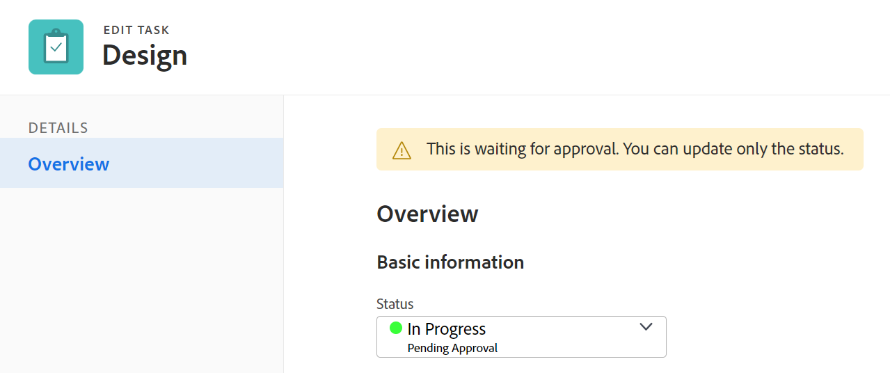

# 編輯任務

<!--

(NOTE: some information in this area is repeated in the following articles. If you need to update a fied, update it in both:

** Task finances in details

** Task information in overview)

-->

您可以編輯已建立、您擁有Contribute或管理權限之工作的相關資訊。

## 存取需求

您必須具備下列存取權，才能執行本文中的步驟：

<table style="table-layout:auto"> 
 <col> 
 <col> 
 <tbody> 
  <tr> 
   <td role="rowheader">Adobe Workfront計畫*</td> 
   <td> 
任何 
 </td> 
  </tr> 
  <tr> 
   <td role="rowheader">Adobe Workfront授權*</td> 
   <td> 
工作或更高
 </td> 
  </tr> 
  <tr> 
   <td role="rowheader">存取層級*</td> 
   <td> 
編輯對任務和項目的訪問
 
<b>附註</b>

如果您仍無權存取，請洽詢您的Workfront管理員，他們是否在您的存取層級設定其他限制。 如需Workfront管理員如何變更您的存取層級的詳細資訊，請參閱 <a href="../../../administration-and-setup/add-users/configure-and-grant-access/create-modify-access-levels.md" class="MCXref xref">建立或修改自訂存取層級</a>.
 </td>
</tr> 
  <tr> 
   <td role="rowheader">物件權限</td> 
   <td> 
    <ul> 
     <li> 
將權限提供給任務，以便在「任務詳細資訊」區域中編輯任務 
 </li> 
     <li> 
管理任務的權限，以在「編輯任務」框中編輯任務
 </li> 
    </ul> 
    <ul> 
     <li> 
為專案貢獻或更高權限
 </li> 
    </ul> 
有關請求其他訪問的資訊，請參閱 <a href="../../../workfront-basics/grant-and-request-access-to-objects/request-access.md" class="MCXref xref">請求對對象的訪問 </a>.
 </td> 
  </tr> 
 </tbody> 
</table>

&#42;若要了解您擁有的計畫、授權類型或存取權，請聯絡您的Workfront管理員。

## 編輯任務的限制

有些限制可能會使您無法編輯工作。

編輯工作時，請考量下列事項：

* 更新任務會觸發處於「目前」狀態的專案的通知。 為了避免指派給工作的使用者造成混淆，請在專案處於「目前」狀態時，盡可能限制編輯工作。
* 您無法編輯審批流程中的任務。 您只能記錄批准流程中任務的時間或更新狀態。

   

* 只有在您的Workfront管理員或組管理員在「項目首選項」區域中啟用了此功能時，您才能編輯狀態為「完成」、「無效」或「待批准」的項目的任務，並將文檔添加到這些任務中。 有關設定項目首選項的資訊，請參閱 [配置系統範圍的項目首選項](../../../administration-and-setup/set-up-workfront/configure-system-defaults/set-project-preferences.md).

* 當項目被標籤為「完成」、「無效」或處於批准流程時，您始終可以編輯任務的以下資訊：

   * 記錄時間
   * 編輯現有費用
   * 附加自訂表單

## 編輯清單中的任務

您可以通過清單視圖中顯示的內聯編輯欄位來編輯任務清單中的任務資訊。

有關在清單中編輯任務的資訊，請參閱 [編輯清單中的任務](../../../manage-work/tasks/manage-tasks/edit-tasks-in-a-list.md).

## 使用「摘要」編輯清單中的任務

您可以使用「摘要」面板編輯清單中的任務。 有關在「摘要」面板中編輯任務的資訊，請參閱 [編輯清單中的任務](../../../manage-work/tasks/manage-tasks/edit-tasks-in-a-list.md) 文章。

## 在「編輯任務」框中編輯任務

您可以使用「編輯任務」或「任務詳細資訊」區域編輯任務。 以下步驟介紹在「編輯任務」框中編輯任務。

1. 按一下 **主菜單** 圖示  在Adobe Workfront的右上角。

1. 按一下 **專案**，然後按一下專案名稱以開啟。
1. 按一下 **工作** 中。
1. 按一下要編輯的任務。
1. （可選）要編輯有關任務的有限資訊，請按一下 **任務詳細資訊** 中。

   

   請考慮在「任務詳細資訊」部分的以下區域編輯資訊：

   * **總覽**

      預設會展開此區域。

   * **自訂表單**

      只有在物件附加自訂表單時，海關表單的名稱才會顯示。

   * **財務**
   >[!NOTE]
   >
   >視您的Workfront管理員或群組管理員修改配置範本的方式而定，「任務詳細資訊」區域中的欄位可能會重新排列或不顯示。 如需詳細資訊，請參閱 [使用版面範本自訂「詳細資料」檢視](../../../administration-and-setup/customize-workfront/use-layout-templates/customize-details-view-layout-template.md).

   有關「任務詳細資訊」部分中可見欄位的資訊，

   繼續編輯「編輯任務」框中的任務，如下所述。

   要編輯「詳細資訊」部分中的資訊，請執行以下操作：

   1. （選用）按一下 **全部折疊** 圖示  折疊所有區域。
   1. （選用和條件性）收合區域時，按一下 **右箭頭**  展開要編輯的區域。
   1. 有關在「任務詳細資訊」頁簽中編輯資訊的詳細資訊，請參閱以下文章：

      * [在「任務詳細資訊概覽」區域中管理任務資訊](../../../manage-work/tasks/manage-tasks/task-information-in-overview.md)
      * [在「任務詳細資訊」部分中管理任務財務](../../../manage-work/tasks/manage-tasks/task-finances-in-details.md)
   1. （可選）如果沒有附加到任務的自定義表單，請在 **新增自訂表單** 欄位，然後在清單中顯示時選取，然後按一下 **儲存變更**.
   1. （選用）按一下 **匯出** 圖示  若要將綜覽和自訂表單資訊匯出至PDF檔案，請按一下 **匯出**. 從以下項目中選取：

      * 全選（僅在至少附加一個自訂表單時顯示）
      * 總覽
      * 一或多個自訂表單的名稱

      PDF檔案下載至您的電腦。

      

      如需詳細資訊，請參閱 [匯出自訂表單和物件詳細資訊](../../../workfront-basics/work-with-custom-forms/export-custom-forms-details.md).

1. 要編輯有關任務的所有資訊，請按一下 **更多** 功能表  在任務名稱旁，按一下 **編輯**.

   或

   從任務清單中，選擇任務，然後按一下 **編輯** 圖示  清單頂端。

   「編輯任務」(Edit Task)框開啟。

   >[!IMPORTANT]
   >
   >您必須具有任務的「管理」權限，才能查看「編輯」選項。

   所有任務欄位都可在「編輯任務」框中使用，並按左面板中列出的區域分組。

   >[!NOTE]
   >
   >視您的Workfront管理員或群組管理員修改配置範本的方式而定，「任務詳細資訊」區域中的欄位可能會重新排列或不顯示。 如需詳細資訊，請參閱 [使用版面範本自訂「詳細資料」檢視](../../../administration-and-setup/customize-workfront/use-layout-templates/customize-details-view-layout-template.md).

   請考慮在下列任何章節中指定資訊：

   * [任務名稱](#task-name)
   * [總覽](#overview)
   * [指派](#assignments)
   * [自訂表單](#Custom%C2%A0F)
   * [財務](#finance)
   * [設定](#settings)

   >[!NOTE]
   >
   >視您的Workfront管理員或群組管理員設定「配置範本」的方式而定，「編輯任務」方塊中的欄位可能會重新排列或未顯示。 如需詳細資訊，請參閱 [使用版面範本自訂「詳細資料」檢視](../../../administration-and-setup/customize-workfront/use-layout-templates/customize-details-view-layout-template.md).

### 任務名稱 {#task-name}

1. 按上述方式開始編輯您的任務。
1. 按一下 **任務名稱** 中。

   

1. 更新任務的名稱。

1. 按一下 **儲存** 或繼續下列章節。

### 總覽 {#overview}

1. 按上述方式開始編輯您的任務。
1. 按一下 **概述** 中。

   

1. 更新有關該任務的以下資訊：

   <table style="table-layout:auto"> 
    <col> 
    <col> 
    <tbody> 
     <tr> 
      <td role="rowheader">說明</td> 
      <td>添加有關任務的其他資訊。 </td> 
     </tr> 
     <tr> 
      <td colspan="2" role="rowheader">基本資訊部分 </td> 
     </tr> 
     <tr> 
      <td role="rowheader">狀態</td> 
      <td> 
選擇任務的狀態，該狀態指示任務所處的開發階段。
 
<b>筆尖</b>

   您可以更新任務題頭中的任務狀態。 
 </td>
   </tr> 
     <tr> 
      <td role="rowheader">優先順序</td> 
      <td> 
這是視覺標幟，可讓您排定工作的優先順序。 
 
從下列選項中選取： 
 
       <ul> 
      <li> 
 無
 </li> 
      <li> 
 低 
 </li> 
      <li> 
標準 
 </li> 
      <li> 
高 
 </li> 
      <li> 
 緊急 
 </li> 
       </ul> 
視您的Workfront管理員選取的「專案偏好設定」而定，優先順序的名稱可能會有所不同。 有關任務優先順序的資訊，請參見 <a href="../../../manage-work/tasks/task-information/task-priority.md" class="MCXref xref">更新任務優先順序</a>. 
 </td> 
     </tr> 
     <tr> 
      <td colspan="2" role="rowheader">任務日期和約束部分 </td> 
     </tr> 
     <tr> 
      <td role="rowheader">任務限制</td> 
      <td> 
通過指定任務約束來決定何時必須完成任務。 
 
從下列選項中選取： 
 
       <ul> 
      <li> 
固定日期 
 
指定 <strong>計劃開始</strong> 和 <strong>計畫完成日期</strong>. 
 </li> 
      <li> 
必須開始時間 
 
指定 <strong>計劃開始日期</strong>. 
 </li> 
      <li> 
必須完成時間 
 
指定 <strong>計畫完成日期</strong>. 
 </li> 
       </ul> 
       <ul> 
      <li> 
盡快
 </li> 
      <li> 
盡可能晚
 </li> 
      <li> 
最早可用時間
 </li> 
      <li> 
 最晚可用時間
 </li> 
      <li> 
開始時間不晚於 
 </li> 
      <li> 
指定計劃開始日期
 </li> 
      <li> 
開始時間不早於 
 
指定 <strong>計劃開始日期</strong>. 
 </li> 
      <li> 
 完成 不遲於
 
指定 <strong>計畫完成日期</strong>. 
 </li> 
      <li> 
 完成 早於
 
指定 <strong>計畫完成日期</strong>
 </li> 
       </ul> 
有關「任務約束」的詳細資訊，請參閱 <a href="../../../manage-work/tasks/task-constraints/task-constraint-overview.md" class="MCXref xref">任務約束概覽</a>.
 </td> 
     </tr> 
     <tr> 
      <td role="rowheader">提交日期和時間</td> 
      <td> 
這是分配給任務的用戶提交完成任務的日期。 這可以與計畫完成日期不同。 僅受指派人可以編輯此欄位。如需Workfront中提交日期的相關資訊，請參閱 <a href="../../../manage-work/projects/updating-work-in-a-project/overview-of-commit-dates.md" class="MCXref xref">提交日期概述</a>. 
 </td> 
     </tr> 
     <tr> 
      <td role="rowheader">計畫的開始日期和時間</td> 
      <td> 
計劃開始任務時。 任務的計畫起始日期是設定的，並受多種因素的影響：
 
       <ul> 
      <li>根據任務計劃開始日期的全系統首選項，預設情況下，項目上新任務的開始日期可以是今天，也可以是項目的開始日期。 與項目關聯的組的組管理員也可以為組設定此首選項。 有關係統級或組級任務首選項的詳細資訊，請參閱 <a href="../../../administration-and-setup/set-up-workfront/configure-system-defaults/set-task-issue-preferences.md" class="MCXref xref">配置全系統任務和問題首選項</a>.</li> 
      <li>根據任務的前置任務，Workfront將選擇計畫起始日期作為前置任務完成後的下一個可用日期，或根據前置任務關係開始。 如需先前關係的詳細資訊，請參閱 <a href="../../../manage-work/tasks/use-prdcssrs/predecessors-overview.md" class="MCXref xref">任務前置任務概述</a>.</li> 
      <li>當任務約束為「固定日期」或「必須開始」時，項目經理或任務責任人可以人工設定計畫起始日期。 有關任務約束的詳細資訊，請參閱 <a href="../../../manage-work/tasks/task-constraints/task-constraint-overview.md" class="MCXref xref">任務約束概覽</a>.</li> 
       </ul> </td> 
     </tr> 
     <tr> 
      <td role="rowheader">計畫完成日期和時間</td> 
      <td> 
計畫任務時顯示的預計完成日期。 計畫完成日期可以由多種因素設定：
 
       <ul> 
      <li>計畫完成日期從計畫起始日期計算，方法是將任務的持續時間添加到計畫起始日期。 當項目經理或Workfront指定任務的持續時間時，將觸發對計畫完成日期的更新。 如果計畫日期變更，通常是因為的持續時間已更新。</li> 
      <li>當任務約束為「固定日期」或「必須完成」時，項目經理或任務責任人可以人工設定計畫完成日期。 有關任務約束的詳細資訊，請參閱 <a href="../../../manage-work/tasks/task-constraints/task-constraint-overview.md" class="MCXref xref">任務約束概覽</a>.</li> 
      <li>如果任務的「持續時間類型」更改，且任務上的資源數同時更改，則計畫完成日期也會更改。 如需持續時間類型的詳細資訊，請參閱 <a href="../../../manage-work/tasks/taskdurtn/task-duration-and-duration-type.md" class="MCXref xref">任務持續時間和持續時間類型概覽</a>.</li> 
       </ul> </td> 
     </tr> 
     <tr> 
      <td role="rowheader">實際開始日期和時間</td> 
      <td> 
指定任務的實際起始日期。 當您將任務的狀態更改為「正在進行」時，通常會自動填入預設值。 項目經理或任務責任人也可以人工修改實際起始日期。 
 </td> 
     </tr> 
     <tr> 
      <td role="rowheader">實際完成日期和時間</td> 
      <td> 
指定任務完成時的實際日期和時間。 任務完成時的預設日期和時間始終與狀態變為「完成」時的實際時間一致。 項目經理或任務責任人也可以人工修改實際完成日期。 
 </td> 
     </tr> 
     <tr> 
      <td role="rowheader"><b>工作時段</b></td> 
     </tr> 
     <tr> 
      <td role="rowheader">工作量 </td> 
      <td>

   
完成任務所需的工作量。 您的項目經理可能會決定使用此欄位，而不是「計畫小時」來估計完成任務所需的工作量。 只有在符合下列條件時，此欄位才會顯示：
 
      <ul> 
      <li> 
該任務具有「簡單持續時間類型」。 
 
<b>筆尖</b>

   如果更改任務「持續時間類型」，則此欄位將變灰。 
 </li>
   <li>您的項目經理啟用了「使用工作量」欄位，以自動計算項目上的任務計畫小時數。 </li> 
      </ul> 
      
從下列選項中選取：
 
      <ul> 
      <li>小</li> 
      <li>中 （這是新任務的預設值）</li> 
      <li>大</li> 
      </ul> 
      
<b>附註</b>

   更新工作量可以更新任務「計畫小時數」。 如果項目「更新類型」為「自動」，則更新為立即更新。 當項目更新類型為「人工」時，必須重新計算時間軸，才能查看更新的計畫小時數。 

   
有關使用工作量（而非計畫小時）來估計任務工作量的資訊，請參閱 <a href="../../../manage-work/tasks/task-information/work-effort.md" class="MCXref xref">工作成果概觀</a>. 
 
    </td> 
     </tr> 
    </tbody> 
   </table>

1. 按一下 **儲存** 或繼續下列章節。

### 指派 {#assignments}

1. 按上述方式開始編輯您的任務。
1. 按一下 **分配** 中。

   

1. 按一下 **搜索人員、角色和團隊** 然後開始鍵入要分配給任務的用戶、角色或團隊的名稱，然後按一下該名稱，或在清單上顯示時按Enter鍵。

   >[!NOTE]
   >
   >如果用戶名包含特殊字元，則必須在搜索欄位中包含特殊字元。

   >[!TIP]
   >
   >您可以指派多個使用者、工作角色或團隊。 您只能指派作用中的使用者、工作角色和團隊。
   >
   >如果在停用前已指派使用者、工作角色或團隊，則他們仍會指派給工作項目。 在此情況下，我們建議：
   >
   >* 將工作項重新分配給活動資源。
   >* 將已停用團隊中的用戶與活動團隊關聯，並將工作項重新分配給活動團隊。

1. （可選）通過選擇 **擁有者** 選項按鈕。 團隊不能是任務的主要受託人。
1. （條件式和選用式）更新下列欄位：

   <table style="table-layout:auto"> 
    <col> 
    <col> 
    <tbody> 
     <tr> 
      <td role="rowheader">期間類型</td> 
      <td> 
這可識別下列項目之間的關係： 
 
       <ul> 
      <li> 
分配給任務的資源數 
 </li> 
      <li> 
完成任務所需的總工作量 
 </li> 
      <li> 
 任務的總持續時間。 
 </li> 
       </ul> 
您的Workfront管理員  或組管理員 選擇系統或組中任務的預設「持續時間類型」設定。 有關設定項目預設值的資訊，請參閱 <a href="../../../administration-and-setup/set-up-workfront/configure-system-defaults/set-project-preferences.md" class="MCXref xref">配置系統範圍的項目首選項</a>. 
 
持續時間類型使您能夠根據任務的需要設定一致的資源分配。 有關任務的「持續時間類型」的詳細資訊，請參閱 <a href="../../../manage-work/tasks/taskdurtn/task-duration-and-duration-type.md" class="MCXref xref">任務持續時間和持續時間類型概覽</a>. 
 
從下列選項中選取： 
 
       <ul> 
      <li> 
已計算的任務指派 
 </li> 
      <li> 
 已計算的工作 
 </li> 
      <li> 
投入比導向 
 </li> 
      <li> 
簡單
 </li> 
       </ul> </td> 
     </tr> 
     <tr data-mc-conditions="QuicksilverOrClassic.Quicksilver"> 
      <td role="rowheader">各事件的持續時間</td> 
      <td> 
這只會顯示在循環工作的上層。 它顯示每個循環任務的持續時間。 有關建立循環任務的資訊，請參閱 <a href="../../../manage-work/tasks/create-tasks/create-recurring-tasks.md" class="MCXref xref">建立循環任務</a>. 
 
 <b>附註</b>

   在個別循環任務中修改的持續時間不會顯示此欄位中指出的值。 
 </td>
   </tr> 
     <tr> 
      <td role="rowheader">期間</td> 
      <td> 
      
 
      
 
      
這是您允許任務在完成之前保持開啟的時間。 
 
      
<b>重要</b>

   由於任務持續時間通常是計劃開始日期和計畫完成日期之間的時間量，因此會影響項目的時間軸。

   
要指示任務的持續時間和時間單位，請執行以下操作：
 
      <ul> 
      <li> 
輸入時間長度，然後從下拉式功能表中可用的時間單位中選取。
 
<b>筆尖</b>

      在任務清單中更新任務的持續時間時，可以使用時間單位的縮寫。 
 </li> 
      </ul> 
      
 您可以從下表中的一般時間或經過的時間選項中進行選擇： 
 
      <table style="table-layout:auto"> 
      <col> 
      <col data-mc-conditions=""> 
      <tbody> 
      <tr> 
      <td>單位</td> 
      <td>縮寫</td> 
      </tr> 
      <tr> 
      <td>分鐘</td> 
      <td>一</td> 
      </tr> 
      <tr> 
      <td>時數</td> 
      <td>H</td> 
      </tr> 
      <tr> 
      <td>天. 這是預設值。 </td> 
      <td>D</td> 
      </tr> 
      <tr> 
      <td>週</td> 
      <td>三</td> 
      </tr> 
      <tr> 
      <td>月</td> 
      <td>二</td> 
      </tr> 
      <tr> 
      <td>經過的分鐘數</td> 
      <td>EM</td> 
      </tr> 
      <tr> 
      <td>經過的時數</td> 
      <td>EH</td> 
      </tr> 
      <tr> 
      <td>經過的天數</td> 
      <td>ED</td> 
      </tr> 
      <tr> 
      <td>經過的週數</td> 
      <td>EW</td> 
      </tr> 
      <tr> 
      <td>經過的月數</td> 
      <td>ET</td> 
      </tr> 
      </tbody> 
   </table>

   
<b>附註</b>

   
已用時間是任務持續時間的單位。 它是任務（包括節假日、週末和休假時間）的「計畫起始日期」和「計畫完成日期」之間的時間。 換句話說，經過的時間是日曆天數的過去。

   常規時間會考慮節假日、週末和休假時間，並將它們從任務的「持續時間」中排除。 有關任務持續時間的詳細資訊，請參閱 <a href="../../../manage-work/tasks/taskdurtn/task-duration-and-duration-type.md" class="MCXref xref">任務持續時間和持續時間類型概覽</a>. 

   
 
   
 </td> 
   </tr> 
   <tr> 
   <td role="rowheader">計畫小時</td> 
   <td> 
指定任務的計畫小時數（以小時為單位）。 這是任務的受分配者完成任務所需的實際時間。 當「期間類型」設定為「計算分配」時，您只能指定任務的計畫小時數。 如需持續時間類型的詳細資訊，請參閱 <a href="../../../manage-work/tasks/taskdurtn/task-duration-and-duration-type.md" class="MCXref xref">任務持續時間和持續時間類型概覽</a>.
 </td> 
   </tr> 
   <tr> 
   <td role="rowheader">配置</td> 
   <td> 
如果任務約束是「計算工作」或「工作驅動」，請指定 <strong>分配%</strong> （分配百分比）。 這是受託人的計畫中，他們可以花在此任務上的時間。 更改受託人的分配百分比將更改任務的計畫小時數。 
 
當「任務約束」為「簡單」時，可以指定以下內容：
 
      <ul> 
      <li> 
每個受託人的分配小時數。
 </li> 
      <li> 
任務的計畫小時數
 </li> 
      <li> 
任務的持續時間
 </li> 
      </ul> </td> 
   </tr> 
   <tr> 
   <td role="rowheader">受指派人角色</td> 
   <td> 
從 <strong>受託人的角色</strong> 下拉式功能表中選擇「人員」作為受託人時顯示。 這是受讓人可以在此任務上承擔的角色。 
 
<b>筆尖</b>

   只有與每個受託人在其設定檔中相關聯的工作角色才會出現在下拉式功能表中。
 </td>
   </tr> 
      </tbody> 
      </table>

1. 按一下 **儲存** 或繼續下列章節。

### 自訂表單

您可以在將任務新增至專案時，定義要自動附加至任務的預設自訂表單。 有關將項目設定為包括所有新任務的預設任務自定義表單的資訊，請參閱文章中的「任務」部分 [編輯專案](../../../manage-work/projects/manage-projects/edit-projects.md).

1. 按上述方式開始編輯任務。
1. 按一下 **自訂Forms** 在左側面板中，或按一下已附加的自訂表單名稱。

   

1. 按一下 **新增自訂表單** 並選擇要與任務關聯的自定義表單或表單。 您必須先建置自訂表單，才能在此欄位中供選取。 清單中只會顯示使用中的自訂表單。

   如需建立自訂表單的詳細資訊，請參閱 [建立或編輯自訂表單](../../../administration-and-setup/customize-workfront/create-manage-custom-forms/create-or-edit-a-custom-form.md)。您最多可以為任務添加10個自定義表單。

1. （條件性）如果將自訂表單附加至任務，請編輯表單上的任何欄位。 您必須先指定所有必填欄位，才能儲存任務。

   >[!NOTE]
   >
   >根據您的Workfront管理員如何設定自訂表單中各區段的權限，不是每個人都可以在指定的自訂表單上檢視或編輯相同的欄位。 編輯自訂表單區段內欄位的權限，取決於您對工作本身擁有的權限。 有關設定任務權限的資訊，請參閱 [共用任務](../../../workfront-basics/grant-and-request-access-to-objects/share-a-task.md).

1. 按一下 **儲存** 或繼續下列章節。

### 財務 {#finance}

1. 開始編輯任務，如 [編輯任務](#Edit2) 一節。
1. 按一下 **金融** 中。

   

1. 更新下列欄位：

   <table style="table-layout:auto"> 
    <col> 
    <col> 
    <tbody> 
     <tr> 
      <td role="rowheader">成本類型</td> 
      <td> 
指定任務的成本類型。 這將根據任務的小時數確定如何計算任務的成本。 
 
從下列選項中選取： 
 
       <ul> 
        <li> 
無成本
 </li> 
        <li> 
固定小時 
 </li> 
        <li> 
 使用者小時 
 </li> 
        <li> 
 角色小時
 </li> 
       </ul> 
如需追蹤成本的詳細資訊，請參閱 <a href="../../../manage-work/projects/project-finances/track-costs.md" class="MCXref xref">追蹤成本</a> . 您的Workfront管理員或群組管理員會為系統或群組中的任務選取預設的成本類型設定。 有關設定項目預設值的資訊，請參閱 <a href="../../../administration-and-setup/set-up-workfront/configure-system-defaults/set-project-preferences.md" class="MCXref xref">配置系統範圍的項目首選項</a> .
 </td> 
     </tr> 
     <tr> 
      <td role="rowheader">收入類型</td> 
      <td> 
指定任務的「收入類型」。 這將根據任務上的小時數，確定如何計算任務上的收入。 
 
從下列選項中選取： 
 
       <ul> 
      <li> 
 不可記帳 
 </li> 
      <li> 
使用者小時 
 </li> 
      <li> 
角色小時 
 </li> 
      <li> 
固定小時 
 </li> 
      <li> 
受限使用者小時 
 </li> 
      <li> 
受限角色小時 
 </li> 
      <li> 
使用者小時加固定 
 </li> 
      <li> 
角色小時加固定 
 </li> 
      <li> 
固定收入 
 </li> 
       </ul> 
如需追蹤收入的詳細資訊，請參閱<a href="../../../manage-work/projects/project-finances/billing-and-revenue-overview.md" class="MCXref xref">帳單和收入概觀</a> . 
 
您的Workfront管理員或群組管理員會針對您系統或群組中的任務選取預設的「收入類型」設定。 有關設定項目預設值的資訊，請參閱 <a href="../../../administration-and-setup/set-up-workfront/configure-system-defaults/set-project-preferences.md" class="MCXref xref">配置系統範圍的項目首選項</a>.
 </td> 
     </tr> 
    </tbody> 
   </table>

1. 按一下 **儲存** 或繼續下列章節。

### 設定 {#settings}

1. 開始編輯任務，如 [編輯任務](#Edit2) 一節。
1. 按一下 **設定** 中。

   

1. 更新下列欄位：

   <table style="table-layout:auto"> 
    <col> 
    <col> 
    <tbody> 
     <tr> 
      <td role="rowheader">追蹤模式</td> 
      <td> 
指定如何跟蹤任務的進度狀態。 
 
從下列選項中選取： 
 
       <ul> 
      <li> 
 使用者必須更新 
 </li> 
      <li> 
假設時間 
 </li> 
      <li> 
忽略遲到警告
 </li> 
      <li> 
 自動完成 
 </li> 
      <li> 
前置任務 
 </li> 
       </ul> 
如需有關工作的追蹤模式的詳細資訊，請參閱 <a href="../../../manage-work/tasks/task-information/task-tracking-mode.md" class="MCXref xref">任務追蹤模式概觀</a>.
 </td> 
     </tr> 
     <tr> 
      <td role="rowheader">資源平準</td> 
      <td> 
選取 <strong>從資源調平中排除</strong> 欄位。
 </td> 
     </tr> 
     <tr> 
      <td role="rowheader">平準延遲</td> 
      <td> 
指定「調平延遲」(Lequading Delay)（以小時為單位）。 
 
 有關調平延遲的詳細資訊，請參閱 <a href="../../../manage-work/tasks/task-information/task-leveling-delay.md" class="MCXref xref">更新任務調平延遲</a>. 
 </td> 
     </tr> 
     <tr> 
      <td role="rowheader">核准程序</td> 
      <td> 
選擇要與任務關聯的審批流程。 您的Workfront管理員必須先定義系統層級的核准程式，才能將它們與任務建立關聯。 具有管理存取權的核准程式使用者也可以建立群組專屬的核准程式。 
 
如需建立核准程式的詳細資訊，請參閱 <a href="../../../administration-and-setup/customize-workfront/configure-approval-milestone-processes/create-approval-processes.md">建立工作項的審批流程</a>. 新增核准程式時，請考量下列事項： 
 
       <ul>

   <li> 
清單中只會顯示作用中的核准程式。 
 </li>

   <li> 
清單中顯示系統範圍和組特定的批准流程。 與項目組以外的組相關聯的審批流程不會顯示在清單中。 

   
<b>重要</b>

   如果項目組發生更改，先前附加的特定於組的審批流程將變為一次性審批流程。 有關項目組的更改或審批流程中的更改如何影響審批設定的詳細資訊，請參閱 <a href="../../../administration-and-setup/customize-workfront/configure-approval-milestone-processes/how-changes-affect-group-approvals.md">組和審批流程更改如何影響分配的審批流程</a>. 

   </li>

   <li> 
您可以在將任務添加到項目時定義自動附加到任務的預設批准流程。 有關將項目設定為包括預設任務審批流程的資訊，請參閱文章中的「任務」部分 <a href="../../../manage-work/projects/manage-projects/edit-projects.md" class="MCXref xref">編輯專案</a>. 
 </li>

   <li> 
批量編輯任務時，存在以下情況： 
 
      <ul> 
      <li> 
從同一組中選擇多個任務時，系統級和組級審批流程都顯示在此欄位中。 
 </li> 
      <li> 
當您從不同的組中選擇多個任務時，此欄位中只顯示系統級別的批准進程。 
 </li> 
      <li> 
如果任何任務都附加了一次性審批流程，則會由您選擇的系統級或組級審批流程替換。 
 </li>

   </ul> </li> 
      </ul> </td> 
     </tr> 
    </tbody> 
   </table>
    </li>

1. 按一下&#x200B;**儲存**。

<!--notes from the table: 
(NOTE: this bullet stays here although the sections it might appear in are QS only, so we can use the snippet for both Qs and classic)
       -->

## 在任務標題中編輯任務（有限）

您可以在任務題頭中編輯有限的資訊量。

您的系統或群組管理員可以自訂您在任務標題中看到的欄位。 如需詳細資訊，請參閱 [使用版面範本自訂物件標題](../../../administration-and-setup/customize-workfront/use-layout-templates/customize-object-headers.md).

依預設，專案標題中包含下列欄位：

* 任務名稱
* 完成百分比
* 指派
* 計畫完成日期和時間

   >[!CAUTION]
   >
   >某些任務約束和其他依賴項可能會阻止您編輯此欄位。 有關任務約束的資訊，請參閱 [任務約束概覽](../../../manage-work/tasks/task-constraints/task-constraint-overview.md).

* 狀態
* 如果您被設定為當前審批流程中的審批人，則進行審批決策

## 大量編輯任務

您可以在清單中大量編輯任務，並在選擇自動保存對清單中的任務所做的更改時同時更新其所有資訊。

如需大量儲存工作的相關資訊，請參閱文章中的「大量編輯工作」一節 [編輯清單中的任務](../../../manage-work/tasks/manage-tasks/edit-tasks-in-a-list.md).
