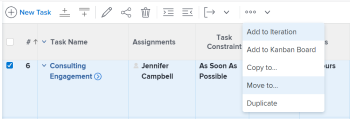

# 移動任務

<!--Audited: 12/2024-->

本頁醒目提示的資訊指出尚未普遍可用的功能。 它僅在預覽環境中可供所有客戶使用。 每月發行至生產環境後，生產環境中為啟用快速發行的客戶也提供相同的功能。

如需快速發行資訊，請參閱[為您的組織啟用或停用快速發行](/help/quicksilver/administration-and-setup/set-up-workfront/configure-system-defaults/enable-fast-release-process.md)。

您可以在Adobe Workfront中移動以下物件之間的工作：

* 專案的臨時任務。
* 從專案到另一個專案的任務。
* 另一個專案中不同父項下的專案任務。
* 同一專案中不同父項下的任務。

您可以在任務層級移動任務，也可以從任務清單移動任務。
您可以從任務清單中移動單一任務，或一次移動數個任務。

## 存取需求

+++ 展開以檢視本文中功能的存取需求。

若要執行本文中的動作，您必須具備下列存取權：

<table style="table-layout:auto"> 
 <col> 
 <col> 
 <tbody> 
  <tr> 
   <td role="rowheader">Adobe Workfront計畫</td> 
   <td> 
任何
 </td> 
  </tr> 
  <tr> 
   <td role="rowheader">Adobe Workfront授權*</td> 
   <td> 
新計畫：標準 
 
 
或
  

目前計畫：工作或以上 
 </td> 
  </tr> 
  <tr> 
   <td role="rowheader">存取層級設定</td> 
   <td> 
編輯任務與專案的存取權
 </td> 
  </tr> 
  <tr> 
   <td role="rowheader">物件許可權</td> 
   <td> 
管理任務的許可權
 
專案的Contribute或以上許可權可新增任務
  </td> 
  </tr> 
 </tbody> 
</table>

*如需詳細資訊，請參閱Workfront檔案中的[存取需求](/help/quicksilver/administration-and-setup/add-users/access-levels-and-object-permissions/access-level-requirements-in-documentation.md)。

+++

## 移動任務的注意事項

移動任務時請考慮下列事項：

* 當您將任務從一個專案移動到另一個專案時，可能會重新計算任務日期。 重新計算將考慮新專案使用的排程和專案的「排程起始日期」資訊。

* 在移動過程中，您可以選取將一些與任務相關的專案移動到已移動任務中。 但是，依預設，下列物件會轉移至移動的工作：

   * 問題
   * 記錄時數
   * 使用者註解
   * 自訂表單和自訂欄位資訊
   * 子任務

依預設，下列專案不會隨任務移動：

* 里程碑

* 您的系統或群組管理員可能會阻止您移動記錄時數的任務，具體取決於他們如何在「設定」區域中設定「允許使用者移動記錄時數任務和問題」偏好設定。 如需詳細資訊，請參閱[設定全系統的任務和問題偏好設定](/help/quicksilver/administration-and-setup/set-up-workfront/configure-system-defaults/set-task-issue-preferences.md)。

## 移動清單中的任務

1. 移至包含您要移動之任務的一或多個任務的專案。
1. 按一下左側面板中的&#x200B;**工作**&#x200B;以顯示工作清單。
1. 按一下「**計畫模式**」圖示，並確定已啟用「**自動儲存**」切換功能，然後選取您要移動的一項或多項工作。

   

   >[!IMPORTANT]
   >
   >**自動儲存**&#x200B;切換停用時，您無法移動工作。

1. （選擇性和條件性）如果您想要在相同專案中移動選取的任務，請按一下您選取的任務，將其拖放到您想要在專案中移動的位置。

   將任務拖放到專案的正確位置後，您對任務階層所做的變更會立即儲存。 與每個任務相關的所有資訊都會隨任務一起移動。

1. （視條件而定）選取您要移動的一或多個工作，然後執行下列其中一項作業：

   * 按一下工作清單頂端的&#x200B;**更多**&#x200B;功能表，然後按一下&#x200B;**移至**。
   * 以滑鼠右鍵按一下選取的工作，然後按一下[移至&#x200B;**]。**
   * 選取一個任務時，按一下清單中任務名稱旁的&#x200B;**更多**&#x200B;功能表，然後按一下&#x200B;**移至**。

   

   顯示&#x200B;**移動任務**&#x200B;方塊

1. 從步驟4開始，繼續移動工作，如本文中[移動工作層級](#move-a-task-at-the-task-level)一節中所述。

   <!--
   is this still accurate?!
   -->

## 在任務層級移動任務 {#move-a-task-at-the-task-level}

除了從任務清單中移動任務外，您也可以在開啟任務後，在任務層級移動任務。

1. 透過搜尋來尋找Workfront系統中的任務。
1. 按一下工作名稱以開啟。
1. 按一下工作名稱旁的&#x200B;**更多**&#x200B;下拉式功能表，然後按一下&#x200B;**移至**。 「移動工作」方塊隨即顯示。

   

1. （選用）更新&#x200B;**工作名稱**。 任務會以新名稱移動到新位置。 Workfront不會記錄任務的原始名稱。

   >[!TIP]
   >
   >選擇在清單中移動多個任務時，「任務名稱」欄位會變暗且無法編輯。 您可以將滑鼠游標停留在「任務名稱」欄位上，所有選取的任務清單隨即顯示。
   >
   >
   >

1. 在&#x200B;**選取目的地專案**&#x200B;欄位中，輸入您要移動任務的&#x200B;**目的地專案**&#x200B;的名稱。

   如果您想要在相同專案中移動任務，請輸入目前專案的名稱。

   >[!TIP]
   >
   >* 專案名稱區分大小寫。
   >* 您也可以開始輸入「參考編號」或輸入專案的ID。 這可能會協助您區分具有相同名稱的專案。
   >* 清單中只會顯示100個專案。

1. （視條件而定）如果您沒有選取專案的存取權，請按一下&#x200B;**要求存取權**&#x200B;來要求存取專案。
1. （視條件而定）如果您有權將任務新增至目標專案上的任務之一，請繼續將任務移動至所選的目標專案，而不要求存取權。

   

   >[!TIP]
   >
   >如果Workfront管理員防止將任務新增到這些專案時，選取的專案處於未決核准、已完成或廢棄狀態，則會顯示類似訊息。 如需詳細資訊，請參閱[設定全系統的專案偏好設定](../../../administration-and-setup/set-up-workfront/configure-system-defaults/set-project-preferences.md)。

1. （選擇性）按一下左側面板中的&#x200B;**選項**

   或

   向下捲動至「移動任務」方塊中的&#x200B;**選項**&#x200B;區段，然後取消選取下表所列的任何專案，以將其從移動的任務中移除。 依預設會選取所有選項。

   >[!IMPORTANT]
   >
   >取消選取「選項」清單中的專案會導致資料遺失。 現有工作的資訊將被移除且無法復原。

   <table style="table-layout:auto"> 
    <col> 
    <col> 
    <tbody> 
     <tr> 
      <td role="rowheader">全選</td> 
      <td>取消選取此選項，可在將任務移動到新位置時，從任務中移除所有資訊。 </td> 
     </tr> 
     <tr> 
      <td role="rowheader">約束</td> 
      <td> 
任務限制會根據專案排程模式設定為儘可能早或儘可能遲。
 
 選取時，任務的目前限制會與任務一起轉移。 
 
      
<b>附註</b>

   當將具有日期特定限制的任務移動或複製到另一個專案時，如果任務的限制日期在新專案的日期之外，則「任務限制」會變更為「儘可能早」或「儘可能晚」，或調整專案的「計劃開始」或「計畫完成」日期。

   以下是日期特定限制的範例：
   <ul>
      <li> 開始日期</li>
      <li> 必須完成時間</li>
      <li> 開始時間不早於</li>
      <li> 開始時間不晚於</li>
      </ul>

   如需有關任務限制以及任務限制或專案日期如何受到影響的資訊，請參閱<a href="../../../manage-work/tasks/task-constraints/task-constraint-overview.md" class="MCXref xref">任務限制總覽</a>並尋找特定限制。
 </td>
   </tr> 
     <tr> 
      <td role="rowheader">指派</td> 
      <td> 
所有指派都將從任務中移除。 
 </td> 
     </tr> 
     <tr> 
      <td role="rowheader">核准流程</td> 
      <td>所有核准流程都會從任務中移除。</td> 
     </tr> 
     <tr> 
      <td role="rowheader">進度</td> 
      <td>任務狀態為「新增」。 否則，會保留現有的工作狀態。 </td> 
     </tr> 
     <tr> 
      <td role="rowheader">財務資訊</td> 
      <td>工作的財務資訊會被移除，而Workfront會將工作「成本型別」更新為「無成本」，並將工作「收入型別」更新為「不可開立帳單」。 </td> 
     </tr> 
     <tr> 
      <td role="rowheader">所有前置任務</td> 
      <td> 
選取後，當您將任務移至另一個專案時，相依性會變成跨專案前置任務。 
 </td> 
     </tr> 
     <tr> 
      <td role="rowheader">文件</td> 
      <td> 
附加到任務的檔案未轉移到已移動的任務。 這包括版本、校樣和連結檔案。
 
這不包括檔案核准。 移動任務時無法移動檔案核准。
 
      <b>附註</b>

   如果您選擇不將檔案與任務一起移動，檔案將被刪除並放入資源回收筒30天。 管理員可以還原它們，它們將在移動的任務上還原。

   如果任務在移動後刪除，則恢復的檔案將放置在恢復檔案的管理員使用者頁面的「檔案」區域中。

   </td> 
     </tr> 
     <tr> 
      <td role="rowheader">提醒通知</td> 
      <td>任務提醒未轉移到已移動的任務。 </td> 
     </tr> 
     <tr> 
      <td role="rowheader">費用</td> 
      <td>登入任務的費用未轉移到已移動的任務。 </td> 
     </tr> 
     <tr> 
      <td role="rowheader">權限</td> 
      <td> 
Workfront會移除顯示在任務之「共用」清單中的所有實體名稱。 
 </td> 
     </tr> 
    </tbody> 
   </table>

1. （選擇性）按一下左側面板中的&#x200B;**選取父項**

   或

   捲動至「**選取父項**」區段，然後在目的地專案中選取您要成為已移動任務之父項的工作。

   >[!TIP]
   >
   >選取移動清單中的多個任務時，所有選取的任務都會成為選取父系的子系。

   執行下列任一項作業來選取父系：

   * 在任務清單中，選取專案計畫中的父項之一。
   * 按一下搜尋圖示並按名稱搜尋父系任務。

   任務會顯示在清單中。

   

1. 找到父項後，選取該父項的圓鈕。

   如果您未選取父系任務，任務會作為主要任務而非子任務移動，並放置在目標專案上任務清單的末尾。

1. 按一下&#x200B;**移動任務**

   或

   當您在清單中選取多個任務時，請按一下&#x200B;**移動任務**。

   移動的任務現在位於指定的專案上，且為父系任務的子任務或專案上的最後一個任務。
