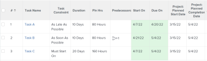

# 任務限制總覽：儘可能遲

儘可能延遲(ALAP)是Adobe Workfront任務限制，可將任務的完成時間儘可能置於專案結尾處。

使用此限制可能會導致前置任務或相依任務被重新排程。

如需前置任務關係的詳細資訊，請參閱[使用前置任務：文章索引](../../../manage-work/tasks/use-prdcssrs/use-task-predecessors.md)。

如果專案使用的排程模式是「從完成日期開始排程」，且作業「開始日期」的系統或群組預設值為「根據專案計畫日期」，則「儘可能延遲」為預設限制。

如需有關設定新任務的預設條件約束的詳細資訊，請參閱[設定全系統的任務和問題偏好設定](../../../administration-and-setup/set-up-workfront/configure-system-defaults/set-task-issue-preferences.md)。

如需有關如何更新任務之任務限制的資訊，請參閱[更新任務的任務限制](../../../manage-work/tasks/task-constraints/update-task-constraint-of-task.md)。

<!--

<h2>Use the As Late As Possible Task Constraint</h2>

(NOTE: replaced with new article linked above) 

To update the Task Constraint to As Late As Possible: 

<ol>
<li value="1">Go to a task whose Task Constraint you want to update.</li>
<li value="2"> 
Click the <strong>More</strong> icon  next to the task name, then click <strong>Edit</strong>.
 </li>
<li value="3"> 
In the <strong>Overview</strong> section, expand the <strong>Task Constraint</strong> drop-down menu.
 </li>
<li value="4"> 
Select <strong>As Late As Possible</strong>.
 </li>
<li value="5">Click <strong>Save Changes</strong>. </li>
</ol>

-->

## 最新可用時間和儘可能晚可用時間之間的差異

<!--

(NOTE: [! This section is duplicated in "Latest Available Time"] - inserted a snippet for both articles (Alina)) 

-->

當存在下列條件時，「最新可用時間」限制與「儘可能晚到」限制不同：

* 從開始日期排程專案
* 專案中的任務具有前置任務關係
* 後續任務具有彈性任務限制

在此情況下：

* **最新可用時間：**&#x200B;在前置任務上使用最新可用時間限制，會優先處理後置任務的彈性限制。

  **範例：**&#x200B;例如，任務A是任務B的前置任務。任務A具有最新的可用時間限制，而任務B具有「儘快」限制。 在此情況下，任務A會儘可能安排在接近專案開始的時間。

  

* **儘可能遲：**&#x200B;在此案例中，在前置任務上使用儘可能晚限制會將優先順序給予前置任務。

  **範例：**&#x200B;例如，任務A是任務B的前置任務。任務A具有儘可能晚的限制，而任務B具有儘可能早的限制。 在此情況下，任務A會排程儘可能接近專案結尾。

  

<!--

(NOTE: this content was here before but it was wrong - according to this issue in Hub, per Dev, the correct functionality is in the snippet above: https://hub.workfront.com/task/6193c6910004bce9de07cda7757f3ce8/updates?email-source=subscribedCommunication) 

The Latest Available Time constraint differs from the As Late As Possible constraint when the following criteria exist:

<ul>
<li> The project is scheduled From Completion </li>
<li> Tasks in the project have a predecessor relationship </li>
<li> The predecessor task has a flexible task constraint </li>
</ul>

 In this situation: 

<ul>
<li> 
<strong>Latest Available Time:</strong> Using the Latest Available Time constraint on the successor task gives priority to flexible constraint of the predecessor.
 
For example, Task A is a predecessor to Task B. Task B has the Latest Available Time constraint and Task A has the As Soon As Possible constraint. In this situation, the task is scheduled as close to the start of the project as possible.
 </li>
<li> 
<strong>As Late As Possible:</strong> In this scenario, using the As Late As Possible constraint on the successor task gives the priority to the successor task.
 
For example, Task A is a predecessor to Task B. Task B has the As Late As Possible constraint and Task A has the As Soon As Possible constraint. In this situation, the task is scheduled as close to the end of the project as possible.
 </li>
</ul>

-->
