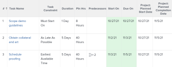

# 作業限制概要：最早可用時間

「最早可用時間」是一種「任務限制」，可在考慮任何前置任務關係後，將任務排定在最早可用時間開始。

如需有關如何更新任務之任務限制的資訊，請參閱[更新任務的任務限制](../../../manage-work/tasks/task-constraints/update-task-constraint-of-task.md)。

<!--

(NOTE: replaced with new article linked above) 

-->

<!--

To update the Task Constraint to Earliest Available Time:

-->

<!--
   <li value="1" data-mc-conditions="QuicksilverOrClassic.Draft mode">Go to a task whose constraint you want to modify. </li>
   -->

<!--
   
Click <strong>Edit Task</strong>.

   -->

<!--
   
Click the <strong>More</strong> icon  next to the task name, then click <strong>Edit</strong>.

   -->

<!--
   
In the <strong>Overview</strong> section, expand the <strong>Task Constraint</strong> drop-down menu.

   -->

<!--
   
Select <strong>Earliest Available Time</strong>.

   -->

<!--
   <li value="5" data-mc-conditions="QuicksilverOrClassic.Draft mode">Click <strong>Save Changes</strong>.</li>
   -->

## 最早可用時間與儘快可用時間之間的差異

<!--

(NOTE: [! This section is duplicated in "Earliest Available Time"])

-->

當以下所有條件存在時，「最早可用時間」限制與「儘快」限制會有所不同：

* 專案已排程自「完成」
* 專案中的任務具有前置任務關係
* 前置任務具有彈性任務限制

在此情況下：

* **最早可用時間：**&#x200B;在後續任務上使用最早可用時間限制，會優先處理前置任務的彈性限制。

  **範例**

  任務A是任務B的前置任務。任務B具有「最早可用時間」限制，而任務A具有「儘可能延遲」限制。 在此情況下，任務B的排程會儘可能接近專案完成。

  當任務的日期接近專案完成日期時，

* **儘快：**&#x200B;在此案例中，使用後續任務的「儘快」限制會將優先權給予後續任務。

  **範例**

  任務A是任務B的前置任務。任務B具有儘可能早的限制，而任務A具有儘可能晚的限制。 在此情況下，任務B的排程會儘可能接近專案開始。

  
