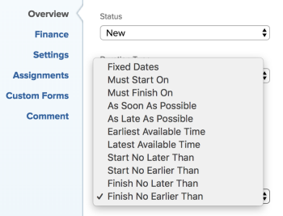

# 任務約束概覽：完成時間不早於

完成不早於(FNET)是任務約束，它將任務安排在指定日期之後完成。

## 結束時間早於約束概述

使用任務的「完成時間不早於」(FNET)約束時，請考慮以下事項：

* 當計畫項目的完成日期為時，應使用此約束。 在這種情況下，您可以在強制其他相依任務顯示「風險」之前，對任務提供軟約束。
* 在計畫的項目上使用FNET時&#x200B;**開始日期**，則約束將調度任務，如果約束是「盡快」，則約束將按照計畫進行調度。
* 將具有FNET約束的任務移動或複製到另一個項目時，任務的約束或項目日期可能會根據約束日期以及項目的起始日期和完成日期而改變。 存在下列情況：

   * 排程從開始時：

      * 當任務的約束日期早於項目計畫起始日期時，任務約束將盡快更改為。
      * 當任務的約束日期晚於項目計畫完成日期時，項目計畫完成日期將更改以匹配任務的完成約束日期。
   * 排程完成時：

      * 當任務的約束日期晚於項目完成日期時，任務約束將變為盡可能晚。
      * 當任務的約束日期早於項目的計畫起始日期時，項目計畫起始日期將更改以匹配任務的起始約束日期。
   * 無論項目計畫如何，當任務的約束日期在項目的「開始」和「完成」日期內時，任務約束或項目日期均不會更改。

   有關移動任務的資訊，請參閱 [移動任務](../../../manage-work/tasks/manage-tasks/move-tasks.md). 有關複製任務的資訊，請參閱 [複製和複製任務](../../../manage-work/tasks/manage-tasks/copy-and-duplicate-tasks.md).

   有關如何更新任務的任務約束的資訊，請參閱 [更新任務的任務約束](../../../manage-work/tasks/task-constraints/update-task-constraint-of-task.md).

<!--

<h2>Use the Finish No Earlier Than constraint</h2>

(NOTE: replaced with new article linked above)&nbsp;

To update the Task Constraint to Finish No Earlier Than:

<ol>
<li value="1">Go to a task whose Task Constraint you want to update.</li>
<li value="2"> 
Click the <strong>More</strong> icon  next to the task name, then click <strong>Edit</strong>.
 </li>
<li value="3"> 
In the <strong>Overview</strong> section, expand the <strong>Task Constraint</strong> drop-down menu.
 </li>
<li value="4"> 
Select <strong>Finish No Earlier Than</strong>.
 
  
 </li>
<li value="5"> 
Specify a <strong>Planned Completion Date</strong>.
 
The task must complete no earlier than this date. 
 </li>
<li value="6">Click <strong>Save Changes.</strong> </li>
</ol>

-->
