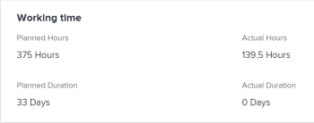

# 計畫小時數概觀

與任務、發放或項目關聯的計畫小時數表示分配的用戶完成任務、發放或項目所需的時間。

## 關於Adobe Workfront計畫時數的考量

* 計畫小時數主要與Adobe Workfront中的工作項目（工作和問題）相關聯。 工作項目的「計畫小時數」累計至其項目的「計畫小時數」。
* 依預設，Workfront會將任務和發放計畫小時數平均分配給任務或問題持續時間內的所有天數。
* 當將用戶和角色分配給任務和問題時，來自任務和問題的計畫時數將與用戶或角色分配相關聯。
* 如果要使用Workfront中的資源管理工具，則必須為任務和問題定義「計畫小時數」的值。
* 您只能修改某些持續時間類型的任務上「計畫小時數」的值。

   有關修改與任務的「持續時間類型」相關的任務的「計畫小時數」的詳細資訊，請參閱部分 [根據持續時間類型更新任務計畫小時數](#update-task-planned-hours-based-on-duration-type) 這篇文章。

* 您可以隨時修改「問題時間」的值。
* 您不能修改項目或父任務的「計畫小時數」值，因為它們是所有任務和子任務的所有「計畫小時數」的計算總計。
* 使用資源管理工具管理用戶分配可能會更改任務、問題、項目和與工作項關聯的分配的「計畫小時數」的數量。

## 任務的計畫小時數與項目的計畫小時數 {#planned-hours-on-tasks-vs-planned-hours-on-projects}

從任務開始的計畫小時數累計到項目的計畫小時數。 從問題開始的計畫小時數不一定會累計至專案的計畫小時數。

本節介紹任務與項目計畫小時數之間的差異。 它也說明您可以在何處檢視統計至專案的「計畫時數」問題。

* [任務計畫小時數](#planned-hours-on-tasks)
* [項目計畫時數](#planned-hours-on-projects)

### 任務計畫小時數 {#planned-hours-on-tasks}

任務的「計畫小時數」指明了估計任務實際工作可能花費的時間。 依預設，Workfront會在每個工作期間內，平均分配每天的計畫時數總計。 計畫小時數的每日金額將成為任務的每日分配。 如果將任務分配給多個資源，則預設情況下，每個資源將分配等量的每日小時數。

使用工作負載平衡器，可以修改分配給任務的用戶的每日分配。 當任務持續時間類型為「簡單」時，這也可以更新任務的「計畫小時數」。 有關詳細資訊，請參閱文章中的「在管理用戶分配時更新任務計畫小時數」部分 [在工作負載平衡器中管理用戶分配](../../../resource-mgmt/workload-balancer/manage-user-allocations-workload-balancer.md).

當任務包含子任務時，父任務的「計畫小時數」是任何子任務上所有「計畫小時數」的總和。 無法更新父任務的「計畫小時數」。

>[!NOTE]
>
>與「計畫小時數」不同，父任務的「實際小時數」是直接記錄在父任務上的小時數。 它們不代表子任務的實際小時數的總和。\
>有關「實際小時數」的詳細資訊，請參閱 [查看實際小時數](../../../manage-work/tasks/task-information/actual-hours.md).

### 項目計畫時數 {#planned-hours-on-projects}

您無法編輯項目上的計畫小時數。 項目的計畫小時數是項目上所有任務的所有計畫小時數的計算總和。

計畫小時數的計算中是否包括問題取決於您查看計畫小時數的項目所在位置。 您可以在項目的以下位置查看項目計畫小時數：

* **專案詳細資料** **節** ****和&#x200B;**編輯專案**box **:**只考慮項目任務的「計畫時數」。 在「項目詳細資訊」部分或「編輯項目」框中查看項目的「計畫小時數」總數時，不會考慮項目問題的「計畫小時數」。

* ****工作負載平衡器：項目的工作負載平衡器中只顯示與工作負載平衡器中可見的任務關聯的計畫小時數。 用戶每日分配可以更改工作負載平衡器中的項目每日計畫小時數。
* **利用率區段：** 在「利用率」部分查看項目的「計畫小時數」總數時，將考慮與分配給任務的用戶和項目問題相關聯的「計畫小時數」。
* **角色分配面板** 在任務清單中：此區域中將顯示任務的計畫小時數，以及分配給職務角色或與職務角色關聯的用戶的項目問題。 與未分配或分配給團隊的任務和問題關聯的計畫小時數不會顯示在此區域。 如需詳細資訊，請參閱 [在「角色分配」面板中查看項目計畫小時數](../../../manage-work/projects/planning-a-project/view-planed-hours-in-role-allocation-panel.md).

## 在任務期間內的計畫時數分配

依預設，Workfront會根據項目排程的可用性，在任務的持續時間內平均分配計畫小時數，為每天的任務分配等數的計畫小時數。

例如，如果將任務設定為下午4:00開始，並且計畫在任務的第一天還剩下一小時，則Workfront會在任務持續時間的第一天放入一個計畫小時，然後將計畫小時的其餘部分平均分配給任務持續時間的其餘天數。

>[!NOTE]
>
>「每天計畫小時數」或每日分配是任務期間每天的計畫小時數分配。 如果任務有一個分配，則此數字表示每個分配的每天計畫小時數。 如果任務具有多個分配，則每個分配的「每天計畫小時數」與任務的「每天計畫小時數」不同。 對於具有多個分配的任務，Workfront中沒有每天計畫小時數的可視表示。

 

## 查找並了解「計畫小時數」值

您可以在Workfront的各個區域找到「計畫小時數」值。 

顯示的計畫小時數源自項目上的工作項目，或根據您在中查看的對象的區域和對象而不同地計算。

您可以在下列Workfront區域找到「計畫小時數」：

* [項目、任務或問題的「詳細資訊」部分](#the-details-section-of-a-project-task-or-issue)
* [編輯任務或編輯問題框](#the-edit-task-or-edit-issue-box)
* [報告](#reports)
* [排程區域](#the-scheduling-areas)
* [工作負載平衡器](#the-workload-balancer)
* [資源計畫員](#the-resource-planner)
* [「 Utilization 」報告](#the-utilization-report)
* [角色分配面板](#The%C2%A0Role)

### 項目、任務或問題的「詳細資訊」部分 {#the-details-section-of-a-project-task-or-issue}

任務、問題或項目的「詳細資訊」部分中的「計畫小時數」是與相應物料關聯的總計計畫小時數。

如需專案計畫時數的詳細資訊，請參閱 [任務的計畫小時數與項目的計畫小時數](#planned-hours-on-tasks-vs-planned-hours-on-projects) 一節。

### 編輯任務或編輯問題框 {#the-edit-task-or-edit-issue-box}

任務或問題的「編輯」框中的「計畫小時數」是相應物料的「計畫小時數總計」。

如需專案計畫時數的詳細資訊，請參閱 [任務的計畫小時數與項目的計畫小時數](#planned-hours-on-tasks-vs-planned-hours-on-projects) 一節。

對於任務，您只能編輯某些持續時間類型的計畫小時數。 如需詳細資訊，請參閱 [根據持續時間類型更新任務計畫小時數](#update-task-planned-hours-based-on-duration-type) 一節。

您可以在「分配」區域中查看分配給任務或問題的每個用戶或職務角色的計畫小時數的單獨分配。

### 報告 {#reports}

您可以在項目、任務和問題報告中添加「計畫小時數」欄位。

預設情況下，「計畫小時數」列包含在任務清單的「標準」視圖中。

任務、發放或項目中的計畫小時數報告是顯示在項目的「詳細資訊」部分或「編輯」框中的相應項目的總計計畫小時數。

如需建立報表的相關資訊，請參閱 [建立自訂報表](../../../reports-and-dashboards/reports/creating-and-managing-reports/create-custom-report.md).

>[!NOTE]
>
>如果您建立項目（財務資料）報表並按日期對其進行分組，則「計畫時數」可能會根據項目上任務的時間表顯示項目的「計畫時數」的一部分。 依預設，Workfront會在任務持續時間的每天平均分配「計畫小時數」任務。 特定時間範圍的「計畫小時數」與Workfront針對該時間範圍在「專案（財務資料）」報表中設定的相等分配相符。

### 排程區域  {#the-scheduling-areas}

任務和問題的「計畫小時數」顯示在「計畫小時數」欄位的「計畫區」中。

您可以在「計畫」區域中查看分配給任務或問題的每個用戶的計畫小時數的每日分配。

每日小時數代表下列其中一項： 

* Workfront在任務或問題持續期間的每一天平均分配預設金額
* 由資源管理員管理的已調整的每日分配。

   有關在計畫工具中調整每日分配的資訊，請參閱 [在「計畫」區域中管理用戶分配](../../../resource-mgmt/resource-scheduling/manage-allocations-scheduling-areas.md).

### 工作負載平衡器 {#the-workload-balancer}

任務、問題和項目的以下計畫小時數顯示在任務、問題或項目名稱右側的工作負載平衡器中：

* 對於任務和問題，將顯示與它們關聯的計畫時數。
* 若是專案，畫面上會顯示來自工作和問題的總計計畫時數。

   >[!TIP]
   工作負載平衡器不會顯示項目的所有計畫小時數，如項目詳細資訊區域中所示。

您可以查看分配給任務或工作負載平衡器中某個問題的每個用戶的每日計畫小時數分配。

「計畫小時數」的每日小時數表示以下值之一： 

* Workfront在工作、問題或專案持續期間的每一天平均分配預設金額
* 由資源管理員管理的已調整的每日分配。

   有關在工作負載平衡器中調整每日分配的資訊，請參見 [在工作負載平衡器中管理用戶分配](../../../resource-mgmt/workload-balancer/manage-user-allocations-workload-balancer.md).

### 資源計畫員 {#the-resource-planner}

資源計畫員顯示項目、任務、問題的計畫時數。

您可以在「資源計畫員」的「PLN」列中查看與工作項關聯的用戶和職務職責的計畫小時數每週分配。

>[!TIP]
工作負載平衡器中的每日分配調整會影響資源規劃器中任務和問題的每週分配。

每個對象的計畫小時數因您應用於資源計畫員的視圖而異。 如需詳細資訊，請參閱 [資源計畫員的「項目」和「職責」視圖中的小時數、FTE和成本資訊概覽](../../../resource-mgmt/resource-planning/overview-of-planner-hour-fte-cost-information-in-role-project-views.md).

任務和問題的「計畫小時數」的每週小時數表示以下內容之一： 

* Workfront在任務或問題持續時間的每一天平均分配預設每週金額
* 由工作負載平衡器中的資源管理器管理的調整每週分配。

   有關在工作負載平衡器中調整每日分配的資訊，請參見 [在工作負載平衡器中管理用戶分配](../../../resource-mgmt/workload-balancer/manage-user-allocations-workload-balancer.md).

項目、用戶和角色的每週金額受與它們關聯的任務和問題的每週計畫小時數的影響。

### 「 Utilization 」報告 {#the-utilization-report}

項目「計畫小時數」是與每個任務和問題上的分配關聯的工時。

>[!IMPORTANT]
請注意，「利用率」報表中的「計畫小時數」與分配相關聯，而不與任務和問題本身相關聯。 「利用率」報表中的「計畫小時數」在項目任務和問題上並不總是與「計畫小時數」匹配。 但是，「計畫小時數」與任務和問題上的分配相關聯的小時數匹配。

您可以在「利用率」報表中查看以下類型的計畫小時數：

* 包含項目的整個生命週期中項目上所有分配的總計畫小時數
* 僅指定日期範圍內所有分配的總計畫小時數（您可以指定單個周或月）。

   使用工作負載平衡器調整了用戶小時的每日分配時，如果在「利用率」報告中選擇的日期僅包含任務或問題的「持續時間」的一部分，則特定日期範圍的「計畫小時數」可能會受到影響。 有關調整用戶每日分配的資訊，請參閱 [在工作負載平衡器中管理用戶分配](../../../resource-mgmt/workload-balancer/manage-user-allocations-workload-balancer.md).

如需詳細資訊，請參閱 [查看資源利用資訊](../../../resource-mgmt/resource-utilization/view-utilization-information.md).

### 角色分配面板

「角色分配」面板中的「計畫小時數」表示在項目總期間內與分配給項目任務或問題的每個職務職責關聯的「計畫小時數」。 編號與資源計畫員中的「計畫小時數」職責匹配。

>[!TIP]
請注意，與用戶關聯的「計畫小時數」不會顯示在「角色分配」面板中。

如需詳細資訊，請參閱 [在工作負載平衡器中顯示項目和方案的角色分配](../../../scenario-planner/show-role-allocation-workload-balancer.md).

## 根據持續時間類型更新任務計畫小時數 {#update-task-planned-hours-based-on-duration-type}

只有在任務具有特定的「持續時間類型」時，才能在編輯任務時更新任務的「計畫小時數總計」。

存在下列情況：

* 只有在編輯任務時使用「計算分配」或「簡單持續時間類型」時，才可修改任務的「計畫小時數」。

   有關計算的分配持續時間類型的詳細資訊，請參閱 [持續時間類型概觀：計算分配](../../../manage-work/tasks/taskdurtn/calculated-assignment.md).

   如需「簡單持續時間類型」的詳細資訊，請參閱 [持續時間類型概觀：簡單](../../../manage-work/tasks/taskdurtn/simple-duration-type.md).

* 在管理用戶對任務的分配時，您只能更新工作量平衡器中的任務「計畫小時數」，只能更新「簡單持續時間類型」任務。 有關在工作負載平衡器中管理用戶分配的資訊，請參見 [在工作負載平衡器中管理用戶分配](../../../resource-mgmt/workload-balancer/manage-user-allocations-workload-balancer.md).
* 不能修改「工作持續時間類型」為「工作驅動」或「計算工作」的任務的「計畫小時數」。 在這些情況下，Workfront會根據任務的持續時間來決定計畫小時數；但是，在此情況下，「計畫小時數」一律等於「持續時間」（以小時為單位），且不會受指派資源的百分比分配影響。

   如需「工作導向持續時間類型」的詳細資訊，請參閱 [持續時間類型概觀：工作驅動](../../../manage-work/tasks/taskdurtn/effort-driven.md).

   有關計算的工作期間類型的詳細資訊，請參閱 [持續時間類型概觀：計算工作](../../../manage-work/tasks/taskdurtn/calculated-work.md).

## 在管理用戶分配時更新任務計畫小時數

當您手動更新任務的用戶或作業角色分配時，可以更新任務的計畫小時數。 只有當任務的「持續時間類型」為「簡單」時，才能執行此操作。

如需詳細資訊，請參閱 [持續時間類型概觀：簡單](../../../manage-work/tasks/taskdurtn/simple-duration-type.md).

您可以更新分配給任務的用戶和角色的總體分配，或者在使用工作負載平衡器時更新用戶的每日分配。

有關管理任務的整體用戶和作業角色分配的資訊，請參閱 [管理任務上的用戶和角色分配時數](../../../manage-work/tasks/assign-tasks/manage-allocation-hours-on-tasks.md).

有關管理任務的每日分配的資訊，請參閱 [在工作負載平衡器中管理用戶分配](../../../resource-mgmt/workload-balancer/manage-user-allocations-workload-balancer.md).

手動更新任務的用戶或作業角色分配時，存在以下情況：

* 當您尚未人工更新單個用戶或角色分配以觸發對任務計畫小時數的更改時，在任務上添加、刪除或替換分配時，計畫小時數將保持不變。 向任務添加新分配時，在所有分配者之間重新分配各個分配。
* 如果人工更新分配以觸發對任務計畫小時數的更改，則從任務中刪除分配時，計畫小時數將減少。 替換分配時，它們保持不變。
* 如果人工更新分配以觸發對任務「計畫小時數」的更改，並且向任務添加分配，則預設情況下將分配新分配0小時。 您必須手動更新其分配給可能影響計畫小時數的任務。
* 如果尚未人工更新分配以觸發對任務計畫小時數的更改，並且您刪除了任務的所有分配，則計畫小時數保持不變。
* 當您人工更新分配以觸發對任務「計畫小時數」的更改，並且刪除了任務的所有分配時，也會刪除「計畫小時數」，並且任務的「計畫小時數」將變為0。

>[!NOTE]
例如，如果任務有10個計畫小時，而您有兩個分配人，則預設情況下，每個分配5小時。
* 如果您未使用工作負載平衡器更新單個用戶分配或每日分配，並且從任務中刪除任何或所有分配，則任務「計畫小時數」將保持10小時。
* 如果您分別人工將分配的分配更改為4小時和6小時，並且刪除分配給6小時的用戶及其職務職責，則任務「計畫小時數」將更新為4小時。 如果您也刪除分配給4小時的用戶，但保留與已刪除用戶關聯的作業角色，則任務的「計畫小時數」將保持4小時。 如果刪除分配給4小時的最後一個用戶及其職務角色，並且任務仍未分配，則任務的「計畫小時數」將變為0。

## 使用工作自動更新任務計畫小時數

使用「工作量」來估計任務完成所需的工作量時，任務的「計畫小時數」將自動更新。 這僅適用於具有簡單持續時間類型的任務。

有關使用工作量來估計任務工作量的資訊，請參閱 [工作成果概觀](../../../manage-work/tasks/task-information/work-effort.md).

<!--

(NOTE: this issue has the explanation of how Planned Hours should work - from Vazgen and Anna: https://hub.workfront.com/issue/6217dced00730b7034c4b808339a35ce/

-->

<!--

Details of their comments: 

-->

<!--

Anna Asatryan

3/22/2022 At 3:16 PM

&nbsp;

to Mark Paul, Corrie Butler, Arman Simonyan, Gagik Khalatyan, Alina Wilson, Artur Sargsyan, Vazgen Babayan, Anna Asatryan

I have done some rough calculations on what the planned hours/revenues should look like Book.xlsx . And if we look, for example at the 2 users highlighted in one of the screenshots their planned hours look way off from what the calculation looks like in the spreadsheet (i.e. equally distributed allocation). When looking at the Workload balancer (the second screenshot), as an example for the user Yashas Mitta, I can see that the allocation has been modified. Obviously the utilization report calculates the allocations based on the modified contouring using the new work per day calculation. The project financial report uses the old, equal distribution of allocation along the full duration of the task. Hence. there is a difference when grouping per periods.

Vazgen Babayan

I believe we will need to prioritise syncing the project financial data report with the new work per day.

Alina Wilson

@Anna Asatryan , do you have a definition of what we should say in documentation (glossary, for example) for how the Planned Hours (or Planned Revenue) is calculated, keeping in mind that we don't document the concept of "workPerDay". We call them "daily allocations", for example, but let me know if that's accurate, too.

Vazgen Babayan

Last Thursday at 3:13 PM

I think an important note here is that regardless the calculation, even if the both views used the same formula, they will not display the same data, because the underlying data sources are different. The Financial Data report does not respect user-entered allocations in Workload Balancer at this moment. So there will be a clear discrepancy, as Anna showed in her message. My recommendation for communication will be to explain that the data sources are different so there can be a mismatch in data and that we will look into addressing that on our roadmap.

Alina Wilson

So far, I hear you guys say this (with my questions for confirmation/ comments in bold):

- the utilization report calculates the allocations based on the modified contouring using the new work per day calculation (so this is what we see in the Workload Balancer, right?)

- the project financial report uses the old, equal distribution of allocation along the full duration of the task (this is before the daily allocations for example were modified in the WB, right?)

I have these additional questions:

- what does the Project Details show? Which Planned Hours, for instance - because earlier, we had a question about this also. - which numbers?

- what does any Planned Hours/ Planned Revenue field that can be pulled in any other report (outside of Financial Data and Utilization reports) show? - which numbers?

- are there any other areas I am not thinking of that we need to document, @Corrie Butler

I will try to document all the possible areas where these display but please help. Thanks!

Vazgen Babayan

Last Saturday at 3:41 PM

<ul>
<li> 
Confirming the first two points 
 </li>
</ul>

For the following questions

<ul>
<li> 
Project details show an aggregated sum of task planned hours. It doesn't have anything to do with the work per day because it always deals with total numbers for the whole duration of the Project/Task.
 </li>
<li> 
Same thing applies to the Planned Hours and Planned Revenue fields in reports - they show totals for the whole Project/Task duration and thus have no use of work per day.
 </li>
<li> 
Can't think of any other fields related to this right now.
 </li>
<li> 
In general, if I were to summarize the system behavior, it's as follows:
 </li>
<li> 
Every area that only deals with total numbers of Planned Hours / Planned Revenue, uses the numbers entered on the tasks. Those are Task / Project Details, reports exposing those fields.
 </li>
<li> 
Areas that deal with time-sensitive portions of Planned Hours / Planned Revenue, use work per day. Those are all Resource Management tools - Workload Balancer, Resource Planner, Utilization Report, importing projects via Scenario Planner.
 </li>
<li> 
All the areas in the second point support user-edited allocations made in Workload Balancer.
 </li>
<li> 
Scheduling area and Project Financial Data reports use the old version of the work per day, which doesn't respect user-edited allocations from Workload Balancer.
 </li>
<li> 
Scheduling will be removed this year, and we need to do work to move the Project Financial Data reports to the new work per day sometime after Q3.
 </li>
</ul>

Alina Wilson

@Vazgen Babayan , one clarifying question: when you say "Scheduling and Project Financial Data reports use the old version of the work per day, which doesn't respect user-edited allocations from WB" - you mean that those use the system default which spreads the allocations evenly, correct? Because you can edit (daily) allocations in Scheduling tools, but it doesn't use that, correct? It uses the default of the daily allocation that the system figures out when dividing the Planned Hours by the number of days in the Duration. Please let me know. And thanks!

Anna Asatryan

Yesterday at 11:42 AM

@Alina Wilson , that's correct, when saying "Scheduling and Project Financial Data reports use the old version of the work per day, which doesn't respect user-edited allocations from WB" Vazgen meant that it spreads the allocation evenly.

As for the scheduling, the allocation modification that's being done there isn't reflected anywhere else in the application other than in the Scheduling itself. That's probably one of the reasons it's being deprecated.

-->

<!--

   

-->

<!--

(NOTE: everything below is drafted because I replaced it with the table above)

-->

<!--

You can find the Planned Hours information on tasks, issues, or projects in the following locations:

-->

<!--

The Planned Hours in the Details  section  of a task, issue, or project are the total Planned Hours of the respective item. 

Finding the Planned Hours in the Details  section  is identical for tasks, issues, and projects. 
 <note type="tip">
You cannot edit the Planned Hours of projects manually, as they are a calculation of all Planned Hours of all the tasks on the project.
</note>

To locate the Planned Hours value on the Details  section  of a task: 

<ol>
<li value="1">Go to a task for which you want to review the Planned Hours.</li>
<li value="2"> 
Click <strong>Task Details</strong> in the left panel. 
 </li>
<li value="3"> 
Click the <strong>Overview</strong> area and notice the Planned Hours value.
 
This value represents the time it would take the user assigned to the task to complete it. 
 </li>
</ol>

-->

<!--

<h3> </h3>

The Planned Hours in the Edit box of a task, issue, or project are the total Planned Hours of the respective item. 

Finding the Planned Hours while editing a task or an issue is identical. 
 <note type="tip">
You cannot edit the Planned Hours of projects manually, as they are a calculation of all Planned Hours of all the tasks on the project.
</note>

To locate the value of Planned Hours while editing a task:

<ol>
<li value="1">Go to the task or issue you want to view Planned Hours for.</li>
<li value="2"> 
Click the <strong>More</strong> icon  next to the task name, then click <strong>Edit</strong>.
 
The Planned Hours are located in the <strong>Overview</strong> section. 
 </li>
</ol>

-->

<!--

The Planned Hours column is included in the Standard view of a task list, by default. For issues and projects, you can add it to the view, when you are editing the view or when you build a report. 

The Planned Hours in a task, issue, or project report are the total Planned Hours of the respective item as they display in the Details  section  or the Edit box of the items. 

Adding the Planned Hours column to a project view is similar to building a view in a project report. 

To show Planned Hours in a project report:

<ol>
<li value="1"> 
Click the <strong>Main Menu</strong> icon  in the upper-right corner of Workfront, then click <strong>Reports</strong>. 
 </li>
<li value="2">Click <strong>New Report</strong>, then choose <strong>Project</strong> as your object.</li>
<li value="3">Click <strong>Add Column</strong>, and start typing <strong>Planned Hours</strong> when the <strong>Show in this column</strong> drop-down field is displayed. Select the field when it appears in the list.</li>
<li value="4"> 
Click <strong>Save + Close</strong> to save the report. 
 
The Planned Hours column shows the total number of Planned Hours on each project. 
 </li>
</ol>

-->

<!--

Planned Hours in Resource Management tools
 <note type="important">
When viewing Planned Hours in the Resource Management tools by a specific time frame, the daily allocations for each work item and the daily allocations for the resources assigned to the work items during that time frame can influence the daily Planned Hours of projects or work items.
</note>

You can see the value of Planned Hours for your tasks, issues, or projects when using the following Resource Management tools:

<ul>
<li> 
Resource Planner
 
For information about using the Resource Planner, see <a href="../../../resource-mgmt/resource-planning/get-started-resource-planner.md" class="MCXref xref">Resource Planner overview</a>.
 </li>
<li> 
Utilization Report.
 
For information about the utilization report, see <a href="../../../reports-and-dashboards/reports/using-built-in-reports/resource-utilization-report.md" class="MCXref xref">Overview of the Resource Utilization report</a>.
 </li>
<li>

Workload Balancer or Scheduling areas in the following sections:

<ul>
<li>Scheduling or Workload Balancer sections in the Resourcing area</li>
<li>Scheduling or Workload Balancer section at the project level</li>
<li>Schedule or Workload Balancer section at the team level</li>
</ul>

 
For information about scheduling resources, see <a href="../../../resource-mgmt/resource-scheduling/get-started-resource-scheduling.md" class="MCXref xref">Get started with Resource Scheduling</a>.
 
For information about the Workload Balancer, see <a href="../../../resource-mgmt/workload-balancer/overview-workload-balancer.md" class="MCXref xref">Overview of the Workload Balancer</a>. 
 </li>
<li> 
<b>Role Allocation panel</b> in the project  task list or  Workload Balancer: The Planned Hours for the tasks and the issues on the project that are assigned to a job role or a user associated with a job role are taken into account in this area. For more information, see <a href="../../../manage-work/projects/planning-a-project/view-planed-hours-in-role-allocation-panel.md" class="MCXref xref">View project Planned Hours in the Role Allocation panel</a>. 
 </li>
</ul>

-->
