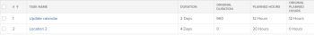

# 任務的概覽原始持續時間和原始計畫小時數

在計畫項目時，您應確定項目中每個任務的「計畫小時數」和「期間（或計畫期間）」的值。

有關任務的「計畫小時數」的詳細資訊，請參閱 [計畫小時數概觀](../../../manage-work/tasks/task-information/planned-hours.md).

有關任務持續時間的詳細資訊，請參閱 [任務持續時間和持續時間類型概覽](../../../manage-work/tasks/taskdurtn/task-duration-and-duration-type.md).

您可以在「任務詳細資訊」頁簽或編輯任務時查看這些值。

如果為任務清單或任務報告建立視圖，則您還可以查看任務的「原始計畫小時數」和「原始持續時間」欄位。

## 第四或以上

任務的原始計畫小時數表示任務在成為父任務之前最初具有的計畫小時數。 當任務成為父任務時，子任務的「計畫小時數」將累計到父任務，以指明父任務的「計畫小時數」。

在任務報表或清單中顯示「原始計畫小時數」欄位，您可以查看任務繼承其子項的「計畫小時數」之前的原始「計畫小時數」。

>[!NOTE]
>
>建立任務時，原始計畫小時數為零。 如果任務變為父任務，則此欄位的值將在任務更改為父任務之前，填入任務的計畫小時數。 即使任務回復為獨立任務，此值仍保留在此欄位中。

## 初始持續時間

任務的原始持續時間是任務在成為父任務之前最初具有的持續時間（以分鐘為單位）。 當任務成為父任務時，最早子任務的計畫起始日期和最後子任務的計畫完成日期之間的持續時間累計到父任務，並成為父任務的持續時間。 這將替換原始任務的持續時間。

在任務報告或清單中顯示「原始持續時間」欄位，您可以在繼承其子項的「持續時間」之前查看任務持續時間的原始天數。

>[!NOTE]
>
>建立任務時，原始持續時間為零。 如果任務變為父任務，則在將該任務更改為父任務之前，此欄位的值將填入任務的持續時間。 即使任務回復為獨立任務，此值仍保留在此欄位中。 此值以分鐘為單位顯示。

## 範例

例如，當兩個任務是獨立任務時，其原始持續時間和原始計畫小時數為零。

當第一個任務成為第二個任務的父任務時，在成為父任務之前，將在「原始持續時間」和「原始計畫小時數」欄位中填入任務的「持續時間」和「計畫小時數」的值。 原始持續時間以分鐘為單位顯示。 子項的「持續時間」和「計畫小時數」成為父項的「持續時間」和「計畫小時數」。

當父代再次成為獨立任務時，「持續時間」和「計畫小時數」將恢復為原始值，同時「原始持續時間」和「原始計畫小時數」將保留。 它們沒有回復為零。

