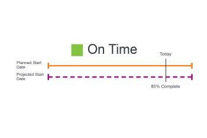

# 任務進度狀態總覽

Adobe Workfront會透過檢視任務在其時間軸中的進度來確定任務的進度狀態。 您可以設定Workfront，以根據任務的進度狀態值來決定專案狀況。 如需有關設定專案條件的詳細資訊，請參閱文章 [專案狀態與狀態型別概觀](../../../manage-work/projects/manage-projects/project-condition-and-condition-type.md).

## 決定任務進度狀態的條件

如需有關專案進度狀態的資訊，請參閱 [專案進度狀態概觀](../../../manage-work/projects/planning-a-project/project-progress-status.md).

如需追蹤工作進度的相關資訊，請參閱 [任務追蹤模式概觀](../../../manage-work/tasks/task-information/task-tracking-mode.md).

下列條件決定任務的進度狀態：

<table> 
 <col> 
 <col> 
 <thead> 
  <tr> 
   <th> 
<strong>進度狀態</strong> 
 </th> 
   <th> 
<strong>決定條件</strong> 
 </th> 
  </tr> 
 </thead> 
 <tbody> 
  <tr valign="top"> 
   <td scope="col"> 
 
 
<strong>準時</strong> 
 </td> 
   <td scope="col"> 
已考慮任務 <strong>準時</strong> 當所有計畫日期符合預計日期時。 此進度狀態也代表專案比排程提前，且預計日期可能早於計畫日期。
 
如需有關預計日期的詳細資訊，請參閱 <a href="../../../manage-work/projects/planning-a-project/project-projected-completion-date.md" class="MCXref xref">專案、任務和問題的預計完成日期總覽</a>.
 
如需有關任務規劃完成日期的詳細資訊，請參閱下列文章：
 
    <ul> 
     <li> 
<a href="../../../manage-work/tasks/task-information/task-planned-start-date.md" class="MCXref xref">任務計劃開始日期概要</a> 
 </li> 
     <li> 
<a href="../../../manage-work/tasks/task-information/task-planned-completion-date.md" class="MCXref xref">任務計畫完成日期概要</a> 
 </li> 
    </ul> </td> 
  </tr> 
  <tr> 
   <td>

 
<strong>有風險</strong> 
 </td> 
   <td>
已考慮任務 <strong>有風險</strong> 當預估完成日期晚於計畫完成日期且晚於預計完成日期時。 當任務具有下列限制時，可能會發生這種情況 <strong>必須完成日期</strong> 或 <strong>必須開始於</strong> 但任務的完成百分比或前置任務關係顯示它無法在指定的日期完成或開始。 

 將任務限制設定為 <strong>必須完成日期</strong> 手動將計畫完成日期設定為特定日期。 在此情況下，預計完成日期與計畫完成日期相符。 在此限制的情況下，Workfront會分析任務，以根據完成百分比計算任務的完成時間。 此計算會儲存為「預估到期日」。 如果「預估到期日」晚於「預估完成日期」，則任務有延遲的風險。 
 
 將任務限制設定為 <strong>必須開始於</strong> 手動將計劃開始日期設定為特定日期。 在此情況下，預計開始日期與計劃開始日期相符。 在此限制的情況下，Workfront會分析任務，以根據其前置任務關係計算開始的時間。 此計算會儲存為「預估開始日期」。 如果有強制性的前置任務，不允許任務在指定的開始日期開始，則預估開始日期可以在預計完成日期之後。 該任務會被視為有延遲的風險。 
 
注意：通常預估日期會與預計日期相符，但以下情況除外 <strong>必須開始於</strong> 或 <strong>必須完成日期</strong> 已使用。 在這些情況下，「預估日期」會繼續根據完成百分比和其他因素（前置任務關係）計算，而「預估日期」會強制比對手動設定的「計畫日期」。
 </td> 
  </tr> 
  <tr> 
   <td> 
<strong>滞後</strong> 
 </td> 
   <td> 
任務被視為 <strong>滯後</strong> 當預估完成日期晚於或等於計畫完成日期，且早於預計完成日期時。
 
「預計完成日期」是根據先前進度完成任務的即時檢視。 雖然任務開始延遲，但不會將其視為延遲，因為「計畫完成日期」和「預計完成日期」仍在未來，任務可能仍準時完成。
 
注意： <strong>滯後</strong> 和 <strong>有風險</strong> 進度狀態幾乎完全相同。 不過， <strong>有風險</strong> 表示計畫日期之一或兩者上有某些強制的任務限制（必須完成日期、必須開始日期、固定日期）。 如果任務沒有強制限制，則預計日期與估計日期相同，並反映系統根據任務目前進度計算的「完成日期」。 任務尚未被視為延遲，因為計畫和預計完成日期仍在未來，任務可能仍準時完成。 如需有關預計日期和估計日期的詳細資訊，請參閱 <a href="../../../manage-work/tasks/task-information/differentiate-projected-estimated-dates.md" class="MCXref xref">區分預計日期和估計日期 </a>.
 </td> 
  </tr> 
  <tr valign="top"> 
   <td> 
<strong>延遲</strong> 
 </td> 
   <td> 
任務是 <strong>延遲</strong> 當計畫完成日期早於今天日期時。 
 </td> 
  </tr> 
 </tbody> 
</table>

<!--hiding this because some users find the images confusing, as they don't really show the dates mentioned in the descriptions above. Keep the pictures though, in case some users will complain that we hid them. 

## How task Progress Status updates over time

The different date types in our projects tell us how tasks are progressing over time:

* On Time

  

* At Risk

  

* Behind

  

* Late

  

-->