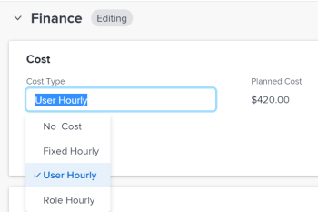

# 更新任務成本型別

作業的「計畫成本」與「實際成本」及其人工成本是由每個作業的「成本型態」所決定。

您可以為專案中的個別任務設定「成本型別」。 每種成本型態都會影響計畫成本與實際成本值。

如需在Adobe Workfront中追蹤成本的詳細資訊，請參閱[追蹤成本](../../../manage-work/projects/project-finances/track-costs.md)。

## 存取需求

+++ 展開以檢視本文中功能的存取需求。

<table style="table-layout:auto"> 
 <col> 
 <col> 
 <tbody> 
  <tr> 
   <td role="rowheader">Adobe Workfront套件</td> 
   <td> 
任何
 </td> 
  </tr> 
  <tr> 
   <td role="rowheader">Adobe Workfront授權</td> 
   <td> 
標準

   
規劃
 </td> 
  </tr> 
  <tr> 
   <td role="rowheader">存取層級設定</td> 
   <td> 
編輯專案、任務和財務資料的存取權
</td> 
  </tr> 
  <tr> 
   <td role="rowheader">物件許可權</td> 
   <td> 
貢獻專案或更高的許可權
 
管理任務的許可權
 </td> 
  </tr> 
 </tbody> 
</table>

如需詳細資訊，請參閱Workfront檔案中的[存取需求](/help/quicksilver/administration-and-setup/add-users/access-levels-and-object-permissions/access-level-requirements-in-documentation.md)。

+++

<!--Old:

<table style="table-layout:auto"> 
 <col> 
 <col> 
 <tbody> 
  <tr> 
   <td role="rowheader">Adobe Workfront plan*</td> 
   <td> 
Any
 </td> 
  </tr> 
  <tr> 
   <td role="rowheader">Adobe Workfront license*</td> 
   <td> 
Plan 
 </td> 
  </tr> 
  <tr> 
   <td role="rowheader">Access level configurations*</td> 
   <td> 
Edit access to Projects, Tasks, and Financial&nbsp;Data
 
Note: If you still don't have access, ask your Workfront administrator if they set additional restrictions in your access level. For information on how a Workfront administrator can modify your access level, see <a href="../../../administration-and-setup/add-users/configure-and-grant-access/create-modify-access-levels.md" class="MCXref xref">Create or modify custom access levels</a>.
 </td> 
  </tr> 
  <tr> 
   <td role="rowheader">Object permissions</td> 
   <td> 
Contribute or higher permissions to a project
 
Manage permissions to a task
 
For information on requesting additional access, see <a href="../../../workfront-basics/grant-and-request-access-to-objects/request-access.md" class="MCXref xref">Request access to objects </a>.
 </td> 
  </tr> 
 </tbody> 
</table>-->

## 設定個別任務的成本型別

1. 移至您要設定「成本型別」的工作。
1. 按一下左側面板中的&#x200B;**工作詳細資料**，然後展開&#x200B;**財務**&#x200B;區域。
1. 連按兩下&#x200B;**成本型別**，然後選取您要套用至工作的成本型別。

   

   從下列選項中選取：

   * 無成本
   * 固定每小時
   * 使用者每小時
   * 角色每小時

   如需每個任務成本型別的詳細資訊，請參閱[追蹤成本](../../../manage-work/projects/project-finances/track-costs.md)。

1. 按一下&#x200B;**儲存** **變更** **。**
