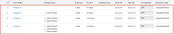

# 期間型別概觀：計算的工作量

「計算的工作量」是一種期間型別，您可以在Adobe Workfront中為任務設定。 如需Workfront中期間型別的一般資訊，請參閱[任務期間與期間型別概觀](../../../manage-work/tasks/taskdurtn/task-duration-and-duration-type.md)。

## 計算的工作期間型別概觀

計算的工作量會決定完成任務所需的工作量（計畫時數）。 當指派給任務的資源被配置用於任務的整個工期時，我們建議您使用計算的工作工期型別。

您的Workfront或群組管理員可以將您系統或群組的預設「期間型別」設定為「已計算的工作」。 在此情況下，所有新任務都將以此期間型別建立。 如需有關將您的任務和問題偏好設定變更為系統層級或群組層級專案偏好設定一部分的資訊，請參閱[設定全系統的任務和問題偏好設定](../../../administration-and-setup/set-up-workfront/configure-system-defaults/set-task-issue-preferences.md)。

當資源新增至任務時，專案經理可預期會看到計畫付出增加。 舉例來說，有三種資源的一小時計畫會議代表總共需要三小時的工作，而有十種資源的一小時計畫會議代表需要十小時的工作。 這假設每個資源都以100%的配置分配給任務。

## 檢閱使用已計算的工作期間型別時計算所需工作的公式

當您在任務上使用「已計算的工作期間型別」時，Workfront會使用下列兩個公式計算每個任務的工作量。 公式會因每個資源配置給作業的時間百分比，以及您指派給每個作業的資源數量而有所不同：

* 簡化公式：假設您有一個資源指派給作業，且這些資源已全部分配至作業的可用時間，則每個作業的「需工作」值會使用下列公式計算：

```
Work Required (Planned Hours) = (Duration of the task in hours) x (The number of resources assigned to the task)
```

* 複雜公式：如果您以各種配置指定每個資源，則公式會將這些配置考慮在內，並計入這些變化：

```
Work Required (Planned Hours) = SUM[(Duration of the task in hours) x (Percent allocated towards tasks for each resource)]
```

## 檢閱從任務新增或移除資源的效果

在具有「已計算工作」持續時間型別的任務中新增或移除被指定者時，可以手動編輯「持續時間」。 新增受指派人或將其從任務中移除時，計畫時數就會變更。

在下列範例中，設定中的專案偏好設定中，每工作日一般時數設定為8。 每個任務的工期為1天。 當受指派人數量變更時，計畫時數會根據指定任務的受指派人數量而變更：

<table border="1" cellspacing="15" cellpadding="1"> 
 <col> 
 <col> 
 <col> 
 <thead> 
  <tr> 
   <th> <p><strong>受指派人數（每100%配置）</strong> </p> </th> 
   <th> <p><strong>期間</strong> </p> </th> 
   <th> <p><strong>規劃時數</strong> </p> </th> 
  </tr> 
 </thead> 
 <tbody> 
  <tr> 
   <td> <p>1</p> </td> 
   <td> <p>1天</p> </td> 
   <td> <p>8 小時</p> <p>（1天x每個工作天8小時x 1受指派人= 8計畫小時）</p> </td> 
  </tr> 
  <tr> 
   <td> <p>2</p> </td> 
   <td> <p>1天</p> </td> 
   <td> <p>16小時</p> <p>（1天x每個工作天8小時x 2受指派人= 16計畫小時）</p> </td> 
  </tr> 
  <tr> 
   <td> <p>3</p> </td> 
   <td> <p>1天</p> </td> 
   <td> <p>24 小時</p> <p>（1天x每個工作天8小時x 3受指派人= 24計畫小時）</p> </td> 
  </tr> 
 </tbody> 
</table>

在此情況下，每個受指派人都會100%地分配到已計算的工作任務。



## 將任務的期間型別變更為計算的工作量

如需有關變更任務期間型別的資訊，請參閱[更新任務的期間型別](../../../manage-work/tasks/taskdurtn/update-duration-type-of-task.md)。

<!--
<p data-mc-conditions="QuicksilverOrClassic.Draft mode">(NOTE: replaced with new article linked above)</p>
-->

<!--
<ol data-mc-conditions="QuicksilverOrClassic.Draft mode">
<li value="1">Go to a task for which you want to change the Duration Type.</li>
<li value="2"> <p data-mc-conditions="QuicksilverOrClassic.Quicksilver">Click <strong>Task Details</strong> in the left panel, then in the Overview area double click <strong>Duration Type</strong>. </p> </li>
<li value="3">Select <strong>Calculated Work</strong> from the drop-down menu.</li>
<li value="4">Click <strong>Save</strong> <strong>Changes</strong>.</li>
</ol>
-->
