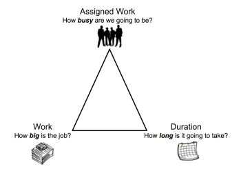

# 任務持續時間和持續時間類型概覽

任務持續時間是任務的計畫完成日期與計畫起始日期之間的差值。 「持續時間」指示任務完成時可用的時間範圍。

任務的「持續時間類型」標識分配給任務的資源數、總工作量和任務的總持續時間之間的關係。

## 任務持續時間概觀

>[!NOTE]
>
>考慮到主要受託人在項目上的休假時間時，任務的計畫日期可能會調整，但任務的持續時間保持不變。 有關在規劃項目時考慮主要受讓人的休假時間的資訊，請參閱  [配置系統範圍的項目首選項](../../../administration-and-setup/set-up-workfront/configure-system-defaults/set-project-preferences.md).

如果任務的實際起始日期和實際完成日期不在項目、主要受託人或預設計畫的計畫之外，則任務持續時間為零。

**範例：** 如果您的排程從上午9:00開始，在下午12:00結束，而排程在下午2:00開始、下午4:00結束的任務，則任務的持續時間為零。

以下是在Adobe Workfront中計算持續時間時存在的兩種情況。

* 如果將任務分配給用戶Workfront使用下列其中一個計畫，則按照此確切順序計算持續時間：

   1. Workfront會考量使用者的排程。
   1. 如果使用者未與排程建立關聯，Workfront會考量專案的排程。
   1. 如果專案未與排程相關聯，Workfront會考量您系統的預設排程。 如需排程的相關資訊，請參閱 [建立排程](../../../administration-and-setup/set-up-workfront/configure-timesheets-schedules/create-schedules.md).

* 如果將任務分配給多個用戶：

   Workfront考慮到項目或主要受讓人的時間表。

   將任務指派給多個使用者時，您的Workfront管理員會決定Workfront會使用哪個排程。 如需詳細資訊，請參閱 [配置系統範圍的項目首選項](../../../administration-and-setup/set-up-workfront/configure-system-defaults/set-project-preferences.md).

   這些步驟類似於了解Workfront用於計算持續時間的排程後的第一個案例。

## 任務持續時間的時間單位

您可以在常規時間和計畫起始日期和計畫完成日期之間的經過時間中指定任務持續時間。

更新清單中的「工作期間」時，您可以使用下列縮寫來指出Workfront中的時間單位：

| 單位 | 縮寫 |
|---|---|
| 分鐘 | 一 |
| 時數 | H |
| 天. 這是預設值。 | D |
| 週 | 三 |
| 月 | 二 |
| 經過的分鐘數 | EM |
| 經過的時數 | EH |
| 經過的天數 | ED |
| 經過的週數 | EW |
| 經過的月數 | ET |

{style=&quot;table-layout:auto&quot;}

**範例：** 如果要指示任務的持續時間為3已用日，則可在任務清單的持續時間欄位中鍵入「3 ED」。  在編輯任務時，或在「任務詳細資訊」部分中，還可以從可用的下拉菜單中選擇「持續時間單位」的首選選項。 有關編輯任務的資訊，請參閱 [編輯任務](../../../manage-work/tasks/manage-tasks/edit-tasks.md).

<!--

(NOTE: stays QS only forever; for the pictures below: make the first one classic at preview time and the second one stays QS always. The second one is yellow >> take out at 21.2 production!!)

-->

指示任務的持續時間時，請考慮以下事項：

* 已用時間是任務持續時間的單位。 它是任務（包括節假日、週末和休假時間）的「計畫起始日期」和「計畫完成日期」之間的時間。 換句話說，經過的時間是日曆天數的過去。
* 常規時間會考慮節假日、週末和休假時間，並將它們從任務的「持續時間」中排除。

* 當您以周表示任務的持續時間時，Workfront會根據Workfront管理員在「設定」的「項目首選項」區域中設定的「每週典型工作日」和「每個工作日典型小時」設定，計算「持續時間」(Duration)（天和小時）。
* Workfront計算「持續時間」時，會使用1個月的4週預設持續時間。

## 任務持續時間類型概述

管理任務的「持續時間類型」使您能夠根據任務的需要設定一致的資源分配。

持續時間類型有助於回答下列問題：

* 我們要多忙？
* 這份工作有多大？
* 要多久？

## 定義持續時間類型

<table border="1" cellspacing="15" cellpadding="1"> 
 <col> 
 <col> 
 <col> 
 <thead> 
  <tr> 
   <th scope="row">期間類型 </th> 
   <th scope="col"> 
<strong>函數</strong> 
 </th> 
   <th scope="col"> 
<strong>資源對資源的影響</strong> 
 </th> 
  </tr> 
 </thead> 
 <tbody> 
  <tr> 
   <th scope="col"> 
<strong>已計算的任務指派</strong> 
 </th> 
   <td scope="col"> 
計算任務上每個受託人的分配百分比。 
 
選擇此「持續時間類型」時，您可以為任務輸入單個持續時間和計畫小時數。 Workfront將「計畫小時數」除以任務「持續時間」內的小時數，然後除以分配給任務的資源數，以計算每個受託人的分配。
 
如需詳細資訊，請參閱 <a href="../../../manage-work/tasks/taskdurtn/calculated-assignment.md" class="MCXref xref">持續時間類型概觀：計算分配</a>.
 </td> 
   <td scope="col">添加或刪除任務的受分配者時，持續時間和計畫小時數不會更改。 </td> 
  </tr> 
  <tr> 
   <th scope="col"> 
<strong>已計算的工作</strong> 
 </th> 
   <td scope="col"> 
確定完成任務所需的計畫小時數（工作量）。
 
通常在為任務的整個持續時間分配分配給任務的資源時使用。
 
選擇此「持續時間類型」時，您可以為任務輸入單個持續時間。 Workfront通過將持續時間中的天數乘以計畫中的工作小時數和任務的受分配者數來計算任務的計畫小時數。 
 
您可以手動將每個受託人的分配百分比更改為任務，從而縮短計畫小時數。
 
如需詳細資訊，請參閱 <a href="../../../manage-work/tasks/taskdurtn/calculated-work.md" class="MCXref xref">持續時間類型概觀：計算工作</a>.
 </td> 
   <td scope="col"> 
計畫小時數在任務中添加分配者時增加。 
 
從任務中刪除受分配者時，計畫小時數會減少。
 </td> 
  </tr> 
  <tr> 
   <th scope="col"> 
投入比導向
 </th> 
   <td scope="col"> 
根據資源數量確定計畫小時數。
 
選擇此「持續時間類型」時，您可以為任務輸入單個持續時間。 Workfront通過將持續時間中的天數乘以計畫中的工作小時數，再除以任務的受分配者數來計算任務的計畫小時數。 
 
您可以手動更改每個受託人對任務的分配百分比，但計畫小時數保持不變。
 
如需詳細資訊，請參閱 <a href="../../../manage-work/tasks/taskdurtn/effort-driven.md" class="MCXref xref">持續時間類型概觀：工作驅動</a>.
 </td> 
   <td scope="col"> 
從任務中刪除受分配者時，計畫小時數增加。
 
將受分配者添加到任務時，計畫小時數將減少。 
 
無論受分配人數或其計畫是否發生更改，持續時間都不會更改。 
 
持續時間等於計畫小時數。 計畫持續時間等於計畫小時數除以受分配者數。
 </td> 
  </tr> 
  <tr> 
   <th scope="col"> 
<strong>簡單</strong> 
 </th> 
   <td scope="col"> 
根據每個受託人分配的小時數確定計畫小時數和持續時間（對於此持續時間類型而言是相同的）。 
 
Workfront通過為每個受讓人加總計劃分配小時數來計算「計畫小時數」。 
 
您可以手動更改每個受託人分配的小時數，並且計畫小時數和持續時間的數量相應地更改。 如果為所有受分配人選擇分配的總小時數，則每個受分配人之間會平分該小時數。
 
如需詳細資訊，請參閱 <a href="../../../manage-work/tasks/taskdurtn/simple-duration-type.md" class="MCXref xref">持續時間類型概觀：簡單</a>.
 </td> 
   <td scope="col"> 
如果選擇分配的小時總數，則小時數將平均分配給受分配者。 但是，作為項目經理，您可以手動調整每個受託人的工時。 
 
您可以編輯任務的「計畫小時數」和「持續時間」，其中包含「簡單持續時間類型」。 
 
如果將敏捷團隊分配給任務，則「持續時間類型」(Duration Type)將自動設定為「簡單」(Simple)，並且無法更改。 敏捷團隊的任務持續時間必須大於0分鐘。
 </td> 
  </tr> 
 </tbody> 
</table>

## 新任務的持續時間類型

新任務的「持續時間類型」與系統中設定的「持續時間類型」匹配。 預設的持續時間類型為計算分配。 您的Workfront管理員或群組管理員可以更新系統或與專案相關聯的群組的預設持續時間類型。 如需詳細資訊，請參閱 [配置全系統任務和問題首選項](../../../administration-and-setup/set-up-workfront/configure-system-defaults/set-task-issue-preferences.md).

## 更改任務的持續時間類型

有關更改任務的「持續時間類型」的資訊，請參閱 [更新任務的持續時間類型](../../../manage-work/tasks/taskdurtn/update-duration-type-of-task.md).
