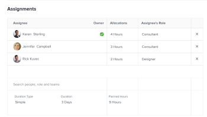

# 使用簡單持續時間類型更新任務的計畫小時數和持續時間

依預設，Adobe Workfront會根據「計畫小時數」計算具有「簡單持續時間類型」的任務的「持續時間」。 不過，您也可以在Workfront的某些區域中，手動編輯「計畫小時數」和「簡單持續時間」任務的持續時間。

您可以編輯具有「簡單持續時間類型」的任務的「計畫小時數」和「持續時間」，或在「工作總攬」區域的任務層編輯。

如需內嵌編輯資訊的詳細資訊，請參閱 [在Adobe Workfront中內嵌編輯清單中的項目](../../../workfront-basics/navigate-workfront/use-lists/inline-edit-objects.md).

本文介紹如何在任務層的「分配」區域更新具有「簡單持續時間類型」的任務的「計畫小時數」和「持續時間」。

## 存取需求

您必須具備下列存取權，才能執行本文中的步驟：

<table style="table-layout:auto"> 
 <col> 
 <col> 
 <tbody> 
  <tr> 
   <td role="rowheader">Adobe Workfront計畫*</td> 
   <td> 
任何
 </td> 
  </tr> 
  <tr> 
   <td role="rowheader">Adobe Workfront授權*</td> 
   <td> 
工作或更高
 </td> 
  </tr> 
  <tr> 
   <td role="rowheader">訪問級別配置*</td> 
   <td> 
編輯對任務的訪問
 
注意：如果您仍無權存取，請洽詢您的Workfront管理員，他們是否在您的存取層級設定其他限制。 如需Workfront管理員如何修改您的存取層級的詳細資訊，請參閱 <a href="../../../administration-and-setup/add-users/configure-and-grant-access/create-modify-access-levels.md" class="MCXref xref">建立或修改自訂存取層級</a>.
 </td> 
  </tr> 
  <tr> 
   <td role="rowheader">物件權限</td> 
   <td> 
管理任務的權限
 
有關請求其他訪問的資訊，請參閱 <a href="../../../workfront-basics/grant-and-request-access-to-objects/request-access.md" class="MCXref xref">請求對對象的訪問 </a>.
 </td> 
  </tr> 
 </tbody> 
</table>

&#42;若要了解您擁有的計畫、授權類型或存取權，請聯絡您的Workfront管理員。

## 使用簡單持續時間類型更新任務的計畫小時數和持續時間

>[!IMPORTANT]
>
>在您手動更新「簡單持續時間」任務的「持續時間」後，Workfront會停止根據「計畫時數」計算。

要在「高級分配」框中編輯具有「簡單持續時間類型」的任務的「計畫小時數」和「持續時間」，請執行以下操作：

1. 在任務清單中，按一下要更改其持續時間類型的任務的名稱。
1. 執行下列任一項作業：

   * 按一下 **更多** 圖示  在任務名稱旁，按一下 **編輯**，然後 **分配**.
   * 按一下 **指派給** 或任務題頭的「分配」(Assignments)區域中的分配名稱，然後按一下 **進階**.

1. 輸入 **計畫小時數** 例如10小時。 在分配給任務的所有資源之間平均分配總計計畫小時數。
1. （可選）人工調整分配給任務的每個資源的計畫時數。 任務更新的「計畫小時數」總數，以反映各自分配給資源的新小時數。
1. 輸入任務的值 **持續時間**，例如2天。

   

1. 按一下&#x200B;**儲存**。
