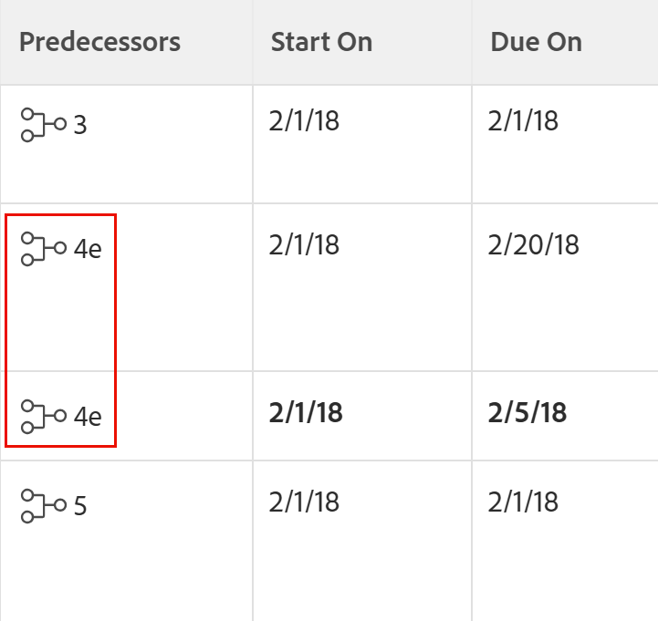

# 強制執行前置任務

<!-- Audited: 11/2025 -->

前置任務是指其他任務需依賴完成的任務。 前置任務關係會影響任務的開始和完成日期，並最終影響專案的時間表。

有關前置任務的資訊，請參閱[前置任務概觀](../../../manage-work/tasks/use-prdcssrs/predecessors-overview.md)。

藉由設定任務之間的前置任務關係，您可以定義相依任務的開始或完成如何取決於其前置任務的開始或完成。 這是使用不同的相依性型別來完成的。

如需相依性型別的相關資訊，請參閱[工作相依性型別的概觀](../../../manage-work/tasks/use-prdcssrs/task-dependency-types.md)。

## 強制前置任務概觀

>[!IMPORTANT]
>
>您必須強制前置任務關係，才能要求前置任務關係必須被接受。 如果不強制前置任務，則相依任務可以獨立於其前置任務的開始和結束來開始和完成，無論其相依性型別為何。

在專案中設定前置任務時，您可以強制執行前置任務關係。

如果前置任務已強制執行，則前置任務完成之前無法開始後續任務。 例如，強製作業A與作業B之間的「完成 — 開始」關係表示，在作業A標籤為完成之前，作業B無法開始（「狀態」必須保持為「新」，而「完成百分比」必須保持為0%）。 強制關係適用於所有前置任務型別。

## 存取權要求

+++ 展開以檢視這篇文章中所述功能的存取權要求。

<table style="table-layout:auto"> 
 <col> 
 <col> 
 <tbody> 
  <tr> 
   <td role="rowheader">Adobe Workfront 封裝</td> 
   <td> 
任何
 </td> 
  </tr> 
  <tr> 
   <td role="rowheader">Adobe Workfront授權</td> 
   <td>
標準
 
   
規劃
 </td> 
  </tr> 
  <tr> 
   <td role="rowheader">存取層級設定</td> 
   <td> 
編輯任務與專案的存取權
 </td> 
  </tr> 
  <tr> 
   <td role="rowheader">物件許可權</td> 
   <td> 
管理任務和專案的許可權
</td> 
  </tr> 
 </tbody> 
</table>

如需詳細資訊，請參閱Workfront檔案中的[存取需求](/help/quicksilver/administration-and-setup/add-users/access-levels-and-object-permissions/access-level-requirements-in-documentation.md)。

+++

<!--
Old:

<table style="table-layout:auto"> 
 <col> 
 <col> 
 <tbody> 
  <tr> 
   <td role="rowheader">Adobe Workfront plan</td> 
   <td> 
Any
 </td> 
  </tr> 
  <tr> 
   <td role="rowheader">Adobe Workfront license</td> 
   <td>
      
New: Standard
 
      
OR

      
Current: Plan

   </td> 
  </tr> 
  <tr> 
   <td role="rowheader">Access level configurations</td> 
   <td> 
Edit access to Tasks and Projects
 </td> 
  </tr> 
  <tr> 
   <td role="rowheader">Object permissions</td> 
   <td>
Manage permissions to the tasks and the project
</td> 
  </tr> 
 </tbody> 
</table>
-->

## 在任務層級強制執行前置任務

1. 移至您要執行其前置任務的後續任務。
1. 按一下左側面板中的&#x200B;**前置任務**，然後按一下&#x200B;**新增前置任務**。
1. （條件式）如果您想要新增跨專案前置任務，請移除&#x200B;**父專案**&#x200B;欄位中的專案名稱，並以其他專案取代。
1. 在&#x200B;**任務**&#x200B;欄位中指定前置任務名稱。
1. 指定這兩個工作之間的&#x200B;**相依性型別**。

   預設&#x200B;**相依性型別**&#x200B;為&#x200B;**完成開始**。

1. 選取&#x200B;**強制**&#x200B;欄位以強制前置任務。
1. 按一下「**儲存**」。

## 在任務清單中強制前置任務

1. 前往專案上的工作清單。
1. 從&#x200B;**檢視**&#x200B;下拉式功能表中，選取&#x200B;**標準檢視**。

1. 對要指定為前置任務的工作數量做心理上的記事。
1. 尋找您要執行其前置任務的後續任務。
1. 在&#x200B;**前置任務**&#x200B;欄中，開始輸入前置任務編號，然後輸入&quot;e&quot;。 例如，輸入「1e」將任務編號1新增為所選任務的前置任務。
1. 按一下Enter以儲存任務的前置任務資訊。

   

   隨即會立即儲存前置任務的相關資訊。
