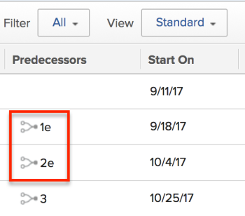

# 強制前置作業

前置任務是其它任務依賴於完成的任務。 前置關係會影響任務的「開始」和「完成」日期，最終影響項目的時間軸。

有關前置任務的資訊，請參閱 [任務前置任務概述](../../../manage-work/tasks/use-prdcssrs/predecessors-overview.md).

通過設定任務之間的前置任務關係，可以定義從屬任務的開始或結束如何取決於其前置任務的開始或結束。 這是使用不同的相依類型來完成的。

如需相依性類型的相關資訊，請參閱 [任務相關性類型概述](../../../manage-work/tasks/use-prdcssrs/task-dependency-types.md).

## 強制前置任務概述

>[!IMPORTANT]
>
>必須強制前任，要求前任關係得到尊重。 不強制前置任務，從屬任務可以獨立於其前置任務的開始和結束，而不管其「從屬類型」如何。

在項目上設定前置項時，可以強制實施前置項關係。

如果前置任務被執行，則後置任務無法在前置任務完成之前啟動。 例如，強制任務A和任務B之間的「完成 — 開始」關係意味著在任務A標籤為已完成之前，任務B無法啟動（狀態必須保持為New，而完成百分比必須保持為0%）。 強制關係適用於所有前置類型。

## 存取需求

您必須具備下列存取權，才能執行本文中的步驟：

<table style="table-layout:auto"> 
 <col> 
 <col> 
 <tbody> 
  <tr> 
   <td role="rowheader">Adobe Workfront計畫*</td> 
   <td> 
任何
 </td> 
  </tr> 
  <tr> 
   <td role="rowheader">Adobe Workfront授權*</td> 
   <td> 
計劃 
 </td> 
  </tr> 
  <tr> 
   <td role="rowheader">訪問級別配置*</td> 
   <td> 
編輯對任務和項目的訪問
 
注意：如果您仍無權存取，請洽詢您的Workfront管理員，他們是否在您的存取層級設定其他限制。 如需Workfront管理員如何修改您的存取層級的詳細資訊，請參閱 <a href="../../../administration-and-setup/add-users/configure-and-grant-access/create-modify-access-levels.md" class="MCXref xref">建立或修改自訂存取層級</a>.
 </td> 
  </tr> 
  <tr> 
   <td role="rowheader">物件權限</td> 
   <td> 
管理任務和專案的權限
 
有關請求其他訪問的資訊，請參閱 <a href="../../../workfront-basics/grant-and-request-access-to-objects/request-access.md" class="MCXref xref">請求對對象的訪問 </a>.
 </td> 
  </tr> 
 </tbody> 
</table>

&#42;若要了解您擁有的計畫、授權類型或存取權，請聯絡您的Workfront管理員。

## 在任務層強制執行前任

1. 轉到要強制執行其前身的後繼任務。
1. 按一下 **前置任務** 在左側面板中，按一下 **添加前置任務**. 您可能需要按一下 **顯示更多**，然後 **前置任務**.
1. （條件性）如果您想要新增跨專案前置項目，請移除 **上層專案** 欄位，並以其他專案取代。
1. 指定前置任務或任務的名稱， **工作** 欄位。
1. 指定 **相依類型** 這兩個任務之間。

   預設 **相依類型** is **完成開始**.

1. 選取 **強制** 欄位來執行前置作業。
1. 按一下&#x200B;**儲存**。

## 在任務清單中強制執行前置任務

1. 轉到項目上的任務清單。
1. 從 **檢視** 下拉式功能表，選取 **標準檢視**.

1. 在腦中記下要指定為前身的任務數。
1. 查找要強制執行其前置任務的後續任務。
1. 在 **前置任務** 欄，開始輸入前置任務的編號，後跟「e」。 例如，鍵入&quot;1e&quot;將任務編號1添加為選定任務的前置任務。
1. 按一下Enter以保存任務的前置資訊。

   
