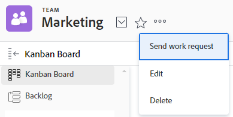

# 停用或刪除團隊

您可以停用不再使用的團隊，同時保留關聯的歷史資料。 [!DNL Adobe Workfront]管理員可隨時從設定中的團隊區域重新啟用團隊。 如果您停用專案團隊，專案團隊將不再顯示在下列區域中：

<table style="table-layout:auto"> 
 <col> 
 <col> 
 <tbody> 
  <tr> 
   <td> 
    <ul> 
     <li> 
自訂表單中的預先輸入欄位
 </li> 
    </ul> 
    <ul> 
     <li> 
物件的共用對話方塊
 </li> 
     <li> 
[!UICONTROL 使用者設定檔]*
 </li> 
    </ul> </td> 
   <td> 
    <ul> 
     <li> 
[!UICONTROL 團隊]區域中的主要選取下拉式功能表
 </li> 
     <li> 
[!UICONTROL 指派]自動提示
 </li> 
     <li> 
專案中的[!UICONTROL 新增到Kanban]展示板對話方塊
 </li> 
    </ul> </td> 
  </tr> 
 </tbody> 
</table>

當您搜尋團隊時，已停用的團隊不會出現，但如果在停用之前已將使用者指派給團隊，則仍會顯示在[!UICONTROL 主團隊]和其他團隊中。

## 存取需求

+++ 展開以檢視本文中功能的存取需求。

您必須具有下列存取權才能執行本文中的步驟：

<table style="table-layout:auto"> 
 <col> 
 <col> 
 <tbody> 
  <tr data-mc-conditions=""> 
   <td role="rowheader">Adobe Workfront計畫</td> 
   <td>任何</td> 
  </tr> 
  <tr> 
   <td role="rowheader">Adobe Workfront授權</td> 
   <td>
   
新增：標準

   
或

   
目前：計畫
</td>
  </tr>
  <tr>
   <td>存取層級設定</td>
   <td>
若要停用群組，不需要任何設定。

   
若要刪除專案團隊，您必須是系統管理員。
</td>
  </tr>
 </tbody> 
</table>

如需有關此表格的詳細資訊，請參閱Workfront檔案中的[存取需求](/help/quicksilver/administration-and-setup/add-users/access-levels-and-object-permissions/access-level-requirements-in-documentation.md)。

+++

## 停用團隊

在停用之前指派給團隊的任何工作都會維持指派狀態。 建議您先重新指派工作，再停用團隊。

>[!TIP]
>
>您可以建立報告，以篩選仍然指派已停用團隊的任何任務或問題。

使用請求佇列時，如果您停用在路由規則中指派為預設專案團隊的專案團隊，專案團隊會保留，請求仍會路由至已停用的專案團隊。 建議您先更新作用中團隊的路由規則，然後再停用團隊。

{{step1-to-team}}

1. 按一下&#x200B;**[!DNL Switch team]**&#x200B;圖示，然後從下拉式選單中選取新專案團隊或在搜尋列中搜尋專案團隊。
1. 按一下&#x200B;**[!UICONTROL 更多]**&#x200B;功能表，然後選取&#x200B;**[!UICONTROL 編輯]**。

   

1. 清除團隊設定中的&#x200B;**[!UICONTROL 作用中]**&#x200B;核取方塊。
1. 按一下&#x200B;**[!UICONTROL 儲存變更]**。

## 停用團隊的已知限制

已停用的團隊會顯示在下列區域中：

* [!DNL Workfront Goals]中的擁有者欄位。 這需要[!DNL Adobe Workfront Goals]的額外授權。 如需詳細資訊，請參閱[開始使用 [!DNL Adobe Workfront Goals]](../../workfront-goals/goal-management/getting-started-with-wf-goals.md)。

## 刪除團隊

只有系統管理員可以刪除團隊。 如果您是團隊擁有者（但不是管理員）並嘗試刪除團隊，您會看到一則錯誤訊息。

若要刪除專案團隊：

{{step1-to-team}}

1. 按一下&#x200B;**[!DNL Switch team]**&#x200B;圖示，然後從下拉式選單中選取新專案團隊或在搜尋列中搜尋專案團隊。
1. 按一下&#x200B;**[!UICONTROL 更多]**&#x200B;功能表，然後選取&#x200B;**[!UICONTROL 刪除]**。

   

1. 在確認訊息上按一下&#x200B;[!UICONTROL **確認**]&#x200B;以永久刪除團隊。 已刪除的團隊無法復原。
