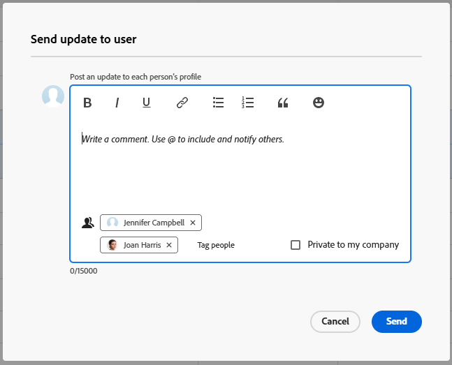

# 傳送直接訊息給其他使用者

[!DNL Adobe Workfront]可讓您快速輕鬆地直接傳送與任何工作專案無關的訊息給其他[!DNL Workfront]使用者。 依照此節所述傳送的訊息會顯示在使用者設定檔頁面的[!UICONTROL 更新]索引標籤中，且所有使用者皆可看到。 如需更新的其他資訊，請參閱[更新工作專案並檢視更新：文章索引](../../workfront-basics/updating-work-items-and-viewing-updates/update-work-items-and-view-updates.md)。

傳送訊息給的使用者會在您傳送訊息時收到下列型別的通知，如本節所述：

* 應用程式內通知，如[檢視和管理應用程式內通知](../../workfront-basics/using-notifications/view-and-manage-in-app-notifications.md)中所述
* 電子郵件通知

  這取決於使用者設定為要接收的電子郵件通知型別。 如需詳細資訊，請參閱[設定系統中每個人的事件通知](../../administration-and-setup/manage-workfront/emails/configure-event-notifications-for-everyone-in-the-system.md)、[檢視和設定群組的事件通知](../../administration-and-setup/manage-groups/create-and-manage-groups/view-and-configure-event-notifications-group.md)以及[修改您自己的電子郵件通知](../../workfront-basics/using-notifications/activate-or-deactivate-your-own-event-notifications.md)。

## 存取需求

+++ 展開以檢視本文中功能的存取需求。

您必須具有下列存取權才能執行本文中的步驟：

<table style="table-layout:auto"> 
 <col> 
 <col> 
 <tbody> 
  <tr data-mc-conditions=""> 
   <td role="rowheader">Adobe Workfront計畫</td> 
   <td>任何</td> 
  </tr> 
  <tr> 
   <td role="rowheader">Adobe Workfront授權</td> 
   <td>
   
若要從使用者的設定檔頁面傳送訊息，您必須擁有： 
   新增：淺色或更高 
   或 
   目前：檢閱或以上

   
若要從使用者清單傳送訊息，您必須擁有： 
   新增： Standard 
   或 
   目前：工作或以上
</td>
  </tr> 
 </tbody> 
</table>

如需有關此表格的詳細資訊，請參閱Workfront檔案中的[存取需求](/help/quicksilver/administration-and-setup/add-users/access-levels-and-object-permissions/access-level-requirements-in-documentation.md)。

+++

## 從另一個使用者的設定檔頁面傳送與工作專案無關的訊息給該使用者

1. 前往您要傳送訊息之使用者的設定檔頁面。

   若要導覽至使用者的設定檔頁面，請按一下連結的使用者名稱，因為該名稱出現在[!DNL Workfront]介面的任何位置。 使用者名稱會顯示在許多區域中，例如使用者所做的註解。

1. 在&#x200B;**[!UICONTROL 更新]**&#x200B;索引標籤上，按一下文字方塊欄位。

   ![訊息使用者在[!UICONTROL 更新]索引標籤](assets/send-message-to-user-on-updates-tab.png)

1. 輸入您的訊息。
1. （選擇性）按一下&#x200B;**[!UICONTROL 通知]**&#x200B;欄位，然後開始輸入您想要包含在此訊息中的其他使用者名稱。

1. （選擇性）選取&#x200B;**[!UICONTROL 我的公司私有]**，讓此訊息僅對您公司的其他使用者可見。

   >[!TIP]
   >
   >[!UICONTROL **我的公司專用**]&#x200B;設定只有在您的Workfront設定檔與公司相關聯時才可用。

1. 按一下&#x200B;**[!UICONTROL 更新]。**
訊息會張貼在使用者設定檔頁面的**[!UICONTROL 更新]**&#x200B;索引標籤上的訊息清單頂端。

## 從使用者清單傳送訊息給一或多位使用者

只有當您擁有「標準」、「計畫」或「工作」授權時，才能使用此選項。

{{step-1-to-users}}

1. 選取您要傳送訊息給的一或多位使用者，然後按一下&#x200B;[!UICONTROL **傳送更新給使用者**]。
1. 在[!UICONTROL 傳送更新給使用者]視窗中輸入您的訊息。 視需要使用文字格式選項。 如需詳細資訊，請參閱文章[更新工作](/help/quicksilver/workfront-basics/updating-work-items-and-viewing-updates/update-work.md#use-rich-text-in-a-workfront-comment)中的[在Workfront註解中使用RTF文字](/help/quicksilver/workfront-basics/updating-work-items-and-viewing-updates/update-work.md)。

   傳送更新給使用者視窗上的

1. （選擇性）按一下「**標籤人員**」以在訊息上標籤任何其他使用者。 如需詳細資訊，請參閱[標籤其他人的更新](/help/quicksilver/workfront-basics/updating-work-items-and-viewing-updates/tag-others-on-updates.md)。
1. （選擇性）選取&#x200B;**[!UICONTROL 我的公司私有]**，讓此訊息僅對您公司的其他使用者可見。

   >[!TIP]
   >
   >[!UICONTROL **我的公司專用**]&#x200B;設定只有在您的Workfront設定檔與公司相關聯時才可用。
1. 按一下&#x200B;[!UICONTROL **傳送**]。
此郵件張貼在每個已標籤使用者設定檔頁面的**[!UICONTROL 更新]**&#x200B;索引標籤上的郵件清單頂端。
