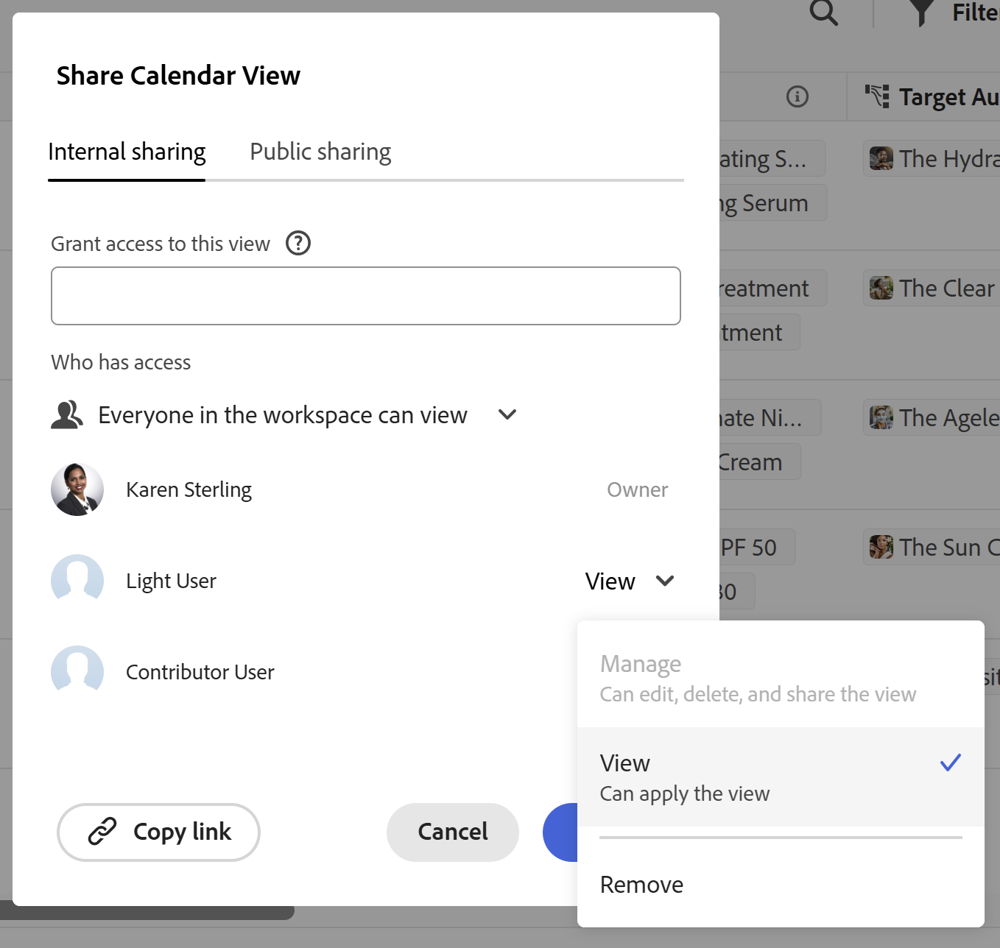

# 使用Adobe Workfront Planning時的授權型別概觀

<!--
The highlighted information on this page refers to functionality not yet generally available. It is available only in the Preview environment for all customers. After the release to Preview, the same features are also available monthly in the Production environment for customers who enabled fast releases.    

For information about fast releases, see [Enable or disable fast releases for your organization](/help/quicksilver/administration-and-setup/set-up-workfront/configure-system-defaults/enable-fast-release-process.md). 
-->

<!--{{planning-important-intro}}-->

>[!IMPORTANT]
>
>本文資訊為Adobe Workfront Planning。 Workfront Planning是獨立產品，或是另外購買的Adobe Workfront功能。
>
>
>本文包含客戶同時購買Workfront或Workflow套件時，有關Workfront Planning的一般資訊。
>
>如需包含Workfront Planning檔案的完整文章清單，請參閱[Adobe Workfront Planning的一般資訊和文章索引](/help/quicksilver/planning/planning-information.md)。
>
>如需Workfront Planning作為獨立產品的詳細資訊，請參閱[開始使用Adobe Workfront Planning作為獨立產品](/help/quicksilver/planning/planning-sta/planning-sta-overview.md)。

您的Adobe Workfront工作流程授權型別可與Adobe Workfront Planning授權型別搭配使用，並與Planning許可權搭配使用，以提供下列存取權：

* 檢視、貢獻或管理工作區、記錄型別和記錄。
* 檢視或管理檢視。

如需Workfront Planning中物件的許可權相關資訊，請參閱[在Adobe Workfront Planning中共用許可權概觀](/help/quicksilver/planning/access/sharing-permissions-overview.md)。

如需有關存取Workfront Planning的資訊，請參閱[Adobe Planning存取總覽](/help/quicksilver/planning/access/access-overview.md)。

## 工作流程與Planning授權型別之間的關係

使用者的存取層級可以與以下授權型別相關聯：

* 工作流程授權類型
* 規劃授權類型

如需詳細資訊，請參閱[建立和修改自訂存取層級](/help/quicksilver/administration-and-setup/add-users/configure-and-grant-access/create-modify-access-levels.md)。

可用於指派使用者的Planning授權型別依貴組織購買的Workfront套件而異。

<!--

This list also exists here: \help\quicksilver\planning\planning-sta\planning-sta-overview.md
-->

您的組織可以透過數種方式購買Workfront Planning：

* 與Workfront Workflow套件搭配使用，提供相同數量的Workflow和Planning授權。 使用者可取得Adobe Workfront Workflow和Planning完整功能的存取權。
* 與Workfront Workflow套件搭配使用，其中包含不同數量的Workflow和Planning授權。 使用者可獲得Adobe Workfront Workflow完整功能的存取權，以及Workfront Planning的有限存取權。
* Workfront Planning本身，作為獨立產品。 使用者無權存取Workfront Workflow功能，且擁有Workfront Planning功能的完整存取權。 如需詳細資訊，請參閱[開始使用Adobe Workfront Planning作為獨立產品](/help/quicksilver/planning/planning-sta/planning-sta-overview.md)。

下表說明「工作流程」與Planning授權型別之間的關係，以及根據這些授權的使用者功能：

| Workfront套件 | Planning授權型別 | 工作流程授權型別 | 授權功能 |
|---|---|---|---|
| 計畫與工作流程 — 相同數量的授權 | 標準、貢獻者、無存取權 | 標準、輕度、投稿人 | - Planning和Workflow授權型別在存取層級上是不同的設定 - Planning授權型別允許Standard、Contributor和空白選項 - Planning授權型別在任何存取層級上都可以保留空白 — 具有此存取層級的使用者無法存取Planning  — 工作流程授權型別不能保留空白  — 不允許具有工作流程參與者授權組合的Planning Standard - Planning Standard只能搭配工作流程輕度授權和標準授權一起選取 |
| 計畫與工作流程 — 不平均的授權數目 | 標準，無存取權 | 標準、輕度、投稿人 | - Planning和Workflow授權型別在存取層級上為個別設定 - Planning授權型別僅允許「標準」或「無存取」選項  — 可選取具有任何Workflow授權型別的Planning Standard  - Planning授權型別可為「無」 — 具有此存取層級的使用者完全無法存取Planning資料  — 工作流程授權型別不可在任何存取層級上保留空白  — 具有Planning Contributor授權的使用者可以在Planning中檢視已連線的Workflow物件，但無法連線或中斷連線 |

如需Workfront Planning授權的相關詳細資訊，請參閱[Adobe Workfront Planning存取權概觀](/help/quicksilver/planning/access/access-overview.md)。

<!--
not sure if we need this anymore, this is before STA launched:

| Adobe Workfront license type                                   | Highest permissions allowed in Adobe Workfront Planning                                                                                                                                             |
|------------------------------------------------|-------------------------------------------------------------------------------------------------------------------------------------------------------------------------------|
|Standard                     | 
Users can manage workspaces, record types, records, and views. They can create, edit, or delete workspaces, record types, records, fields, and views.
 
System administrators have Manage permissions to all workspaces, including the ones they did not create.
                                                                                                                     |
| Light or Contributor  | 
Users can view the workspaces shared with them, as well as the record types, records, and fields of those workspaces.
   
Users can view the views shared with them, but they cannot create their own. 
  
Users cannot create, edit, or delete workspaces, record types, records, or fields.
|
-->

<!--
Old: 
*Workfront Planning is not available for legacy Workfront licenses. 
For more information, see [Access requirements in Workfront documentation](/help/quicksilver/administration-and-setup/add-users/access-levels-and-object-permissions/access-level-requirements-in-documentation.md).
-->

## 授權型別以及工作區與記錄型別的許可權

將使用者許可權授予工作區也會授予他們記錄型別、記錄和欄位的許可權。

除了使用者擁有的工作區許可權外，您還必須授予使用者各別的檢視許可權，才能存取和管理檢視。

使用記錄型別許可權時，請考慮下列事項：

* 使用者會自動從工作區繼承記錄型別許可權。
* 當使用者具有工作區的管理許可權時，他們無法擁有記錄型別的較小存取許可權。
* 使用者對記錄型別的許可權不能超過他們對該記錄型別所屬的工作區的許可權。
* 移除使用者對記錄型別的許可權不會移除他們對工作區中所有記錄型別的檢視存取權，因為這不會移除他們對工作區的許可權。

只有擁有Planning Standard授權的使用者才能擁有工作區與記錄型別的「貢獻」或「管理」許可權。 依預設，工作區和記錄型別的「貢獻和管理」許可權也會傳輸至記錄和欄位。

管理員可以檢視系統中的所有工作區，包括他們未建立的工作區。

<!--
Lilit asked for this to be removed as there is no Planning Admin license/ access for combos: 
>[!TIP]
>
>Planning Administrator access is automatically assigned to users that you create as Administrators in the Adobe Admin Console. 
>
>For information, see [Manage users in the Adobe Admin Console](/help/quicksilver/administration-and-setup/add-users/create-and-manage-users/admin-console.md).

Users with all other license types can have View permissions to workspaces and record types  shared with them, as well as to their records and fields. 
-->

>[!INFO]
>
>**範例：**
>
>Planning貢獻者或工作流程輕度使用者無法貢獻或管理工作區及其物件。
>
>共用方塊中會顯示當使用者擁有較低層級的授權時，由於這些許可權層級變暗，因此無法授予他們參與或管理工作區的許可權。
>
>

## 檢視的授權型別和許可權

只有擁有Planning Standard授權的使用者才能擁有檢視的「管理」許可權。

管理員無法存取他們未建立的檢視。 他們必須與其共用。

具有所有其他授權型別的使用者可以擁有與其共用檢視的檢視許可權。

>[!INFO]
>
>**範例：**
>
>Planning貢獻者或工作流程輕度授權使用者無法管理檢視。 他們可以套用臨時篩選器、排序或分組到他們可以存取的檢視。
>
>共用方塊中會顯示當使用者擁有較低層級的授權時，無法授予他們管理檢視的許可權，因為這些許可權層級會變暗。
>
>上輕度使用者的許可權顯示為灰色
