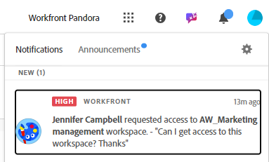
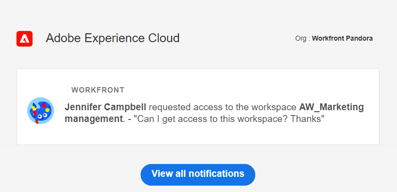

# 要求檢視或工作區的許可權

本頁醒目提示的資訊指出尚未普遍可用的功能。 它僅在預覽環境中可供所有客戶使用。 每月發行至生產環境後，生產環境中為啟用快速發行的客戶也提供相同的功能。

如需快速發行資訊，請參閱[為您的組織啟用或停用快速發行](/help/quicksilver/administration-and-setup/set-up-workfront/configure-system-defaults/enable-fast-release-process.md)。

<!-- 
no longer needed: 
>[!IMPORTANT]
>
>The functionality described in this article is available only when your organization has been onboarded to the Adobe Unified Experience. 
>
>For more information, see [Adobe Unified Experience for Workfront](/help/quicksilver/workfront-basics/navigate-workfront/workfront-navigation/adobe-unified-experience.md). 
-->

當有人與您共用您無權存取之檢視或工作區的連結時，您可以要求檢視或工作區的許可權。

向檢視要求許可權與向工作區要求許可權類似。

本文介紹當有人與您共用連結而您無法存取共用頁面時，如何要求存取檢視或工作區。

如需授予檢視和工作區許可權的相關資訊，請參閱下列文章：

* [共用檢視](/help/quicksilver/planning/access/share-views.md)
* [共用工作區](/help/quicksilver/planning/access/share-workspaces.md)

## 存取權要求

+++ 展開以檢視這篇文章中所述功能的存取權要求。 

<table style="table-layout:auto"> 
<col> 
</col> 
<col> 
</col> 
<tbody> 
    <tr> 
<tr> 
   <td role="rowheader">
Adobe Workfront 封裝
</td> 
   <td> 

任何Workfront和Planning套件
 
或

任何工作流程和Planning套件
 
 </tr>

<tr> 
   <td role="rowheader">
Adobe Workfront授權
</td> 
   <td>
任何
 
  </td> 
  </tr> 
  <tr> 
   <td role="rowheader">
存取層級設定
</td> 
   <td> 
Adobe Workfront Planning沒有存取層級控制
   
</td> 
  </tr> 
<tr> 
   <td role="rowheader">
物件許可權
</td> 
   <td>  
您的許可權要求取得授權後，您就可以取得下列許可權：

   <ul><li>
檢視或管理檢視
</li>
   <li>
檢視、貢獻或管理工作區
</li>
   <li>
檢視、貢獻或管理記錄型別
</li>
   <li>
檢視或管理記錄
</li>
   </ul>  
   
只有對工作區和檢視具有管理許可權的使用者才能公開共用檢視。
</td> 
  </tr> 
<tr>
   <td role="rowheader">
版面配置範本
</td>
   <td> 必須為具有輕度或貢獻者授權的使用者指派包含Planning的版面配置範本。
   
標準使用者和系統管理員預設會啟用Planning區域。

</li></ul>

</td>
  </tr>

</tbody> 
</table>

如需Workfront存取需求的詳細資訊，請參閱Workfront檔案中的[存取需求](/help/quicksilver/administration-and-setup/add-users/access-levels-and-object-permissions/access-level-requirements-in-documentation.md)。

+++

<!--
 Old:
 
 <table style="table-layout:auto"> 
<col> 
</col> 
<col> 
</col> 
<tbody> 
    <tr> 
<tr> 
<td> 
   
 Products
 </td> 
   <td> 
   <ul><li>
 Adobe Workfront
</li> 
   <li>
 Adobe Workfront Planning
</li></ul></td> 
  </tr>   
<tr> 
   <td role="rowheader">
Adobe Workfront plan*
</td> 
   <td> 

Any of the following Workfront plans:
 
<ul><li>Select</li> 
<li>Prime</li> 
<li>Ultimate</li></ul> 

Workfront Planning is not available for legacy Workfront plans
 
   </td> 
<tr> 
   <td role="rowheader">
Adobe Workfront Planning package*
</td> 
   <td> 

Any 
 

For more information about what is included in each Workfront Planning plan, contact your Workfront account manager. 
 
   </td> 
 <tr> 
   <td role="rowheader">
Adobe Workfront platform
</td> 
   <td> 

Your organization's instance of Workfront must be onboarded to the Adobe Unified Experience to be able to access Workfront Planning.
 

<b>IMPORTANT</b>

The users in your organization can request permissions for views and workspaces only when your organization is onboarded to the Adobe Unified Experience. 

For more information, see <a href="/help/quicksilver/workfront-basics/navigate-workfront/workfront-navigation/adobe-unified-experience.md">Adobe Unified Experience for Workfront</a>. 
 
   </td> 
   </tr> 
  </tr> 
  <tr> 
   <td role="rowheader">
Adobe Workfront license*
</td> 
   <td>
 Standard, Light, or Contributor

   
Workfront Planning is not available for legacy Workfront licenses
 
  </td> 
  </tr> 
  <tr> 
   <td role="rowheader">
Access level configuration
</td> 
   <td> 
There are no access level controls for Adobe Workfront Planning
   
</td> 
  </tr> 
<tr> 
   <td role="rowheader">
Object permissions
</td> 
   <td>  
After your request for permission is granted, you could gain the following permissions:

   <ul><li>
View or Manage for a view
</li>
   <li>
View, Contribute, or Manage to a workspace
</li></ul>  
   
Only users with Manage permissions to a workspace and a view can share a view publicly.
</td> 
  </tr> 
<tr>
   <td role="rowheader">
Layout template
</td>
   <td> Users with a Light or Contributor license must be assigned a layout template that includes Planning.
   
Standard users and System Administrators have the Planning areas enabled by default.

</li></ul>
  
</td>
  </tr>
 
</tbody> 
</table>
-->

## 要求許可權

要求檢視許可權與要求工作區、記錄型別或記錄的許可權類似。

當有人與您共用工作區的連結、錄製型別、錄製，或您沒有存取權的檢視時：

1. 按一下與您共用的連結，以檢視或工作區。

   顯示&#x200B;**您沒有存取權**&#x200B;頁面，通知您您沒有檢視或工作區的存取權。

   

   >[!NOTE]
   >
   >當您沒有記錄型別或記錄的存取權時，「您沒有存取權」頁面會顯示您必須擁有工作區的存取權。

1. （視條件而定）如果共用的連結是針對您有存取權的工作區的檢視，請按一下&#x200B;**以現有檢視開啟**。 如果您有存取工作區的許可權，記錄型別頁面會在預設檢視中開啟。

1. （選擇性和條件性）如果您沒有檢視工作區的許可權，請在可用的方塊中新增個人化訊息，然後按一下&#x200B;**要求存取**。

   所有具有檢視或工作區管理許可權的使用者都會收到下列存取請求通知：
   * 應用程式內通知
     
   * 電子郵件通知
     

1. （視條件而定）當檢視或工作區管理員授予您檢視或工作區的許可權時，您會收到電子郵件通知和應用程式內通知，其中包含已授予許可權的確認。<!--check this - I was not able to test this, but Isk confirmed.-->
