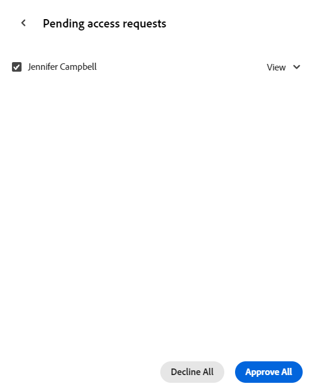

<!-- take the Remove permissions section out, at the end - this is what Lilit said: Because of "Everyone in the workspace can view" wildcard, currently it's not possible to entirely remove access to a record type. Let's take out this section. -->

# 共用記錄型別

<!--The information on this page refers to functionality not yet generally available. It is available only in the Preview environment for all customers. After the monthly releases to Production, the same features are also available in the Production environment for customers who enabled fast releases.    

For information about fast releases, see [Enable or disable fast releases for your organization](/help/quicksilver/administration-and-setup/set-up-workfront/configure-system-defaults/enable-fast-release-process.md). -->

{{planning-important-intro}}

您可以在Adobe Workfront Planning中處理記錄時，與其他人共用記錄型別以確保共同作業。

>[!IMPORTANT]
>
>有權存取工作區的使用者至少會自動取得工作區中所有記錄型別的檢視許可權。
>&#x200B;>共用檢視未授予使用者記錄型別的許可權。 只有共用工作區才能授予使用者記錄型別的許可權。
>
>* 如需在Workfront Planning中共用物件的一般資訊，另請參閱[在Adobe Workfront Planning中共用許可權概觀](/help/quicksilver/planning/access/sharing-permissions-overview.md)。
>* 如需詳細資訊，請參閱本文中的[共用記錄型別](#considerations-when-sharing-record-types)時的考量事項。

## 存取需求

+++ 展開以檢視存取需求。

<!--at GA, check that the Workfront plans article linked below has Planning info-->

您必須具有下列存取權才能執行本文中的步驟：

<table style="table-layout:auto"> 
<col> 
</col> 
<col> 
</col> 
<tbody> 
    <tr> 
<tr> 
<td> 
   
 產品
 </td> 
   <td> 
   <ul><li>
 Adobe Workfront
</li> 
   <li>
 Adobe Workfront規劃
</li></ul></td> 
  </tr>   
<tr> 
   <td role="rowheader">
Adobe Workfront計畫*
</td> 
   <td> 

下列任一Workfront計畫：
 
<ul><li>選取</li> 
<li>Prime</li> 
<li>Ultimate</li></ul> 

舊版Workfront計畫不提供Workfront計畫
 
   </td> 
<tr> 
   <td role="rowheader">
Adobe Workfront規劃套件*
</td> 
   <td> 

任何 
 

如需每個Workfront計畫包含內容的詳細資訊，請聯絡您的Workfront客戶經理。 
 
   </td> 
 <tr> 
   <td role="rowheader">
Adobe Workfront平台
</td> 
   <td> 

貴組織的Workfront例項必須上線至Adobe Unified Experience，才能存取Workfront Planning。
 

必須將使用者新增到Adobe Admin Console才能取得Workfront Planning檢視的許可權。

如需詳細資訊，請參閱<a href="/help/quicksilver/workfront-basics/navigate-workfront/workfront-navigation/adobe-unified-experience.md">適用於Workfront的Adobe Unified Experience</a>。 
 
   </td> 
   </tr> 
  </tr> 
  <tr> 
   <td role="rowheader">
Adobe Workfront授權*
</td> 
   <td>
 標準

   
Workfront計畫不適用於舊版Workfront授權
 
  </td> 
  </tr> 
  <tr> 
   <td role="rowheader">
存取層級設定
</td> 
   <td> 
Adobe Workfront Planning沒有存取層級控制
   
</td> 
  </tr> 
<tr> 
   <td role="rowheader">
物件許可權
</td> 
   <td>  
管理記錄型別的許可權
  
   
只有具有工作區管理許可權的使用者才能共用記錄型別的管理許可權
</td> 
  </tr>

</tbody> 
</table>

*如需Workfront存取需求的詳細資訊，請參閱Workfront檔案中的[存取需求](/help/quicksilver/administration-and-setup/add-users/access-levels-and-object-permissions/access-level-requirements-in-documentation.md)。

+++

## 共用記錄型別時的注意事項

* 根據預設，授予工作區許可權可為使用者提供工作區中記錄型別的相同許可權。

  此外，您可以調整個別記錄型別的許可權。

  不過，您無法授予人員比其對工作區的許可權更高的許可權來使用記錄型別。
* 您可以授予使用者比他們在工作區上更低的記錄型別許可權。 例如，他們可以擁有工作區的貢獻許可權，以及記錄型別的檢視許可權。
* 擁有工作區之「管理」許可權的人，一律保留對工作區中所有記錄型別的「管理」存取權。 即使已關閉繼承許可權，其記錄型別的許可權也無法降低。

* 目前，當您共用記錄型別時，可以達成下列目標：

   * 當您第一次與他人共用記錄型別，而對方沒有任何工作區許可權時，提供人員的工作區檢視許可權。

     這也會授予他們工作區中所有記錄型別的檢視許可權。

     當您授予他們記錄型別的許可權時，共用方塊中會顯示這些許可權也已新增至工作區。
   * 當您停用「繼承」許可權時，讓記錄型別僅供工作區中的每個人檢視（工作區管理員除外）。

     擁有工作區管理許可權的人員一律對記錄型別擁有管理許可權，即使您關閉記錄型別的繼承許可權亦然。
   * 降低人員對記錄型別的許可權。 您無法根據某人在工作區中的擁有權來增加其對記錄型別的許可權。

     例如，如果某人擁有工作區的「貢獻內容」許可權，您可以將其許可權變更為檢視的特定記錄型別。 但是，如果他們擁有工作區的檢視許可權，您無法將任何記錄型別的貢獻許可權授予他們。

* 無法移除工作區中人員的記錄型別存取權。 如果每個人都至少擁有工作區的檢視許可權，則至少每個人都擁有所有記錄型別的檢視許可權。

* 您可以在內部與下列實體共用記錄型別：

  Workfront使用者、群組、團隊、公司和職位角色
* 您無法從外部與Workfront外部的使用者共用記錄型別。
* 若要將工作區許可權不高於記錄型別檢視許可權的使用者授予記錄型別，您必須先以高於檢視的許可權與他們共用工作區。 工作區的較高許可權將套用至記錄型別。

## 共用記錄型別的許可權

如果您有工作區的管理許可權，您可以調整工作區的個別記錄型別的許可權。

{{step1-to-planning}}

1. 開啟您要共用其記錄型別的工作區，然後按一下記錄型別卡片。

   這會開啟記錄型別頁面。

1. 從任何檢視的索引標籤，按一下記錄型別右上角的&#x200B;**共用**。
1. 按一下&#x200B;**共用記錄型別**。

   **共用**&#x200B;方塊開啟。

   

1. （選擇性）在&#x200B;**擁有存取權**&#x200B;區域中，預設會選取&#x200B;**工作區中的每個人都可以檢視**&#x200B;選項。  對工作區具有「檢視」或更高許可權的所有使用者都可以檢視記錄型別。

1. （選擇性）按一下&#x200B;**繼承的許可權**&#x200B;選項下的使用者人數，以檢視從工作區繼承許可權的使用者、團隊、群組、公司或工作角色。

   >[!TIP]
   >
   >您無法從繼承的許可權清單中移除個別實體。

1. （選擇性和條件性）如果您想要與特定實體共用記錄型別，並授予他們不同於工作區現有的記錄型別存取權，請執行以下操作：

   1. 從&#x200B;**繼承許可權**&#x200B;下拉式功能表中選取&#x200B;**停用**。

   >[!TIP]
   >
   >Workspace管理員繼續擁有該記錄型別的管理許可權。

   1. 在&#x200B;**授與此記錄型別**&#x200B;的存取權欄位中，新增您想要授與不同於工作區之許可權等級的使用者、團隊、群組、公司或工作角色。
   1. 選擇許可權層級。

   >[!IMPORTANT]
   >
   >* 除了團隊、群組、公司和職務角色之外，您只能與已新增至Adobe Admin Console的使用者共用。 您無法新增僅限Workfront的使用者。 如需詳細資訊，請參閱[在Adobe Admin Console中管理使用者](/help/quicksilver/administration-and-setup/add-users/create-and-manage-users/admin-console.md)。
   >* 您永遠都不能授予使用者比他們在工作區上更大的記錄型別許可權。
   >* 如果使用者擁有工作區的「管理」許可權，則您無法授予比「管理」更小的使用者記錄型別許可權。
   >* 如果使用者擁有工作區的貢獻許可權，您可以授予他們較少記錄型別的許可權。
   > 如需詳細資訊，請參閱[在Adobe Workfront Planning中共用許可權的總覽](/help/quicksilver/planning/access/sharing-permissions-overview.md)。

1. 若要為沒有工作區存取許可權的使用者授予檢視記錄型別的存取許可權，請在&#x200B;**授予此檢視的存取許可權**&#x200B;欄位中，開始輸入使用者、群組、團隊、公司或工作角色的名稱，然後在其顯示在清單中時按一下該名稱。

   您選取的實體已新增至記錄型別以及具有&#x200B;**檢視**&#x200B;許可權的工作區。

   系統管理員一律會獲得記錄與其共用的型別的管理許可權，並且有跡象表明使用者是系統管理員。

1. （選擇性）按一下&#x200B;**複製連結**&#x200B;以將記錄型別的連結複製到剪貼簿，並與他人共用。
1. 按一下「**儲存**」。

   記錄型別現在與其他使用者共用。
您與其共用記錄型別的使用者會同時收到應用程式內和電子郵件通知，告知其擁有下列實體的特定許可權：

   * 記錄型別
   * 工作區（如果在與他們共用記錄型別之前，他們未擁有工作區的許可權）。

1. 與他人共用複製的連結。 收到連結的使用者必須是作用中使用者，並登入Workfront，才能存取記錄型別頁面並在選取的檢視中顯示該頁面。 使用者必須具有記錄型別的許可權才能檢視該記錄型別。

## 移除記錄型別的許可權

您可以從記錄型別中移除使用者的許可權。 但他們將保留工作區的至少檢視許可權，這也會授予他們記錄型別的至少檢視許可權。 如果您希望他們沒有工作區中記錄型別的許可權，則必須從工作區中移除他們的存取權。

{{step1-to-planning}}

1. 開啟您要停止共用其記錄型別的工作區，然後按一下記錄型別卡片。 這會開啟記錄型別頁面。

1. 從任何檢視的索引標籤，按一下記錄型別右上角的&#x200B;**共用**。
1. 按一下&#x200B;**共用記錄型別**。

   **共用**&#x200B;方塊開啟。
1. 尋找您要移除其許可權的使用者、群組、團隊、公司或工作角色，展開其名稱右側的許可權下拉式功能表，然後按一下&#x200B;**移除**。<!--check the screen shot below - the UI text for View might not be accurate-->

   

1. 按一下「**儲存**」。

   人員不再具有記錄型別的指定許可權。 但是，他們仍擁有工作區的許可權，除非您也將他們從工作區許可權中移除。

   對於已從存取檢視中移除的使用者，不會通知他們不再擁有此存取權。

<!-- This is not working yet: *************************** edit this before publishing, because this was not tested with record types - this section came from sharing views *******************: 

## Grant permissions to a record type from a permission request

Users who access a link to a record type to which they do not have permissions can request permissions to the record type. All users with Manage permissions to the view receive the permission request and can grant or deny the permissions. 

1. (Conditional) If you are are the manager of a view, you might receive a request from another user to access the view in the following areas:
   
   * An in-app notification
      
   * An email notification
      
1. (Conditional) From the notification area in Workfront, click the in-app notification
   Or
   From the email notification, click **View all notifications**, then click the notification in the list.

   The **Pending access requests** box displays. 

      
1. (Optional) For the user whose permissions you want to approve, select one of the following options from the drop-down menu to the right of the user's name: 
   * **View**
   * **Manage**
1. Select the user for whom you want to approve or deny the permission, then click **Approve all** or **Deny all**. 
1. Click the left-pointing arrow to the left of **Pending access requests**, then click **Save**.

   If you approved the request, the users are added to the sharing box of the view. The user requesting the permission receives an email confirmation that their request was approved. <!--will they also get an in-app notification??-->

